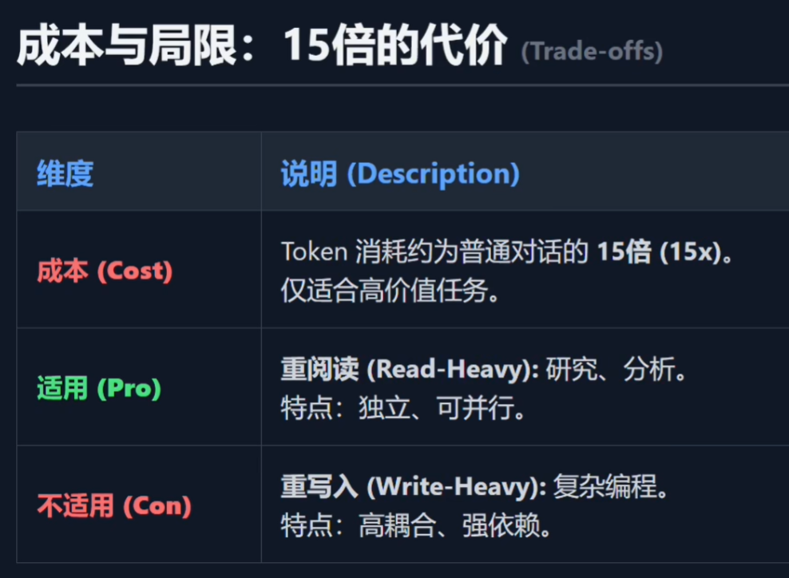
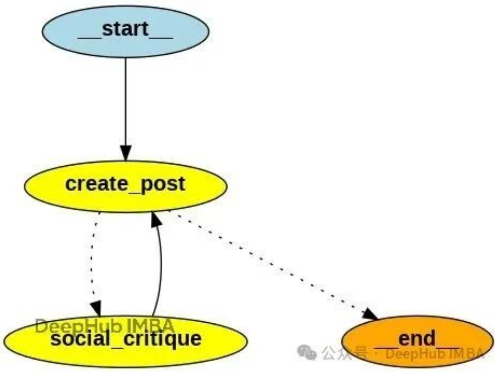
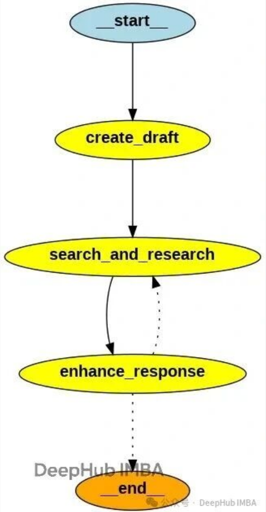

## MAS经验

### Anthropic

参考：这里，多agent架构是指 ClaudeDeepResearch等，不是ClaudeCode

- [Anthropic 做 Multi Agent 系统的工程经验（上）](https://mp.weixin.qq.com/s/S57IWVGWNFu3JZQzNZvV1A)
- [Anthropic 做 Multi Agent 系统的工程经验（下）](https://mp.weixin.qq.com/s/_ykLqKPhpFp8TIO1AoRI9g)
- [精读《How we built our multi-agent research system》①](https://www.bilibili.com/video/BV1a8UCBaEog)
- [精读《How we built our multi-agent research system》②](https://www.bilibili.com/video/BV18UUSBCEeE)

核心内容：

- **Multi Agent的架构设计**（Orchestrator-Worker模式）
- **提示工程实践**（8条 Anthropic 核心经验）
- MAS适用场景
  
- 如何派发subagent
- 评估
- 等等

### 阿里

参考：

- [初探：从0开始的AI-Agent开发踩坑实录](https://mp.weixin.qq.com/s/7Lt3WKmHoQY5HifnPFjxoQ)
- [多智能体自主规划模式性能提升：五大精准策略详解](https://mp.weixin.qq.com/s/PlScarC4gVwEton-T7TNdg)
  - 大模型ToolCalls造成的响应过程较长/FunctionCall用户等待过长：比FunctionCall更好用的工具调用提示词 - 流式XML
  - 上下文通信，缺失一些动态压缩和可追溯策略/上下文过长影响质量和速度：上下文简单压缩传递
  - 主代理在任务执行过程产出的中间态过于简略/主智能体不负责文本推理：规划过程不止是推理下一步动作
  - 循环结束的时机把控不够智能/任务总结很敷衍：让结束时的回答更贴近用户，而不是贴近机器命令
  - 对于规划出的Plan，监督机制不到位/过程监督必不可少：让执行过程保持初始规划轨迹 - 基于工具驱动的思想，我们做了一个即插即用的监督工具

### MAS案例

参考：

- [规划分解的示例Prompt](https://mp.weixin.qq.com/s/_Kmr_Y6T7CZZTOnlBhpvZw?scene=1&click_id=2)
- [构建能源领域的AI专家：一个多智能体框架的实践与思考](https://mp.weixin.qq.com/s/QCdOkhpE6H8Zy_gsLOHIAQ)
- [从小白到专家：Agent 任务分解的完整技术栈](https://mp.weixin.qq.com/s/qXJv6HZ1odXodclLDqS3VA)

### 发展趋势

> 参考：[AI Agent（多智能体）平台未来 5 年发展趋势](https://mp.weixin.qq.com/s/_igFqVXtlrdQzNfhZcrorA)

趋势1：多Agent 平台的技术架构演进
- 分布式与协作框架
- Agent间通信的改进
- 强化学习与自我优化系统
- 在未来五年内，我们预计会出现以下重要进展：
  - 多智能体自博弈（Self-Play）技术
  - 元学习（Meta-Learning）
  - 终身学习（Lifelong Learning）

趋势2：模型能力的提升
- 增强推理、自主性与适应性
- 多Agent系统中 LLM 的演进
- 微调、提示工程与Agent专精化
- 我们预计未来会出现更强的提示工程技术，让开发者可以在**无需重新训练模型的前提下**，灵活地塑造Agent的行为特征（例如设定其个性、优先级、谈判风格等）。**少样本提示和高级指令微调将实现即时专精化**，使Agent能够根据任务需求快速切换角色。

总之，未来五年我们很可能会看到越来越多**模块化、可定制的Agent设计**，每个Agent都是经过微调或提示工程优化的专家型Agent，协同工作，各司其职，发挥所长。

## 常用框架

概述：不实时更新

- [A2A协议](https://a2a-protocol.org/latest/#why-a2a-matters)：每个Agent类似于一个API服务，每个 Agent 都对外暴露一组能力（接口），供其他 Agent 调用。
  
  - 但它和传统 API 服务又有区别：
    - 语义交互：A2A 传递的不只是结构化参数，还可能是自然语言指令或对话上下文。
    - 自治性：Agent 会自己决定是否调用另一个 Agent，而不仅是被动接收请求。
    - 协作性：多个 Agent 可以形成工作流（workflow），动态分工，不需要人工显式 orchestration。

  - Multi-Agent拓扑结构：动态复杂的，通常不固定。但又似乎可以形成常用拓扑结构

  - 特色：将不同框架的生态进行整合、交互
  
- LangGraph：Graph结构、Chain结构
- LangChain-DeepAgents：初心是类似于Claude的subagent，但源码中，将子Agent封装成了tools
- CrewAI：角色扮演？网状结构？
- OpenAI Agent SDK：几个核心模块，Agents、Handoffs、Guardrails等，可以搭建Workflow、Multi-Agent等结构
- Claude的subagent： 演员在一个舞台上快速切换不同角色，但演员始终是一个人
- [Agno](https://docs.agno.com/introduction/multi-agent-systems)：搭建可以推理合作的Agent团队，且可以搭建确定的工作流
- 等等......

## 其他

> 参考：[20260120 - Skills 还是 SubAgents：企业落地如何选择合适的多智能体架构？](https://mp.weixin.qq.com/s/iHAI0Ae5Y_UriF_l7Edfuw)

一、四种多智能体架构模式

1. **子智能体（SubAgents）** 
   1. **特点**：由主智能体集中协调多个专业子智能体，子智能体无状态，上下文隔离性强。 
   2. **适用场景**：需并行执行多领域任务（如日历、邮件、CRM集成）、强调工作流控制的场景。 
   3. **权衡**：每次交互需经主智能体转发，增加模型调用次数和延迟。
2. **技能（Skills）** 
   1. **特点**：单个智能体动态加载专业提示词模块，实现“渐进式披露”，轻量且支持用户直接交互。 
   2. **适用场景**：单一智能体需灵活切换专业方向，或不同团队独立维护技能的分布式开发。
   3.  **权衡**：技能加载后上下文会累积，可能导致令牌冗余。
3. **切换（Handoffs）** 
   1. **特点**：智能体通过工具调用将任务转移给其他智能体，依赖状态管理实现顺序工作流。 
   2. **适用场景**：分阶段任务（如客户支持流程）、需满足前置条件才能解锁功能的场景。 
   3. **权衡**：状态管理复杂，但支持多轮对话的连贯性。
4. **路由（Routers）** 
   1. **特点**：将输入分类并并行分发给专业智能体，最终合成结果，通常无状态。
   2.  **适用场景**：需并行查询多领域知识（如企业知识库）、整合多来源结果的场景。 
   3. **权衡**：无状态设计适合单次请求，但重复请求可能产生冗余开销。

二、性能对比与选型建议

文章通过三个场景分析性能（模型调用次数、令牌消耗）：

- **一次性请求**（如“买咖啡”）：技能、切换、路由模式更高效（3次调用），子智能体因主智能体转发需4次调用。
- **重复请求**：有状态模式（技能、切换）可通过上下文复用减少40%调用次数；子智能体需重复调用，但上下文隔离性强。
- **多领域查询**（如比较三种编程语言）：子智能体和路由模式支持并行执行，令牌效率最高；技能模式因上下文累积导致令牌激增。

三、核心选型指南

| 需求场景             | 推荐模式 | 关键优势                 |
| -------------------- | -------- | ------------------------ |
| 多领域并行执行       | 子智能体 | 上下文隔离、集中控制     |
| 轻量灵活的技能组合   | 技能     | 用户直连、分布式开发友好 |
| 顺序工作流与状态转换 | 切换     | 多轮对话自然延续         |
| 并行查询与结果合成   | 路由     | 无状态、高性能一次性处理 |

> 参考：[从零构建能自我优化的AI Agent：Reflection和Reflexion机制对比详解与实现](https://mp.weixin.qq.com/s/_b1747zQKqD0go5dKf1xzw)

原文以LangGraph，通过编排多Agent或者说节点，实现了：

- Reflection Agent
  
- Reflexion Agent
  

