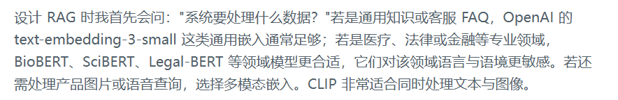
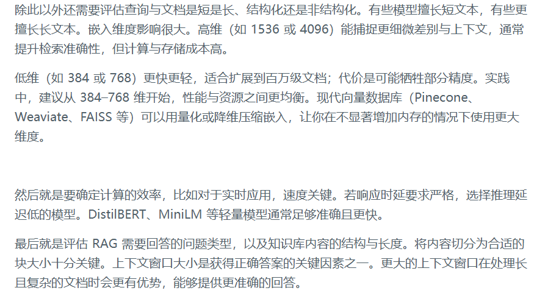
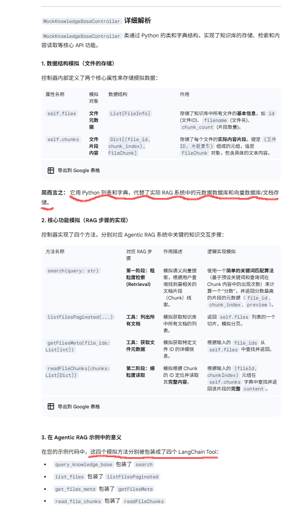
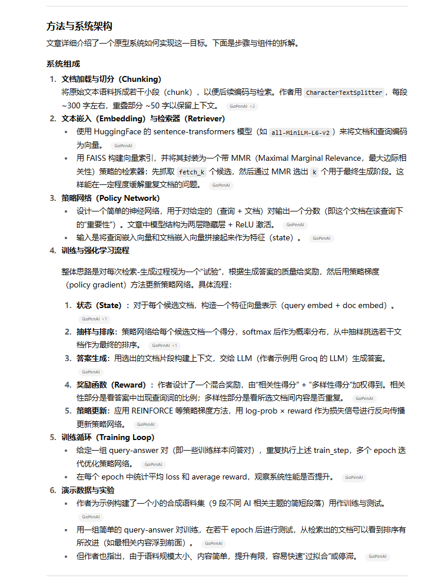
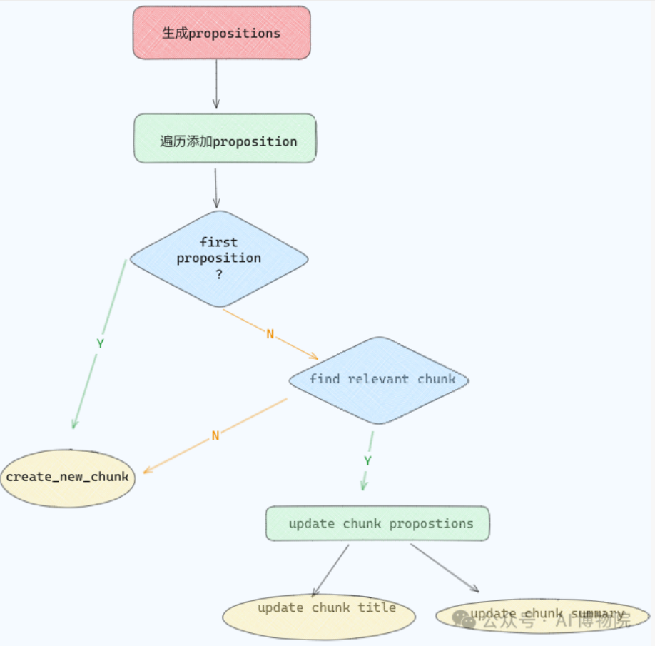
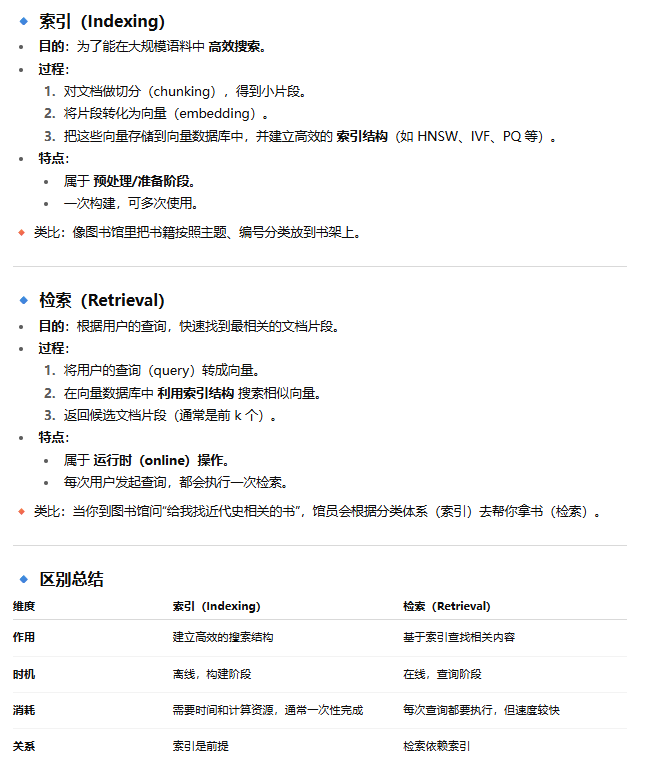

# 基础概念

参考博客：

- 好评如潮：[一文读懂：大模型RAG（检索增强生成）含高级方法](https://zhuanlan.zhihu.com/p/675509396)

内容解析（parsing）、切分策略（chunking）、向量化（embedding）、检索（retrieval）、排序（ranking & reranking）


关于嵌入模型相关概念

> 参考：[RAG系统嵌入模型怎么选？选型策略和踩坑指南](https://mp.weixin.qq.com/s/EHUm5ns10ynUv0tj7Y7sYA)

- 嵌入的类型：词嵌入、句子嵌入、文档嵌入、图嵌入
- 按嵌入的特性划分：稠密嵌入 Dense、稀疏嵌入 Sparse、长上下文嵌入 Long Context、多向量嵌入 Multi-Vector
- 文本嵌入模型的关键参数：上下文窗口（Context Window）、分词单元（Tokenization Unit）、维度（Dimensionality）、词表大小（Vocabulary Size）、训练数据（Training Data）、成本（Cost）
- 选择嵌入时的关键考量：
  
  
- 选择合适嵌入的基准：
  - MTEB
  - MMTEB
- 如何使用 MTEB：
  - 别被 MTEB 分数"迷惑"。MTEB 提供分数头部模型之间的差距往往很小。
  - 建议：关注与你用例相似任务上的表现，这通常比总分更有参考价值。
  - 在选择时一定要考虑你的应用需求。不存在对所有任务都最好的单一模型，这也是 MTEB 存在的意义：帮助你找到"更合适"的那个。
    - 你需要的语言是什么？模型是否支持？
    - 是否涉及金融、法律等专业词汇？
    - 等等


> 参考：[RAG的Embedding模型选取大有门道](https://mp.weixin.qq.com/s/3ymnLZPmw_NwH7upVOVaBw)

根据处理消息的类型，对Embedding模型进行了划分。

选择最佳 Text Embedding 模型的几个参数与关键因素。


# 由浅入深

掌握 hybrid retrieval 技术（稀疏+稠密），了解 ColBERT、BM25、TART 等前沿方法


### 检索方案

参考：[构建可用于生产环境的 RAG 智能体：开发者完整指南](https://mp.weixin.qq.com/s/7n8gHYoBqXzurrNir112dg)

这篇推文简要介绍了：由于单靠Vector Search无法满足需求，进而引出常用的几种检索方法以及各自的适用场景

- Keyword Search 关键词检索：精准
- Vector Search 向量检索：语义侦探
- Hybrid Search 混合检索：两全其美
- Database Search 数据库检索：事实核查员
- Graph Search 图检索：关系专家

适合快速理解各个检索方案，但是缺乏实际场景代码。


### Agentic RAG

Agentic RAG，其**核心思想是RAG不应仅仅是一个被调用的函数，而是整个代理决策和推理循环中的一个关键、不可或缺的步骤**。

总结来看，传统RAG类似于一个工具，Agentic RAG引入了Agent的思想。

---

三个关键层面——**智能编排层**、**精巧的系统提示工程**以及**动态上下文管理**

1）智能编排层：由线性流水线，变为更负责的决策路由

-  传统RAG通常被设计为一个静态的、线性的流水线（Pipeline），其流程固定为“检索-增强-生成” 。这种架构缺乏动态决策和自我修正的能力，对于复杂的、需要多步推理的任务显得力不从心 。
-  在Agentic RAG智能编排这一架构中，RAG的地位发生了根本性转变：它不再是一个孤立的工具，而是编排层在执行**知识密集型任务**时的一个高优先级流程。这种范式升级意味着，系统不再仅仅是进行“工具调用”（Tool Calling），而是进行更复杂的“决策路由”（Decision Routing） 。
-  Agentic RAG是一种动态的、基于循环（Loop）的架构，它将RAG融入一个更高级的“智能体”（Agent）框架中 。在这种架构中，代理可以感知环境、进行多步规划（planning）、调用工具，并根据工具返回的结果进行自我修正。RAG在这个循环中扮演一个关键的“知识获取”工具角色，而不仅仅是一个固定的步骤 。这种动态方法能够处理异步任务，进行复杂的研究、摘要和代码修正工作 。

2）系统提示工程

- 核心策略一：角色设定与指令优先级
- 核心策略二：结构化工具描述与元数据
- 核心策略三：Few-Shot示例与`tool_choice`

3）动态上下文管理

- 查询预处理与增强
- 检索结果的融合与重排序
- 多轮对话与上下文压缩

---

实战架构：

- 基于路由器的代理（LlamaIndex）：LlamaIndex的`RouterQueryEngine`是实现编排层的一个典型范例 。该架构的核心思想是将RAG查询引擎与其他工具封装为可供LLM选择的“工具”，然后通过一个中央路由器进行智能路由。
- 基于图的代理（LangGraph）：LangGraph提供了一种更灵活、更精细的代理工作流控制方式。它将代理的决策流程表示为一个有向无环图（DAG）或循环图（Graph），允许开发者定义复杂的、可控的执行逻辑 。

------

参考：


------

应用实例：

- [基于LangGraph搭建的规划分解框架 + LlamaIndex搭建的RAG相关MCP工具](https://mp.weixin.qq.com/s/ciKYrxvnjzYE9IlOi-9qaQ)：此文章侧重与传统RAG变为具有“规划分解+ReAct能力“的Agentic RAG，没有涉及其他工具
- [RAG相关踩坑](https://mp.weixin.qq.com/s/lmR9UrP2UQC-ZIqQqN_i8g)：描述了从单用户传统RAG到Agentic RAG的历程，但是解决方案少有提及


> 参考：[RAG 进化之路（祛魅 Agentic RAG）：传统 RAG 到工具与强化学习双轮驱动的 Agentic RAG](https://mp.weixin.qq.com/s/UN10QnJUrlB-Ehoi8-aOLg)
>
> 视频：[动手学习大模型8/12\] 从零手写RAG和 Agentic RAG](https://www.bilibili.com/video/BV1iLx6zRETu?spm_id_from=333.1245.0.0)

概述：

- Native RAG 的两种入库方式：在线和离线
- Agentic RAG 的定义、结合chatbox项目讲述架构、基于强化学习的 Agentic RAG

有很多之前不熟悉的关键词，比较有学习价值。

除了文档的内容外，还有：

- native rag、agentic rag的[源码实现](https://github.com/bbruceyuan/Hands-On-Large-Language-Models-CN/blob/master/chapter08/agentic-rag/tool-based.py)
- chatbox的架构图、根据使用示例分析chatbox的工作流程
- 下期预告：rl-based rag，这可能是业界现在的发力点

关于源码中的 `MockKnowledgeBaseController` 的作用：




> 参考：[syhya - Agentic RL](https://syhya.github.io/zh/posts/2025-09-30-agentic-rl/)

TODO


> 参考：
>
> - [Agentic RAG：用LangGraph打造会自动修正检索错误的 RAG 系统](https://mp.weixin.qq.com/s/f7Sxu0KsaZCoCO2nCVtw8g)
> - https://github.com/kushalBanda/AI-Engineer/tree/main/Redis/vectorLibrary

TODO


### RL-Based RAG

> 参考：
>
> - 博客：[chaofa哥 - 基于强化学习的 Agentic RAG](https://yuanchaofa.com/post/from-native-rag-to-agentic-rag.html#_4-4-基于强化学习的-agentic-rag)
> - 源码实现：[chapter08/agentic-rag/rl-based.py](chapter08/agentic-rag/rl-based.py)

原文中有提到：

```
Search-R1：基于 RL 的推理与搜索交织式 LLM
Search-R1 是一个基于强化学习的框架，专为训练具备推理和搜索能力的大语言模型而设计。与传统 RAG 或基于提示词的 Agentic RAG 不同，Search-R1 让模型通过强化学习掌握"何时搜索"、"搜索什么"以及"如何利用搜索结果"的能力。
```


参考流程图：

```
Question
   ↓
<think> ... reasoning ... </think>
   ↓
<search> query </search>
   ↓
SearchEngine → knowledge base → <information> retrieved knowledge </information>
   ↓
<answer> final result </answer>
   ↓
↑ (reward feedback: correctness + structure)
   ↓
GRPO policy update
```


> 参考：[yue佬 - Agentic RL](https://syhya.github.io/zh/posts/2025-09-30-agentic-rl/)

直接看原文吧，类似一篇综述。


> 参考：https://github.com/FareedKhan-dev/rag-with-rl

一个比较早的项目，start比较低，但是文档写的很清晰。

这个项目是一个探索性质的实验：在一个相对简单、可控的 RAG 流水线中植入 RL 控制器，用以在检索、上下文控制与生成之间做动作决策。它展示了一条把强化学习加进检索 + 生成系统中的思路——通过定义状态、动作、奖励，把答案质量作为最终优化目标，从而让系统在训练过程中“学”如何选择策略。


> 参考：[构建一个通过强化学习自我优化的RAG系统](https://blog.gopenai.com/building-a-self-improving-rag-system-with-reinforcement-learning-dbf51df5a966)

一个理论结合代码的文章




> 参考：[使用 Python 中的强化学习最大化简单 RAG 性能](https://zhuanlan.zhihu.com/p/1964662569265533395)

TODO


# 开发经验

### 1、RAG架构

> 参考：[为什么80%的RAG项目都失败了？100+团队血泪教训总结](https://mp.weixin.qq.com/s/4Vtp2sHQHguY0t-B7xsoGg)

进阶RAG架构

- **查询优化层**：
  - 查询分类与路由
  - 查询重写与扩展
  - 假设文档生成（HyDE）
- **多路检索策略**：
  - 混合搜索结合了向量搜索和关键词搜索，提高召回率
  - 分层检索（粗检索→精检索）
  - 多索引并行检索
- **重排序与过滤**：
  - Cross-encoder重排序
  - MMR（最大边际相关性）去重
  - 相关性阈值过滤

等等


> 参考：[三个轻量级智能体分工协作，如何让问答系统更精准？](https://mp.weixin.qq.com/s/GizZiM1JeF2Mc2Ui8coCGg)

架构图：


核心在于先基于 `推理路由器（Reasoning Router）` 做判断，输出No Retrieval、Retrieval、Planning分别对应不同的Workflow，相关Prompt如下：

```


你是一个智能助手，负责评估给定的问题是否需要通过检索获取更多信息，或者需要规划才能得出准确答案。你可以访问一个大型语言模型（LLM）来进行规划或回答问题，并且有一个检索系统来提供与查询相关的信息。
指令：
1. **评估问题**：评估基于LLM的现有知识是否可以提供精确的答案。考虑问题的具体性、复杂性和清晰度。
2. **决策类别**：
- 如果问题是复杂的，并且在检索之前需要一个规划阶段，你的回应应该是：
[Planning]
- 如果问题请求特定信息，你认为LLM不具备这些信息，或者涉及最近的事件或超出LLM知识范围的小众话题，请按照以下格式进行回应：
[Retrieval] ‘YOUR QUERY HERE‘
- 如果你认为LLM可以在没有额外信息的情况下回答问题，请回复：
[No Retrieval]
3. **专注于评估**：避免直接回答问题。只专注于确定是否需要检索或规划。
推理路由器状态
现在，请处理以下问题：
问题：{question}
推理路由器的所有可能操作输出
% 对于不需要检索的情况
[No Retrieval]
% 对于需要检索的情况
[Retrieval]<查询内容> （对于简单问题）
[Planning] （对于复杂问题）
```

可以考虑使用一个7B小模型进行fine-tuning以提升Reasoning Router的表现。


### 2、RAG优化方案

> 参考：[RAG效果不佳？先别急着微调模型，这几个关键节点才是优化重点](https://mp.weixin.qq.com/s/gbm179_Bk_nEWrWOlN5JUw)

文章主要内容为：回顾并扩展描述了几个RAG的基础概念

- 文档分块 Chunking
- 增强检索 Indexing：这里介绍两种类型：1.语义增强；2.反向HyDE。
- 编码 Embedding
- 检索 HybridSearch
- 重排-ReRanking

概念和Demo很简单，但是技术细节需要往深水区慢慢前行。


### 3、预处理

#### 3.1 文档解析

OCR 导致文本顺序错乱的处理：

- OCR 在解析 PDF 或图片时，**每一段文本通常都带有位置信息（坐标）**；
- 可基于坐标信息进行：
  - 文本排序（从上到下、从左到右）；
  - 段落与版面结构重建；
- 目前主流 OCR 模型已在表格、多栏排版等复杂场景上进行了大量训练，整体效果较为成熟；
- 若需进一步优化，可在其已有架构和数据组织思路上进行微调或定制。

------

解析工具：主流方案仍在OCR与多模态模型

- OCR工具，如PaddleOCR等等
- VAT工具，如Mineru等


#### 3.2 数据清洗

删除章节目录、让大模型辅助将部分章节精炼化等等


### 4、分块 Chunking

#### 4.1 常用方法

（ChatGPT）业务中最常用的 7 类 RAG 切分策略：

- **固定长度切分（Baseline / 不推荐单独使用）**

- **固定长度 + Overlap（目前最常见）**

  ```
  chunk_size = 800 tokens
  overlap = 100~200 tokens
  ```

- **按自然语义边界切分（业务效果明显提升）**

  - 按 段落 / 标题 / 小节 切
  - 保证一个 chunk 表达一个完整语义

- **标题感知切分（Header-aware Chunking）**

  - 方式：chunk = 标题 + 该标题下的内容

- **语义驱动切分（Semantic Chunking，进阶）**

  - 方式
    - 用 embedding 判断语义突变点
    - 在语义变化明显处切分
  - 典型流程
    1. 按句子拆
    2. 计算相邻句 embedding 相似度
    3. 相似度骤降 → 切分

-  **任务感知切分（Task-aware / QA-aware）**

  - 方式根据“用户会怎么问”来切 chunk
  - 例子
    - 客服 FAQ → 一问一答一个 chunk
    - 流程类文档 → 一个流程步骤一个 chunk
    - API 文档 → 一个接口一个 chunk

- **混合切分（Production 最终形态）**

  - 组合示例

    ```
    1. 先按标题切
    2. 标题块太大 → 再按语义 / 长度切
    3. 加 overlap
    4. chunk 内注入 metadata
    ```

  - chunk 结构示例

    ```
    {
      "content": "...",
      "title": "退款规则",
      "section": "3.2",
      "doc_type": "policy",
      "source": "xxx.pdf"
    }
    ```

    


> 参考：[传统分块已死？Agentic Chunking拯救语义断裂，实测RAG准确率飙升40%](https://mp.weixin.qq.com/s/NyDnQCvq_cpCz_SwWivewQ)

常见传统分块方法：传统方法要么把这两句话拆到不同区块，要么被中间内容干扰导致语义断裂。而人工分块时，我们自然会将它们归为“模型原理”组——**这种跨越文本距离的关联性，正是Agentic Chunking要解决的**。

- 递归字符分割（Recursive character splitting）：简单易用，但它有一个明显的缺点：它依赖于固定的token长度进行分割，这可能导致一个主题被分割到不同的文本块中
- 语义分割（semantic splitting）：它通过检测句子之间的语义变化来进行分割。这种方法虽然比递归字符分割更智能，但它也有局限性。比如，当文档中的话题来回切换时，语义分割可能会将相关内容分割到不同的块中，导致信息不连贯。

工作原理：

- 核心思想：让大语言模型（LLM）主动评估每一句话，并将其分配到最合适的文本块中

- 在Agentic Chunking中，LLM会将这些句子进行**propositioning**处理，即将每个句子独立化，确保每个句子都有自己的主语，例如

  ```python
  # 原文本
  On July 20, 1969, astronaut Neil Armstrong walked on the moon. He was leading the NASA’s Apollo 11 mission. Armstrong famously said, “That’s one small step for man, one giant leap for mankind” as he stepped onto the lunar surface.
  
  # 处理后
  On July 20, 1969, astronaut Neil Armstrong walked on the moon.
  Neil Armstrong was leading the NASA’s Apollo 11 mission.
  Neil Armstrong famously said, “That’s one small step for man, one giant leap for mankind” as he stepped onto the lunar surface.
  ```

Agentic Chunking

- 概述：关键在于**propositioning**和**文本块的动态创建与更新**

  

- 作者基于Langchain和Pydantic等工具，给出了理论结合实践的案例，具体步骤如下：

  - **propositioning处理：**propositioning 可以看做是对文档进行“句子级整容”，确保每个句子独立完整

    ```python
    from langchain.chains import create_extraction_chain_pydantic
    from langchain_core.pydantic_v1 import BaseModel
    from typing import Optional
    from langchain.chat_models import ChatOpenAI
    import uuid
    import os
    from typing import List
    
    from langchain import hub
    from langchain_core.prompts import ChatPromptTemplate
    from langchain_openai import ChatOpenAI
    
    from pydantic import BaseModel
    
    obj = hub.pull("wfh/proposal-indexing")
    llm = ChatOpenAI(model="gpt-4o")
    
    class Sentences(BaseModel):
        sentences: List[str]
    
    extraction_llm = llm.with_structured_output(Sentences)
    extraction_chain = obj | extraction_llm
    
    sentences = extraction_chain.invoke(
        """
        On July 20, 1969, astronaut Neil Armstrong walked on the moon.
        He was leading the NASA's Apollo 11 mission.
        Armstrong famously said, "That's one small step for man, one giant leap for mankind" as he stepped onto the lunar surface.
        """
    )
    ```

  - **创建和更新文本块：**创建一个函数来动态生成和更新文本块。每个文本块包含主题相似的propositions，并且随着新propositions的加入，文本块的标题和摘要也会不断更新。

    ```python
    def create_new_chunk(chunk_id, proposition):
        summary_llm = llm.with_structured_output(ChunkMeta)
        summary_prompt_template = ChatPromptTemplate.from_messages([
            ("system", "Generate a new summary and a title based on the propositions."),
            ("user", "propositions:{propositions}"),
        ])
        summary_chain = summary_prompt_template | summary_llm
        chunk_meta = summary_chain.invoke({"propositions": [proposition]})
        chunks[chunk_id] = {
            "summary": chunk_meta.summary,
            "title": chunk_meta.title,
            "propositions": [proposition],
        }
    ```

  - **将proposition推送到合适的文本块**：用Agent来判断新的proposition应该被添加到哪个文本块中。如果没有合适的文本块，Agent会创建一个新的文本块。

    ```python
    def find_chunk_and_push_proposition(proposition):
        class ChunkID(BaseModel):
            chunk_id: int = Field(description="The chunk id.")
        allocation_llm = llm.with_structured_output(ChunkID)
        allocation_prompt = ChatPromptTemplate.from_messages([
            ("system", "Find the chunk that best matches the proposition. If no chunk matches, return a new chunk id."),
            ("user", "proposition:{proposition} chunks_summaries:{chunks_summaries}"),
        ])
        allocation_chain = allocation_prompt | allocation_llm
        chunks_summaries = {chunk_id: chunk["summary"] for chunk_id, chunk in chunks.items()}
        best_chunk_id = allocation_chain.invoke({"proposition": proposition, "chunks_summaries": chunks_summaries}).chunk_id
        if best_chunk_id not in chunks:
            create_new_chunk(best_chunk_id, proposition)
        else:
            add_proposition(best_chunk_id, proposition)
    ```

  - 实测效果：略

适用场景：

- 非结构化文本（如客服对话记录）
- 主题反复横跳的内容（技术沙龙实录）
- 需要跨段落关联的QA系统


> 参考：[Agentic RAG 的21种分块方法](https://mp.weixin.qq.com/s/iT5xGHlbXCnlIOvI1fP3UQ)

TODO


> 参考：[（万字长文）告别粗暴切分：入门 RAG 文本分块，从策略到优化](https://zhuanlan.zhihu.com/p/38753080790)

文中提到了一些分块策略：

- 基础策略：固定大小分块、基于句子的分块、递归字符的分块、基于文档结构的分块、混合分块
- 高级策略：语义分块、分层分块、Small-to-Big检索、命题分块、Agentic / LLM-based Chunking

特别是提供了一个基于markdown标题的分块示例，很有学习价值。


#### 4.2 实操经验

是否以“章节”为最小 Chunk，需要根据具体文本体量与结构灵活调整：

- 对于文本规模较小、章节内部语义高度一致的文档，可以直接采用**每章节一个 Chunk**的方式。
- 对于篇幅较大或章节内部主题较为复杂的文档，可参考 **Dify 的父子分段（Parent–Child Chunking）思路**：
  - 将较大的父 Chunk（如章节）进一步拆分为多个子 Chunk；
  - **检索阶段仅对子 Chunk 做向量检索**；
  - 一旦某个子 Chunk 命中，则**返回其对应的父 Chunk**作为上下文；
  - 而不是先检索父 Chunk，再回溯子 Chunk。

------

检索对象选择

- 检索目标应为**文档的具体内容（content）**，而非仅基于标题进行检索；
- 标题可作为辅助特征或 metadata，但不应作为主要检索向量来源。

------

多 RAG / 模块化 RAG 架构：从底层实现和效果上看，两种方案在实际表现上差异可能有限，更多是工程组织和扩展性的取舍

- 针对产品级知识库，可采用**模块化 RAG 设计**：
  - 按业务或功能模块拆分为多个子 RAG；
  - 主 RAG / 主 Agent 先进行**用户意图识别**；
  - 通过 **ReAct 机制**，按需调用一个或多个子 RAG；
  - 汇总多个子 RAG 的检索结果后，由主 Agent 统一生成最终回答。
- 后续也可演进为**统一 RAG + Chunk Group（标签化）方案**：
  - 不再物理拆分多个 RAG，而是通过 chunk group / 标签的方式组织数据；
  - 主 Agent 在意图识别后，判断命中哪些 chunk group；
  - 仅在相关 group 内执行检索。


### 5、向量化 Embedding

参考向量库相关笔记。


### 6、索引 Indexing

索引的作用：在 RAG 里，文本被切分成片段并编码成向量（embedding）。查询时，需要在大规模向量集合中快速找到与查询向量最相似的文档向量。

- 直接暴力计算（Brute Force）是 **O(N·d)**（N=向量数，d=维度），当 N 很大（百万级以上）时几乎不可用。
- 因此，向量数据库（如 FAISS、Milvus、Weaviate、Pinecone 等）会用 **高效索引结构** 来加速搜索。


常见索引结构：

- HNSW（Hierarchical Navigable Small World Graph）
  - **基本思想**：基于小世界图（Small World Graph），通过构建多层分层图结构来加速搜索。
  - **构建过程**：
    1. 将所有向量逐步插入到图中。
    2. 为每个向量建立“邻居连接”，形成一个稀疏图。
    3. 顶层只有少量节点，底层包含所有数据点。
  - **搜索过程**：
    - 从顶层的随机入口点开始，逐层向下跳转。
    - 在每一层用贪心法不断靠近查询向量，直到到达底层。
    - 在底层图中再做局部扩展搜索，找到最近邻。
- IVF（Inverted File Index）
  - **基本思想**：基于聚类（如 K-means），先对数据做粗分桶，再在桶内精细搜索。
  - **构建过程**：
    1. 用 K-means 将向量划分为 `nlist` 个聚类中心（簇）。
    2. 每个向量被分配到最近的簇，形成“倒排文件”。
  - **搜索过程**：
    - 查询时，先找到离查询向量最近的 `nprobe` 个簇。
    - 在这些簇内做精确（或近似）搜索。


注意，在 **RAG** 里，**索引（Indexing）** 和 **检索（Retrieval）** 是两个不同但紧密相关的概念。

一句话总结：索引是“如何存放文档以便快速找”，检索是“用户来问时，怎么快速找到相关文档”。




### 7、检索 Retrieval

三大主流检索范式：

1、稀疏检索（Sparse Retrieval）

- 代表算法
  - **TF-IDF**
  - **BM25**（工业界老大）
- 核心思想：词项匹配 + 词频统计

2、稠密检索（Dense Retrieval）

- 这是 **RAG 的核心支柱**。
- 代表模型
  - DPR（Dense Passage Retrieval）
  - Sentence-BERT
  - OpenAI / BGE / E5 embedding
  - Contriever
- 核心思想：**把 Query 和 Document 映射到同一个向量空间，用“语义相似度”检索**

3、混合检索（Hybrid Retrieval）

- 工程上最常见、效果最稳的方案

- 思路：

  ```
  BM25（关键词） + 向量检索（语义）
  → 融合排序
  ```

- **常见融合方式**

  - Score 加权
  - Reciprocal Rank Fusion (RRF)
  - 两阶段召回（先 BM25 再 Dense）


#### 7.1 扩展

> 参考：[Multi-HyDE与Adaptive HyDE如何突破RAG检索瓶颈？](https://mp.weixin.qq.com/s/Rdf2-tS3bfptSIGO09lYPw)

HyDE（基础版）：

- 传统零样本稠密检索直接匹配“查询-文档”效果有限，因查询短、风格差异大。HyDE转而利用LLM生成一个“假设文档”（风格接近真实文档），再通过无监督编码器（如Contriever）将其嵌入向量空间，基于文档-文档相似性检索真实文档。

Multi-HyDE（多假设版）:

- 背景：针对金融等高精度领域，解决复杂查询中的语义歧义、多视角遗漏问题。
- 机制：
  1. 多样化查询生成：从原始查询生成N个非等价衍生查询（如聚焦风险、财务等不同角度）。
  2. 多路检索：对每个查询生成假设文档并独立检索。
  3. 结果融合：合并候选文档，通过重排序模型（如BGE-Reranker）精选最终结果。

Adaptive HyDE（自适应版）

- 目标：平衡效率与效果，确保新型或复杂查询“永不空手而归”。
- 动态阈值机制： 高阈值初探：从高相似度阈值（如0.9）开始检索，保证精度。 自适应降级：若未命中，逐步降低阈值（如0.9→0.8→…→0.5），直到检索到相关文档。

| 维度             | HyDE（基础版）                                               | Multi-HyDE（多假设版）                                       | Adaptive HyDE（自适应版）                                    |
| :--------------- | :----------------------------------------------------------- | :----------------------------------------------------------- | :----------------------------------------------------------- |
| **来源论文**     | Precise Zero-Shot Dense Retrieval without Relevance Labels (arXiv 2212.10496, 2022) | Enhancing Financial RAG with Agentic AI and Multi-HyDE (arXiv 2509.16369, 2025) | Never Come Up Empty: Adaptive HyDE Retrieval (arXiv 2507.16754, 2025) |
| **核心创新**     | 生成**单个假设文档**（hypothetical document）作为桥梁，提升查询-文档语义匹配 | 生成**多个非等价、多样化假设查询/文档**，合并检索结果        | 在标准 HyDE 基础上**动态降低相似度阈值**，确保检索不为空     |
| **检索机制**     | 单假设文档 → 嵌入 → 固定阈值检索                             | 多假设（N 个） → 分别嵌入检索 → 合并 + 重排序（rerank）      | 单/标准假设文档 → 嵌入 → 从高阈值起步，若为空则逐步降低（e.g., 0.9 → 0.5） |
| **针对主要问题** | 查询短、风格与文档差异大，导致直接嵌入检索精度低             | 单假设覆盖率不足，易遗漏复杂文档的关键部分（尤其结构化/多年度报告） | 新型/unseen 查询下固定阈值易导致“空检索”，覆盖率低           |
| **适用场景**     | 通用零样本检索、网络搜索、问答、多语言任务                   | 复杂领域（如金融、法律），需高覆盖率的大规模结构化知识库     | 查询高度多样/新颖场景（如开发者支持、代码问答、实时新兴问题） |
| 性能特点         | 简单有效，但依赖单假设质量                                   | 召回率高，但延迟显著                                         | 平衡精度与覆盖率，自适应性强                                 |

原文也给出了示例代码，通过`AsyncHyDE`类实现`Multi-HyDE`的并行生成，将串行耗时从≈60秒优化至≈20秒（依赖LLM响应速度）


### 8、重排 Rerank

#### 8.1 基础概念

rerank 模型通常解决的是一个任务：

- 给定 **Query + Document**，输出一个 **相关性分数**
- 然后按 score 从高到低排序，选 Top-K 送给 LLM。

与向量检索的本质区别

| 阶段      | 模型结构                      | 特点                     |
| --------- | ----------------------------- | ------------------------ |
| Retrieval | **双塔（Bi-Encoder）**        | 快、可预计算、适合大规模 |
| Rerank    | **交叉编码（Cross-Encoder）** | 慢、但精度高             |

Retrieval（Bi-Encoder） 与 Rerank（Cross-Encoder） 的工作方式：

- 向量检索（Bi-Encoder）：Query 和 Doc **各自编码**，无法深度建模词级交互

  ```
  Query → Embedding_q
  Doc   → Embedding_d
  sim(Embedding_q, Embedding_d)
  ```

- Rerank（Cross-Encoder）

  - 架构图：

    ```
    [CLS] Query [SEP] Document [SEP]
    ↓
    Transformer
    ↓
    相关性分数
    ```

  - ✅ Query 和 Document 在同一个 Transformer 中

  - ✅ 每个 token 都能互相注意（attention）

  - ✅ 能捕捉：

    - 关键词匹配
    - 逻辑关系
    - 否定、条件、时序

  - 📌 代价：**必须对每个 (query, doc) 单独算一次**

常见Rerank模型：

- 传统 NLP / Learning to Rank（较少用于 LLM RAG）
  - BM25 + LTR
  - LambdaMART
  - 优点：可解释、低成本
  - 缺点：语义能力弱
- Transformer Cross-Encoder（主流）
  - **开源**
    - `bge-reranker-base / large`
    - `ms-marco-MiniLM-L-12-v2`
    - `cross-encoder/ms-marco-*`
  - **商业 / API**
    - Cohere Rerank
    - OpenAI Rerank（部分平台）
    - Jina Reranker
- LLM-based Rerank（进阶）
  - 直接用大模型：`请根据问题判断以下文档是否有助于回答（0-5分）`
  - 优点：
    - 任务对齐能力极强
    - 可做复杂规则（时效性、来源可信度）
  - 缺点：
    - 慢、贵、不稳定
    - 不适合大规模 rerank


#### 8.2 实操经验

关于使用“大模型 + Prompt”进行 Rerank：

- Rerank 阶段建议优先使用**专用的 Rerank 模型**：
  - 推理速度更快；
  - 排序目标更明确，效果通常更稳定；
- 若使用“大模型 + Prompt”进行排序：
  - 成本和延迟较高；
  - 效果不一定优于专用模型，且稳定性较差；
- 因此更适合作为实验或补充方案，而非默认配置。


### 9、Agentic RAG 设计

#### 9.1 常用方法

略


#### 9.2 实操经验

主 Agent 与 Agentic RAG 的职责划分

- 主 Agent：
  - 负责用户输入的**意图理解与混合意图拆解**；
  - 将**拆解后的多个 Query** 传递给 Agentic RAG 工具。
- Agentic RAG：
  - 本质上是一个**基于 ReAct 的检索 Agent**；
  - 能够多轮调用检索工具；
  - 持续判断是否仍有必要继续检索，直到满足信息需求。

------

Agentic RAG 的输出形式

- Agentic RAG 内部完成：
  - 多轮检索；
  - 结果去重；
  - 相关性排序；
- **不对 Chunk 内容进行二次总结或生成式改写**；
- 仅将最终：
  - 去重；
  - 排序完成；
  - 结构化的 Chunk 列表
     返回给主 Agent。
- 主 Agent 基于这些 Chunk，并结合**真实用户意图**，完成最终答案生成。


# 一些概念

#### RAG1.0与RAG2.0

> RAG2.0官方：https://contextual.ai/introducing-rag2/


🧠 先说说：什么是RAG？

想象一下你是个超级聪明的孩子，但你记不住所有书上的知识。于是你学会了一个技巧：不会的问题，先去图书馆找书，然后再动脑子写答案。

这个过程就是： 👉 先“检索”（找书） + 再“生成”（写答案）

这就叫 RAG：检索增强生成。

------

📘 RAG 1.0 就像“找完书再动脑的孩子”：

- 你拿到问题，
- 去图书馆找**几本你觉得可能有答案的书**（找Top-k段内容），
- 把它们拿回来放在桌上，
- 然后坐下来用这些书来写答案。

📌 问题在于：

- 你找的书对不对？你自己不知道。
- 写答案的时候，你**不能回头再换书**，因为你已经找完了。
- 你找书和写作**是两件分开的事**。

------

📗 RAG 2.0 就像“边找书边动脑、随时能换书的聪明孩子”：

- 你拿到问题，开始想答案，
- 想一会儿觉得：“嗯，我可能需要找一点资料。”
- 于是你**边想边去找书**，甚至可以**根据你现在写到哪儿**再去换更合适的书！

📌 这个方法更聪明：

- 写答案和找书是**一起做的**。
- 你写到一半可以说：“这本书不太对，我换一本！”
- 就像你脑子和手**配合得更好**，写得又快又准！

------

🧃打个比方来总结：

| 比喻内容         | RAG 1.0                | RAG 2.0                        |
| ---------------- | ---------------------- | ------------------------------ |
| 像什么孩子？     | 先找好资料再写作的孩子 | 边想边找资料、会换书的聪明孩子 |
| 找书和写作的关系 | 分开的，不能互相帮忙   | 一起做的，互相帮忙、互相学习   |
| 能不能换书？     | 不能，找完就固定了     | 能，写的时候还可以换           |
| 效率和聪明程度   | 一般般，靠运气         | 很聪明，写得又快又好           |


#### 混合搜索是王道？

结合关键词的精确性和向量的语义理解


#### Embedding

参考：[面试题：大模型Embedding层与独立Embedding模型的区别是啥](https://mp.weixin.qq.com/s/LJ0cv3Z4X8otGgJZZv3yRQ)


备注：**Transformer Block** 是 **Transformer 模型** 的基本构建单元，多个 Transformer Block 可以堆叠起来，形成一个完整的 Transformer 模型。


#### RAG与ContextEngineer

参考： [Chroma 的创始人 Jeff Huber 访谈 - RAG的概念很糟糕，让大家忽略了应用构建中的关键问题](https://mp.weixin.qq.com/s/LYjxxQxqqNylsUrDIHQKKw)

Jeff Huber 的核心观点可以总结为以下几点：

1. **RAG 概念误导开发者**
   Huber 认为“RAG（检索增强生成）”这个词把“检索、生成、结合”三件事硬拼在一起，容易让人误以为“做一次向量搜索”就能解决上下文问题，实则掩盖了应用构建中最关键的工作：**如何把最合适的信息放进模型的上下文窗口**。
2. **上下文工程（Context Engineering）才是核心**
   - LLM 的推理能力随 Token 增多而下降，出现“上下文腐烂”（Context Rot）。
   - 真正决定产品效果的，是“每一步生成时，窗口里到底放什么”，这需要在**内循环**（单次请求选料）和**外循环**（长期反馈迭代）两个层面做工程优化。
   - 今天表现最好的 AI 初创公司，最拿手的就是 Context Engineering，而非花哨的模型或算法。
3. **“记忆”就是 Context Engineering 的副产品**
   - 把“记忆”拟人化便于宣传，但落地时仍是“把合适信息在合适时刻塞进窗口”。
   - 离线压缩、索引、再排序、生成式评测数据等，都是让模型“记住”并“用对”信息的手段。
4. **检索系统的下一步**
   - **持续检索**：生成过程中按需多次检索，而不是一次性前置检索。
   - **停留在 Embedding 空间**：未来模型可能直接消费向量，不再往返自然语言。
   - **小而精的黄金数据集**：几百条高质量“查询-答案”对就能显著提升检索效果，团队应定期“标注披萨派对”自制数据。
5. **工程建议与踩坑提醒**
   - 别把希望寄托在“百万 Token 完美利用”的营销图表上，真机测试会迅速衰减。
   - 第一阶段用向量/全文/元数据快速缩小候选，再用大模型做重排，是目前最经济有效的方案。
   - 缓存只能省成本，不能救质量；窗口太大只会稀释注意力。
6. **创业与价值观**
   - 只做自己热爱、与喜欢的人一起、服务真正想服务的客户；影响力=被更多人用得上的好工具。
   - 设计、文档、办公室细节一致高标准，创始人必须是“公司品味的把关人”。


#### 向量数据库查询性能的优化方案

| 分类     | 优化方法                                   |
| -------- | ------------------------------------------ |
| 算法级   | HNSW/IVF/PQ 索引调优, Embedding 维度调整   |
| 系统级   | 缓存、预过滤、混合检索、metadata 过滤      |
| 工程级   | 横向扩展、并发优化、连接池、监控与基准测试 |
| 混合策略 | 先 BM25 过滤再向量检索                     |

------

向量检索的“加速算法”（底层核心）

1、HNSW（主流首选）

- 原理：
  - 构建多层小世界图
  - 上层稀疏、下层密集
  - 搜索时：先粗定位再精细搜索
- 特点：搜索快、准确率高、内存占用大

2、IVF（倒排向量索引）

- 原理：
  - K-Means 聚类
  - Query 只在最近的几个簇中搜索
- 特点：节省内存、构建快、精度略低

3、PQ / SQ（向量压缩）

- 原理：
  - 把向量拆分成子向量
  - 用码本表示
  - 用查表代替浮点计算
- 特点：适合超大规模向量库

------

RAG 场景下的 Milvus 推荐架构：

```
User Query
  ↓
Embedding
  ↓
Metadata Filter（时间 / 租户 / 文档类型）
  ↓
Milvus ANN（topK=10, ef=64）
  ↓
Cross Encoder Rerank（top50 → top5）
  ↓
LLM
```

针对Milvus的优化思路：

1、定位查询瓶颈

- Milvus 的一次向量查询，关键路径是：

  ```
  Query → Proxy
        → QueryNode（segment + index）
            → ANN Search
            → TopK merge
  ```

- 性能瓶颈通常来自：

  1. 索引类型 / 参数不合理（最常见）
  2. segment 过多 / 过小（非常隐蔽但致命）
  3. metadata 过滤未下推
  4. 并发与资源配置不匹配
  5. RAG 场景中 topK、nprobe、efSearch 被滥用

2、索引层优化（最关键，决定下限）

- 首选索引：HNSW（RAG 首推），及其调参逻辑
- 超大规模：IVF_FLAT / IVF_PQ
- 不要踩的坑：
  - ❌ HNSW + 超大 topK（>100）
  - ❌ IVF nprobe = nlist（等于全扫）
  - ❌ 未 load index 就上线查询
  - ❌ 混用 L2 / IP 导致 recall 崩

3、Segment & 数据布局优化（80% 的人忽略）

- Segment 大小 = 查询性能的生命线
- 避免“小 segment 地狱”

4、Query 层优化（直接影响 P99）

- metadata pre-filter 一定要用
- TopK ≠ 上下文数量
- 批量查询（Batch Search）

5、系统与资源层（决定上限）

- QueryNode 资源配置：如 HNSW 查询是 **CPU + 内存带宽密集型**
- 并发控制（非常关键）：并发并非设置为无限，应该控制并发 + 多 QueryNode 扩展
- 网络别忽视

