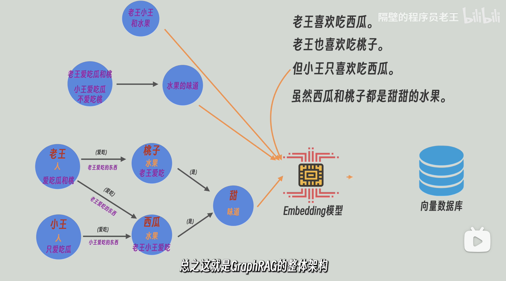

## 基础概念

概述：[AI知识图谱 GraphRAG 是怎么回事？](https://www.bilibili.com/video/BV1zoKuzoENM)



烧钱，但是能挖掘逻辑


GraphRAG能提高查询质量因为LLM处理了docs并提炼其中的关系。但我认为最大的代价就是，当documents更新过后，最坏的情况下，整个graph就要重新structure，可不是删几个nodes或者几个edges这么简单了。GraphRAG适合存储不经常更新的documents。还有一点就是，人类的语言太复杂了，大部分情况下要存的文本不可能这么具体（谁谁谁干了啥），那些很抽象（散文诗，古诗）的东西压根无法处理成graph，这也是个大问题


传统 RAG（Retrieval-Augmented Generation）与 GraphRAG（Graph-based Retrieval-Augmented Generation）的核心差异体现在**知识建模方式、检索机制、推理能力、适用场景与资源消耗**五个维度，可归纳为一句话：

> 传统 RAG 是“向量找片段”，GraphRAG 是“图谱做推理”。

| 对比维度   | 传统 RAG                           | GraphRAG                                     |
| ---------- | ---------------------------------- | -------------------------------------------- |
| 知识表示   | 纯向量嵌入，文本切块后丢失实体关系 | 图结构+向量，显式保留实体-关系-属性          |
| 检索机制   | 单跳向量相似度 Top-K               | 图遍历 + 向量混合检索，可多跳                |
| 上下文构建 | 若干孤立片段，无结构               | 关联子图/社区摘要，结构清晰                  |
| 推理能力   | 单跳、易“断链”                     | 多跳、因果、时序、状态推理                   |
| 生成质量   | 对“单点事实”好，跨段/跨文档总结差  | 对总结性、对比性、趋势性问题优势明显         |
| 数据准备   | 切分→嵌入→入库，O(n)               | 实体抽取→关系抽取→建图→社区检测，O(n²)       |
| 索引成本   | 1× 时间/空间                       | 3-5× 时间，2-3× 空间                         |
| 查询延迟   | 100 ms 级                          | 200-2000 ms，随图规模增大                    |
| Token 消耗 | 低                                 | 高（单查询 4 k-40 k），但长期可复用社区摘要  |
| 黄金场景   | 快问快答、资源有限、实时客服       | 多跳推理、全局总结、政策/医学/金融等复杂决策 |

一句话选型

- 问“刘德华出生年月？”→ 传统 RAG 又快又省。
- 问“过去五年肺癌治疗格局如何演变，相关药物副作用对临床路径的影响？”→ GraphRAG 才能给出可追溯、有结构的深度答案。


### GraphRAG 与 知识图谱

> **知识图谱是“结构化知识资产”，
>  GraphRAG 是“利用图结构进行 RAG 的方法”。**

👉 **GraphRAG 可以用知识图谱，但 ≠ 一定要先构建传统知识图谱。**
 👉 **构建知识图谱 ≠ 自动就有 GraphRAG 能力。**


四种常见组合模式：

- 模式 1：**只有知识图谱，没有 GraphRAG**（传统 KG 系统）
-  模式 2：**GraphRAG，不建传统知识图谱（最常见）**
- 模式 3：**知识图谱 + GraphRAG（最强，但成本最高）**
- 模式 4：**GraphRAG → 反向生成知识图谱**


## 快速上手

> 参考教程：[Neo4j 与 LangChain 构建知识图谱驱动的 AI 系统](https://mp.weixin.qq.com/s/-Y1iam0RnVQknHGY2oHqrA)

**核心概念**

- **知识图谱（Neo4j）** + **向量检索（RAG）** 的混合架构
- 解决传统向量检索无法处理**多跳推理**和**复杂关系查询**的痛点

**技术实现**

- **图谱层**：将数据导入 Neo4j，用 Neo4j 存储实体（节点）和关系（边），通过 Cypher 查询进行结构化检索
- **语义层**：保留向量数据库处理模糊语义匹配
- **混合检索**：通过 `EnsembleRetriever` 组合两者，兼顾语义灵活性与关系准确性
- **LangChain 集成**：提供 `GraphCypherQAChain` 自动将自然语言转为图查询语言（Cypher）

**应用场景**：医疗（药物关系验证）、金融（风险传导分析）、法律（案例引用推理）、企业知识管理


### 1、安装 Neo4j

#### 安装 Neo4j

1）安装 Java 环境

```
sudo apt update
sudo apt install openjdk-17-jdk -y
```

2）添加 Neo4j 官方仓库

```
# 下载并安装 GPG 密钥
wget -O - https://debian.neo4j.com/neotechnology.gpg.key | sudo gpg --dearmor -o /etc/apt/keyrings/neo4j.gpg

# 添加 Neo4j 软件源（此处以最新稳定版为例）
echo 'deb [signed-by=/etc/apt/keyrings/neo4j.gpg] https://debian.neo4j.com stable latest' | sudo tee -a /etc/apt/sources.list.d/neo4j.list

sudo apt update
```

3）安装 Neo4j

```
sudo apt install neo4j -y
```

4）启动与管理

```
sudo systemctl start neo4j    # 启动服务
sudo systemctl enable neo4j   # 设置开机自启
sudo systemctl status neo4j   # 查看运行状态
```

示例日志：

```
$ sudo systemctl status neo4j
● neo4j.service - Neo4j Graph Database
     Loaded: loaded (/usr/lib/systemd/system/neo4j.service; enabled; preset: enabled)
     Active: active (running) since Mon 2026-02-02 16:50:08 CST; 3s ago
   Main PID: 2223574 (java)
      Tasks: 108 (limit: 308728)
     Memory: 2.2G (peak: 2.2G)
        CPU: 18.434s

$ sudo lsof -i :7687
COMMAND     PID  USER   FD   TYPE   DEVICE SIZE/OFF NODE NAME
java    2223670 neo4j 1124u  IPv6 41341318      0t0  TCP localhost:7687 (LISTEN)

$ neo4j --version
2025.12.1
```

5）修改密码：默认用户名是 `neo4j`，默认初始密码是：`neo4j`，这里密码改为`password123`方便后续测试

```
cypher-shell -u neo4j
```


#### 安装 apoc

1）找你的[neo4j对应的apoc版本](https://neo4j.com/docs/apoc/current/installation/)，下载后并放入neo4j对应目录下

```
sudo wget \
https://github.com/neo4j/apoc/releases/download/2025.12.1/apoc-2025.12.1-core.jar \
-O /var/lib/neo4j/plugins/apoc.jar
```

2）修改 Neo4j 配置：`sudo vim /etc/neo4j/neo4j.conf`，添加如下两行

```
dbms.security.procedures.unrestricted=apoc.*
dbms.security.procedures.allowlist=apoc.*
```

3）重启 neo4j

```
sudo systemctl restart neo4j
```

4）进入neo4j测试：在安装之前，如下程序输出为空

```
SHOW PROCEDURES
YIELD name
WHERE name STARTS WITH 'apoc'
RETURN name;
```


#### 接入Python测试

```
# 1. 卸载可能冲突的库
pip uninstall -y numpy pandas neo4j

# 2. 清除 pip 缓存（防止它又从本地缓存里找错误的编译包）
pip cache purge

# 3. 指定版本强制重装
# 我们锁定 numpy 在 1.26.x 系列，这是 2.0 之前最稳定的版本
pip install "numpy<2.0" "pandas>=2.2.2" "langchain-neo4j"
```

```
from langchain_neo4j import Neo4jGraph

graph = Neo4jGraph(
    url="bolt://0.0.0.0:7687",
    username="neo4j",
    password="password123"
)
# 检查 schema
print(graph.schema)
```

示例输出：

```
$ python main.py 
Node properties:

Relationship properties:

The relationships:
```

