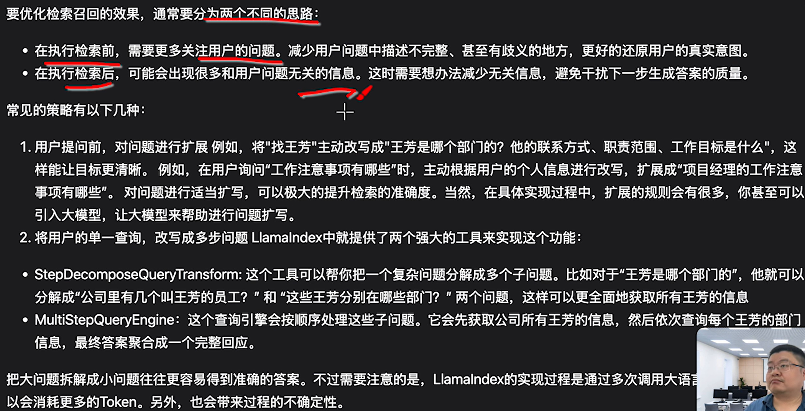
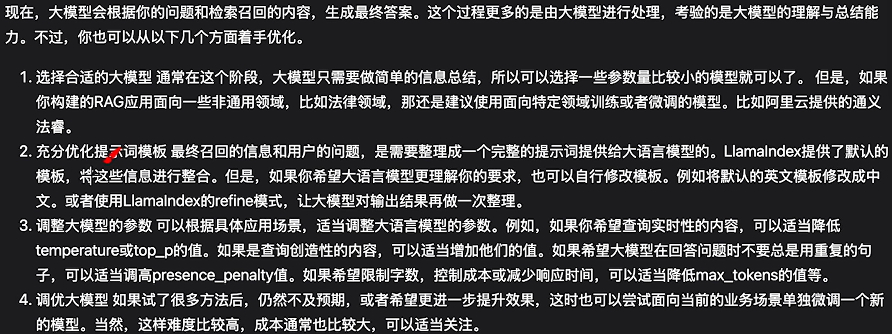

为什么学了LangChain还要学LlamaIndex？

LlamaIndex细节那么多，重点学习什么？

如何评估RAG并迭代优化？

如何实现企业级RAG，而不是LLM玩具？


# 01 为什么需要LlamaIndex

构建Agent：示例代码就不赘述了，课程这里简要介绍了核心的两点，Memory与Tools。


LlamaIndex实现RAG示例：略


可借助llama-index-llms-langchain，集成LangChain相关工具


相比业界其他框架，LlamaIndex在Agent、MAS等方面并不占优，主要还是在RAG方面比较不错。


# 02 基础组件

官网文档：https://docs.llamaindex.ai/en/stable/module_guides/


RAg主要分两步：Indexing与Retrieval


重要组件：

- LLM相关：Prompts、Models
- 整体设置：Settings
- 本地数据：Query、Loading、Indexing、Storing


## 1、Prompt

基于`PromptTemplate`构建提示词模版

基于`ChatPromptTemplate`构建多个提示词模版

基与`RichPromptTemplate`动态构建提示词


基于`engine.get_prompts()`方法暴漏提示词

基于`engine.up_prompts()`替换提示词

构建索引时指定`responce_mode="refine"`参数，对结果进行优化


## 2、Models

支持哪些模型：查官网文档知具体使用哪个依赖，实在不行就LangChain。


使用Embedding模型将文字转换为向量

通过向量相似度计算语义相似度


## 3、Loading 文档加载组件

将一个本地资源封装为Document

做信息处理时，将Document拆分为Node（NodeParser提供了多种拆分方案）

Node就是LLamaIndex处理本地数据的基本单位


常用SimpleDirectoryReader，输入目录路径，直接读取目录下的各类文档（对于特殊文档，如json，SimpleDirectoryReader只能加载出一个文档，则需要采用JSONReader）。如果不满足需求，可对其进行扩展


## 4、Indexing 索引组件

比如：

- 基于VectorStoreIndex构建索引？
- 基于as_retriever构建召回工具？
- 根据问题进行召回


Indexing构建索引后，支持持久化存储


## 5、Storing 数据存储组件

数据存储组件有很多，比如向量、聊天记录、知识图谱、数据库等等

具体支持情况见官网


## 6、Querying 查询引擎

见官网


## 7、Setting 全局设置

不做默认设置，默认是访问OpenAI相关模型


除了维护llm、enbedding model，setting还支持很多组件，比如Node Parser、Tokenzier等等


# 03 评估RAG应用的准确性

上述章节讲述了如何搭建RAG，下面将讲述评估和优化。


## 1、评估RAG回答的准确性

教程展示了一个源文档有对应信息，但是没有召回成功的案例。

不过本章主要还是将评估，下一章讲如何优化。


## 2、建立自动化评测机制

构建测试的提示词模版

```
你是***
-----
问题是{}
-----
参考资料是{}
```

找出问题是在检索，还是在大语言模型


这样就可以构建大量样本集（包含问题和预设答案），依次提问，评估RAG应用的答案以及召回信息。


上述测试方案很简陋，实际上已经有很多成熟的测试框架，可以进一步完善测试方案。


## 3、使用Ragas评估RAG应用表现

成熟的测试框架有Ragas、DeepEval等等，这里已[Ragas](https://docs.ragas.io/en/stable/)为例。

常用的两个测评指标：

- recall
- precision


ragas的一些核心机制，也是依赖提示词，涉及到一些指标的计算。

可以根据需求对提示词进行替换。


可以多学习ragas相关指标，源码不需要深入学习。


# 04 优化应用回答准确度

## 1、回答准确性问题分析

进一步讲述了RAG中Indexing与Retrieval中各个模块详细的内容


## 2、应用各个环节改进策略

1）文档准备阶段

更高质量的文档、持续优化文档


2）文档解析与切片阶段

文档形式五花八门，可以尝试统一转换为markdown格式

查找LLamaIndex支持的各类切片工具、调整参数，当这些工具不够用，也可以自己实现


3）文本向量化与存储阶段

选择Embedding Model：通常选用最新的

选择向量数据库：向量数据库两个功能，存储向量与相似度检索。不同向量库虽然实现方法天差地别，但是核心功能差不多，选择不同的向量库，通常对RAG准确性不会产生太大影响。


4）检索召回阶段




通常两个思路：

- 检索前，更关注用户的问题
- 检索后，减少与用户提问无关的召回内容

常用策略：

- 扩展问题
- 拆分多步
- HyDE：先生成一个假想的文档，再根据文档内容去修改


5）重排序Rank

即rerank模型，


6）生成答案阶段




# 05 Others

## 关于RouterQueryEngine

谈及Agentic RAG会聊到智能路由，此方法不同于传统RAG的线性Pipline，而LlamaIndex中的RouterQueryEngine方法就是一个典型范例。


### 介绍

`RouterQueryEngine` 是 LlamaIndex 提供的一种机制，用于接收用户查询，并根据一定的逻辑或模型判断，将任务“路由”至若干候选 QueryEngine 中最适合的一个来执行。目的在于将不同类型的查询分发给最合适的处理模块，从而提高整体能力与响应质量。

在 LlamaIndex 文档中，`RouterQueryEngine` 可以通过不同的方式构造：

- **PydanticSingleSelector**、**LLMSingleSelector**：用于基于结构化或 LLM 预测选择单一引擎；
- **PydanticMultiSelector**：允许输出多个目标引擎 [LlamaIndex](https://docs.llamaindex.ai/en/stable/examples/query_engine/RouterQueryEngine/?utm_source=chatgpt.com)。

另一变体是 **RetrieverRouterQueryEngine**，它会基于 Retriever 检索哪些节点与查询相关，再选择合适的 QueryEngine [LlamaIndex](https://docs.llamaindex.ai/en/stable/examples/query_engine/RetrieverRouterQueryEngine/?utm_source=chatgpt.com)。

示例代码：

```
from llama_index import (
    SummaryIndex,
    VectorIndex,
    QueryEngine,
    RouterQueryEngine,
)
from llama_index.selectors import LLMSingleSelector

# 1. 构建索引或 query engines
summary_index = SummaryIndex.from_documents(docs)
vector_index = VectorIndex.from_documents(docs)

# 分别封装成 QueryEngine
summary_qe = QueryEngine(index=summary_index, metadata={"type": "summary"})
vector_qe = QueryEngine(index=vector_index, metadata={"type": "vector"})

# 2. 构建选择器（Selector）
selector = LLMSingleSelector(
    query_engine_mapping={"summary": summary_qe, "vector": vector_qe},
    selection_prompt_template="Select either 'summary' or 'vector' based on query: {query}"
)

# 3. 构建 RouterQueryEngine
router = RouterQueryEngine(selector=selector, query_engine_mapping={
    "summary": summary_qe,
    "vector": vector_qe
})

# 4. 使用
response = router.query("请概括这篇文档主要内容")

```

上述流程背后的逻辑是：

1. 用户提出查询；
2. Selector（如 LLM 模型）判断最适合的 QueryEngine；
3. 将查询转交给对应引擎执行；
4. 返回结果。

这种架构灵活、高效，适用于处理结构化、多样化的查询任务。


### 与Agentic RAG关系

关于Agentic RAG 中的“智能路由层”（智能编排层）与 RouterQueryEngine 的关系

在 Agentic RAG 架构中，通常会存在一个 **Orchestration Layer（编排层）**，其负责调度不同模块或 agent。RouterQueryEngine 就是这种层次中的简化版本或实现手段之一：它通过判断将任务分配给不同的 QueryEngine，可以被视为一种“智能路由”机制的一种初级实现。

- **RouterQueryEngine = 单一查询路由器**：它依据固定选择逻辑（如 LLM 模型或规则），将查询发送到候选引擎，实现分流与专属处理；
- **Agentic RAG 的 Orchestrator = 更复杂的智能编排器**：不仅做路由判断，还负责控制流程、迭代、调度 planning、retrieval、generator、critic 等多个 agent 进行协同工作。

因此，RouterQueryEngine 可以被看作 Agentic RAG 中 Orchestration Layer 的一个子集，是最基础形式：用于选择具体引擎。但在完整的 Agentic RAG 中，这一层还需要涵盖多 agent 调度、规划、反思、工具调用、执行回馈等能力


### 总结

- **RouterQueryEngine** 是 LlamaIndex 中用于简易路由的组件，通过选择器将任务派发给多个候选 QueryEngine 之一执行；
- 它是 Agentic RAG 中 **智能编排层**的原型或简化版本；
- 完整的 Agentic RAG 在路由之外，还加入了流程规划、多 agent 协作、反馈反思和工具使用等能力，属于架构层次更高、更加智能化的 orchestrator 实现。


# 06 实战经验

> 参考：[LlamaIndex检索调优实战：分块、HyDE、压缩等8个提效方法快速改善答案质量](https://mp.weixin.qq.com/s/8F-G2EwlHS3NFxcFaiUvVQ)

概述：

- **分块要考虑语义完整性：**根据任务场景不同（长PDF、代码文档、表格等），灵活调整chunk_size、chunk_overlap
- **扩展命中句子的上下文窗口：**单独一句话作为检索结果，用户看着没把握。LlamaIndex的sentence-window后处理器会在命中句子前后各补几句，让返回的片段更连贯，也更方便直接引用。在FAQ、规章制度、会议纪要这类文档特别有用。
- **向量检索配合BM25做混合召回：**向量embedding擅长捕捉语义相似度，BM25擅长精确匹配关键词。内部知识库测试，混合检索+rerank（下一条会说）相比纯向量检索，correct@1指标能提升10-18%左右。
- **用cross-encoder做二次排序：**检索阶段只是粗筛候选，真正决定哪些结果靠谱还得靠reranker。一个轻量的cross-encoder模型（比如MiniLM）能有效把那些看起来相似但实际答非所问的结果往后排。
- **查询重写：HyDE和多query生成**：用户的问题经常描述不清楚。HyDE (Hypothetical Document Embeddings) 的思路是让LLM先生成一个理想答案，然后用这个假设答案去embedding和检索，能减少query本身表达不清造成的召回偏差。Multi-query则是生成多个改写版本，从不同角度去检索。
- **元数据过滤优先于向量检索**：不是所有文档都需要参与检索。如果能提前用metadata把范围限定在特定产品、版本、团队、时间段，检索效率和准确性都会高很多。比如，政策文档和release notes，可以在后处理阶段加个时间过滤，防止过时信息混进来。
- **压缩冗余上下文**：Contextual compression能把检索到的内容再过滤一遍，只留下跟当前问题强相关的部分。这种方式对于处理那种章节很长的PDF特别管用。
- **动态调整top_k：基于相似度阈值**：不要写死top_k参数，把"总是塞进一堆垃圾"变成"只要有用的部分",单靠这一条改动，幻觉率就能明显下降。


> 参考：[LlamaIndex检索调优实战：七个能落地的技术细节](https://mp.weixin.qq.com/s/rS3gULs0bIh3AdXWAExBAA)

原文有示例代码：

- 语义分块 + 句子窗口：
  - SemanticSplitter会在语义边界处切分，不再机械地按字数来；SentenceWindow则给每个节点附加前后几句话作为上下文窗口。
- BM25 + 向量的混合检索：
  - 向量嵌入擅长捕捉语义相似性，但碰到专业缩写、产品型号这类精确匹配场景就容易翻车。老牌的BM25算法恰好补上这个短板，它对精确词项敏感，长尾术语的召回能力很强。
  - 把两种检索方式融合起来，LlamaIndex的QueryFusionRetriever可以直接搞定
- 多查询扩展
  - 自动生成几个query的变体，分别检索，再把结果融合起来
  - 使用QueryFusionRetriever方法
- reranker
- 元数据过滤与去重
  - 不是所有检索回来的段落都值得信任，文档有新有旧，有的是正式发布版本，有的只是草稿。如果语料库里混着不同版本、不同产品线的内容，不加过滤就是给自己挖坑。
- 响应合成模式的选择
- 持续评估


> 参考：[2025.12.04 LlamaIndex 深度实战：用《长安的荔枝》学会构建智能问答系统](https://mp.weixin.qq.com/s/xGdSUX0G2FEV5QOQAfbHUw)
>
> 原文结合了实际文本和代码，很有条理

**第一部分：原理篇 - RAG 核心概念**

- **核心思想**：用一个生动的“图书管理员和索引卡片”的比喻，解释了 RAG 系统如何工作。AI 通过三个关键步骤模仿人类阅读：1) **建立索引**（将书切成段落并生成“数字指纹”即向量）；2) **检索**（将问题也转为向量，找到最相似的段落）；3) **生成答案**（将相关段落和问题一起给大模型，让其生成答案）。
- **关键参数**：详细解释了影响系统效果的三个重要参数： `chunk_size`（段落大小）：控制每个文本块包含的信息量。 `top_k`（检索数量）：控制一次检索多少相关段落来生成答案。 `chunk_overlap`（重叠大小）：防止关键信息在段落边界处丢失。
- **优势**：对比了传统关键词搜索和直接询问大模型的局限性，突出了 RAG 系统答案**基于特定文档、可理解语义、答案来源可追溯**的关键优势。

**第二部分：实战篇 - 快速上手 LlamaIndex**

- **目标**：用不到 30 行代码快速构建一个针对《长安的荔枝》的问答系统。
- **核心步骤与 API**： **配置** (`Settings`)：设置使用的大模型（如 GPT-3.5）和文本向量化模型。 **加载文档** (`PyMuPDFReader`)：读取 PDF 格式的《长安的荔枝》。 **构建索引** (`VectorStoreIndex.from_documents`)：自动完成文本切分、向量化并存储。 **查询** (`query_engine.query`)：输入问题，获取基于书籍内容的答案。
- **扩展功能**：介绍了支持多轮对话的 `chat_engine`。

**第三部分：优化篇 - 参数调优实战**

- **实验方法**：通过针对《长安的荔枝》设计的不同类型问题（如简单事实、复杂情节、宏观主题），对比了不同参数配置下（如 `chunk_size`为 256 vs 2048, `top_k`为 2 vs 10）AI 生成答案的具体差异。
- **核心发现**： `chunk_size`对答案深度影响显著，越大越能理解复杂信息。 `top_k`决定答案的全面性，越大信息覆盖越广。 `chunk_overlap`能有效保证跨段落信息的连续性。
- **配置建议**：针对不同场景给出了参数配置建议： **简单事实查询**（如“主角是谁？”）：`chunk_size=512`, `top_k=3`（快速、精准）。 **复杂情节理解**（如“如何解决保鲜难题？”）：`chunk_size=1024`, `top_k=6`（最常用、平衡）。 **宏观主题分析**（如“故事表达了什么？”）：`chunk_size=2048`, `top_k=10`（最全面、深入）。

**第四部分：架构篇 - LlamaIndex 内部机制**

- **系统架构**：剖析了 LlamaIndex 的五层工作流程（数据处理→索引→检索→合成→生成）及其七个核心组件（文档加载器、文本分块器、向量化模型、向量存储、检索器、响应合成器、大模型）。
- **参数定位**：明确了各个调优参数在架构中的具体作用位置，帮助理解其底层原理。

**第五部分：Agent 化 - 扩展系统能力**

- **局限性**：指出基础 RAG 只能回答已有文档内容，无法执行外部操作（如联网搜索、保存文件）。
- **解决方案**：提出将 LlamaIndex（负责推理决策）与 **AgentBay** 工具平台（提供浏览器自动化、代码执行等“动手”能力）结合的思路，让系统能主动获取新信息或执行任务，并提供了集成代码示例。
