# 上下文工程

安德烈·卡帕西（Andrej Karpathy）：如果大语言模型（LLM）是计算机的 CPU，那么上下文窗口就是它的 RAM。RAM 的容量有限，需要操作系统来智能地管理数据。同样，上下文工程就是智能体的“操作系统”，管理和优化输入给模型的信息。

## Summery

>以下总结不做实时更新（维护成本较高），仅作为参考清单，实际设计上下文工程时，建议阅读全文。
>
>参考来源包括：
> 1）主流模型/平台官方博客（Anthropic、OpenAI 等）
> 2）社区一线实践经验（阿里技术公众号、小红书等）
> 3）成熟产品的经验贴（Claude Code、Manus、Cursor等）

1️⃣ 上下文到底包含什么？本质是 **“模型生成前看到的一切”**

- System / Instructions
- 对话历史（短期记忆）
- 长期记忆
- RAG / 检索结果
- 工具定义
- 文件 / 状态 / 环境
- 输出约束

2️⃣ 四个**永不过时的动作**（LangChain 总结得很好）

- Write（写出去）：笔记、文件、长期记忆、Scratchpad
- Select（拉进来）：检索、工具筛选、相关性过滤
- Compress（压缩）：摘要、去冗余、清理工具返回
- Isolate（隔离）：子 Agent、沙盒、MapReduce

3️⃣ 真正的一线经验，不在“花活”，而在“稳定性”：你笔记里 Manus / Cursor / ClaudeCode / Devin 的共识其实高度一致

- ❌ 不要为了炫技乱上多 Agent
- ❌ 不要把所有信息都塞上下文
- ❌ 不要频繁修改 prefix（KV 缓存杀手）
- ✅ 文件系统是“无限上下文”
- ✅ 指针 > 原文
- ✅ 保留失败，别洗白历史
- ✅ 少即是多，让模型去探索

## Reference

### 1）上下文的定义

> 参考：[20260130 - AI Agent 记忆系统：从短期到长期的技术架构与实践](https://mp.weixin.qq.com/s/mftM6jr0YiFxRATeNvm5Qg)

**一、记忆系统的定义与分类**

记忆系统是解决AI Agent在处理复杂任务和长对话历史时面临的核心挑战（如上下文窗口限制、token成本、个性化记忆）的关键技术。记忆分为两个层面：

- **短期记忆（会话级）**：存储单次会话中的多轮交互消息，直接参与模型推理，受token限制，需通过上下文工程策略（压缩、卸载等）优化。
- **长期记忆（跨会话）**：从短期记忆中提炼用户偏好、历史交互等通用信息，持久化存储并支持跨会话检索，实现个性化服务。

**二、记忆系统的通用架构**

各Agent框架集成记忆系统遵循通用模式：

1. **推理前加载**：根据当前查询从长期记忆中检索相关信息。
2. **上下文注入**：将检索结果注入短期记忆，辅助模型推理。
3. **记忆更新**：会话结束后将短期记忆中有价值的信息提取并存入长期记忆。
4. **信息处理**：长期记忆依赖LLM进行信息提取、向量化存储和语义检索。

**三、短期记忆的上下文工程策略**

为解决token限制问题，主要策略包括：

- **上下文缩减**：通过保留预览或摘要压缩信息（可能丢失细节）。
- **上下文卸载**：将完整内容存储于外部，上下文仅保留引用（信息可恢复）。
- **上下文隔离**：通过多智能体架构拆分上下文，降低主智能体负载。 各框架（如Google ADK、LangChain、AgentScope）通过配置参数或内置模块（如AgentScope的AutoContextMemory）实现这些策略。

**四、长期记忆的技术架构**

长期记忆系统核心组件包括LLM（信息提取）、向量数据库（语义检索）、图数据库（关系存储）等，流程分为：

- **Record（记录）**：从短期记忆中提取信息，向量化后持久化存储。
- **Retrieve（检索）**：根据用户查询检索相关记忆，注入当前会话。 与RAG的区别：长期记忆侧重个性化用户历史（如对话记录），而RAG侧重补充外部领域知识（如文档库）。

**五、关键挑战与发展趋势**

- **挑战**：记忆准确性（提取与检索质量）、安全隐私、多模态记忆支持。
- **趋势**： **记忆即服务（MaaS）**：记忆系统成为AI应用的基础设施。 **精细化记忆管理**：借鉴人脑记忆机制（如巩固、遗忘）。 **参数化记忆**：将记忆集成到模型参数（面临更新成本高的问题）。
- **开源产品对比**：Mem0、Zep、ReMe等主流产品在功能（用户画像、领域记忆）和技术栈（向量/图数据库支持）上各有特点，其中Mem0被视为行业标杆。

**结语**

记忆系统是AI Agent智能进化的核心，短期记忆处理技术已较为成熟，而长期记忆正朝向更接近人脑的动态管理方向发展，需进一步解决准确性、安全性和多模态融合等挑战。

> 参考：[DeepMind - 人工智能的新技能不是提示，而是上下文工程](https://www.philschmid.de/context-engineering)

文章到没有详细介绍上下文工程的方法，最有价值的是其对上下文这个概念的介绍：

它不仅仅是发送给一个大型语言模型（LLM）的单个提示。把它想象成模型在生成响应之前所看到的一切。通常包括：

- 指令 / 系统提示 (Instructions / System Prompts): 定义模型行为的基础规则、角色设定和示例。
- 用户提示 (User Prompt): 用户当前直接提出的问题或任务。
- 状态 / 历史记录 (State / History): 当前对话的完整记录，即短期记忆。
- 长期记忆 (Long-term Memory): 跨越多次对话沉淀下来的持久化知识，如用户偏好、过往项目摘要等。
- 检索的信息 (Retrieved Information / RAG): 从外部文档、数据库或 API 中动态获取的、与当前任务相关的最新知识。
- 可用的工具 (Available Tools): 模型可以调用的所有函数或 API 的定义，如查询日历、发送邮件。
- 结构化输出 (Structured Output): 对模型响应格式的强制要求，例如必须返回一个特定的 JSON 对象。

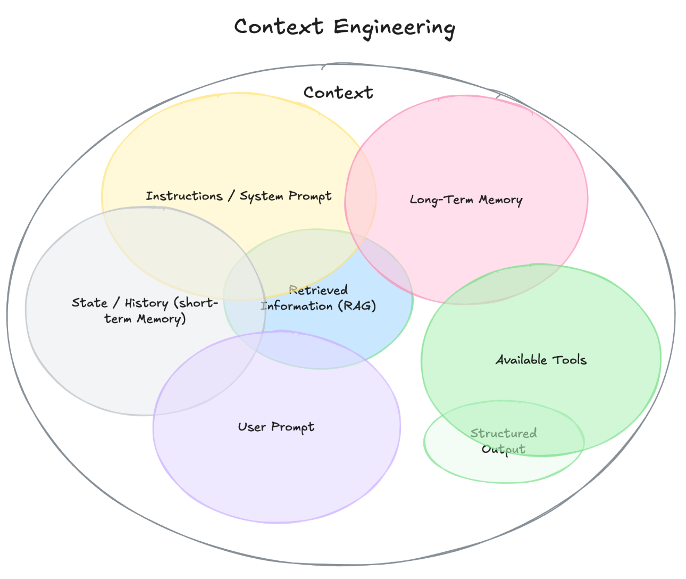

> 参考：[综述论文 - A Survey of Context Engineering](https://arxiv.org/pdf/2507.13334)

一篇长达 160 页的上下文工程综述，作者梳理了超过 1400 篇文献，包含 prompt 技术、记忆体系、RAG、agent 系统等，深度广度兼备。作者按组件与系统两层结构整理领域现状，适合研究者快速梳理全景与定位未来方向。

这篇综述贡献了一种将上下文工程研究的科学分类的框架：

**支柱一**：基础组件-构建的核心模块和技术：

1. **上下文检索与生成**：获取并组装模型所需的上下文信息。这包括传统提示工程、从外部知识库（如数据库、知识图谱）检索，以及动态整合这些信息以形成连贯上下文。
2. **上下文处理**：对获取的信息进行转换和优化。涵盖长序列处理、模型自优化（Self-Refinement）以及多模态/结构化数据（如图表）的整合能力。
3. **上下文管理**：高效组织、存储和利用上下文信息，以应对有限上下文窗口的挑战。涉及记忆层次结构、上下文压缩和优化策略。

**支柱二**：系统实现-整合基础组件，解决现实世界问题的复杂 AI 架构：

1. **检索增强生成**：将外部知识动态注入模型，从简单的线性流程演变为模块化、智能体化和图增强的复杂架构。
2. **记忆系统**：赋予模型跨会话的持久记忆能力，以实现长期学习和适应。
3. **工具集成推理**：通过函数调用和与环境交互，使模型能够超越自身知识限制，利用外部工具解决问题。
4. **多智能体系统**：上下文工程的顶峰，多个智能体通过复杂的通信与编排机制协作，解决单个智能体无法完成的复杂任务。

**论文提出目前上下文工程最关键研究缺口—基本不对称性：**

当前模型虽在先进上下文工程技术加持下展现出强大的复杂上下文理解能力，但在生成同等复杂度的长篇输出时却表现出明显局限性。这意味着模型能“读懂”一本复杂的书，却难以“写出”同样复杂的书。弥合这种理解与生成能力之间的差距，是未来研究的重中之重。

### 2）常用方法

#### Claude

> 权威的来了，最新发布的：[（Datawhale翻译版）Anthropic 发布 AI Agent 上下文工程指南](https://mp.weixin.qq.com/s/WcSuyVyfr4kLzsq5yKO18w)

**Context engineering vs. prompt engineering**

- 上下文工程指的是在 LLM 推理过程中策划和维护最优 token 集合（信息）的一系列策略
- 参考图：
  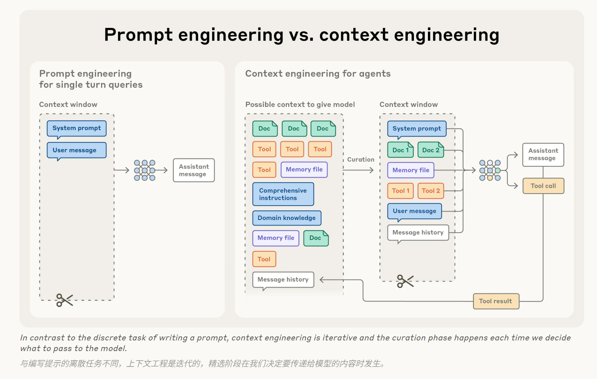

**Why context engineering is important to building capable agents**

- 上下文长度与注意力集中之间会形成一种天然的权衡，随着上下文窗口中 token 数量的增加，模型准确提取其中信息的能力会逐渐下降。
- LLMs 采用的是 Transformer 架构，该架构使得每个 token 都能关注整个上下文中的每个其他 token，从而导致 n 个 token 之间产生 n² 个成对的关系。

**The anatomy of effective context**

- 说起来容易做起来难，怎么寻找最少数量但信息量最高的 token 集？且看下文
- 提示词设计在两种极端种取平衡：
  - 在一种极端，我们看到工程师在提示中硬编码一些复杂而僵化的逻辑，试图精确控制智能体的行为。另一种极端则是提供过于模糊、笼统的指导，没有能够为 LLM 提供明确的行为信号，或错误地假定双方已经有了相同的知识背景。
  - 取得平衡：既要足够具体来有效的引导 LLM 的行为，又要保持足够的灵活性，为模型提供强大的启发式方法来指导行为。
    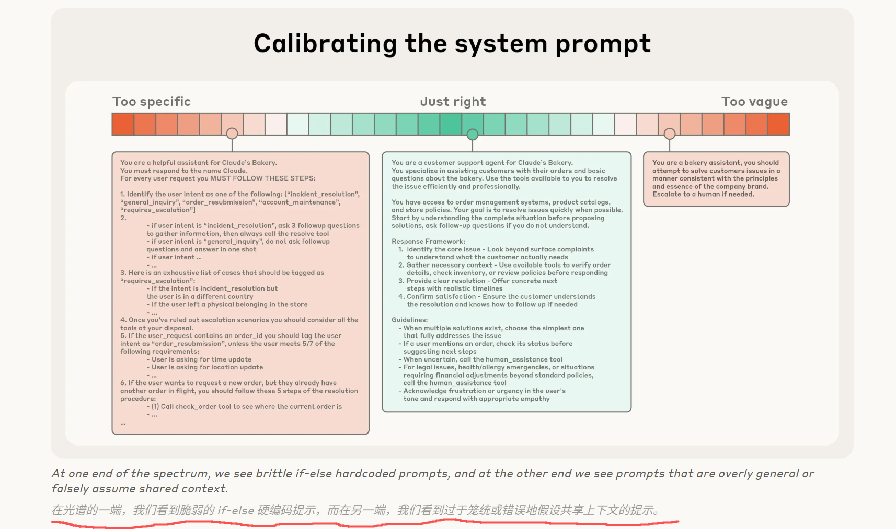
  - 具体做法：
    - 系统提示词设计：
      - 区分提示词不同部分：用 XML 标签或 Markdown 标题等技术
      - 如何提供最核心的信息：最佳做法是先用当前`最佳模型`测试最核心的提示，看看它在你的任务上表现如何，然后根据初始测试中发现的问题模式，添加清晰的指令和示例来提升性能。
    - 工具设计：
      - 工具使智能体能够与其环境交互，并在工作中引入新的、额外的上下文。由于工具定义了智能体与其信息/行动空间之间的协议，因此工具在提高效率方面至关重要，这既体现在返回 token 高效的资讯上，也体现在鼓励智能体高效行为上。
      - 在 [Writing tools for AI agents – with AI agents](https://www.anthropic.com/engineering/writing-tools-for-agents) 中，讨论了构建那些被 LLMs 充分理解且功能重叠最小的工具。
      - 我们观察到最常见的失效模式之一是工具集过于臃肿，涵盖过多功能或导致在工具选择上出现模糊的决策点。如果人类工程师在特定情况下无法明确指出应该使用哪个工具，那么也不应该期望人工智能代理能做得更好。
    - 提供示例：
      - 也称为少样本提示，是一种众所周知的最佳实践，我们持续强烈建议采用。然而，团队通常会往提示中塞满各种边缘情况，试图明确说明 LLM 在特定任务中应遵循的所有可能规则。我们不推荐这样做。
      - 相反，我们建议努力策划一组多样化、规范化的示例，这些示例能有效展现代理的预期行为。对于 LLM 来说，示例就是“一图胜千言”里的“图”。（For an LLM, examples are the “pictures” worth a thousand words.）

**Context retrieval and agentic search**：主要讲的就是混合策略，也就是一部分数据预先加载入上下文，一部分数据靠检索等工具动态加载

- 随着基础模型变得更强大，智能体的自主水平也能相应提升：更强大的模型能让智能体独立处理复杂多变的问题，并自主从错误中恢复。
- 我们看到越来越多的团队用**“即时”上下文策略**来增强现有检索系统的能力：
  - 与预先处理所有相关数据不同，使用“即时”方法构建的智能体会保留轻量级标识符（文件路径、存储的查询、网络链接等），并在**运行时通过工具动态调用这些引用，将所需数据实时加载至上下文**。Anthropic 的智能体编码解决方案 Claude Code 正是采用这种方法，从而能够在大型数据库上进行复杂的数据分析。比如：模型可以编写有针对性的查询、存储结果，并利用像 head 和 tail 这样的 Bash 命令来分析大量数据，而无需将完整的数据对象加载到上下文中。这种做法模拟了人类的认知模式。
  - 除了存储效率之外，这些引用的元数据还能有效引导行为的优化，无论是显式提供的信息还是基于直觉的判断。对一个在文件系统中运行的智能体来说，`tests` 文件夹中名为 `test_utils.py` 的文件的存在意味着与位于 `src/core_logic.py` 中的同名文件不同的用途。
  - 让智能体自主导航和检索数据也实现了渐进式披露——换句话说，允许智能体通过探索逐步发现相关上下文。
  - 当然，这里有一个权衡：**运行时探索比检索预计算数据慢。**
- 在某些场景中，最有效的智能体可能会采用**一种混合策略**，<u>预先检索一些数据以提升响应速度，同时根据需要自主地选择进行进一步探索</u>。其自主程度的“最佳平衡点”取决于具体任务。Claude Code 正是采用了这种混合模式：CLAUDE.md 文件会被直接预先载入上下文，而像 glob 和 grep 等基础命令，它还能在环境中自主导航。
- 混合策略可能更适合动态内容较少的上下文，例如法律或金融工作。随着模型能力的提高，智能体的设计趋势将是让模型更自主地发挥智能，逐渐减少人类策划。鉴于该领域的发展太多迅速，**“做最简单有效的事情”**可能仍然是我们为在 Claude 之上构建智能体的团队提供的最佳建议。

**Context engineering for long-horizon tasks**：等待更大的上下文窗口似乎是个简单直接的策略。但在可预见的未来，所有大小的上下文窗口都可能受到上下文污染和信息相关性问题的影响——至少在需要最强智能体性能的情况下。为了使智能体能在更长时间跨度上有效工作，我们开发了一些直接解决这些上下文污染问题的技术

- **Compaction**：
  - 压缩是将接近上下文窗口限制的对话进行总结，并用摘要重新启动新的上下文窗口的做法。压缩通常是上下文工程中最先使用的手段。
  - 压缩的艺术在于选择保留什么与丢弃什么，我们建议在复杂的智能体轨迹上仔细调整你的提示
    - 首先最大化召回率以确保你的压缩提示从轨迹中捕获每一条相关信息，然后通过消除多余内容来迭代提高精度
    - 一种容易处理冗余内容的方式是<u>清理工具调用及其结果</u>：一旦工具在消息历史深处被调用，为什么智能体需要再次看到原始结果？清除工具结果是一种既安全又轻量的压缩方式，该功能最近已作为 Claude 开发者平台的新特性正式上线。
- **Structured note-taking **：在上下文外维护一个本地结构化笔记文件
  - 结构化笔记，也称为智能体记忆，是指智能体定期将信息以笔记形式记录下来，并持久地存储在上下文窗口之外的内存中，以便后续重新载入上下文窗口使用。
  - 这种策略以最小的开销提供持久记忆。就像 Claude Code 创建待办事项列表，或你的自定义智能体维护 NOTES.md 文件一样，这种简单的模式允许智能体跨越复杂任务跟踪进度，维护关键上下文和依赖关系，否则这些将在数十个工具调用中丢失。
  - Claude 玩宝可梦展示了记忆如何在非编程领域显著提升智能体的能力，该智能体能够在数千个游戏步骤中精准地进行记录和追踪。在上下文重置后，智能体通过读取自身记录的笔记，能够继续执行长达数小时的训练流程或地牢探索任务。这种在多次摘要之间保持的连贯性，使得原本仅靠 LLM 上下文窗口无法实现的长期规划策略成为可能。
  - 我们在 Claude 开发者平台上以公开测试版发布了一个记忆工具。该工具采用基于文件的系统，可更便捷地在上下文窗口之外存储和调用信息。
- **Sub-agent architectures**：
  - 个子智能体可以在本地进行大量探索，使用数万个 token 或更多，但最终仅向主智能体返回精炼后的成果摘要（通常为 1,000-2,000 个 token）。
  - 这种方法实现了清晰的关注点分离——详细的搜索上下文在子智能体中保持隔离，而主智能体专注于综合和分析结果。正如《我们如何构建多智能体研究系统》一文中所述，这一模式在应对复杂研究任务时，相比单智能体系统表现出显著的提升。
- **选择上述哪种方法取决于任务的特点**。例如：
  - 压缩技术有助于在需要频繁交互的任务中保持对话的连贯性；
  - 笔记在具有明确里程碑的迭代开发中表现出色；
  - 多智能体架构适用于那些通过并行探索能显著提升效率的复杂研究与分析场景。

一些大佬的经验：

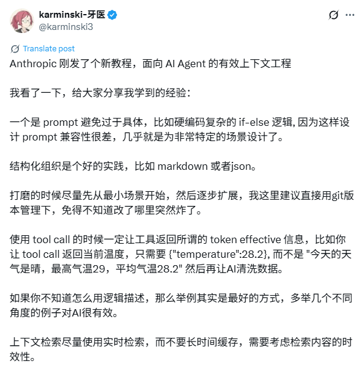

#### LangChain

> 参考：[LangChain - Context Engineering for Agents](https://blog.langchain.com/context-engineering-for-agents/)

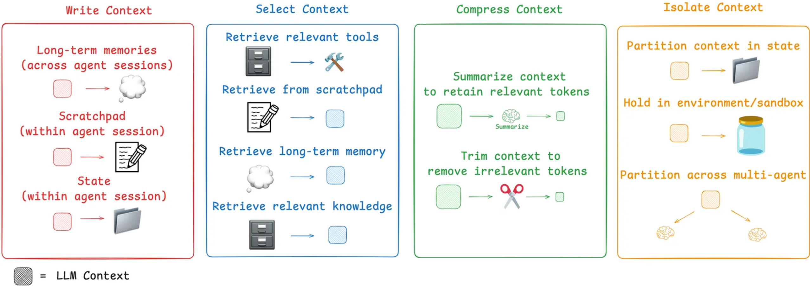

这篇博客更偏实践性，自于 LangChain 工程师 Martin Lance，主要讲了上下文工程的的四种落地策略：**写入、选择、压缩和隔离**。

**1. 写入：将信息保存到上下文窗口之外，以备后续使用。**

这就像人类在解决复杂问题时记笔记一样，帮助智能体“记住”关键信息，避免因上下文窗口限制而遗忘。

- **草稿板 (Scratchpads):** 用于短期记忆。智能体可以在执行任务时，将中间步骤的思考、计划或关键数据“写入”一个临时的草稿板。例如，先思考并制定一个详细计划，然后将其保存起来，即使后续对话很长导致早期上下文被截断，这个核心计划依然存在。
- **记忆 (Memories):** 用于长期记忆，可以跨越多个会话。智能体通过与用户的交互，自动学习并生成长期记忆（如用户偏好、特定指令等）。像 ChatGPT、Cursor 等产品都内置了类似机制，让智能体在未来的交互中能“记起”过去的信息。

**2. 选择上下文 ：在需要时，将最相关的信息“拉入”上下文窗口。**

拥有海量的记忆还不够，关键在于精准地选择。

- **从记忆中选择:** 当智能体需要执行任务时，它需要从大量的记忆库中检索出最相关的内容。这可能包括：用于指导行为的指令（程序性记忆），用于模仿的案例（情景记忆），或用于提供背景的事实（语义记忆）。
- **从工具中选择:** 不将所有工具的描述都塞给模型，而是利用 RAG 技术，根据当前任务动态地选择最相关的几个工具。研究表明，这能将工具选择的准确率提升高达三倍。
- **从知识中选择 :** 在代码生成等复杂场景中，简单的嵌入搜索已不足以应对。先进的系统会结合抽象语法树（AST）分析、知识图谱检索、grep/文件搜索以及重排（Re-ranking）等多种技术，来确保为智能体提供最精准的代码片段作为上下文。

**3. 压缩上下文 ：提炼信息，只保留执行任务所必需的令牌（Tokens）。**

当交互轮次过多或工具返回内容过长时，压缩上下文就显得至关重要。

- **上下文摘要:** 利用模型自身的能力，对长对话历史或冗长的工具输出进行总结。例如，Claude Code 在上下文窗口使用率超过 95% 时会自动运行“压缩”功能。摘要也可以应用在特定节点，比如对一个返回大量文本的搜索工具进行后处理，或在多智能体协作的交接点上进行信息提炼。

- **上下文修剪:** 一种更直接的过滤方法。通常采用硬编码的规则，例如简单地“移除对话列表中最旧的消息”，或者使用经过训练的专门模型来“修剪”掉不相关的部分。

**4. 隔离上下文：将复杂的任务分解，让不同的上下文在隔离的环境中发挥作用**。

通常有两种隔离方式：

- **多智能体：**将一个大任务分解成多个子任务，分配给一个由多个子智能体组成的“团队”。每个子智能体都有自己独立的、更小的上下文窗口，专注于处理特定的任务。Anthropic 的研究表明，这种架构的性能往往优于单个庞大的智能体，因为它允许并行探索和更专注的处理，但是这也带来了更高的令牌消耗和团队协调的挑战。
- **沙盒环境:** 智能体（特别是代码智能体）不直接处理复杂的工具调用，而是生成一段代码，这段代码在一个隔离的“沙盒”中运行。只有代码执行后的关键结果（如返回值）才会被传递回模型的上下文。这种方式特别适合处理和隔离那些令牌消耗巨大的对象（如图片、音频文件等）。

其他解读可参考：

- [Mutil-Agent的终极秘密武器：上下文工程（Context Engineering）](https://mp.weixin.qq.com/s/PmVUWakaxkHU8FDDdFUunA)

#### Others

> 参考：[用Context Offloading解决AI Agent上下文污染，提升推理准确性](https://mp.weixin.qq.com/s/Dwv2zFKjxbhKQR8Nd2NlJA)

文章引入了`上下文卸载（Context Offloading）`的概念，并撰写了一个Langgraph示例。

> 参考：[AI 智能体的8种记忆系统架构设计与落地](https://mp.weixin.qq.com/s/IQ649L2nqT0i4-QoQYJKgg)

通过8个方案快速了解上下文工程

- 全量记忆系统：最直男的“我全都要”
- 滑动窗口记忆系统：最像人脑的“只记得最近 3 句”
- 相关性过滤记忆系统：给记忆贴“重要度标签”
- 摘要压缩记忆系统：把长篇小说改写成便签
- 向量数据库记忆系统：给每句话发一张“语义身份证”
- 知识图谱记忆系统：让记忆长成一棵树
- 分层记忆系统：像人脑一样冷热分层
- 类 OS 内存管理记忆系统：Page In / Page Out

### 3）框架介绍

> 参考：[万字解码 Agentic AI 时代的记忆系统演进之路](https://mp.weixin.qq.com/s/LYx4pV1L9aVjd5u5iiI2zg)

介绍了Agent Memory的由来以及现有的Memory框架

- Memory 的定义：类比人脑，Memory的存储、分类、操作
- Agent Memory 的实现：主要概述了各类上下文管理框架（MemoryBank、LETTA、ZEP、A-MEM、MEM0、MemOS、MIRIX）
- 总结：一些被验证能有效提升Memory性能的手段，1、精细化记忆管理；2、组合多种记忆存储结构；3、记忆检索优化。

# 经验帖

## 主流产品

### Devin

> 参考：[Devin母公司Cognition - Context Engineering：不要构建多代理](https://mp.weixin.qq.com/s/C8l9eI3AYNjsoDbvOJSCKQ)

本文提出了与`Anthropic构建多代理研究`、`主流框架多代理方案`等相悖的关键，即不要构建多代理

- 当代理必须在长时间运行并保持连贯对话的同时保持可靠时，**可靠性的核心是上下文工程**。
- 笔者根据多代理的实际问题，引出了两个原则：
  - 原则1、*共享上下文(Share context)，并且要共享完整的代理轨迹，而不仅仅是单个消息*；
  - 原则2、*行动承载隐性决策，而冲突的决策会导致糟糕的结果*；

- 应用原则：
  - 首先描述了Claude Code的子代理设计，主要是描述其子代理的上下文隔离机制：子代理只负责子任务，且通常只负责回答问题不负责编写代码，不涉及主代理的上下文。子代理的所有调查性工作都不需要保留在主代理的历史记录中，从而允许在耗尽上下文之前有更长的追踪记录。Claude Code 的设计者特意采用了一种简单的方法。
  - 其次引出了不构建多代理的原因：
    - 例如现实中如果工程师之间的代码合并出现冲突，他们就会讨论并达成共识，但面对这种长上下文、主动性对话的情景，当前的多代理并不比单代理可靠。
    - 虽然人们一直在探究多代理协作的方法，但很明显，**在 2025 年，运行多个协作的代理只会导致脆弱的系统**。**决策最终变得过于分散，上下文无法在代理之间得到充分共享**。目前，我没有看到有人投入专门的努力来解决这个困难的跨代理上下文传递问题。我个人认为，随着我们让单线程代理在与人类沟通方面做得更好，这个问题将迎刃而解。当那一天到来时，它将释放出更大的并行性和效率。

- 评论区讨论：
  - 文章强调的是不要为了构建多代理而多代理，最重要的是稳定性。上下文工程能做好的事情，就没必要上多代理，以免带来不必要的上下文管理问题
  - 是否用多代理，主要还是面向需求

### Manus

#### 构建 Manus 的经验教训

> 参考：[宝玉解读 - AI 智能体的上下文工程：构建 Manus 的经验教训](https://baoyu.io/translations/Context-Engineering-for-AI-Agents-Lessons-from-Building-Manus)

Manus搭建上下文工程时的六个核心经验

- Manus背景：
  - BERT和GPT的横空出世，让自研的传统NLP模型一夜过时，这些模型开启了“上下文学习”（in-context learning，也就是模型在推理阶段通过上下文中的示例或提示来学习和完成任务，而无需更新参数的一种能力）的时代——以及一条全新的前进道路。
  - 由此，Manus 决定押注于“上下文工程”（context engineering），但是并非一帆风顺，重构了四次智能体架构，整理了下文的一些经验。

- 经验总结：
  - **围绕 KV 缓存进行设计：**
    - 如果非要我只选一个指标，我认为 KV 缓存命中率是生产阶段 AI 智能体最重要的单一指标。它直接影响延迟和成本。
    - 从上下文工程的角度来看，提高 KV 缓存命中率涉及几个关键实践：1、保持提示词前缀的稳定性（即使是单个 token 的差异也可能使该 token 之后的所有缓存失效。一个常见的错误是在系统提示词的开头包含时间戳）；2、让你的上下文只追加，不修改（避免修改之前的动作或观察结果。确保你的序列化过程是确定性的）；3、在需要时明确标记缓存断点。
    - 此外，如果你在使用 `vLLM` 等框架自托管模型，请确保 `prefix_caching` 已启用，并且你正在使用会话 ID（session ID）等技术来确保请求在分布式工作节点间的一致路由。

  - 掩蔽，而非移除：todo
    
  - 将文件系统用作上下文：todo
    
  - 通过“复述”来引导注意力：todo
    
  - 保留失败的尝试：todo
    
  - 警惕“少样本学习”陷阱：todo

另一个[解读](https://mp.weixin.qq.com/s/bkrTmiWmI6Hxeo6F5IliIA)：

**1. 围绕 KV 缓存进行设计**

在生产环境中，KV 缓存命中率是决定 AI 智能体延迟和成本的最关键指标。

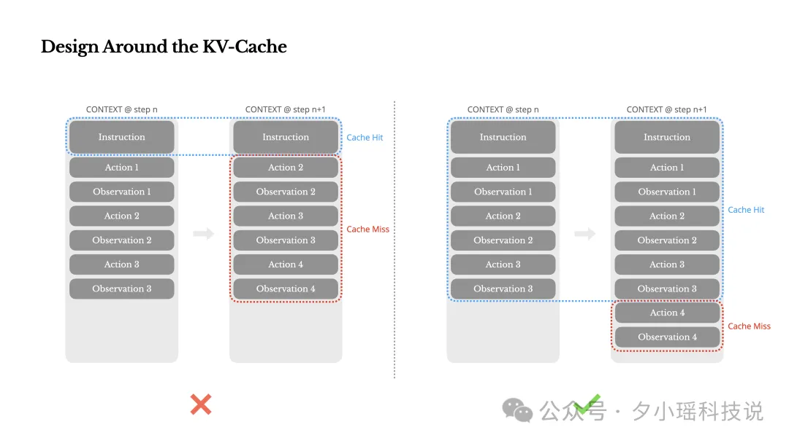

由于智能体任务的输入（上下文）通常远大于输出（工具调用），高效的缓存策略能带来超过 90% 的成本节约：

- **稳定化提示词前缀**：移除系统提示（System Prompt）中的时间戳、用户 ID 等动态内容。任何微小变动都会导致后续所有缓存失效。
- **坚持上下文“只追加”原则**：不要修改或删除历史记录。同时，确保 JSON 等数据结构在序列化时是确定性的（如固定键的顺序），防止缓存被意外破坏。
- **显式标记缓存边界**：如果推理框架支持，应在上下文中手动插入缓存断点，确保关键部分（如完整的系统提示）被有效缓存。

**2. 动态管理工具：用“遮蔽”代替“增删”**

在任务执行中动态增删工具列表是非常不利模型生成正确答案的，工具定义通常位于上下文前部，任何改动都会使后续缓存全部失效，并可能因引用了不再存在的工具而干扰模型：

**3. 将文件系统作为“无限”上下文**

即使是 128K 甚至更长的上下文窗口，在处理网页、PDF 等大型非结构化数据时也捉襟见肘。此外，超长上下文还会显著增加成本并引发“迷失在中间”等性能问题：

- **赋予读写权限**：让智能体能够读写文件，将本地文件系统当作一个容量无限、可持久化的外部结构化记忆体。
- **采用“指针”压缩策略**：不要直接丢弃信息，而是用指针替代。例如，将网页内容从上下文中移除，但保留其 URL；省略文档细节，但保留其文件路径。这样，智能体可以在需要时通过工具重新加载信息，有效缩短上下文长度。

**4. 利用动态任务列表维持焦点**

在执行包含数十个步骤的复杂任务时，智能体很容易偏离最初设定的目标，即“目标漂移”：

- **维护动态待办事项**：让智能体在工作区（如 `todo.md` 文件）维护一个任务清单。每完成一步，就重写整个文件，勾选已完成项。
- **强化“近期记忆”**：通过不断重写，最新的任务计划始终位于上下文的末尾。这利用了模型的“近因效应”（Recency Bias），将核心目标始终置于其注意力焦点，从而有效对抗目标漂移。

**5. 保留失败记录，让智能体从错误中学习**

开发者常倾向于隐藏或清理智能体的错误尝试（如失败的工具调用、错误日志）。但这恰恰剥夺了模型从失败中学习和适应的宝贵机会：

- **完整记录失败过程**：当操作失败时，应将失败的指令连同其返回的错误信息（如堆栈跟踪）一并追加到上下文中。
- **驱动隐式信念更新**：当模型观察到一次失败记录后，它会自然地更新其内部判断，从而在后续步骤中降低重复犯同一错误的可能性。

**7. 打破重复模式，避免“少样本”陷阱**

虽然少样本（Few-shot）示例有助于引导模型，但如果上下文中充斥着大量高度相似的“操作-观察”范例，模型会倾向于盲目模仿，导致行为僵化，在面对新情况时表现脆弱：

- **引入受控的多样性**：在“操作-观察”的表示方式上引入微小的结构性变化，如使用不同的序列化模板、同义词替换或在格式上加入微量“噪音”。
- **提升模型适应性**：这种受控的随机性有助于打破固化模式，迫使模型更深入地理解任务而非简单模仿，从而使其行为更灵活、更鲁棒。

#### 破解上下文膨胀难题的三大核心策略

> 参考：[Manus：3大核心策略，破解AI Agent上下文膨胀难题](https://mp.weixin.qq.com/s/xnYkE54YY8_Qs7R5m0g4ww)

Manus为每个会话**分配独立虚拟机**，让Agent拥有**文件系统和终端工具**。在此基础上，它通过“减少、卸载、隔离”三大策略，实现上下文窗口的高效管理:

- 策略1：Reduce（减少）——压缩与总结双管齐下
  - Manus为**工具调用结果**设计“完整版”和“精简版”两种形态，参考两种形态的结构图：
    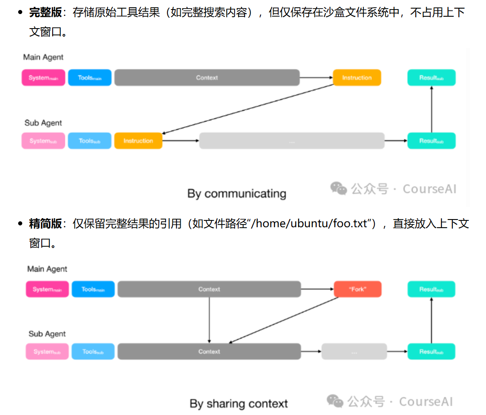
  - 当Agent接近上下文窗口上限时，系统会自动触发压缩机制：
    1. 将旧工具结果的“完整版”替换为“精简版”，释放窗口空间。
    2. 新工具结果仍保留“完整版”，确保Agent能基于最新信息决策。
    3. 当压缩效果达到瓶颈时，启动总结机制——按预设 schema 生成工具结果摘要，保证不同任务的摘要格式统一，进一步节省空间。
- 策略2：Offload（卸载）——构建分层行动空间
  - 函数调用层：仅保留不到20个“原子函数”，如shell（执行终端命令）、text editor（读写文件）、search（搜索）等。这些函数功能通用，能覆盖绝大多数任务需求。
  - 沙盒层：将大量工具（如语音工具、MCP CLI命令）转移到沙盒中，以终端命令形式存在。Agent无需记忆这些工具的细节，只需通过“--help”命令即可随时查看用法。
- 策略3：Isolate（隔离）——用子Agent实现上下文隔离
  - 仅保留3类核心子Agent，避免跨Agent通信的冗余：规划者（Planner）、知识管理者、执行者（Executor）
  - 子Agent与主Agent的上下文交互分两种场景：
    - 简单任务：规划者仅向执行者发送任务指令，执行者完成后返回结果（类似Claude Code的任务工具）。
    - 复杂任务：规划者向执行者共享完整上下文（如全部对话历史），但执行者仍拥有独立的工具库和提示词，确保任务执行的独立性。

### 阿里云

> 参考：[2026.1.12 CodeGenius Memory：构建面向代码生成的可控上下文系统](https://mp.weixin.qq.com/s/Yeh0b82jN4IYuaUMCUl_BQ)

上下文膨胀成为 AI Agent 发展的新瓶颈：略

早期 CodeGenius 采用固定窗口（仅保留最近 5 轮对话），但面临三大问题：

1. **上下文断裂**：复杂任务超 5 轮时，前期关键信息丢失；
2. **缓存失效**：截断导致提示词缓存无法复用，增加成本；
3. **冗余干扰**：重复文件内容、过时工具结果占用 Token 并干扰模型。

新 Memory 系统（CodeGenius Memory）旨在通过**结构化、压缩与抽象机制**，架构图如下：

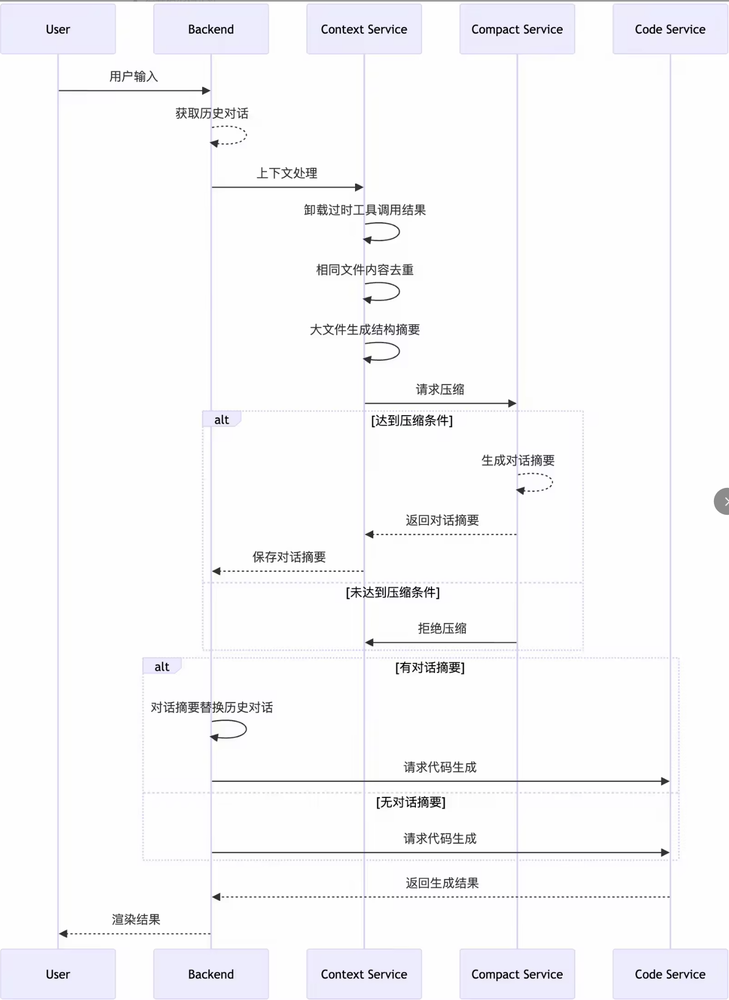

方案最核心的三件事如下：优化方案遵循「输入 → 整理 → 压缩 → 生成」流程

- **卸载过时信息**
  - 将 5 轮前的工具调用详情（如代码、日志）从上下文中移除，仅保留文件路径和提示；
  - 通过批量卸载（每 5 轮一次）平衡缓存稳定性与信息清理效率。
- **文件去重与摘要生成**
  - **去重**：同一文件仅在首次加载完整内容，后续只提供编辑差异（Diff）或路径；
  - **大文件压缩**：对超过 3000 行的文件，用 `tree-sitter`生成仅包含关键结构（如类型定义、函数签名）的摘要，类似“目录导航”，模型可按需定位细节。
- **动态对话摘要**
  - **触发时机**： 上下文使用量达 70%（防溢出）； 用户开启新话题且与历史意图无关（通过最近 3 轮对话判断）。
  - **摘要生成**：使用 Claude Code Compact 提示词，生成包含 9 部分的结构化总结（如主要意图、关键技术、待办任务等），将上百 K 的上下文压缩至 2~3 K。
  - **优化细节**：结合缓存有效期（5 分钟）、Token 占用阈值等策略，避免无效压缩。

**成效与未来方向**

- **显著收益**： 提示词缓存命中率提升，推理成本下降； 复杂任务中模型生成质量增强（不再丢失关键上下文）； 平均 Token 消耗降低。
- **未来演进方向**： **上下文隔离**：通过子 Agent 处理独立任务，避免主上下文污染； **记忆分级**：短期（上下文）、中期（摘要）、长期（知识库）分层存储； **动态策略**：根据任务复杂度自适应调整压缩规则。

> 参考：[基于上下文工程和多智能体构建云小二Aivis的十大实战经验](https://mp.weixin.qq.com/s/u6F93L0sCfR-rjqBSJi3lQ)

为什么Agent不按预期输出:

- TODO

实践总结的十大Agent优化经验:

- TODO

### Cursor

> 参考：
>
> - [Cursor这篇文章揭开了他们上下文管理的秘密](https://mp.weixin.qq.com/s/YWV2dCN6ecC6Tf4tE6Pxjw?scene=1&click_id=2)
> - [看完 Manus、Cursor 分享后的最大收获：避免 Context 的过度工程化才是关键](https://mp.weixin.qq.com/s/dG3e8D3IqGsRxOvhit1Dow)
>
> 原文：[2026.1.6 Cursor 《Dynamic Context Discovery》](https://mp.weixin.qq.com/s/YWV2dCN6ecC6Tf4tE6Pxjw?scene=1&click_id=2)

概述：

1. 将较长的工具响应转化为文件/工具调用返回大内容时，别直接塞上下文
2. 在总结时引用聊天记录/长对话历史的处理
3. 支持 Agent Skills 开放标准
4. 高效地仅加载所需的 MCP 工具
5. 将所有集成终端会话视为文件

补充：文章强调，避免上下文的过度工程化是关键，上下文工程的目标是让模型工作更简单，而不是更复杂。以下是文章的核心要点总结

1、上下文缩减：应对上下文腐烂

- **问题**：Agent 在运行过程中，上下文会无限增长，导致“上下文腐烂”，表现为推理变慢、质量下降、无意义重复。
- **解决思路**：采用“上下文卸载”，将信息转移到上下文窗口之外（如文件系统），需要时再精确检索。
- **Cursor 的做法**：将冗长的工具结果、终端会话、聊天记录全部转化为文件，采用“动态上下文发现”模式，让模型在需要时自行查找信息。
- **Manus 的做法**：设计了一套结构化的可逆缩减系统，包括： **紧凑化**：无损、可逆地剥离可从外部重建的信息（如文件内容，只保留路径）。 **摘要化**：有损压缩，但在生成摘要前会将完整上下文转储到日志文件中作为“保险”。

2、工具管理的动态化：避免工具过载

- **问题**：工具过多会导致上下文混淆和 Token 浪费。
- **解决思路**：动态发现工具，让 Agent 在需要时自行查找工具定义。
- **Cursor 的做法**：将工具详细描述全部文件化，系统提示词中只保留工具名称列表，Agent 通过 grep 或语义搜索主动查找。
- **Manus 的做法**：设计分层行动空间： **L1 原子函数调用**：固定、正交的底层函数（如读写文件、执行 shell）。 **L2 沙盒工具**：将大多数工具预装在虚拟机沙箱中，通过 L1 的 shell 命令动态交互。 **L3 软件包与 API**：对于复杂任务，允许 Agent 编写并执行 Python 脚本。

3、多 Agent 协作：平衡隔离与共享

- **核心问题**：如何在多 Agent 间实现高效的信息同步与协作。
- **两种模式**： **任务委托模式**：通过通信实现隔离，主 Agent 发送指令，子 Agent 独立执行并返回结果。 **信息同步模式**：通过共享上下文实现协作，子 Agent 继承主 Agent 的完整历史记录。
- **Manus 的实践**：采用“Agent 化的 MapReduce”系统，通过共享沙箱、预定义输出 Schema 和约束解码，确保子 Agent 返回结构一致的结果。

4、设计哲学：简化与信任模型

- **Cursor**：强调“少即是多”，通过减少初始信息，让 Agent 主动探索上下文。
- **Manus**：强调“少构建，多理解”，通过简化架构提升系统性能，避免过度工程化。

文章最后指出，未来的趋势是将更多主动权交给模型，为其创建信息丰富且易于探索的外部环境，而非一味地向上下文塞入更多信息。

### Others

> 参考：[向量存储vs知识图谱：LLM记忆系统技术选型](https://mp.weixin.qq.com/s/1qq17gWU6YaYmMH1luqGiw) 

一篇关于实现记忆系统的存储方案

> 参考：[How Long Contexts Fail](https://www.dbreunig.com/2025/06/22/how-contexts-fail-and-how-to-fix-them.html)

很多人在初期使用上下文工程的时候会发现：有的时候信息越多，AI 表现越差。这主要源于“上下文混淆”和“上下文冲突”：

**1. 上下文混淆：当无关信息成为“噪声”**

GeoEngine 基准测试中，一项针对小型模型的研究提供了典型案例。

研究人员发现，当给量化的 Llama 3.1 8B 模型提供 GeoEngine 中所有 46 种工具定义时（即使全部在 16k 上下文窗口内），模型任务失败。然而，仅提供 19 种相关工具时，模型却成功完成任务。

这揭示了一个核心问题：模型会“关注”上下文中所有信息。即使这些信息是无关细节或无用工具定义，模型仍会将其纳入考量。尽管大型模型在忽略冗余信息方面有所进步，但无价值的上下文信息仍会显著干扰 AI 智能体的性能。更大的上下文窗口固然能容纳更多信息，但也增加了模型被无关内容分散注意力的风险。

**2. 上下文冲突：当 AI 被早期错误误导**

上下文冲突是比混淆更严重的现象，指上下文信息不仅无关，甚至相互矛盾。

微软和 Salesforce 团队的一项研究发现。他们模拟用户逐步提供信息的聊天场景，将完整提示“分片”输入模型。结果令人震惊：模型性能平均下降 39%，连 OpenAI 家的模型准确率也从 98.1% 骤降至 64.1%。

这是因为模型在对话早期基于不完整信息做出了错误假设，并过早尝试生成解决方案。这些错误的“中间步骤”残留于上下文中，与后续更完整的信息产生冲突。

“当 LLM 在对话中走错方向时，它们会迷失方向且无法恢复。”

> 参考：[实战经验 - Practical tips on building LLM agents](https://letters.lossfunk.com/p/practical-tips-on-building-llm-agents)

这篇博客更偏向于实战经验，提供了 6 个上下文工程的实用技巧:

- **精细任务分块**
- **充分利用长上下文**
- **为长周期任务构建稳固的验证系统**
- **将模型视为“失忆天才”：持续重复关键信息**
- **赋予 LLM 读写工具：使其主动构建上下文**
- **关注多轮对话成本：善用 KV 缓存**

更多解读，参考：

- https://mp.weixin.qq.com/s/bkrTmiWmI6Hxeo6F5IliIA?scene=1

> 多智能之间是否共享全部的上下文？是什么时候共享上下文？典型落地场景？典型开源项目的做法？原本让ChatGPT做了一堆分析，现直接简述结论，具体分析过程省略

结论：不该“一股脑儿把所有上下文都共享”。在多数 Multi-Agent System（MAS）里，更稳妥/高效的做法是：**分层、按需、可控地共享**。下面给你一份可落地的决策框架 + 大量真实项目/论文/场景对照，帮你判断“什么该共享、怎么共享、共享到什么粒度”。

一句话准则：**把“事实与工件”放在共享层，把“推理与思考”留在私有层；需要时再通过检索把对的东西、在对的时刻、喂给对的代理。**

## 其他

### Chroma演讲

> 参考：[Chroma - Context Engineering: The Outer Loop](https://www.youtube.com/watch?v=vsfbplnJyA8)

Chroma 首席技术官 Hammad Bashir 的演讲，发表了他对上下文工程的看法。

“如果我们无法预测它何时会出故障，那就不能称之为“工程”。

因此，我们如果想要更好地进行上下文工程，那就需要理解大语言模型的心智模型，Hammad 提出了几种理解大语言模型的思维方式：

- **可插值的程序数据库**：可以将模型看作是学习了各种“程序”（例如“用莎士比亚的风格重写”）的集合，它能根据上下文来调用和组合这些程序。
- **重现一种心智状态**：上下文的作用就像是让模型“进入状态”，从而能够顺利执行某个程序。
- **Mesa-Optimization**：一些研究者认为，大语言模型前向传播过程中内部就在执行一种优化过程。这些模型虽不完全准确，但有助于我们提出更好的问题（例如，“我想要定义什么样的搜索空间？”）来调试和改进应用。

### ACE方法

> 参考：[告别微调！斯坦福提出Agentic上下文工程](https://mp.weixin.qq.com/s/sHUZ5IJvPKGQ730A0SFMjw)

提出了现有上下文的问题：它们就像那个只给出一句精炼指令的导师，为了“简洁”而牺牲了“细节”和“深度”，导致模型在复杂的任务中表现不佳。

提出了解决方案：ACE方法。

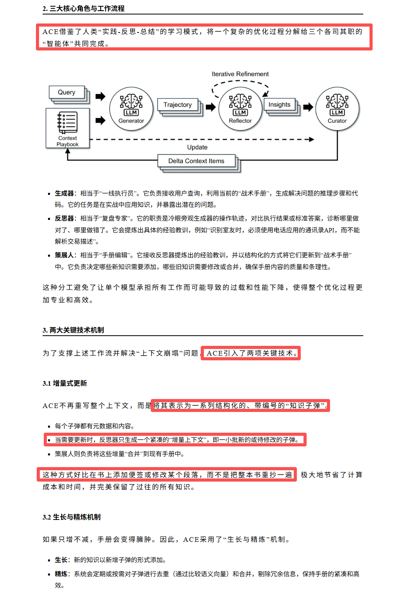

其中，精炼机制很好理解，不过增量式更新还不太理解：如下解析也很奇怪，传统方法需要重写整个上下文？增量更新与新添加一段对话有什么区别，只是让大模型专注于最新的这段对话？

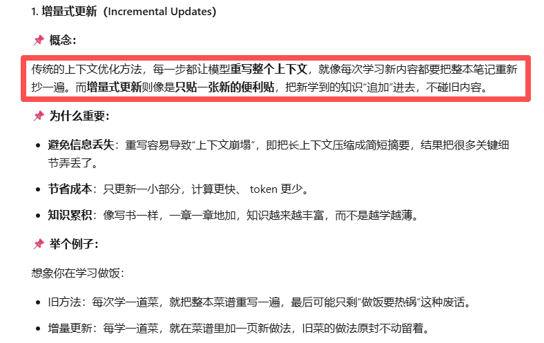

## 概念补充

### 1、内循环与外循环

关于RAG已死，以及上下文工程中的内循环与外循环：

参考：[Chroma创始人「Context Engineering」5 步杀疯全网](https://mp.weixin.qq.com/s/MwlEYBu4G-K94tcycvchPA)

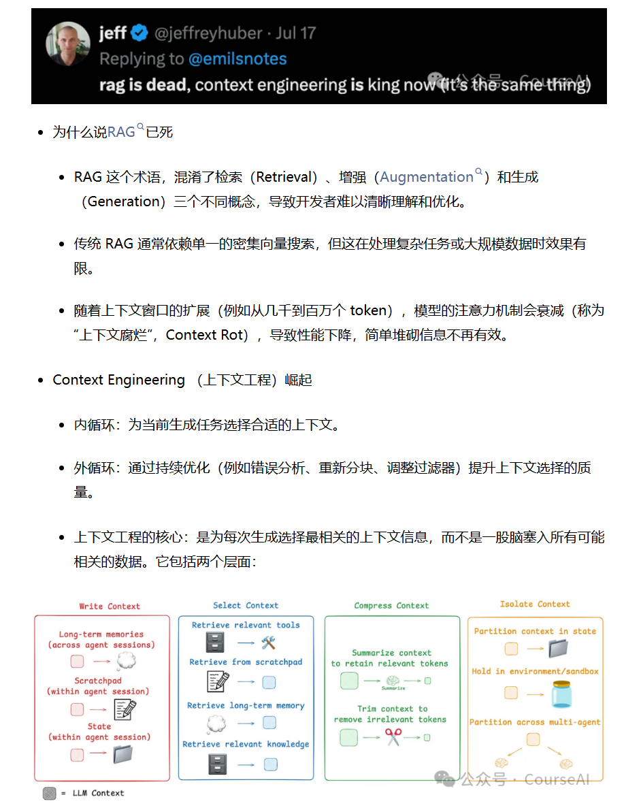

------

1. **“RAG 已死”的说法本质上是对误解和局限的反思**

- **术语混淆**：RAG 的确把 *Retrieval / Augmentation / Generation* 打包成一个 buzzword，但开发者往往以为“RAG”就是“往 LLM 塞知识库 + Embedding 检索”。这造成了“黑盒式拼凑”，而不是系统性的优化。
- **单一向量搜索的局限**：纯粹依赖 dense retrieval，在多模态数据、不规则知识图谱、复杂 reasoning 任务下表现很差。真正强的系统往往是混合检索（dense + sparse + symbolic + structured query）甚至 agent 级 pipeline。
- **上下文窗口扩展的误区**：大家以为“窗口大了就能解决一切”，但实际上 attention 衰减、位置编码失效、无差别信息灌输，都会让模型困惑甚至退化。这就是所谓的 *Context Rot* ——信息并非越多越好，而是要“精准 + 动态裁剪”。

所以，说 “RAG 已死”，其实是在说 **老派的、一次性检索 + 拼接上下文的 RAG 已经过时**。

实际上，**RAG 没死，而是升级为 Context-Oriented System**。真正的未来不是完全抛弃检索，而是将“检索”内化为上下文工程的一环，与 reranking、context pruning、long-context memory、甚至外部 agent loop 融合。

------

2. **上下文工程的崛起：从“喂数据”到“动态对话”**

你的三点（内循环 / 外循环 / 上下文选择）抓住了精髓：

- **内循环**：像实时的“注意力调度器”。不是盲目塞信息，而是根据任务类型、用户意图、模型推理轨迹，去做即时的上下文裁剪和排序。
  - 类似于“prompt-level memory manager”。
- **外循环**：长期的“反馈驱动优化”。把模型出错的地方反推回检索/切分策略，逐步改进 chunking、indexing、reranker、甚至 schema。
  - 这让上下文选择像 RLHF 一样具备迭代性。
- **上下文工程核心**：一句话总结就是 **“让模型只看到必要的上下文，而不是可能相关的上下文”**。

这和传统 RAG 最大的不同在于：RAG 是一次性 pipeline，而上下文工程更像是一个 **自适应的循环系统**（类似编译器优化，而不是文本拼接）。

# 实际案例

[LangChain官方 - 上下文工程的定义与基本组成](https://blog.langchain.com/the-rise-of-context-engineering/)：

- Prompt是上下文工程的子集

[LangChain官方 - 上下文工程的四种一般类别](https://blog.langchain.com/context-engineering-for-agents/)：

- Write Context
- Select Context
- Compress Context
- Isolate Context

# 论文博客

> 参考：[Anthropic再发Agent神文：像人类工程师一样思考，解决「长程任务」难题](https://mp.weixin.qq.com/s/tmXg0tguoZZplDZMaJWlJQ)

核心挑战：上下文压缩还不够，Claude主要表现出两种失败模式：

- 试图一次性完成所有工作：Agent倾向于在一次会话中做太多事，导致中途耗尽上下文，留下的功能只完成了一半且缺乏文档。下一个会话的Agent必须猜测之前发生了什么，浪费大量时间修复基础应用
- 过早宣布完工： 在项目后期，新的Agent实例看到已经有一些功能，就误以为整个工作已完成

解决方案：双Agent架构。Anthropic将问题分解，提出了双重解决方案：

- 初始化Agent： 第一个会话使用专用提示词，负责搭建环境。包括生成`init.sh`脚本、记录进度的`claude-progress.txt`文件，以及展示文件添加情况的初始Git提交
- 编码Agent： 后续的每一个会话都致力于取得增量进展，并留下结构化的更新
- 这一方案的关键在于让Agent在开启新窗口时能迅速理解工作状态——这主要通过`claude-progress.txt`文件和Git历史记录来实现

这项研究展示了长程Agent框架的一种可行方案，但仍有未解决的问题：

- 单Agent vs 多Agent：目前尚不清楚是通用的编码Agent表现最好，还是采用多Agent架构（如专门的测试Agent、QA Agent、代码清理Agent）更优
- 领域泛化：本演示针对全栈Web开发。未来方向是将这些经验推广到科学研究或金融建模等其他长程任务领域

# 开源项目

### Context-Engineering

官网：https://github.com/davidkimai/Context-Engineering

大卫·金梅从一个独特的视角来审视 AI 的构建，将上下文工程理解为五个进化层级：从原子到神经网络的逐级进化的系统。就像生命体的演化过程：从原子到分子，再到细胞、器官，最终形成复杂的神经系统。每一级都以前一级为基础，层层递进。

遗憾的是，大多数人止步于“原子”层面——即最基本的提示词。而真正的力量，在于构建一个完整的“神经网络系统”。这可以通过以下五个层次逐步实现：

具体解读参考：https://mp.weixin.qq.com/s/bkrTmiWmI6Hxeo6F5IliIA

### context-engineering-intro

官网：https://github.com/coleam00/context-engineering-intro
