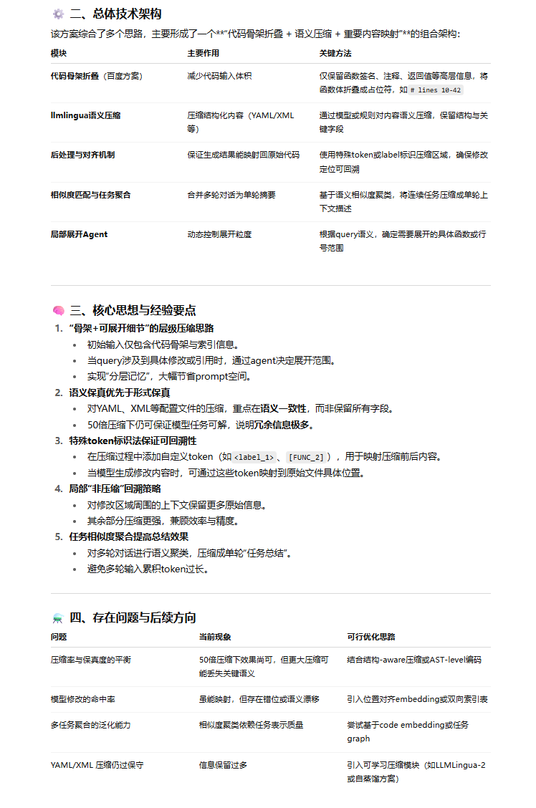

官网：https://llmlingua.com/

## 概述

略


## 案例

目标是**在长上下文（如10万token级别）代码生成或修改任务中进行Prompt压缩**，在不显著损失任务可解性的前提下，大幅降低输入长度，使LLM仍能准确生成或修改对应的代码。

- 核心架构：代码骨架折叠 + 语义压缩 + 重要内容映射

- 总体方案：百度的代码骨架折叠+llmlingua配合后处理+类memo0的生成模型总结，此外还塞了任务相似度匹配来选择压缩一个完整对话变成单轮总结

  ```
  一、llmlingua：
    1. 这个主要处理yaml和xml的内容 我们自己做了些压缩尝试 但是力度不够大 信息保留太多了。
    2. 对于那种10w token来说大部分信息完全不必要  prompt压缩这方面论文也比较少
    3. 我们用了一些标识，保证了模型修改代码能映射回未压缩代码上，保证了模型最后更改代码的function call 能命中 但是我觉得这块memory也就只能做到这了，进一步没啥思路了
    4. 你们是采用的特别token标记重要内容嘛？然后通过这个被标记的重要内容去计算相关内容嘛？不需要  实际测试发现50压缩力度下，压缩后的yaml，xml对于拆解完的query来说信息足够，llm已经能根据这两个信息来解决了  。主要问题在于解决llm阅读压缩后的内容生成的内容怎么命中压缩前的文件。特殊token来判断这种（自定义的类似<label>，［label］这些去让模型识别对应位置）。然后偷组里前辈的 如果你塞入特殊token  保留的会更多。更近一步 把改的位置回溯回去一点不压缩 剩下加大力度  但是我懒没做
  二、代码骨架折叠：
    1. 参考百度的方案  就是一个函数只保留函数签名，中间内容用代码行数码住，line1 to line 2，保留返回值
    2. 用个agent，输入折叠代码和query ，让他判断需要展开多少到多少行
    3. 对应展开然后跟query一起送最终llm里面就好了
  ```

- 参考技术架构：输入代码→骨架折叠→语义压缩→标记→Agent展开→LLM生成→结果回映射
  

- 总结：该方案本质是一个“层次化Prompt压缩框架”：通过**代码骨架折叠**减少结构负担，**llmlingua语义压缩**降低数据密度，配合**token标记和智能展开**机制，在保持修改可定位性的同时实现大规模上下文压缩。
