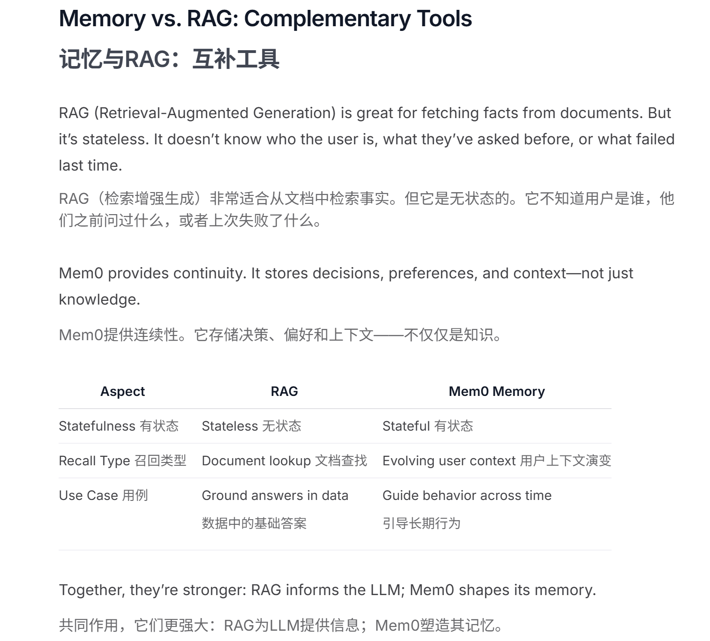

# 概述

**Introduction:**

- [Mem0](https://mem0.ai/) ("mem-zero") enhances AI assistants and agents with an intelligent memory layer, enabling personalized AI interactions. It remembers user preferences, adapts to individual needs, and continuously learns over time—ideal for customer support chatbots, AI assistants, and autonomous systems.

**Core Capabilities:**

- **Multi-Level Memory**: Seamlessly retains User, Session, and Agent state with adaptive personalization
- **Developer-Friendly**: Intuitive API, cross-platform SDKs, and a fully managed service option


总结来说：

- 多层次记忆：支持用户级、会话级和AI代理级的记忆保留。
- 自适应个性化：根据用户交互不断改进，提供精准个性化记忆。
- 开发者友好API：简单易用，易于集成。
- 跨平台一致性：保持不同设备上的行为一致性。
- 托管服务：简化部署和维护。


参考：https://mp.weixin.qq.com/s/zJDdPpZq4ADdmCs-kzJqoA

文章本身主要还是Mem0宏观的叙述，包括架构设计等内容，不过稳重提到：

```
最近，各个大模型开发商不断发布具有更大上下文窗口的模型，上下文长度从128K 扩展到甚至达到千万级别的 Token。但是，这些做法仅仅是“延迟”了问题的发生，并没有真正解决问题。在企业业务场景实际使用中，增加上下文窗口的大小会面临两大障碍：
1、信息丢失和噪声干扰：在跨越数周或数月的交流中，对话历史最终会超出任何大小的上下文窗口。更关键的是，对话内容通常天马行空。比如：用户可能在讨论饮食偏好后，又进行了数小时关于编程的对话。当话题再次回到食物时，重要的“素食”信息可能已经被大量无关的编程讨论所淹没，这即是所谓的“大海捞针”难题。
2、性能和成本的挑战：处理极长的上下文不仅显著增加了打模型的推理延迟，还带来了高昂的 Token 成本。此外，研究显示，LLM 的注意力机制在处理极长序列时会出现性能退化，大模型难以有效利用那些距离当前上下文很远的信息。
因此，我们需要一种更智能的记忆机制，它应该能够模拟人类的认知过程：有选择性地保存关键信息，整合相关概念，并在需要时精确地检索信息。
```

那么对于`信息丢失和噪声干扰`，该怎么在合适的时机把相关上下文再召回回来？


maybe在项目中，基于Mem0搭建一个工具，每轮对话将上下文输入进入，基于Mem0搭建上下文分析工具，判断是否要正确召回之前上下文的某段内容？


# 快速上手

## 常用方法

官方：[Mem0官方-快速入门](https://docs.mem0.ai/quickstart)

其他参考：

- [Mem0开发者指南](https://zhuanlan.zhihu.com/p/710032476)
- [深入浅出分析最近火热的Mem0个性化AI记忆层](https://www.cnblogs.com/xiaoqi/p/18315502/mem0)


常用方法：Memory的增删改查

```
import os
from mem0 import Memory

os.environ["OPENAI_API_KEY"] = "your_api_key"
os.environ["OPENAI_BASE_URL"] = "your_base_url"

config = {
    "llm": {
        "provider": "openai",
        "config": {
            "model": "gpt-4o-mini",
            "temperature": 0.2,
            "max_tokens": 1500,
        }
    },
    "history_db_path": "history.db"
}

m = Memory.from_config(config)

# 添加新记忆
result = m.add("喜欢在周末写代码", user_id="Kirk", metadata={"category": "爱好"})

# 检索所有记忆
all_memories = m.get_all()

# 检索特定记忆
specific_memory = m.get(memory_id)

# 智能搜索相关记忆
related_memories = m.search(query="Kirk的爱好是什么?", user_id="Kirk")

# 更新记忆
result = m.update(memory_id=memory_id, data="喜欢在周末摄影")

# 获取记忆历史
history = m.history(memory_id=memory_id)

# 删除单条记忆
m.delete(memory_id=memory_id)

# 删除用户所有记忆
m.delete_all(user_id="Kirk")

# 重置所有记忆
m.reset()
```


示例-个性化学习助手：

```
def advanced_learning_assistant(user_query, user_id):
    # 检索用户学习历史和偏好
    learning_history = m.search(query="学习历史", user_id=user_id)
    preferences = m.search(query="学习偏好", user_id=user_id)

    # 使用LLM生成个性化学习计划
    learning_plan = generate_learning_plan(user_query, learning_history, preferences)

    # 更新用户的学习记录
    m.add(f"学习计划: {learning_plan}", user_id=user_id, metadata={"category": "learning_plan"})

    # 设置提醒和进度跟踪
    set_reminders(learning_plan, user_id)
    track_progress(learning_plan, user_id)

    return learning_plan

def generate_learning_plan(query, history, preferences):
    # 使用配置的LLM生成学习计划
    prompt = f"基于以下信息生成个性化学习计划:\n查询: {query}\n历史: {history}\n偏好: {preferences}"
    response = m.llm.generate(prompt)
    return response.text

def set_reminders(plan, user_id):
    # 实现设置提醒的逻辑
    pass

def track_progress(plan, user_id):
    # 实现进度跟踪的逻辑
    pass
```

示例-情感智能客户服务系统：

```
def emotion_aware_customer_service(customer_query, customer_id):
    # 检索客户历史互动和情绪状态
    interaction_history = m.search(query="客户互动历史", user_id=customer_id)
    emotion_history = m.search(query="情绪历史", user_id=customer_id)

    # 分析当前查询的情绪
    current_emotion = analyze_emotion(customer_query)

    # 生成情感智能响应
    response = generate_empathetic_response(customer_query, interaction_history, emotion_history, current_emotion)

    # 更新客户情绪历史
    m.add(f"情绪状态: {current_emotion}", user_id=customer_id, metadata={"category": "emotion"})

    # 记录新的互动
    m.add(f"查询: {customer_query}\n响应: {response}", user_id=customer_id, metadata={"category": "interaction"})

    return response

def analyze_emotion(text):
    # 使用LLM分析文本情绪
    prompt = f"分析以下文本的情绪:\n{text}"
    response = m.llm.generate(prompt)
    return response.text

def generate_empathetic_response(query, history, emotion_history, current_emotion):
    # 使用LLM生成富有同理心的响应
    prompt = f"基于以下信息生成一个富有同理心的回应:\n查询: {query}\n历史互动: {history}\n情绪历史: {emotion_history}\n当前情绪: {current_emotion}"
    response = m.llm.generate(prompt)
    return response.text
```


## Mem0 + LangChain

参考：

- 官方文档：https://docs.mem0.ai/components/llms/models/langchain
- 案例：
  - https://mp.weixin.qq.com/s/eHIFt3FyAjgF9q9Zmwog8g


## Mem0 vs RAG

看起来Mem0也跟RAG一样，基于Embedding模型和向量库进行文本的存储和召回，Mem0相比传统的检索增强生成(RAG)系统有以下优势:

1. **动态实体关系**: Mem0可以动态理解和关联不同交互中的实体,而RAG通常基于静态文档检索。
2. **时间敏感性**: Mem0考虑信息的时效性,优先考虑最近和最相关的信息。
3. **上下文连续性**: Mem0可以跨会话保持上下文,而RAG通常局限于单次查询。
4. **自适应学习**: Mem0能够根据交互不断优化其个性化能力。
5. **实时更新**: Mem0支持记忆的动态更新,而RAG通常依赖于静态数据集。

官方描述：




## 知识图谱

### 1）数据库

知识图谱的底层通常使用 **图数据库（Graph Database）** 或 **三元组存储数据库（Triple Store）**。

------

图数据库：主要面向 **关系型查询与图算法**（最短路径、社区发现、PageRank 等）。

- **Neo4j**
  - 最流行的图数据库，支持 **属性图模型（Property Graph）**。
  - 查询语言：Cypher。
  - 适合知识图谱的 **应用层**（比如问答、路径分析）。
- **JanusGraph**
  - 开源、可扩展的图数据库。
  - 常与 **Cassandra、HBase、ScyllaDB** 结合，用于海量图存储。
- **TigerGraph**
  - 商业图数据库，擅长并行计算和大规模分析。
  - 面向 **企业级知识图谱应用**（金融风控、推荐系统）。

------

三元组存储（RDF Store / Triple Store）：适合存储 **RDF 格式**（subject-predicate-object）的知识图谱，强调 **语义推理**。

- **Apache Jena TDB / Fuseki**
  - 支持 RDF/SPARQL，常用于学术研究和小型知识图谱项目。
- **Virtuoso**
  - 功能强大的 RDF 存储与查询引擎。
  - 可支持 **DBpedia、Wikidata** 这种大规模开源知识库。
- **GraphDB（Ontotext）**
  - 商业 RDF 数据库，支持推理（OWL、RDFS）。
  - 多用于 **企业语义知识图谱**。

------

混合/新型数据库：结合 **向量搜索 + 知识图谱**

- **NebulaGraph**
  - 高性能分布式图数据库，适合大规模数据。
- **ArangoDB**
  - 多模型数据库，支持文档 + 图 + 键值。
- **Weaviate / Qdrant + Neo4j 组合**
  - 前者用于 **语义向量检索**，后者用于 **显式知识存储**，越来越常见于 **LLM 应用场景**。


# 开发经验

TODO