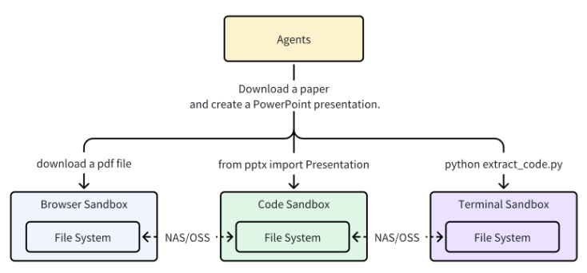
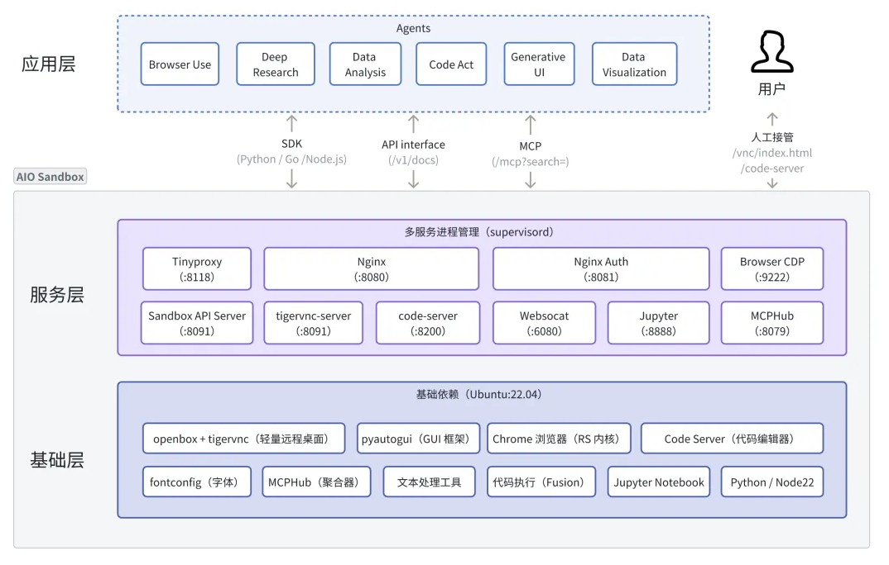
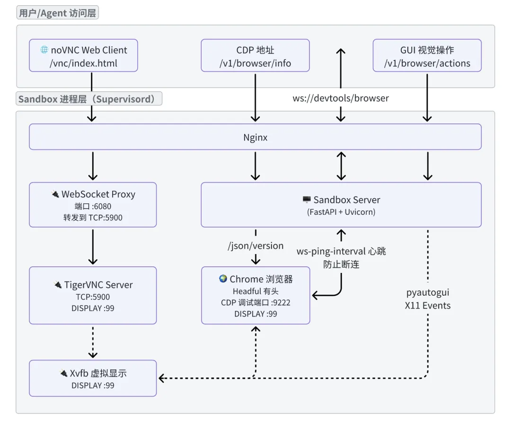

> [agent-infra/sandbox](https://github.com/agent-infra/sandbox)：不需要key，开源、可用、好用
>
> - 202601 - 2k star，AIO Sandbox is an all-in-one agent sandbox environment that combines Browser, Shell, File, MCP operations, and VSCode Server in a single Docker container.
> - 支持LangChain、OpenAI等 
>
> 其他：
>
> - [1015.10.27 字节 - AIO Sandbox：为 AI Agent 打造的一体化、可定制的沙箱环境](https://mp.weixin.qq.com/s/RViNIpYYW_-q1WLsAsO-eQ)：架构分析的很细致！

大多数沙盒都是单一用途（浏览器、代码或 Shell），这使得文件共享和功能协调变得极其困难。例如，浏览器沙盒下载的文件需要通过 NAS/OSS 与其他沙盒共享，而一个 Agent 任务通常需要多个沙盒准备就绪才能运行。



组件图：




### 快速入门

环境配置：

```bash
docker run --security-opt seccomp=unconfined --rm -it -p 8001:8080 enterprise-public-cn-beijing.cr.volces.com/vefaas-public/all-in-one-sandbox:latest
```

接着可以查看各个组件：可行

- 📖 **Documentation**: http://localhost:8001/v1/docs
- 🌐 **VNC Browser**: http://localhost:8001/vnc/index.html?autoconnect=true
- 💻 **VSCode Server**: http://localhost:8001/code-server/
- 🤖 **MCP Services**: http://localhost:8001/mcp

快速上手：https://sandbox.agent-infra.com/zh/guide/start/quick-start

------

环境配置：

```bash
uv venv --python 3.12
source .venv/bin/activate

uv pip install agent-sandbox
```

示例代码：

```python
from agent_sandbox import Sandbox

# Initialize client
client = Sandbox(base_url="http://localhost:8001")
home_dir = client.sandbox.get_context().home_dir

# Execute shell commands
result = client.shell.exec_command(command="ls -la")
print(result.data.output)

# File operations
content = client.file.read_file(file=f"{home_dir}/.bashrc")
print(content.data.content)

# Browser automation
screenshot = client.browser.screenshot()
```

示例输出：

```bash
$ uv run main.py 
total 52
drwxr-x--- 10 gem  gem  4096 Jan 14 11:53 .
drwxr-xr-x  1 root root 4096 Jan 14 11:53 ..
-rw-r--r--  1 gem  gem   220 Jan  7  2022 .bash_logout
-rw-r--r--  1 gem  gem    27 Jan 14 11:53 .bashrc
drwxr-xr-x  6 gem  gem  4096 Jan 14 13:04 .cache
drwxrwxr-x  6 gem  gem  4096 Jan 14 11:53 .config
drwxr-xr-x  2 gem  gem  4096 Jan 14 11:53 .ipython
drwxr-xr-x  4 gem  gem  4096 Jan 14 13:01 .jupyter
drwxrwxr-x  3 gem  gem  4096 Jan 14 11:53 .local
drwxr-xr-x  3 gem  gem  4096 Jan 14 11:53 .npm
drwxrwxr-x  3 gem  gem  4096 Jan 14 11:53 .npm-global
drwx------  3 gem  gem  4096 Jan 14 11:53 .pki
-rw-r--r--  1 gem  gem   807 Jan  7  2022 .profile
-rw-rw-r--  1 gem  gem     0 Jan 14 11:53 .Xauthority
export TERM=xterm-256color
```


### 浏览器模块

面向 Agent 的浏览器环境，核心在于提供出 CDP 和 VNC，主流 Browser Use 框架都可以直接使用。

- CDP （Chrome Devtools Protocol）是一种用于与 Chrome 或 Chromium 浏览器通信的协议，通过 WebSocket 提供浏览器控制 API，可以执行导航与加载、DOM 操作、JS 执行/调试、网络拦截与模拟、截图与渲染、安全与权限等。

AIO 提供了基于 x11 的浏览器 GUI 视觉操作接口，可以与 CDP 方式组合出更高效、更低风控率的 Browser Use 方案。

AIO Sandbox Browser 架构：




### TODO

当前此项目还在逐渐完善中，很多问题需要确认：

- [x] 暂不支持多实例，还是使用k8s辅助着，或者直接用k8s官方的sandbox吧
- [x] 2025.11 官方回复Dockerfile暂不开源，未来可能会
- [ ] 浏览器是虚拟化出来的，还是调用宿主机的浏览器？
