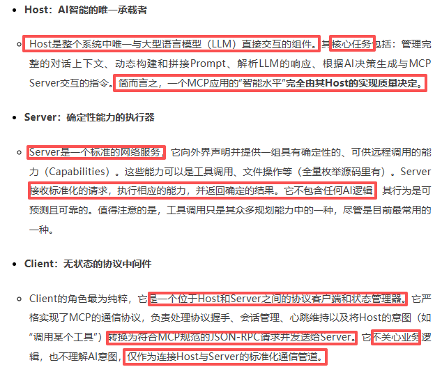
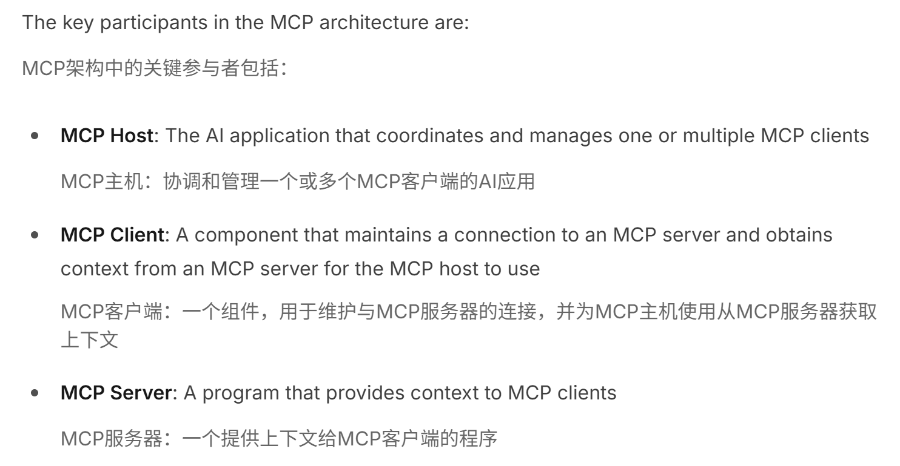
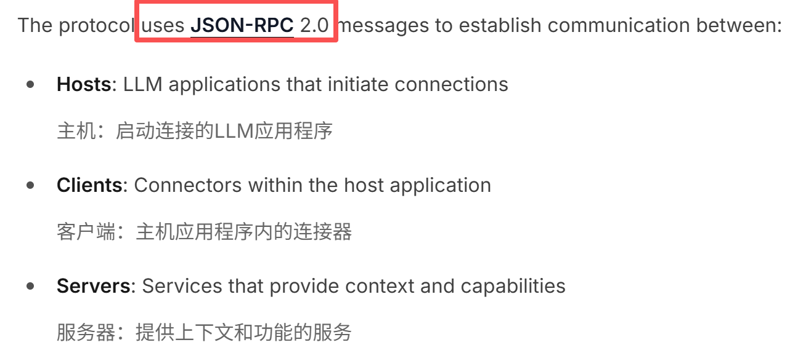
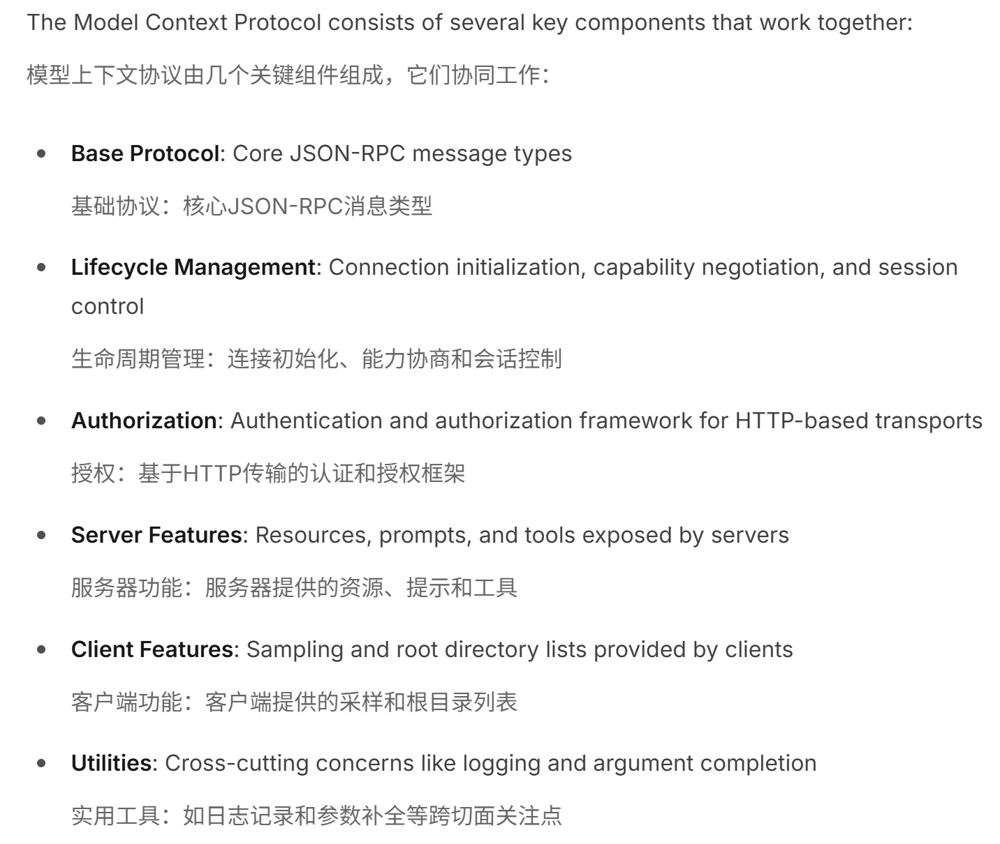
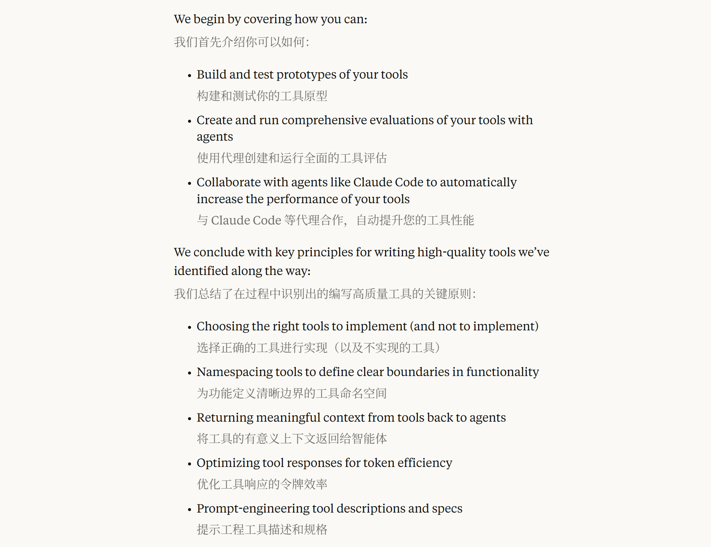

# 基础知识

### 概念

#### FunctionCall

概念：略


#### PE

概念：

-  工具调用有两种方式实现，通过 pe （PromptEngineer）输出固定格式，functioncall。

- PE是最早（在 function calling 出现之前）所有 agent 框架（比如 LangChain、AutoGPT、ReAct）普遍使用的方式。

- 过程如下，简单来说，类似将用户提问提取未标准的格式，然后代码解析并执行对应函数，最后将结果返回给大模型，形成最终回复

  ```
  User 输入 → 模型输出 (action + params JSON) → 解析 JSON → 执行对应函数 → 把结果再交给模型 → 生成最终自然语言回复
  ```

  

一个你可能意想不到的知识点：非常非常多模型（哪怕 fc 能力很强了），可能在复杂场景下， 基于 pe 输出某格式，效果都可能好于 fc（业务用起来绝不吃亏）

比如：

-  cline 用 pe based 来实现 mcp 工具调用
- （可能）百度的ai搜有很多都是基于pe调mcp的

暂时没找到案例


#### MCP

概念：略

认识MCP，参考：

- [别再误会MCP了！一篇写给AI工程师的硬核“辟谣”指南](https://mp.weixin.qq.com/s/EcDCKN4-movoU2JgIqZSXg)
  - **架构分析**：从官方文档出发，将普遍的“CS架构”误解纠正为“CHS三组件”的本质，并精确界定各组件的工程职责。
  - **SDK检验**：深入MCP官方SDK的Server与Client实现，用代码事实证明其作为纯粹RPC中间件的模型无关性。
  - **Host解剖**：以开源项目CherryStudio为例，精准定位Host组件中构建Prompt和调用LLM的“犯罪现场”，找到AI能力的真正归属。
  - **重回概念**：重新回到概念，清晰切割MCP（基础设施协议）与Function Calling（模型决策能力）的边界，并通过伪代码比较两者的流行实现。
- [MCP Registry 来了：官方 MCP 注册中心架构设计剖析](https://mp.weixin.qq.com/s/p0F9Nm57XcAKkd5zhpNNIg)
  - Anthropic在25年9月发布的新工具，核心定位是作为轻量级元数据服务，MCP注册表为MCP客户端提供了一列MCP服务器，就像MCP服务器的应用商店。
  - 新平台支持 公共子注册表（如第三方 MCP 市场、客户端专属目录）和 私有子注册表（企业内部自建、安全可控），为开发者和组织提供灵活扩展的能力。
  - 具体内容参考官方Github：[registry](https://github.com/modelcontextprotocol/registry)
- [深入解析Model Context Protocol](https://mp.weixin.qq.com/s/i7T-Ksab7caLSk5jqlHDpg)
  - Streamable HTTP 机制与原理，与SSE的对比
  -  Inspector ：通过npm包使用，帮助开发者连接、测试和调试MCP服务器


MCP服务器收录社区：[Awesome MCP Servers](https://github.com/punkpeye/awesome-mcp-servers)，目前最完整的 MCP 服务器收录项目，由社区维护。


### 一些探究（会话状态与上下文缓存）

> 参考：[MCP 协议版本更新详解（2025-03-26）](https://zhuanlan.zhihu.com/p/1891148889077290663)

对OAuth、SHTTP、JSON-RPC批处理，做了详解


> 参考：[通过抓包，深入揭秘MCP协议底层通信](https://www.cnblogs.com/sdcb/p/18995424/mcp-http-insights)

涉及初始化、Mcp-Session-Id等详细信息


>参考：[MCP 协议忽视了 40 年来的 RPC 最佳实践，最终将让企业付出代价](https://zhuanlan.zhihu.com/p/1937867104398315638)

MCP的缺陷


> 参考：[MCP高级特性：异步生命周期与上下文管理](https://juejin.cn/post/7518234884480024617)

简介：

- 应用生命周期管理是指控制应用启动和关闭过程中的资源初始化和清理。
- 在异步环境中，这些操作通常需要使用异步上下文管理器来实现。
- MCP框架提供了优雅的方式来定义和管理应用的生命周期，确保资源在应用启动时正确初始化，在应用关闭时妥善释放。

结合代码，讲述了MCP的一些高级用法。


### MCP的三种机制

#### 三种模式的底层区别及如何选择

todo

- **STDIO（Standard Input and Output）**是最基本的输入输出方式，广泛应用于命令行工具、脚本编程以及本地调试过程中。它通过标准输入、输出和错误流来进行数据的传输。
  - **特点**：
    - **标准输入（stdin）**：接收用户或系统输入的数据
    - **标准输出（stdout）**：将处理后的数据输出到终端或文件
    - **标准错误（stderr）**：输出错误信息，便于调试
  - **适用场景**：面向传统命令行式交互，强调顺序性与确定性，通常用于命令行工具、自动化脚本等短期交互场景。它
- **SSE（Server-Sent Events）**是一种基于HTTP协议的单向数据流传输方式。它允许服务器主动向客户端推送实时数据。SSE通过保持一个持久的HTTP连接，将数据流式传输到客户端，特别适合需要持续更新的实时场景。
  - **特点**：
    - **单向传输：** 服务器向客户端推送数据。
    - **自动重连：** 如果连接中断，客户端会自动重新连接。
    - **基于HTTP协议：** 与Web应用的兼容性良好。
  - **适用场景：**SSE非常适合实时推送应用，如新闻更新、社交媒体通知、股票行情等。它适用于服务器向多个客户端实时推送数据的场景。
- **Streamable HTTP**（是一种基于HTTP协议的流式传输技术，专门用于大文件（如视频、音频）的分段传输。与SSE不同，Streamable HTTP允许文件在传输的同时被处理，使客户端可以边接收数据边处理，避免等待整个文件加载完成。
  - **特点**：
    - **分块传输：** 文件被切割成若干小块，逐步传输。
    - **适合大文件：** 主要用于视频、音频、图像等多媒体文件的流式传输。
    - **低延迟：** 数据可以在客户端接收到部分内容时立即开始处理。
  - **适用场景：**Streamable HTTP非常适合大文件的流式传输，尤其在在线视频、音频流和其他大数据量内容的传输中，能极大地提高用户体验。


上述答案对SHTTP描述的不太客观，其是**2025 年新增**，取代传统 HTTP+SSE 双通道方案。


总结：

- **Stdio** 是本地通信的“极简方案”，适合对延迟敏感的本地应用。
- **SSE** 是远程通信的“流式革命”，但受限于单向通信和连接可靠性。
- **Streamable HTTP** 是 2025 年的升级方案，解决了 SSE 的痛点，成为未来主流选择。


其他：

- [三种MCP服务器传输机制对比](https://www.cnblogs.com/shiyuzhahan/p/18966328)


#### 为什么弃用SSE改用SHttp？

> 参考：[阿里二面：MCP为什么要弃用SSE改用StreamableHttp？MCP三种传输方式解析！](https://www.bilibili.com/video/BV1FiHrzxEqL?spm_id_from=333.1245.0.0)

SSE长链接建立后，如果出现网络等问题，Data丢失后，Server并不能立即感知到。


Stdio面向用户，不支持高并发。


### 常见问题

#### Q：介绍一下mcp（基础概念、CHS三层架构、底层实现）

A：CHS三层架构：

- [常有人忽略Host层](https://mp.weixin.qq.com/s/EcDCKN4-movoU2JgIqZSXg)：
  
- [官网介绍](https://modelcontextprotocol.io/docs/learn/architecture)：
  

（todo，待补充和整理）底层实现：参考官网的一些回答






#### Q：大模型如何调用工具？

严格来说，**大语言模型本身并不直接具备“调用函数/工具”的内建能力**。模型只是一个概率分布生成器，它根据上下文预测下一个 token，或者说他只用于输入一段小作文、再输出一段小作文。

但是，大模型在训练时就加入了FunctionCall相关的文本与标签，模型见过很多类似 **“输入 → 函数调用格式输出”** 的数据。

例如，如果你问模型：

> "帮我调用 get_weather(city=北京)"

模型本质上只是“生成了” `{"name":"get_weather","arguments":{"city":"北京"}}` 这样一段文本。

而真正去 **执行函数/调用 API** 的，是**外部系统（例如 OpenAI 的 Function Calling 接口、LangChain、或者你自己写的 agent 框架）**。


本质上就是 **一种上下文约定 + 外部解释器**，流程大概是这样的：

1. **系统提示 (system prompt) 里定义工具**
    例如告诉模型：

   ```
   你可以调用以下函数：
   - get_weather(city: string) -> 返回城市的天气
   - search_web(query: string) -> 搜索互联网
   ```

   这就建立了一个“协议”：模型知道哪些函数存在、参数格式如何。

2. **用户提问**
    比如用户说：

   > “帮我查一下北京的天气”

3. **模型输出结构化调用指令**
    模型根据训练（或少量示例）学习到，它应该返回：

   ```
   {
     "name": "get_weather",
     "arguments": {
       "city": "北京"
     }
   }
   ```

4. **外部系统解析并执行**

   - 接收到这个 JSON 后，框架代码会去真正执行 `get_weather("北京")`。
   - 得到结果，例如 `{"temp": "28℃", "condition": "晴"}`。

5. **结果再交还给模型**
    外部系统把这个结果以“工具响应”的形式再次放进上下文，然后让模型继续生成最终的自然语言回答：

   > “北京现在是晴天，气温大约 28℃。”


**总结：**

- **Function Call 本质上是上下文约定（协议）**。
- 模型只是负责**生成符合约定的结构化输出**。
- **工具的实际执行与返回结果完全由外部框架完成**。


#### Q：MCP与FunctionCall的转换关系

MCP底层实际上是把对应的工具，也转换成了格式化输出的形式，这个格式并不能说等于FunctionCall，而且不同模型服务商，格式化输出的结构也可能有差别（这也是MCP存在的重大意义，不用再针对某一模型服务商专门写FunctionCall）。

例如，[参考官方代码](https://modelcontextprotocol.io/quickstart/client)：

```
response = await self.session.list_tools()
available_tools = [{
    "name": tool.name,
    "description": tool.description,
    "input_schema": tool.inputSchema
} for tool in response.tools]

# Initial Claude API call
response = self.anthropic.messages.create(
    model="claude-3-5-sonnet-20241022",
    max_tokens=1000,
    messages=messages,
    tools=available_tools
)
```

大致流程：

- response = await self.session.list_tools() 获取工具信息
- available_tools 是将工具信息做好格式化
- response = self.anthropic.messages.create 将格式化后的内容，放入创建好的模型中


#### Q：动态加载MCP工具

由上述问题可知：

- 大模型本身不具备直接调用工具的能力，主要还是输出格式化内容，再借助外部框架执行工具调用
- MCP底层也是把写好的工具，变为格式化后的内容，再放入模型中


那么，在工具特别多的情况下，为了避免上下文过长问题，可以利用上述机制，动态的把部分工具放入上下文中。

比如，针对用户的提问，我写一个映射，提问是RAG相关的，那我就只把RAG相关工具的信息通过上下文给到模型。

具体实现，这里并非等同于把工具信息直接塞到上下文即可，部分模型可以支持在对话中直接发送工具信息即可，但是部分不支持，比较普遍的方法还是写一个“中间件”，在MCP相关源码中动态的加载工具。


#### Q：mcp的缺陷

安全认证等等


# MCP 开发实践

参考Fastmcp官网即可，可能会有些异步问题，不过官网新特性更新很快，这里不给出示例代码了。


# 如何写好一个工具

### Anthropic: Writing effective tools for agents

> 参考：Anthropic官方：[Writing effective tools for agents — with agents](https://www.anthropic.com/engineering/writing-tools-for-agents)

大佬解读：

- [Anthropic 万字长文揭秘 AI Agent 工具开发五大“心法”](https://baoyu.io/blog/claude-code-anthropic-ai-agent-development)
- [Claude 官方发文：如何给 Agent 构建一个好用的工具？](https://mp.weixin.qq.com/s/-KvrvRTENoEM7rPohtSVcg)

内容大纲：



**What is a tool?** 

- 略

**How to write tools**

- Building a prototype 构建原型
- Running an evaluation 运行评估：生成评估任务、运行评估、分析结果
- Collaborating with agents 与智能体协作改进工具

**Principles for writing effective tools**

- Choosing the right tools for agents 为智能体选择合适的工具
  - 更多的工具并不总能带来更好的结果
  - 如果一个大语言模型智能体使用一个返回所有联系人的工具，然后必须逐个 Token 地阅读每个联系人，它就在不相关的信息上浪费了其有限的上下文空间。更好、更自然的方法（对智能体和人类都适用）是首先跳到相关的页面（也许是按字母顺序查找）。
  - <u>我们建议构建少数几个精心设计的工具，针对特定的高影响力工作流程</u>，这些工作流程与您的评估任务相匹配，并以此为基础进行扩展。在地址簿的例子中，您可能会选择实现一个 `Contactss` 或 `message_contact` 工具，而不是一个 `list_contacts` 工具。
- Namespacing your tools 为工具命名空间化
  - 例如，按服务（如 `asana_search`, `jira_search`）和按资源（如 `asana_projects_search`, `asana_users_search`）对工具<u>进行命名空间划分</u>
  - 我们发现，选择<u>基于前缀还是后缀的命名空间方案，对我们的工具使用评估有不小的影响</u>。具体效果因大语言模型而异，我们鼓励您根据自己的评估选择命名方案。
  - 智能体可能会调用错误的工具，用错误的参数调用正确的工具，调用太少的工具，或错误地处理工具响应。通过有选择地实现那些名称反映了任务自然划分的工具，您<u>可以同时减少加载到智能体上下文中的工具和工具描述的数量</u>，并将智能体计算从其上下文中卸载回工具调用本身。这降低了智能体犯错的总体风险。
- Returning meaningful context from your tools 从你的工具中返回有意义的上下文
- Optimizing tool responses for token efficiency 优化工具响应的令牌效率
- Prompt-engineering your tool descriptions 优化你的工具描述提示

**Looking ahead**

- 


### Anthropic: Code execution with MCP

> 参考：[Anthropic又一篇Agent开发神文，新范式让Token消耗暴降98.7%](https://mp.weixin.qq.com/s/XHuQghz8bHXqxes_0dS3FQ)

核心思想很简单：别再让模型直接调用工具了，让它写代码来调用工具

AI Agent的两大“隐形税”

- 工具定义过载：当Agent需要连接数千个工具时，仅仅是这些定义就可能消耗数十万Token，模型还没开始工作，成本就已经产生
- 中间结果消耗：更致命的是，工作流中的每一个中间结果都必须经过模型的上下文

解决方案：用代码执行取代直接调用

- 将MCP服务器呈现为代码API
- Agent的任务不再是选择工具并填充参数，而是编写一小段代码来完成整个工作流。变化是颠覆性的：
  - 按需加载：Agent可以通过浏览文件系统（例如`ls ./servers/`）来发现可用的服务，然后只读取它完成当前任务所需的文件（`getDocument.ts`和`updateRecord.ts`）来理解接口。这避免了开局就加载所有工具定义
  - 数据本地流转：`getDocument`返回的`transcript`内容被存储在一个代码变量中，直接传递给`updateRecord`函数。整个纪要文本从未进入模型的上下文窗口


### Anthropic: advanced-tool-use

> 参考：https://www.anthropic.com/engineering/advanced-tool-use

大佬解读：

- [传统Agent工具已死！看如何编排1000+工具！](https://mp.weixin.qq.com/s/FW9MUX_L4GoWP1thdSUnqw)

Anthropic 全新发布了三个核心模块： 

- 工具搜索工具（Tool Search Tool）
- 程序化工具调用（Programmatic Tool Calling）
- 工具使用示例（Tool Use Examples）

三个核心问题：

- 上下文窗口被工具定义吞噬，token 成本居高不下
- 中间结果污染上下文，执行效率低下
- 仅靠 JSON Schema 无法定义工具使用规范，调用准确率低

接下来，我们看看Anthropic 是如何针对性地解决了这三个核心问题，构建起 "动态发现 - 高效执行 - 精准调用" 的完整工具使用闭环。

工具搜索工具（Tool Search Tool）：按需加载，释放 95% 上下文空间

- 要解决的问题：
- 实现原理：
- 使用场景与边界：

程序化工具调用（Programmatic Tool Calling）：代码编排，告别上下文污染与低效推理

- 要解决的问题：
- 实现原理：
- 使用场景与边界：

工具使用示例（Tool Use Examples）：以例为鉴，解决工具调用的"歧义难题"

- 要解决的问题：
- 实现原理：
- 使用场景与边界：


# 概念补充

#### MCP架构模式

> 参考：[MCP 的10种架构模式](https://mp.weixin.qq.com/s/sPPdjZo4779-cRaMUvhQJA)

原文没有代码只有理论，仅供参考


#### Pydantic AI与MCP

> 参考：[Pydantic AI与MCP相逢](https://mp.weixin.qq.com/s/BzRzWzsk4iPue0bHbe8Ujg)

TODO


# 实战经验

#### 数据共享

将一个全流程的代码，拆分为多个工具，那么不同工具间该如何交互呢？

可以直接存在MCP类中，类似一个全局变量的作用。


#### 参数格式

面对MCP中的众多工具，是否会出现参数格式输入不对的问题？

正常使用Pydantic还是挺好的，不过近期看Dify、OpenHands等源码，他们对MCP的输入强制约束为str、list等格式，其他格式直接排除了，导致了参数格式异常的问题，可以考虑改这个约束对应的源码，也可以考虑在具体的mcp工具中再做一次格式转换。


# 扩展

> 参考：[Nacos 安全护栏：MCP、Agent、配置全维防护，重塑 AI Registry 安全边界](https://mp.weixin.qq.com/s/UqwU0KaiK23v1CZWrSCfCg)
>
> 项目地址（30+k star）：https://github.com/alibaba/nacos

TODO

