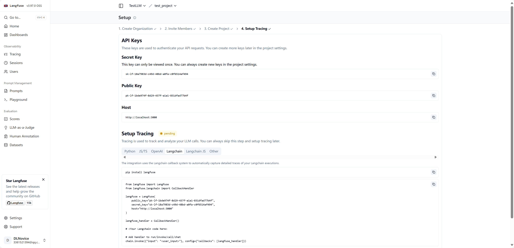
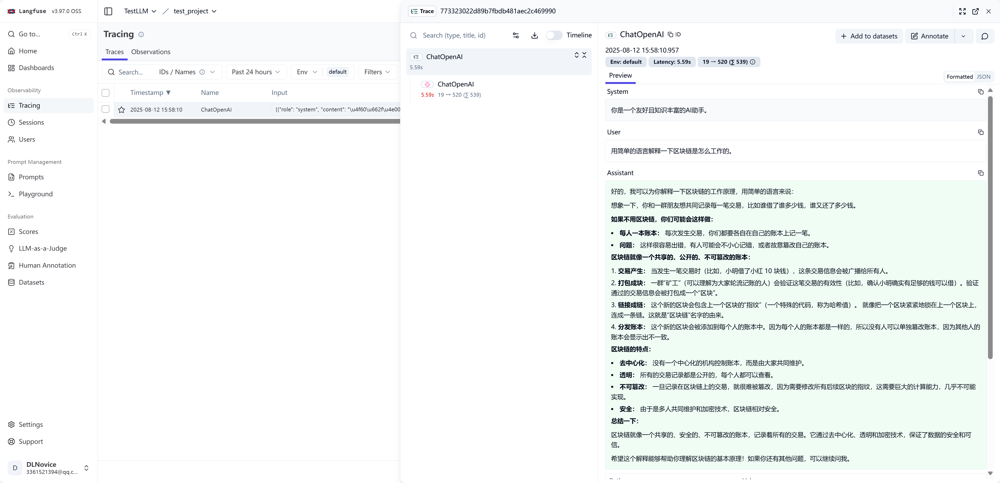

# Langfuse

官网教程：https://langfuse.com/docs/observability/get-started


部署Langfuse（以docker部署为例）：

```bash
# Get a copy of the latest Langfuse repository
git clone https://github.com/langfuse/langfuse.git
cd langfuse

# Run the langfuse docker compose
docker compose up
```

终端输出：

```
langfuse-web-1     |  ✓ Ready in 4.1s
w Enable Watch
```

表示服务已经启动完成，并且 **处于“监听模式”**（Enable Watch），如果希望后台运行，可以`docker compose up -d`

补充：

- 终端关闭后，容器也不会停止，由于可能会与其他程序的端口产生冲突，注意：

  ```
  cd langfuse
  docker compose down
  ```

  

测试账号&密码：

- ***@qq.com
- 123456789@abc

登录后，可以创建key




使用：

```
pip install langfuse langchain-openai
pip install langchain langgraph
```

示例代码：

```python
from langfuse import Langfuse
from langfuse.langchain import CallbackHandler

langfuse = Langfuse(
    public_key="pk-lf-***",
    secret_key="sk-lf-***",
    host="http://localhost:3000"
)

langfuse_handler = CallbackHandler()

import os
from langgraph.graph import StateGraph, START, END
from langchain_openai import ChatOpenAI
from langchain_core.messages import SystemMessage, HumanMessage


# 定义一个简单的状态类型
class ConversationState(dict):
    messages: list

# 初始化模型
llm = ChatOpenAI(
            model="google/gemini-2.0-flash-001",
            base_url="https://openrouter.ai/api/v1",
            api_key="sk-or-v1-*****",
)

# 定义一个节点：调用 LLM
def chat_node(state: ConversationState):
    # 拿最后一条 HumanMessage 的内容作为输入
    last_user_msg = state["messages"][-1].content
    messages = state["messages"]
    
    # 加一个系统 prompt（可选）
    messages.insert(0, SystemMessage(content="你是一个友好且知识丰富的AI助手。"))
    
    response = llm.invoke(messages, config={"callbacks": [langfuse_handler]})
    return {"messages": messages + [response]}

# 创建 LangGraph
workflow = StateGraph(ConversationState)

# 加入节点
workflow.add_node("chat", chat_node)

# 定义流程：START → chat → END
workflow.add_edge(START, "chat")
workflow.add_edge("chat", END)

# 编译成可调用的应用
app = workflow.compile()

if __name__ == "__main__":
    # 用户输入
    user_question = "用简单的语言解释一下区块链是怎么工作的。"
    result = app.invoke({
        "messages": [HumanMessage(content=user_question)]
    })

    print("对话历史：")
    for msg in result["messages"]:
        role = "用户" if msg.type == "human" else "系统" if msg.type == "system" else "AI"
        print(f"{role}: {msg.content}")

```

示例效果：



