# 01 环境配置

## 方法一：docker部署

> Linux和windows的配置过程大差不差，就是部署docker项目，下文以Windows举例

### 1、安装git

略


### 2、安装docker

1）官网下载docker安装包并查看安装教程：https://docs.docker.com/desktop/setup/install/windows-install/


2）直接安装即可，可能会出现docker无法启动，此时可尝试更新wsl后重启：`wsl --update`

PS：关于打开`Hype-V`功能，貌似新版docker可以直接利用wsl工具，无需再处理`Hype-V`了

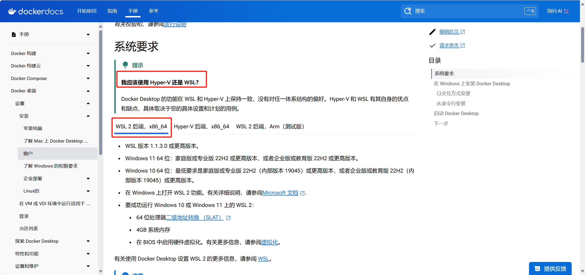


3）配置阿里云镜像加速

官网：https://cr.console.aliyun.com/cn-hangzhou/instances/mirrors

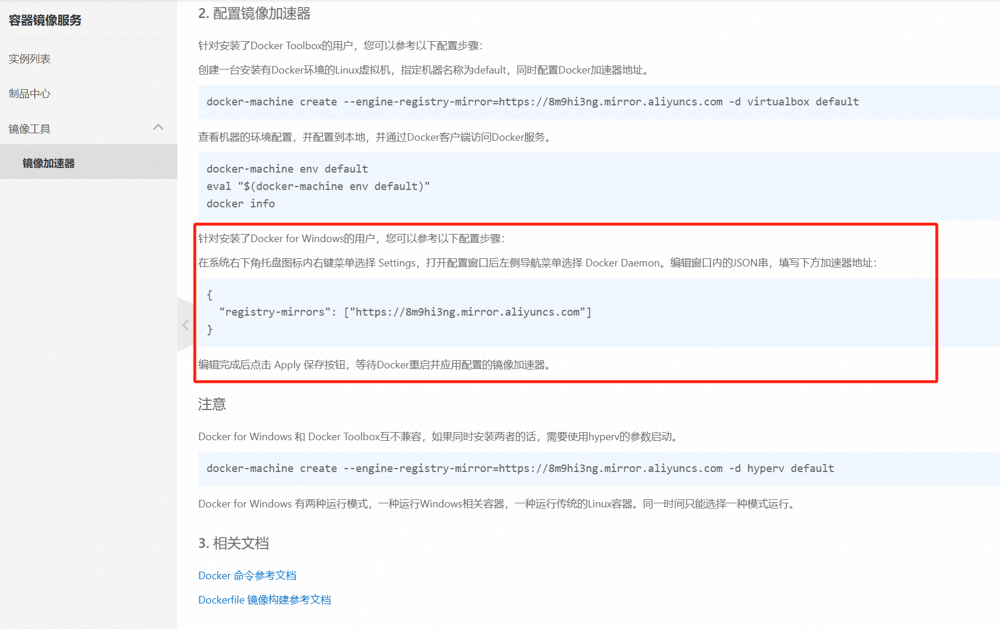

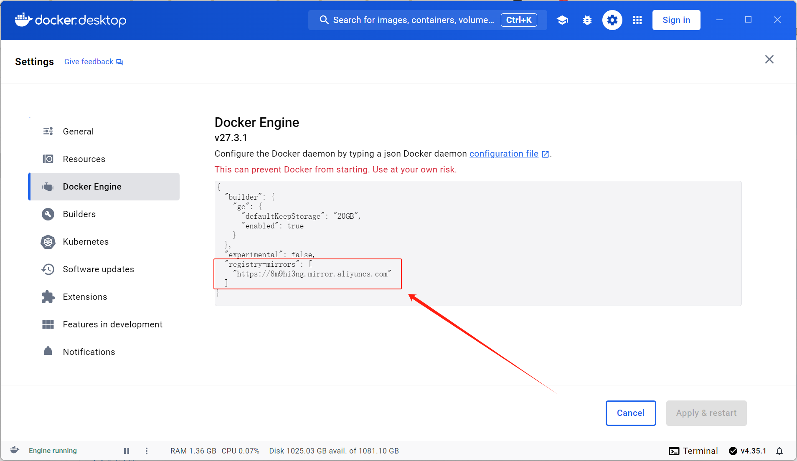

后续发现，阿里云镜像加速还不够，可以再添加几个：

```python
[
    "https://docker.m.daocloud.io",
    "https://dockerproxy.com",
    "https://docker.mirrors.ustc.edu.cn",
    "https://docker.nju.edu.cn"
  ]
```


4）验证是否安装成功

```bash
docker --version
```

```bash
docker pull hello-world
```

示例输出：

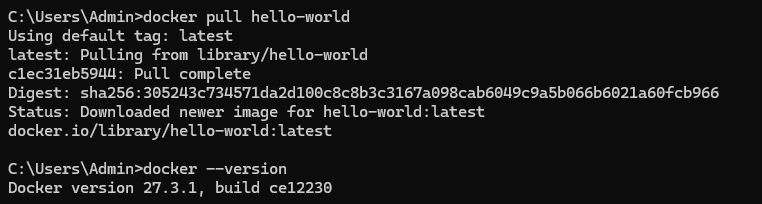

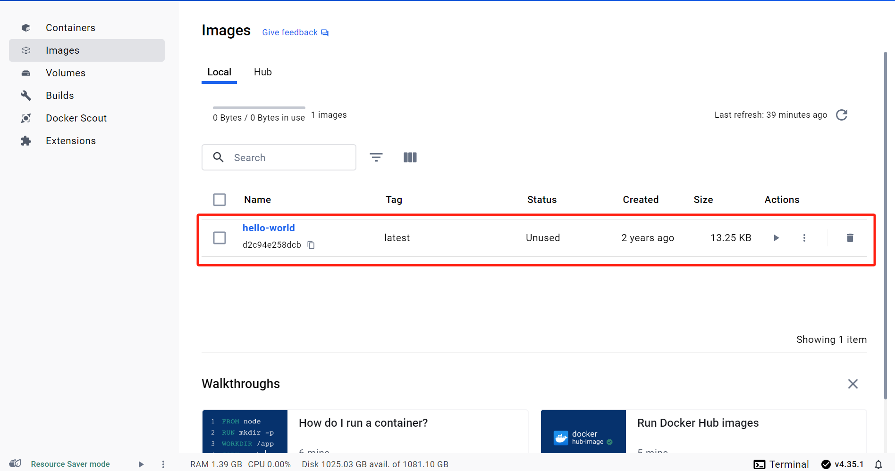

注意：

- 若出现`Error response from daemon: Get "https://registry-1.docker.io/v2/": dialing registry-1.docker.io:443 container via direct connection because  has no HTTPS proxy: connecting to registry-1.docker.io:443: dial tcp: lookup registry-1.docker.io: no such host`：尝试修改镜像加速、尝试打开魔法


### 3、配置Dify

官方文档：https://docs.dify.ai/zh-hans/getting-started/install-self-hosted/docker-compose

按教程步骤一步步来即可

- 克隆源码：

  ```bash
  git clone https://github.com/langgenius/dify.git
  ```

- 配置Dify环境变量：windows没有cp指令，直接本地复制粘贴然后重命名

  ```bash
  cd dify/docker
  cp .env.example .env
  ```

- 启动docker容器：通过 `$ docker compose version` 命令检查版本（失败，可尝试打开梯子，有时也会出现一次编译不完，需要多执行几次）

  - 如果版本是 Docker Compose V2，使用以下命令：

    ```bash
    docker compose up -d
    ```

  - 如果版本是 Docker Compose V1，使用以下命令：

    ```bash
    docker-compose up -d
    ```

- 检查容器是否正常运行：

  ```bash
  docker compose ps
  ```

- 更新Dify

  ```bash
  cd dify/docker
  docker compose down
  git pull origin main
  docker compose pull
  docker compose up -d
  ```


拓展：Dify中的docker-compose.yaml分析

- https://z0yrmerhgi8.feishu.cn/wiki/NYjPwXIaUiVtc4knC5Ccv0SsnHe
- https://z0yrmerhgi8.feishu.cn/wiki/H5fWwUsy6iI1xnkuU4icOmHenPb
- https://z0yrmerhgi8.feishu.cn/wiki/PLLHwT9iDiLI5xkKKThczUbtnqe


注意：

- 启动docker容器：有可能是镜像加速当时只配置阿里的缘故，这里一直编译失败，可以尝试修改镜像加速或者打开梯子，有时也会出现一次编译不完，需要多执行几次
  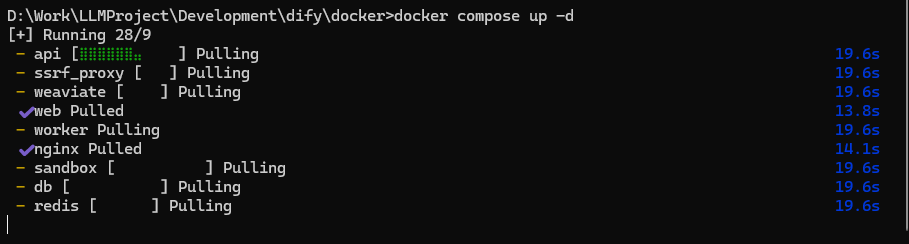


## 方法二：源码部署

参考官网教程：https://docs.dify.ai/zh-hans/getting-started/install-self-hosted/local-source-code

以下采用ubuntu24.04.1安装

### 一、前置条件

在启用业务服务之前，我们需要先部署 PostgreSQL / Redis / Weaviate（如果本地没有的话），可以通过以下命令启动：

```
cd docker
cp middleware.env.example middleware.env
docker compose -f docker-compose.middleware.yaml up -d
```

这里，我避开docker，手动安装

#### 1、PostgreSQL安装

安装：

```
sudo apt update
sudo apt install postgresql postgresql-contrib
```

使用`psql`工具通过连接 PostgreSQL 数据库并且打印它的版本来验证安装：

```
sudo -u postgres psql -c "SELECT version();"
```

备注：退出psql控制台，按q即可

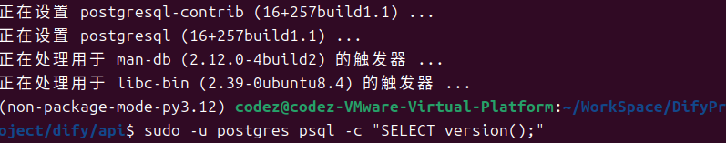


#### 2、Redis安装

安装：

```
sudo apt install redis-server
```

一旦安装完成，Redis 服务将会自动启动。想要检查服务的状态，输入下面的命令：

```javascript
sudo systemctl status redis-server
```

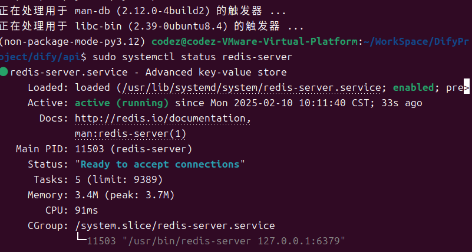

默认是在6379端口，dify中redis使用的端口也是6379，所以无需再指定别的端口


#### 3、Weaviate安装

官网链接：https://weaviate.io/developers/weaviate/installation

官网推荐docker安装，参考官网中的安装指令即可，下面是源码安装相关尝试：

备注：下述方法，测试发现，暂时无法使用，官方的issue中也暂时没看到类似问题，不过发现其貌似提供了二进制文件，解压后，可以尝试执行如下指令部署weaviate

```
./weaviate --config-file=weaviate.conf.json --host 0.0.0.0 --port 8080 --scheme http
```

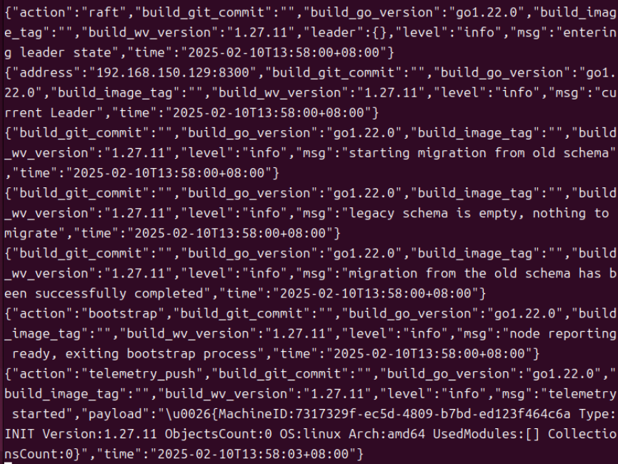

其中，weaviate.conf.json参考：这里，我尝试不指定config-file，也可以运行

```
{
  "authentication": {
    "anonymous_access": {
      "enabled": true
    }
  },
  "authorization": {
    "admin_list": {
      "enabled": false
    }
  },
  "query_defaults": {
    "limit": 100
  },
  "persistence": {
    "dataPath": "./data"
  }
}

```

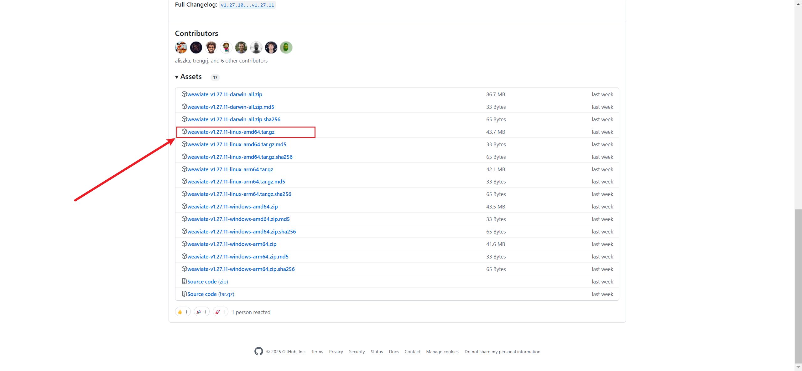

Weaviate 提供了健康检查端点，您可以通过发送 GET 请求来验证其运行状态：

```
curl http://localhost:8080/v1/.well-known/live
```

但是没有返回任何值，等了一段时间后也无返回值，应该不是程序正在启动的缘故

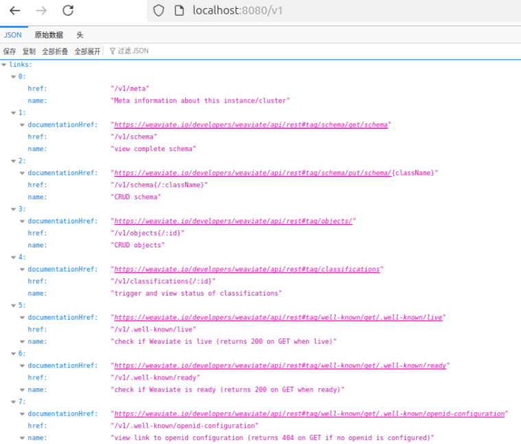

已经提交了issue，等待回复


##### 1. 安装Go语言

Weaviate是用Go语言编写的，因此需要安装Go。

```
sudo apt update
sudo apt install golang-go
```

或者，您也可以从Go的[官方网站](https://golang.org/dl/)下载Go并手动安装。

验证Go是否安装成功：

```
go version
```


##### 2. 安装依赖项

安装构建Weaviate所需的一些依赖项。

```
sudo apt install build-essential git cmake
sudo apt install libssl-dev
sudo apt install libsqlite3-dev
```


##### 3. 获取Weaviate源码

接下来，您可以从Weaviate的GitHub仓库克隆源代码。

```
git clone https://github.com/weaviate/weaviate.git
cd weaviate
```


##### 4. 安装Weaviate的Go依赖

进入Weaviate项目目录后，您需要安装项目依赖。

```
make dependencies
```

备注： `Makefile` 可能已经不再使用 `dependencies` 规则，会导致上述指令报错`没有规则可制作目标dependencies`，可尝试：

- 直接使用 `go mod tidy`：Weaviate 使用 `go modules` 进行依赖管理，所以可以尝试手动拉取依赖：如果 `go mod tidy` 执行成功，说明 `Makefile` 可能已经不再使用 `dependencies` 规则。

  ```
  go mod tidy
  ```

- 确保 `Makefile` 里有 `dependencies`

  ```
  cat Makefile | grep dependencies
  ```


##### 5. 编译Weaviate

使用Makefile来构建Weaviate：

```
make build
```

这将编译Weaviate并生成二进制文件。

备注：如果 `make build` 也报错，手动运行：

```
go build -o weaviate ./cmd/weaviate
```

然后尝试运行：

```
./weaviate
```


##### 6. 配置Weaviate

Weaviate可以通过配置文件来进行一些定制。配置文件一般位于`config`目录，或者您可以通过环境变量设置。

如果您想要修改配置，进入`config`目录并查看`weaviate.yaml`文件，进行必要的修改。

例如，您可以在`weaviate.yaml`中配置存储引擎、认证方式等。


##### 7. 运行Weaviate

Weaviate可以通过以下命令运行：

```
./bin/weaviate
```

默认情况下，Weaviate将运行在`localhost:8080`。您可以通过访问`http://localhost:8080`来检查Weaviate是否已成功启动。


##### 8. (可选) 安装Weaviate的Python客户端

如果您希望使用Python来与Weaviate交互，您可以安装Weaviate的Python客户端库。

```
pip install weaviate-client
```


##### 9. 使用Weaviate

现在，您已经成功地在本地安装了Weaviate。您可以通过API进行交互，或者使用Python客户端编写代码来访问和操作Weaviate中的数据。


### 二、服务端部署

```
poetry shell
poetry env use 3.12
poetry install
```

可能遇到：

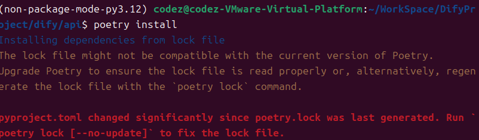

解决方法：由于网络稳定问题，可以多执行几次poetry lock

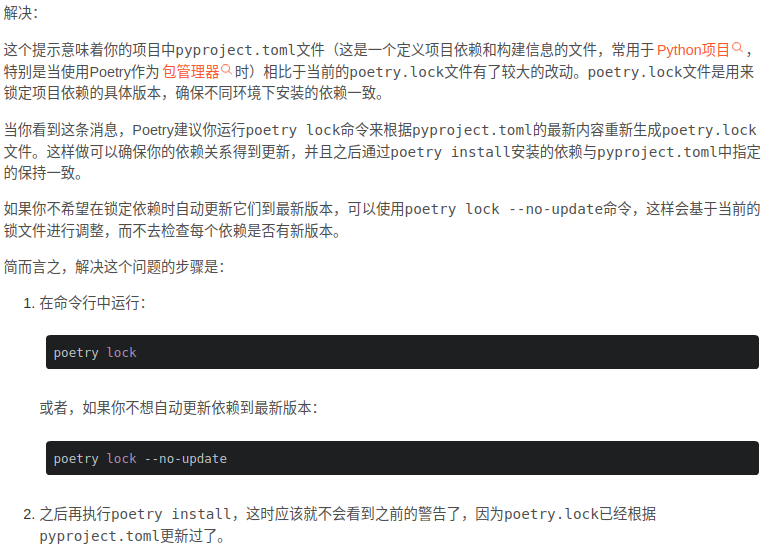


```
poetry shell
flask db upgrade
```

这里虽然我们已经安装了redis和postgresql，但还是报错`No module named redis`、`No such command db`，需要：

```
pip install redis
pip install flask-migrate
```


启动 API 服务：这里会缺失大量的库，需要一一安装

```
flask run --host 0.0.0.0 --port=5001 --debug
```

正确输出：

```
* Debug mode: on
INFO:werkzeug:WARNING: This is a development server. Do not use it in a production deployment. Use a production WSGI server instead.
 * Running on all addresses (0.0.0.0)
 * Running on http://127.0.0.1:5001
INFO:werkzeug:Press CTRL+C to quit
INFO:werkzeug: * Restarting with stat
WARNING:werkzeug: * Debugger is active!
INFO:werkzeug: * Debugger PIN: 695-801-919
```


# 02 使用Dify

## 一、配置账号，体验平台

前往管理员初始化页面设置设置管理员账户：登录账号即可，登陆后会自动跳转到主页面`http://localhost`

```
# 本地环境
http://localhost/install

# 服务器环境

http://your_server_ip/install
```

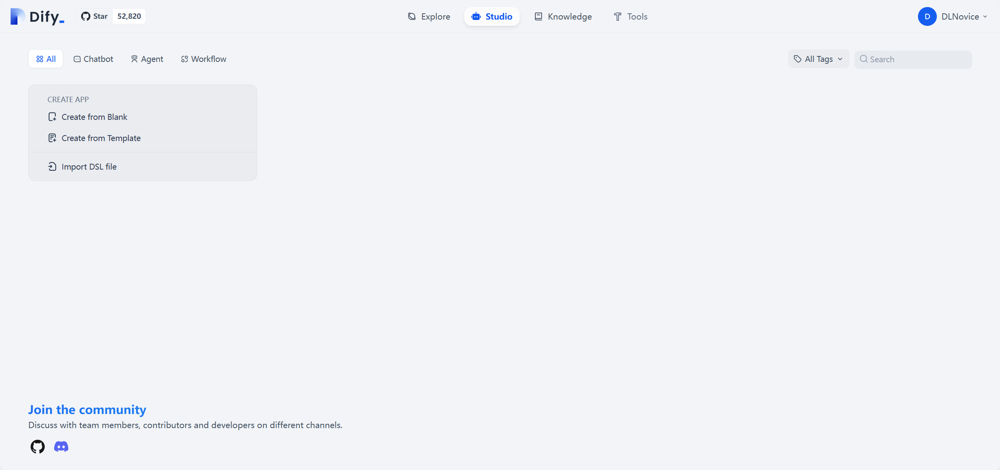


## 二、配置大模型

参考：https://cloud.tencent.com/developer/article/2431963

模型可用云端的，不过这里我们基于Ollama本地部署一个模型进行体验

### 1、下载安装 Ollama

在[Ollama](https://ollama.com/)平台下载软件，打开软件后弹出终端页面

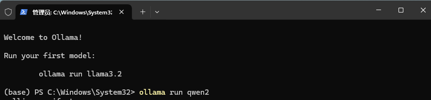

点击Models可以看到常用的模型：

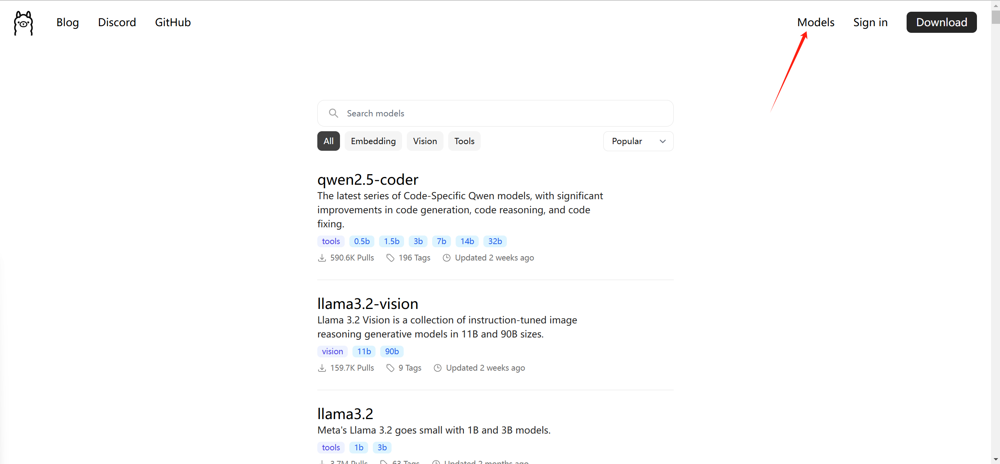

接下来如何配置这些模型。


### 2、配置大模型

这里以qwen2为例：

```
ollama run qwen2 #跑qwen2模型，如果本地没有，会先下载
```

下载完毕后就可以在终端与之交互了：当前机器只有一个算是独显的集显Inel Xe Graphics，模型回复速度意外的快

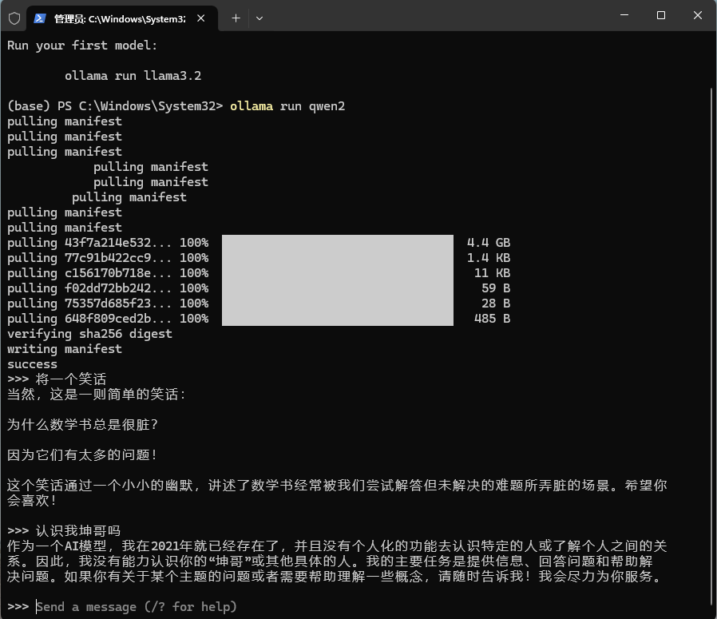

其他常用指令：

- 启动Ollama服务：ollama serve
- 从模型文件创建模型：ollama create
- 显示模型信息：ollama show
- 运行模型：ollama run 模型名称
- 从注册表中拉去模型：ollama pull 模型名称
- 将模型推送到注册表：ollama push
- 列出模型：ollama list
- 复制模型：ollama cp
- 删除模型：ollama rm 模型名称
- 获取有关Ollama任何命令的帮助信息：ollama help


### 3、配置Dify

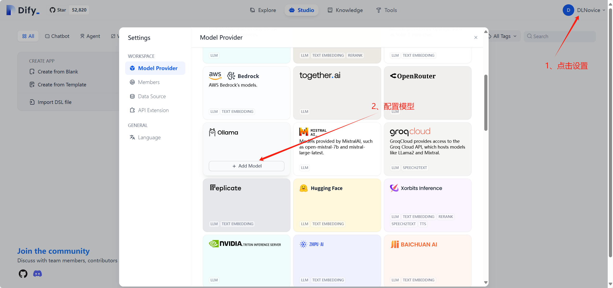

配置Model Name 和 Url：配置完后点击保存即可，平台会测试调用，若不可用，前端会反馈保存失败

- Model Name：
  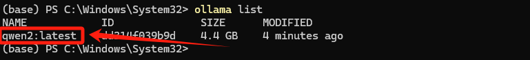
- Url：这里采用默认的，如果是docker部署的，则需要将`localhost`替换为`host.docker.internal`服务就可以生效了

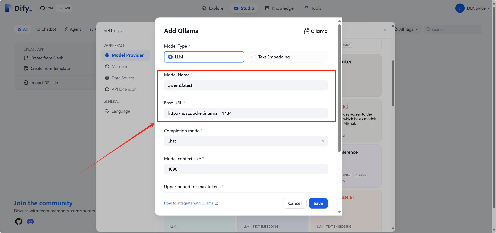

此时可以看到我们已配置好模型


### 4、创建聊天机器人

先创建一个聊天机器人

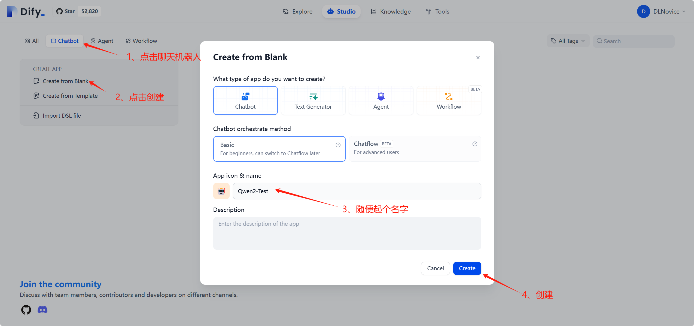

选择我们刚配置好的模型（有时可能会卡顿，显示模型问题，可尝试重新保存模型或者刷新页面）

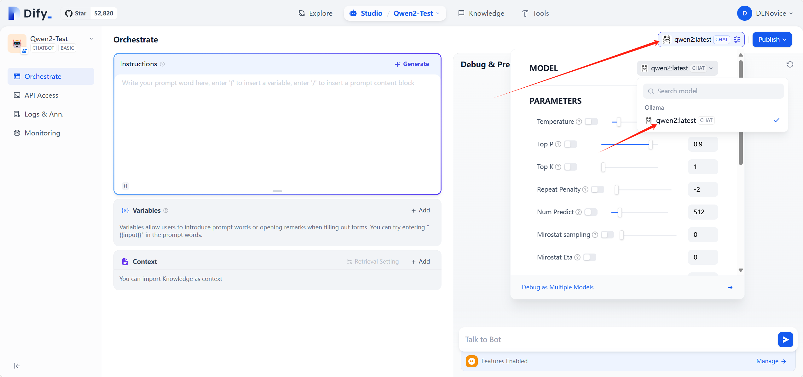

发布此机器人即可

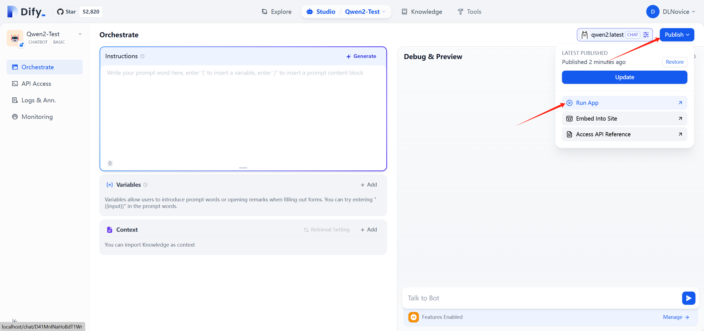

开始聊天

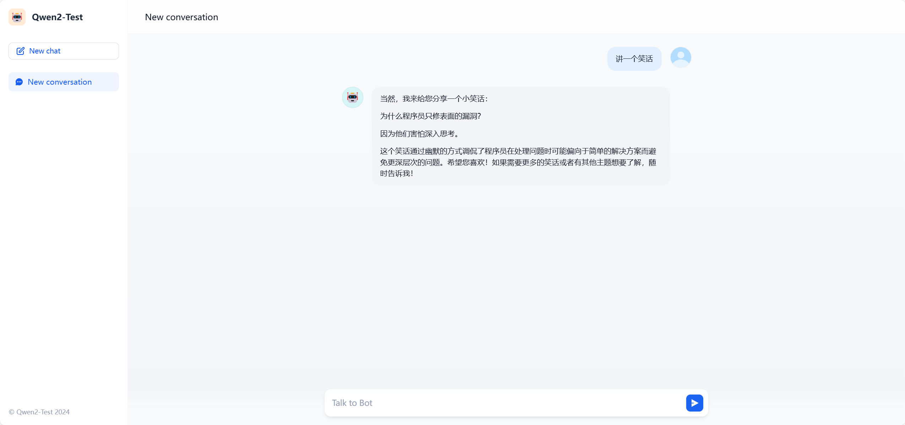


## 三、更多应用

总的来说是三类：聊天机器人、工作流、代理

### 1、知识库聊天机器人

点击知识库，上传用于知识库的文件：“文本分段与清洗”模块中的参数可调节，这里采用默认参数

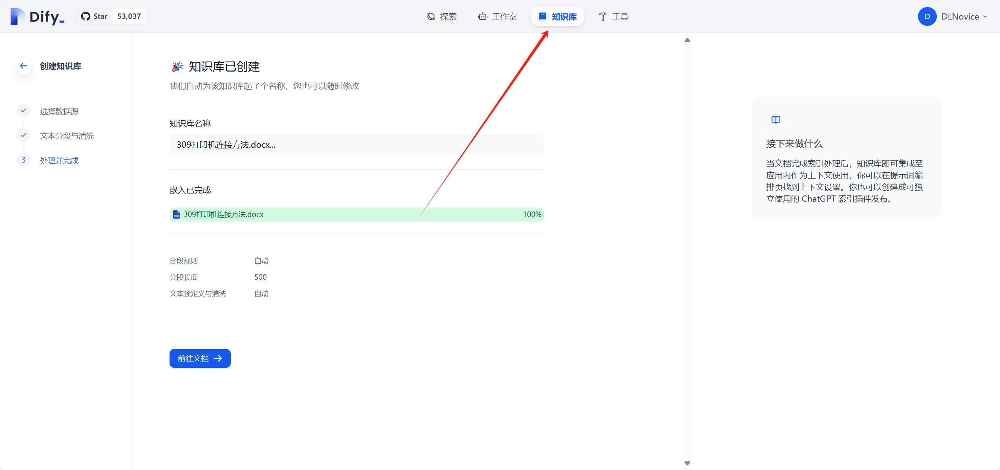


重新创建一个聊天机器人，并在“Context/上下文”部分选择我们的知识库文件并添加：

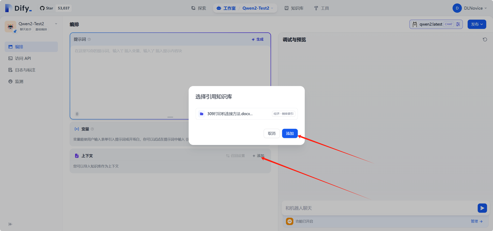

更新聊天机器人并运行即可：答案确实是我们知识库中的内容

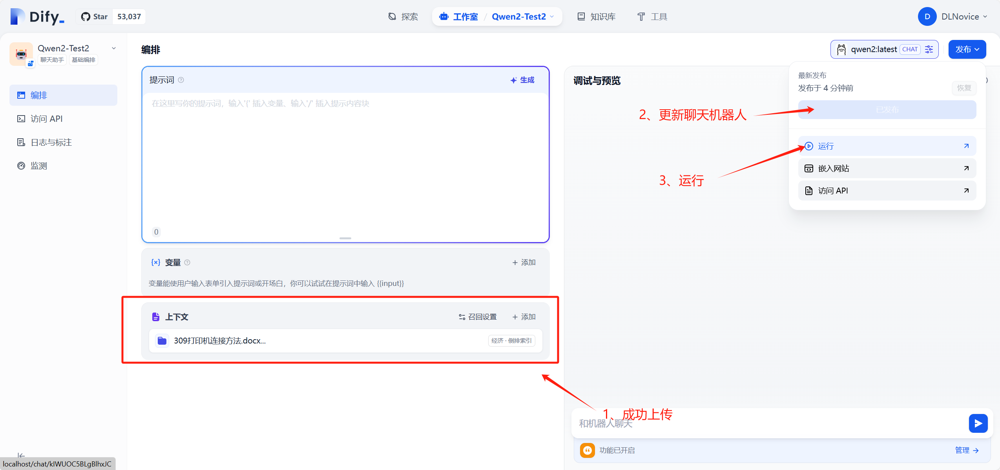

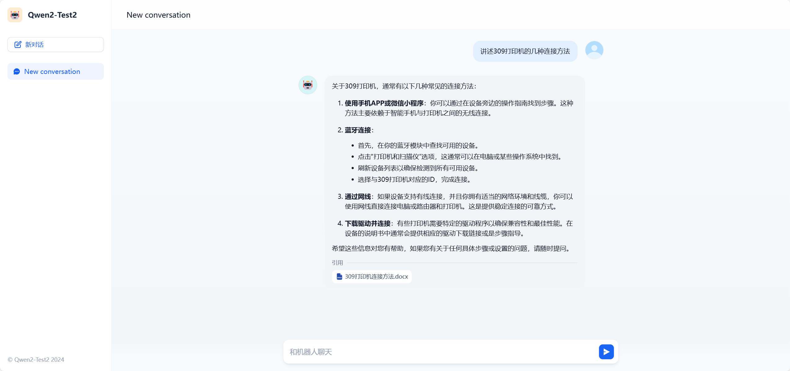


### 2、工作流Workflow

创建一个空白工作流：

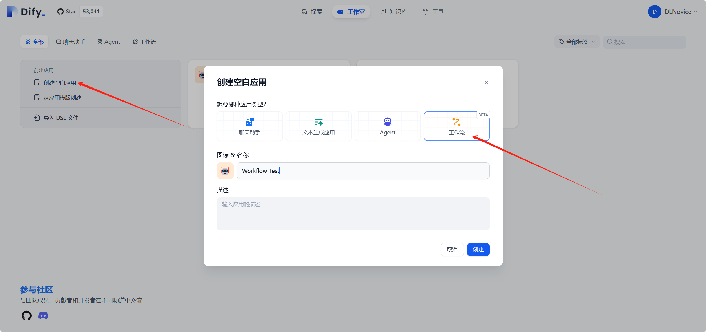

这里以一个爬虫案例为例：首先创建一个爬虫节点，在“工具”栏选择“网络爬虫”即可，输入url即可完成爬虫，这里以豆瓣为例子：`https://movie.douban.com/top250`

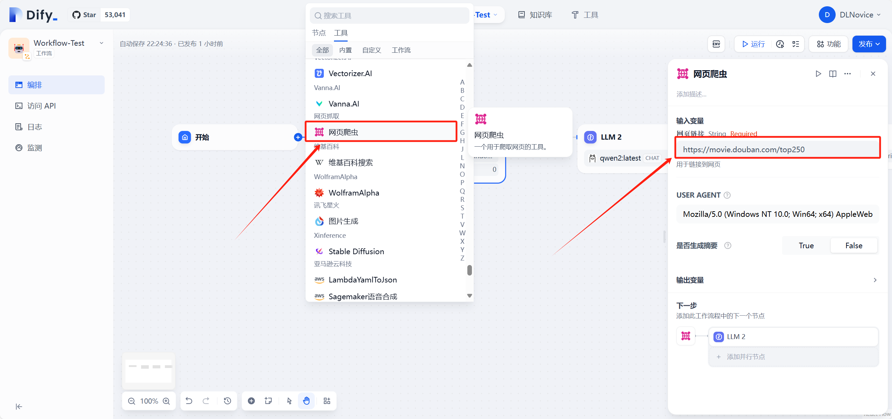

接下来，在爬虫节点后面加一个大模型节点，辅助我们提炼信息：在上下文部分，选择爬虫所得结果，及text，在System栏，输入对话，这里注意，如果需要用输入的内容，需要输入“/”并选择变量

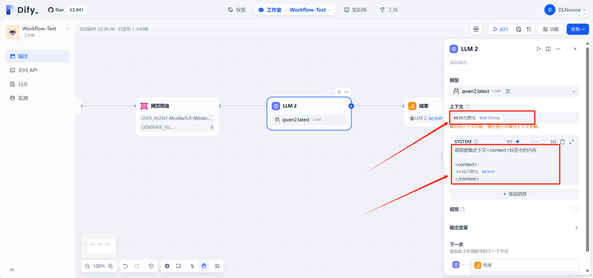

最后加一个end节点，并在end节点的输出变量中，选择刚才大模型的输出结果，点击运行项目，等待结果：

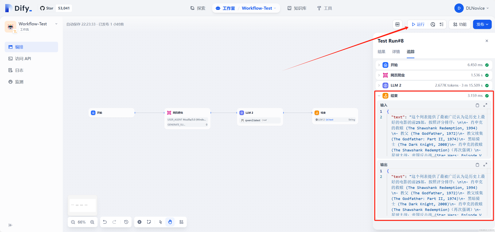


接下来，我们再体验一下API，将上述生成的内容，通过调用api，生成图片，并利用“HTTP节点”，返回图像的URL。

这里以开源模型[ stable-diffusion](https://hf-mirror.com/stabilityai/stable-diffusion-2-1-base)为例，git clone项目，之后在项目同级目录可以运行如下代码：

```bash
pip install diffusers transformers accelerate scipy safetensors
```

```python
from diffusers import DiffusionPipeline
from matplotlib import pyplot as plt

pipe = DiffusionPipeline.from_pretrained("stable-diffusion-2-1-base")

prompt = "draw a dog"
image = pipe(prompt, height=640, width=480, ).images[0]

# 查看生成结果
plt.figure(dpi=300)
plt.imshow(image)
plt.axis('off')
plt.show()
plt.savefig('output_image.png', bbox_inches='tight', pad_inches=0)

```

接下来我们将上述代码基于flask封装成api并运行：

```

```

特别注意：编码解析问题

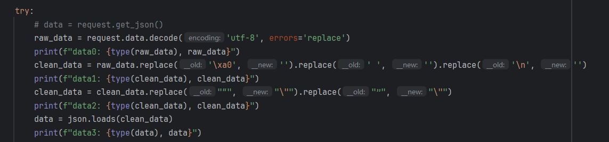

接下来，修改dify即可：首先关于大模型，稍微优化一下其回答
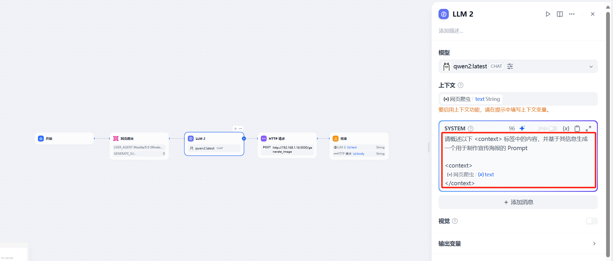

其次，加入“HTTP请求”节点，并在“结束”节点的输出中，加入“HTTP请求”节点的body

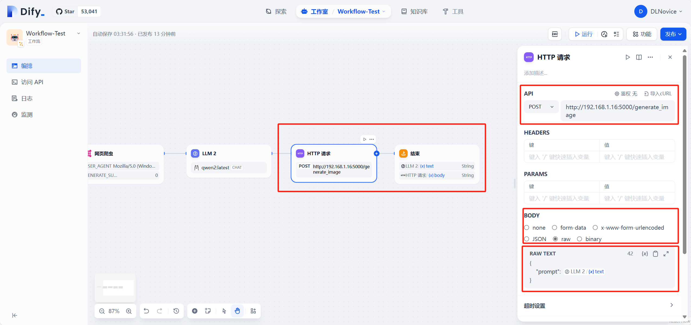

关于“HTTP请求”节点的踩坑：

- API：

  - 由于dify部署在docker中，所以要将`localhost`替换为`host.docker.internal`

  - 其次，相比于`host.docker.internal`，采用 **Class C** 和 **Class B** 的私有地址，测试发现更不易出错：

    ```
    私有IP地址的范围被标准化，并在 RFC 1918 中定义。其范围如下：
    Class A: 10.0.0.0 至 10.255.255.255
    Class B: 172.16.0.0 至 172.31.255.255
    Class C: 192.168.0.0 至 192.168.255.255
    ```

- 编码问题：详情查看上文代码，如何正确解析出post请求中的指定参数，坑很多，需要一点点排查

- 超时问题：部分请求比较久，建议将超时设置中的参数全部调至最大值
  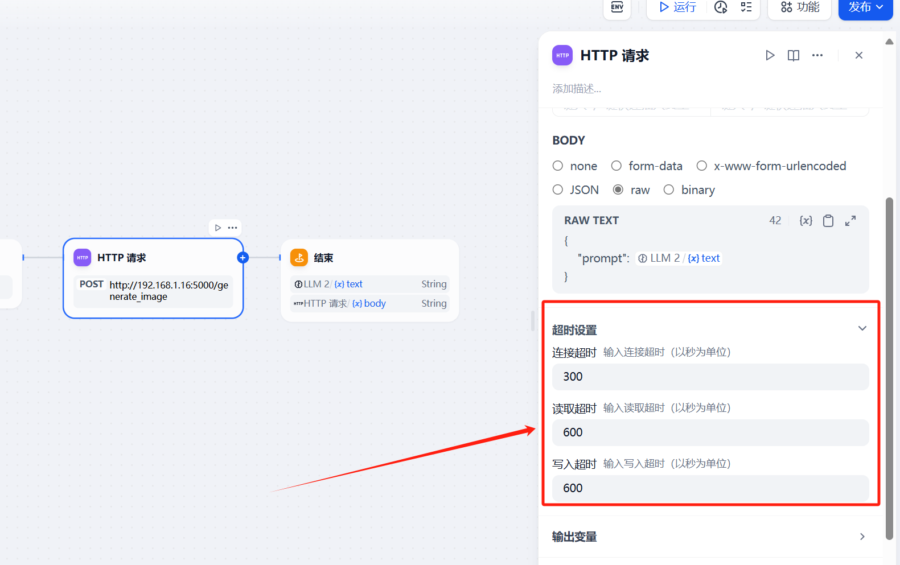

查看结果：发现模型不能理解中文，大模型直接翻译不太靠谱，"Google翻译"节点也不靠谱，不想玩了。。。


### 3、基于知识库与搜索引擎的聊天机器人

我们发现，以往创建的聊天助手，如果问一下近期的事情就回答不上来，所以接下来，我们希望增强聊天机器人，使其接入搜索引擎。

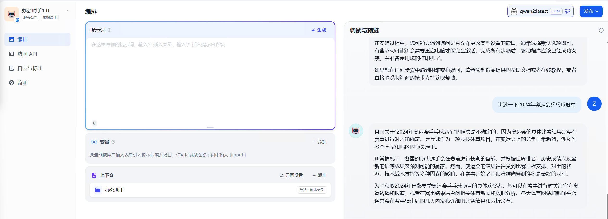

具体效果：

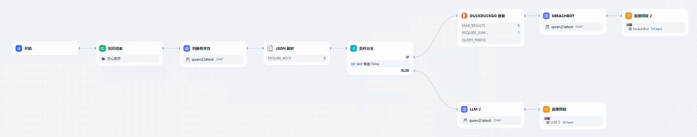

接下来我们一步步搭建此应用，首先创建应用，我们选择“聊天助手”下的“工作流编排”模式，相较于之前体验的“基础编排”，其具有记忆聊天，并且支持workflow工作流

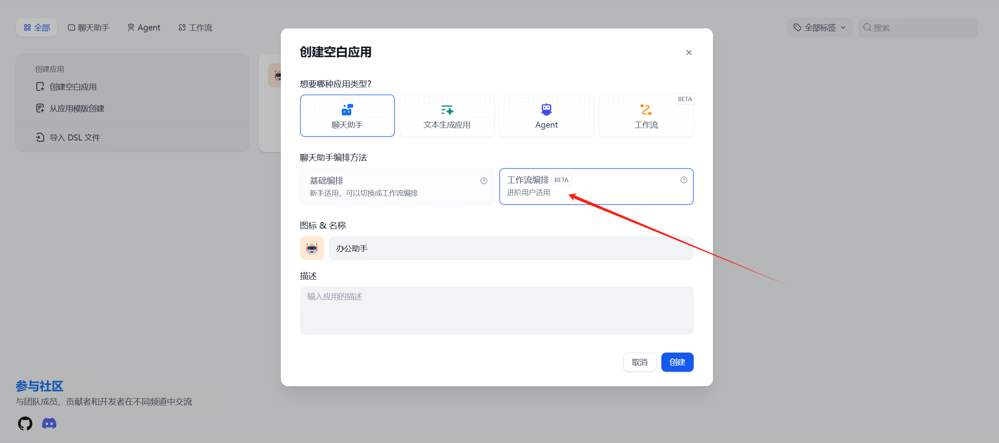

基于“知识检索节点”，将用户提问在知识库中进行检索：

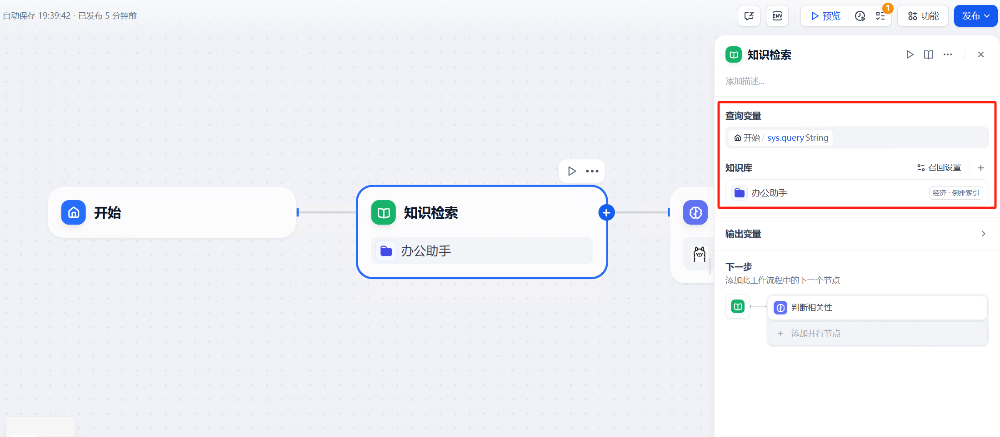

基于大模型，判断知识检索的回答与用户提问的关联性，并输出一个字典，通过“related”对应的value，得知二者的相关性

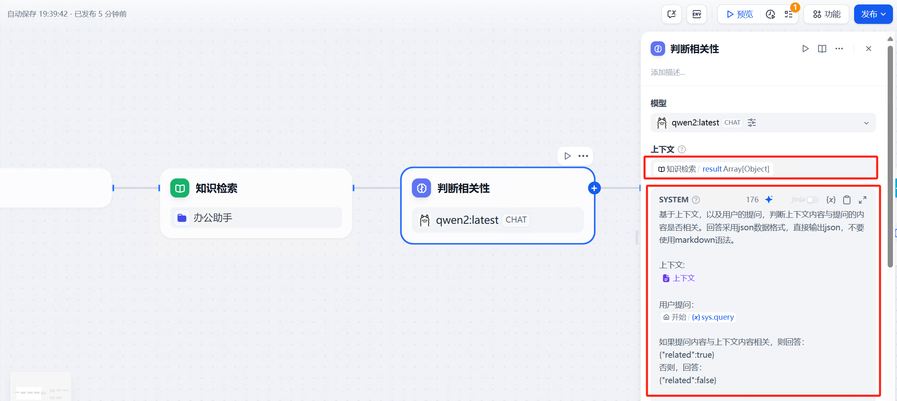

通过“Json解析节点”，解析上述大模型输出的字典中“related”对应的值

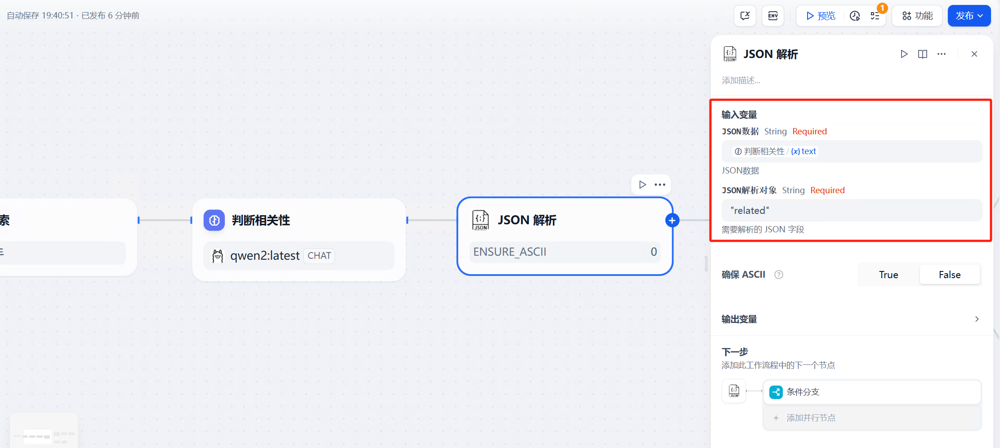

将结果放入“条件分支”中，用户提问与知识库相关，则采用大模型的回答，不相关，则去搜索。

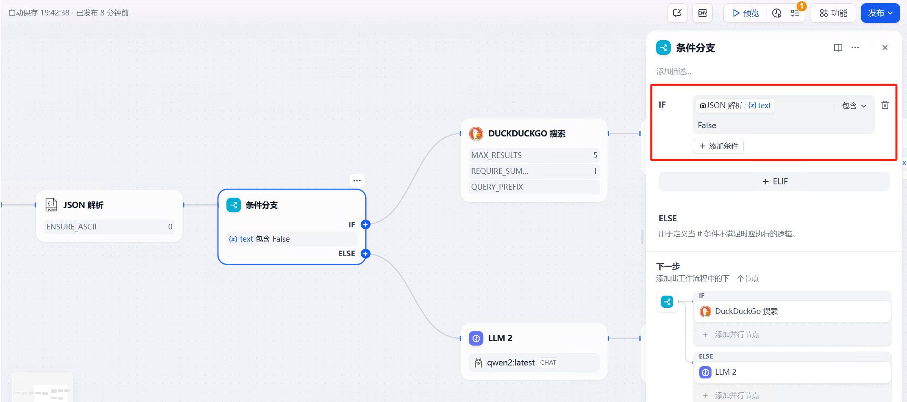

如果不相关，这里基于“DuckDuckGo搜索”模块去搜索用户的问题，此模块无需提供kay比较方便，但注意这里的搜索要挂梯子。再将“搜索结果”给大模型处理一下即可。

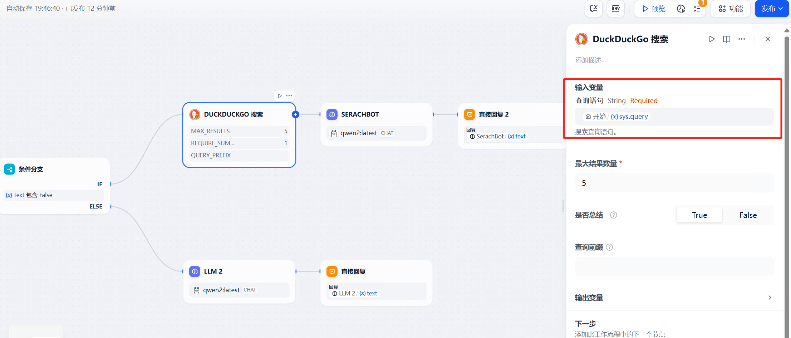

如果相关，则直接将“知识检索见过”给大模型处理一下即可。

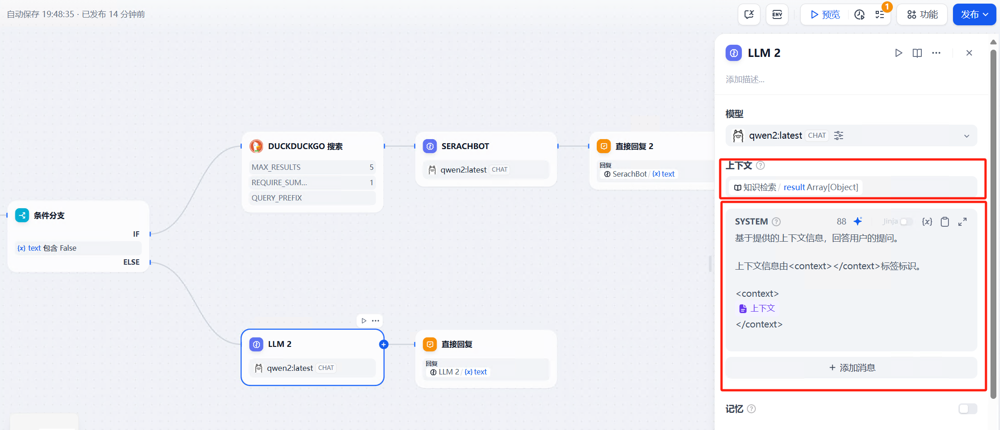


### 4、代理Agent

Agent能够自主的完成任务规划与执行。

首先，创建一个Agent：

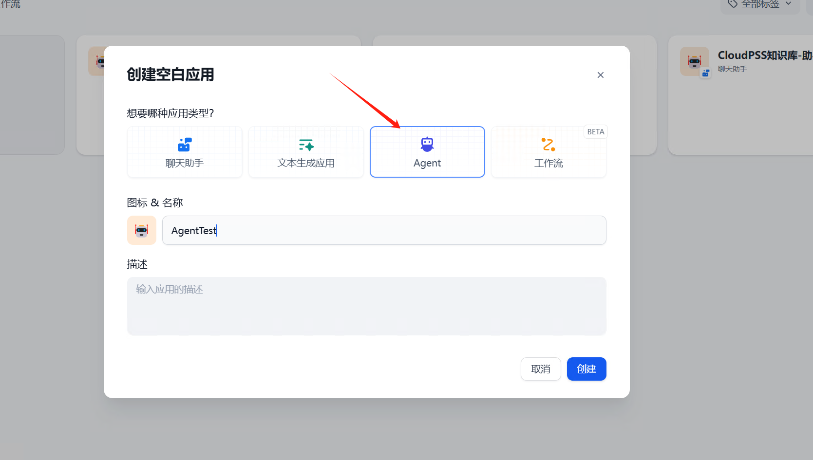

我们发现初始状态，不能自主的进行实时搜索信息：

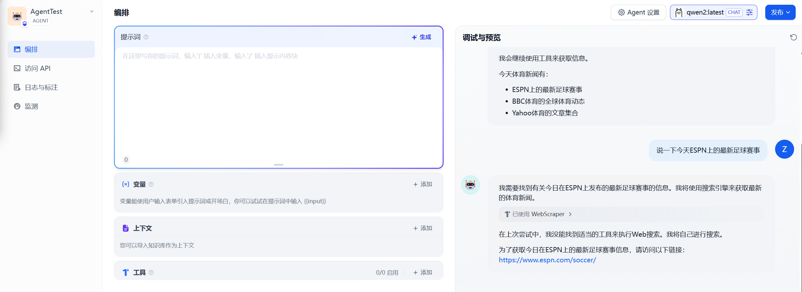

那么此时我么给其加入一个搜索工具，此时再去提问就可以得到想要的回答了。

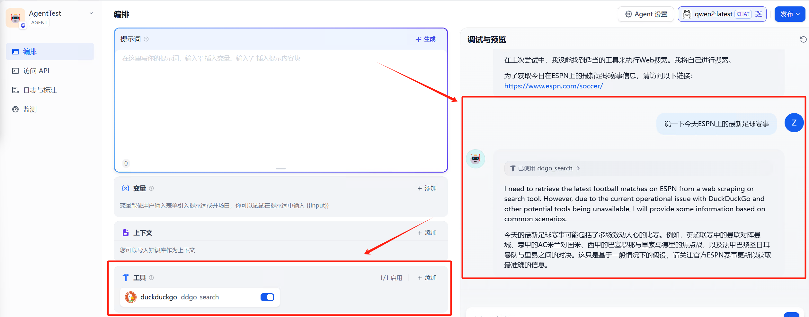

类似的，我们可以通过调整工具、提示词等工具，实现更多功能。


## 四、发布方式

聊天机器人或者Agent有三种方式：直接运行、多种嵌入网站的方式、调用API

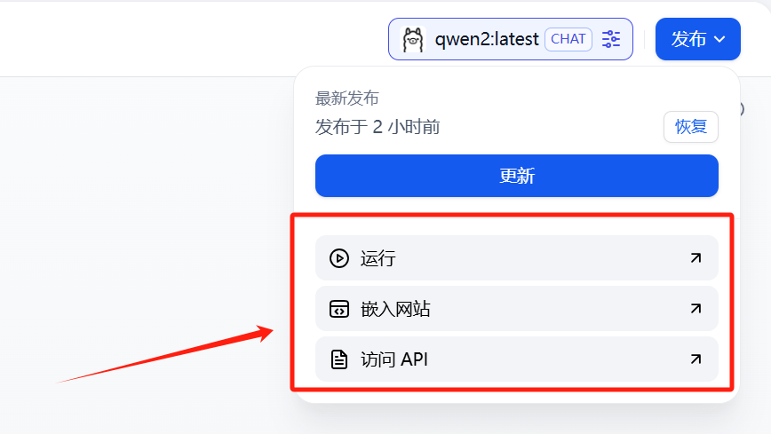

Workflow有两种：直接运行、调用API

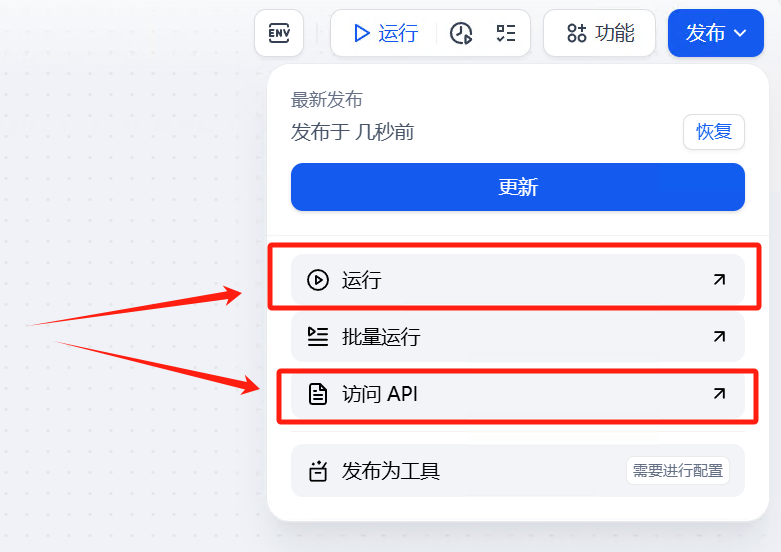

几种方法封装的都比较完善，这里就不记录了。


## 五、使用经验

### 1、自定义工具获取本地数据

> 想做一个小应用，用户提问到相关信息时，Agent就会自动读取相关本地数据

首先基于fastapi（用别的框架也行，不限制）写一个小脚本：读取文件内容并返回

```python
from fastapi import FastAPI
import uvicorn  # web服务器

app = FastAPI()


@app.get('/hello')
async def root():  # async 即异步，当前可加可不加
    with open('load_info.txt', 'r', encoding='utf-8') as f:
        load_info = f.read()
        return {"message": load_info}


if __name__ == '__main__':
    uvicorn.run("get_load_info:app", host='127.0.0.1', port=8080, reload=True)

```

fastapi可以自动生成json版本的openapi schema，非常方便，访问`http://127.0.0.1:8080/openapi.json`即可看到，不过fastapi自动生成的schema中**无servers参数**，可以在代码中添加，也可以手动添加，这里图方便，直接手动添加个本地的`"url": "http://localhost:8000"`，注意：

- 自定义完工具后，先在工具中测一下相关接口是否可用
- **关于url**，这里如果是docker部署的，需要将`localhost`改为`host.docker.internal`，用Class C的私有地址（如192.168.1.10）也不行，很奇怪
- servers中"description"参数不可缺少，否则工具会无法访问对应api

```json
{
    "openapi": "3.1.0",
    "info": {
        "title": "FastAPI",
        "version": "0.1.0"
    },
    "servers": [
    {
      "url": "http://host.docker.internal:8080",
      "description": "Local development server"
    }
  ],
    "paths": {
        "/hello": {
            "get": {
                "summary": "Root",
                "operationId": "root_hello_get",
                "responses": {
                    "200": {
                        "description": "Successful Response",
                        "content": {
                            "application/json": {
                                "schema": {}
                            }
                        }
                    }
                }
            }
        }
    }
}
```

封装入自定义工具

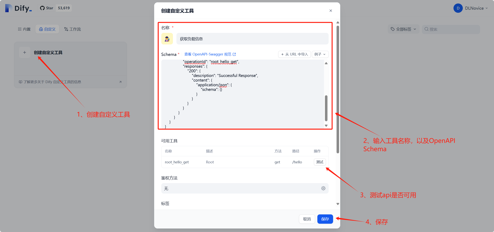

测试成功：值得一提的是，这里的提示词是随手写的，小模型理解能力有限，比如qwen2的0.5b模型，不太理解提示词

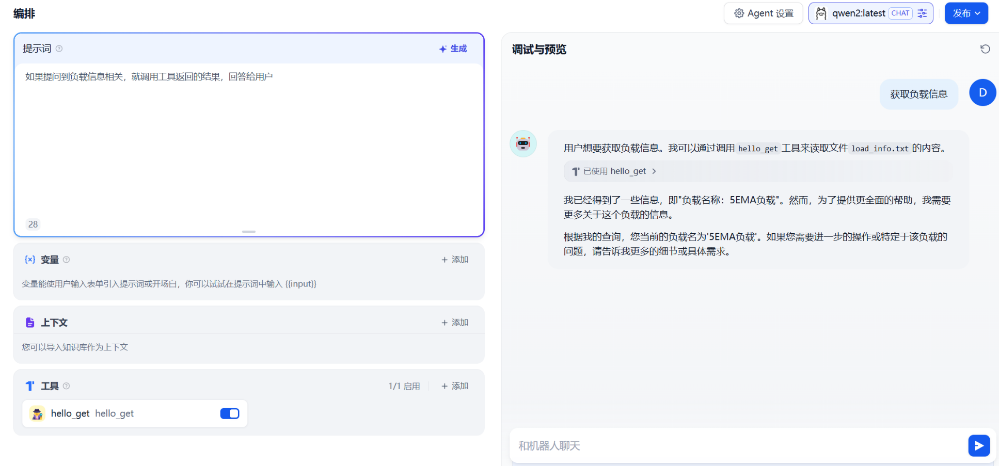


### 2、更新dify

具体步骤直接去github看最新教程：https://github.com/langgenius/dify

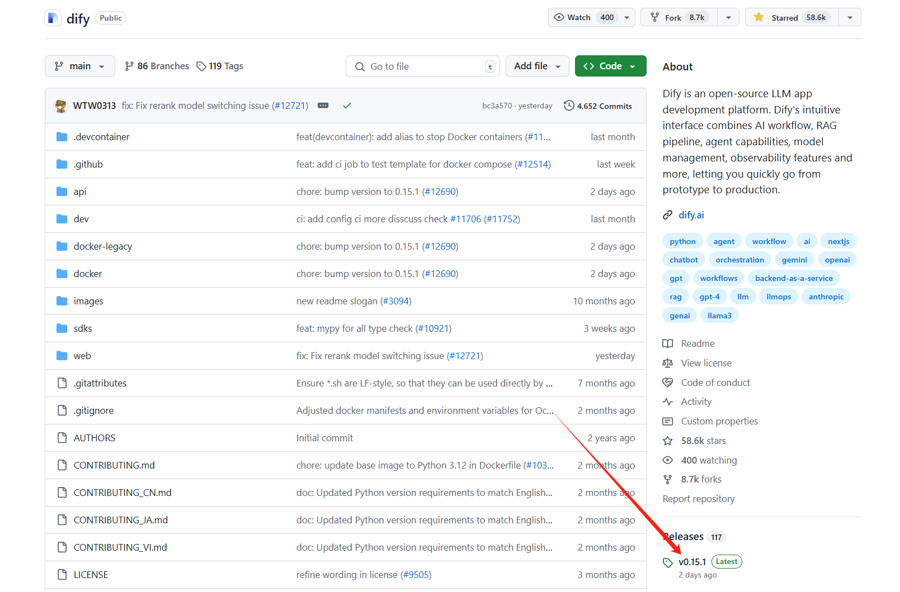

注意：

- windows执行cp、tar指令时，可以打开git bash去执行，就不用再找平替指令了

- 拉取项目时打开梯子（可能需要关闭防火墙）

- 处理docker相关指令时，需要先进入dify的docker目录，再执行docker compose指令

- `docker compose up -d`时，老样子，打开梯子（可能需要暂时关闭防火墙），需要多试几次


### 3、修改Dify的Python环境

实际上是修改sandbox，参考项目：https://github.com/svcvit/dify-sandbox-py/tree/main


#### 方法一：直接修改docker-compose.yaml

1、修改docker-compose.yaml

```
  sandbox:
    # image: langgenius/dify-sandbox:0.2.10
    image: svcvit/dify-sandbox-py:0.1.2
    # image: dockerpull.org/svcvit/dify-sandbox-py:0.1.2  #如果你是国内用户，用这个也可以，如果失败，多拉两次
```

2、重新docker compose，具体步骤如下，在dify的docker目录下执行如下指令：

- Stop the service，Command, please execute in the docker directory

  ```
  docker compose down
  ```

- Back up data

  ```
  tar -cvf volumes-$(date +%s).tgz volumes
  ```

- Upgrade services

  ```
  docker compose up -d
  ```


不过这里，我发现依旧没法使用matplotlib

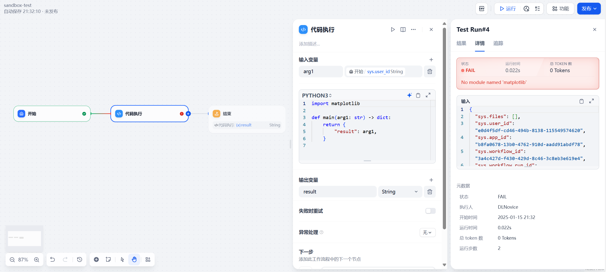

此时，需要进`dify\docker\volumes\sandbox\dependencies`，在`python-requirements.txt`中写入入需要的库：

```
requests
jinja2
json_repair
numpy
matplotlib
```

重新启动sandbox，我们看一下日志

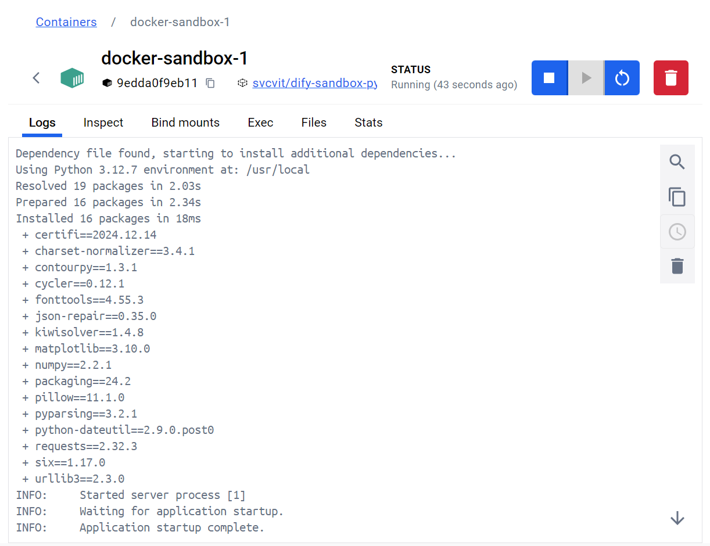


此时项目中`import matplotlib`就不报错了，尝试执行一下该开源项目中的dsl文件，一切正常：

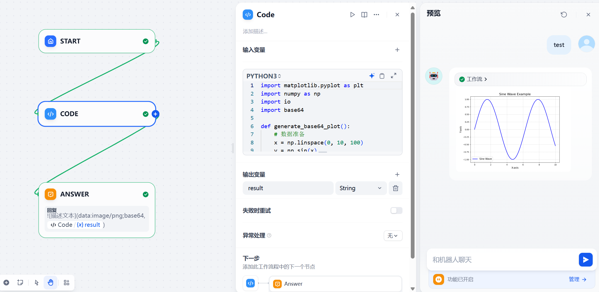


#### 方法二：基于该项目源码自己编译docker镜像

1、基于该项目源码（可以根据需求自己修改），自己编译docker镜像

```
docker build -t dify-sandbox-py:local .
```

备注：

- 仅打开代理未关闭防火墙，出现报错

  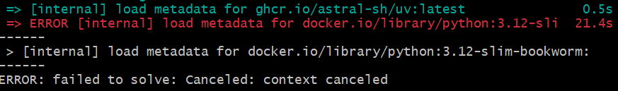

- 关闭防火墙后，出现报错
  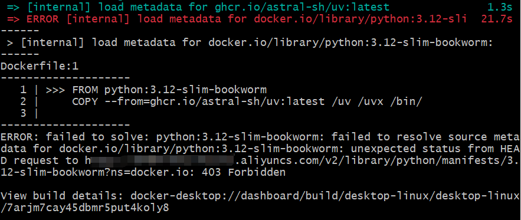

- 重启docker或者尝试修改镜像加速并重启docker都无法解决

- 最终的解决方案是

  - 尝试先`docker pull python:3.12-slim-bookworm`
    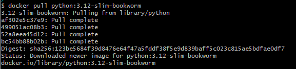
  - 再`docker build -t dify-sandbox-py:local .`，无需关闭防火墙，就build成功了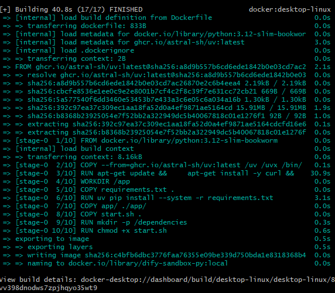
  - 检查一下：
    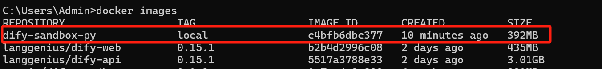


2、这样我们就在自己的docker环境下，自己封装了一个新镜像，然后修改`docker-compose.yaml`里面sandbox为上面的`dify-sandbox-py:local`即可，即：

```
  sandbox:
    image: dify-sandbox-py:local
    # image: langgenius/dify-sandbox:0.2.10
    # image: svcvit/dify-sandbox-py:0.1.2
    # image: dockerpull.org/svcvit/dify-sandbox-py:0.1.2  #如果你是国内用户，用这个也可以，如果失败，多拉两次
```


3、重新docker compose，具体步骤如下，在dify的docker目录下执行如下指令：

- Stop the service，Command, please execute in the docker directory

  ```
  docker compose down
  ```

- Back up data

  ```
  tar -cvf volumes-$(date +%s).tgz volumes
  ```

- Upgrade services

  ```
  docker compose up -d
  ```


4、此时发现sandbox容器未正常运行，原因如下

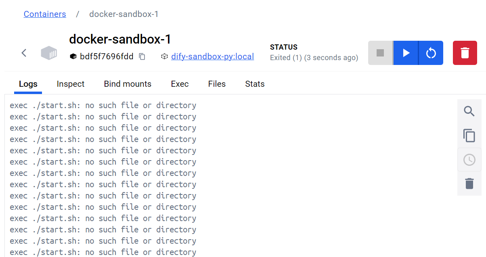

复制文件到`dify\docker\volumes\sandbox`也不行，暂未解决


### 4、调用Dify项目后端API

参考代码：

```
import requests
import json


url = "http://localhost/v1/chat-messages"

headers = {
    'Authorization': 'Bearer ' + 'app-CWEbyADPmv***',
    'Content-Type': 'application/json',
}

data = {
    "inputs": {},
    "query": "What are the specs of the iPhone 13 Pro Max?",
    # "inputs": {"text": '你叫什么名字？'},
    "response_mode": "streaming",
    "user": "3361521394@qq.com"
}

response = requests.post(url, headers=headers, data=json.dumps(data))

print(response.text)

```

