# 00 VMware使用技巧

### 1、虚拟机配置梯子

修改“网络代理Network Proxy”即可，无需改动“VPN”，https://blog.csdn.net/nomoremorphine/article/details/138738065


### 2、关于`sudo apt install **`出现网络问题无法安装工具

首先尝试更新`sudo apt update`


### 3、关于vmware虚拟机黑屏后点击无法唤醒问题

参考：https://blog.csdn.net/lql971203/article/details/103805928，点击指定按钮即可

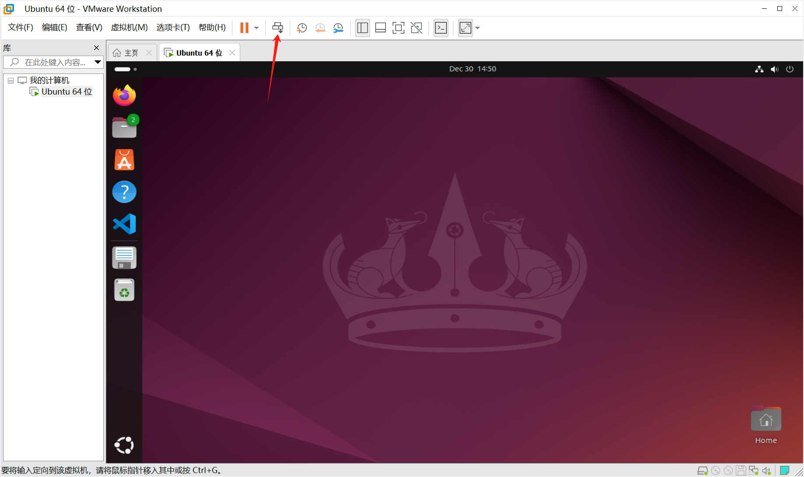


### 4、关于往虚拟机传输文件

多种方式，具体操作如下：

- 直接拖拽：需要安装VMware Tools
- 基于VMware Tools与共享文件夹：初始状态下VMware Tools显示为灰色无法安装
  - 此时一定要先将虚拟机关机，之后再打开设置，将两个CD和软盘的连接均修改为“自动检测”
    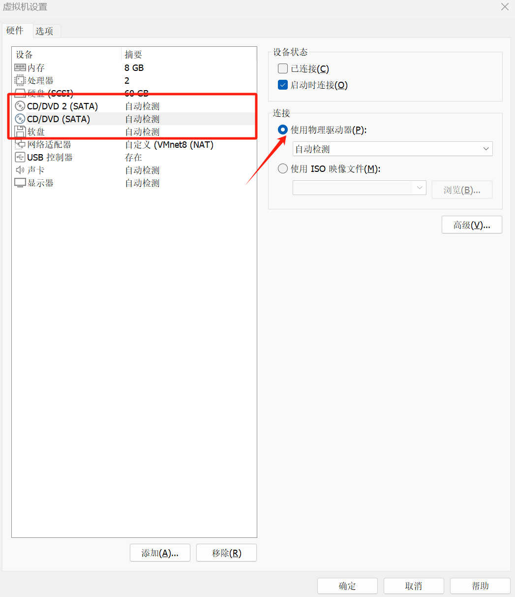
  - 此时再开机，就可以看到VMware Tools可以安装了
    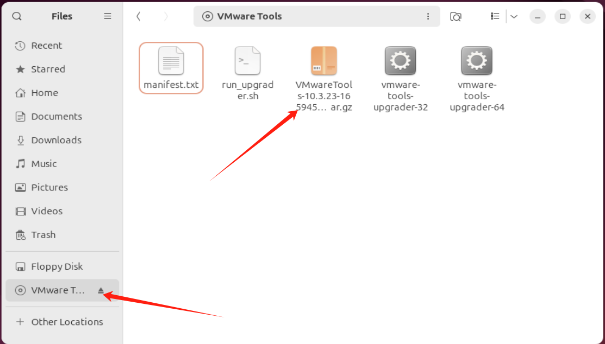
  - 将VMware解压到你想要安装的本地目录：
    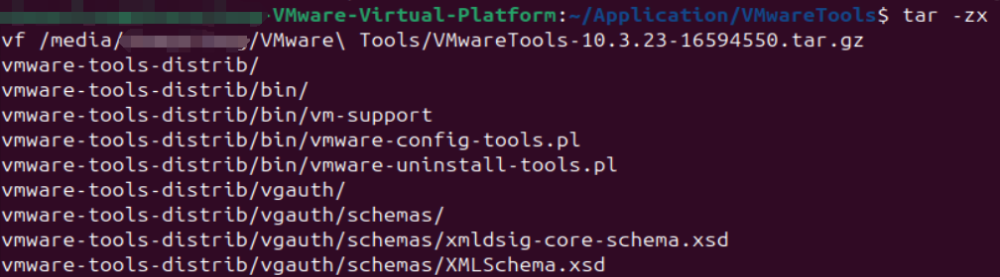
  - 进入到解压后的文件夹，然后进入到 vmware-tools-distrib 目录，输入`sudo ./vmware-install.pl`回车，接着就是一路输入回车即可（部分问题回答yes也可，直接回车最方便），我们均采用默认地址
    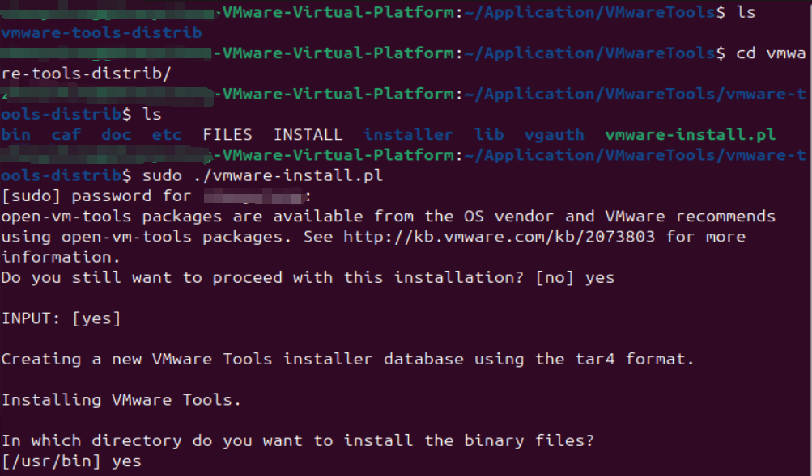
  - 安装成功后将虚拟机虚拟机（不要重启）
    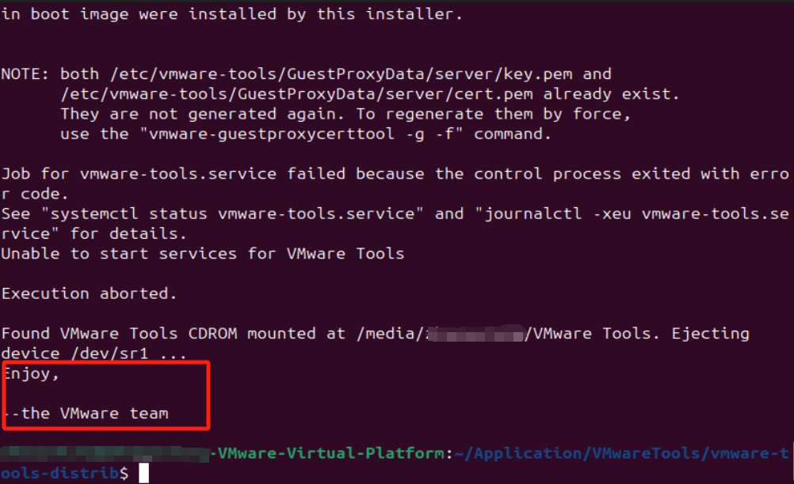
  - 之后就可以创建共享文件夹了，先在Windows上创建共享文件夹
    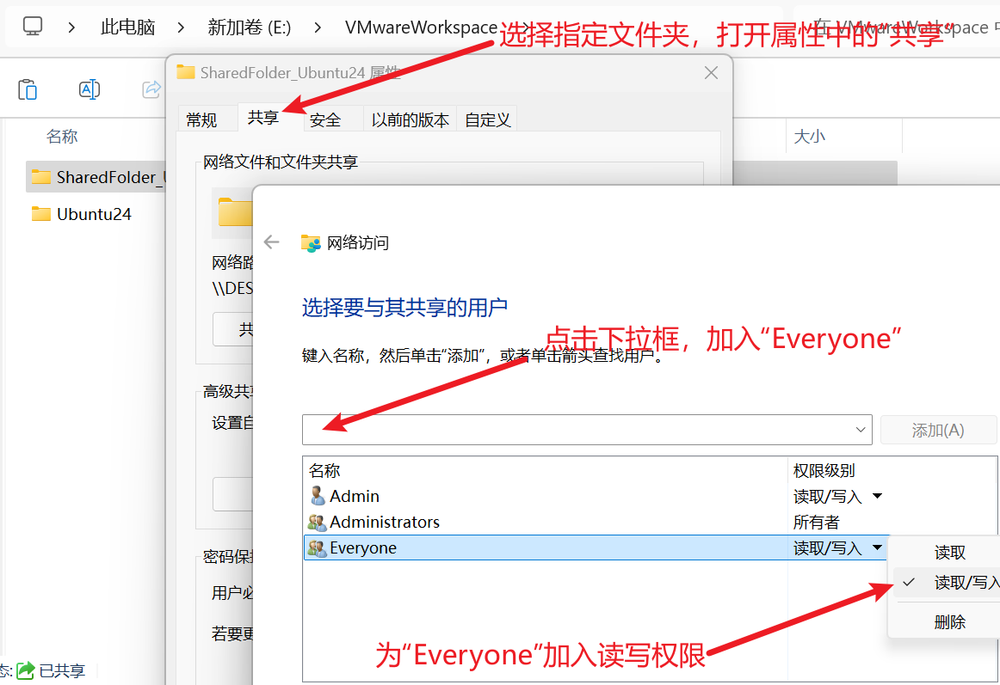
  - 其次在虚拟机上添加我们刚创建的共享文件夹
    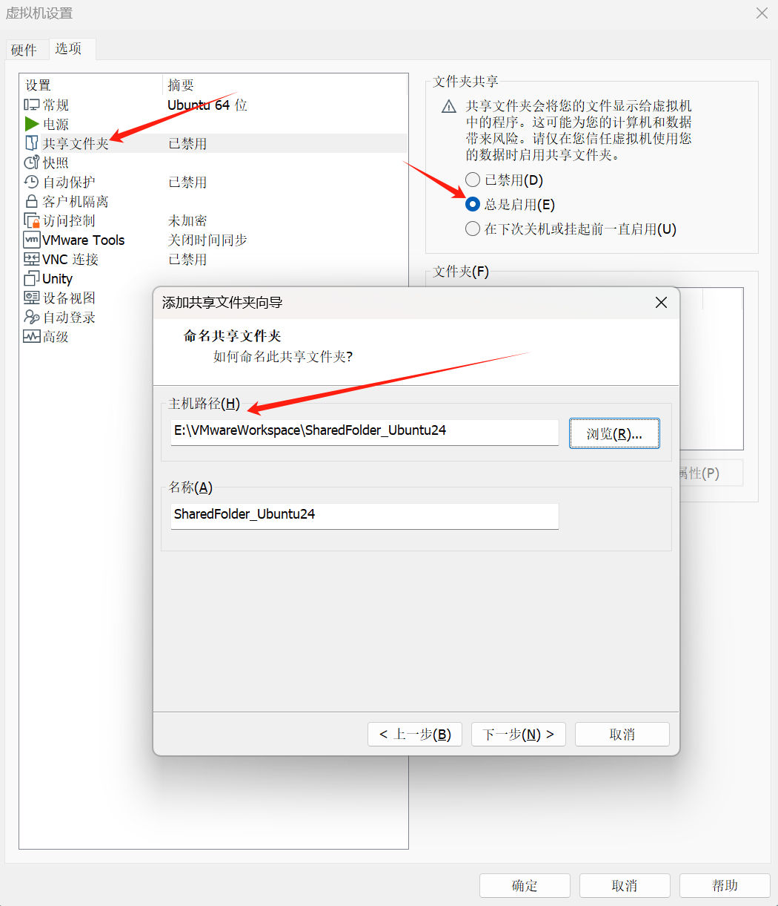
  - 接下来，开机虚拟机，进入 `/mnt/hgfs` 目录，即可看到共享的文件夹
    - 如果`/mnt/hgfs`下面没有共享文件夹, 是因为没有挂载成功, 我们把它挂载上即可
    - 手动在/mnt下创建hgfs目录：`sudo mkdir hgfs`
    - 查看当前有哪些共享的目录:`vmware-hgfsclient`
    - 使用`mount -t vmhgfs .host:/shared /mnt/hgfs `命令挂载该共享文件夹，其中.host:/Documents是共享名，只需把Documents换成你使用vmware-hgfsclient 命令得到的目录（补充，不同linux内核版本，指令可能有出入，参考：https://blog.csdn.net/BjarneCpp/article/details/95899425，不过我这里尝试后没起作用）
      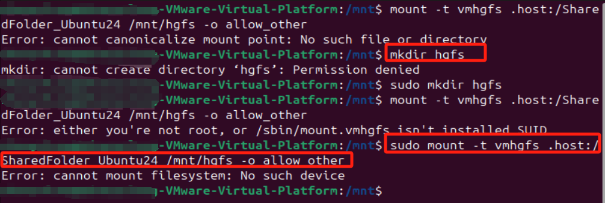
    - 如果出现No such device，ubuntu可尝试`sudo apt-get install open-vm-dkms`，如果找不到该软件包，这里需要安装另一个安装包`sudo apt-get install open-vm-tools-dkms`，centos可尝试`yum install open-vm-tools`，之后再尝试重新挂载，不过因为是离线环境部署，这里可以尝试：
      - 方法一：我这边尝试后没起作用
        - `sudo vim /etc/rc.local`，没有vim可以使用vi
        - 需要增加内容`modprobe -a vboxguest vboxsf vboxvideo`
        - 然后重新执行命令没有报错即可，此时再去查看是否挂载成功
- 基于网络传输：ssh连接不上，不知道是不是因为防火墙没关
- 基于U盘：这边插入U盘，VMware就会提示是否将U盘挂载在虚拟机上，立马就能使用U盘（备注，如果U盘出现文件太大无法拷贝，可能因为U盘是FAT32的文件系统，单次传输文件最大为4GB，所以无法传输，所以格式化U盘，并选择格式化为NTFS即可）

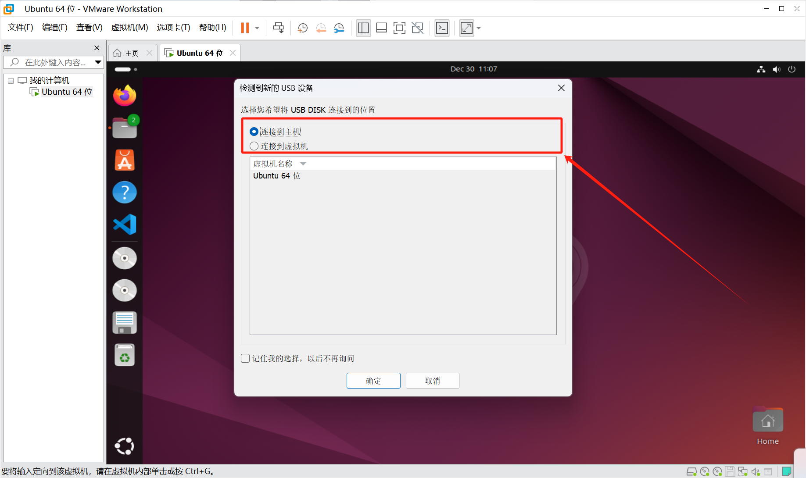

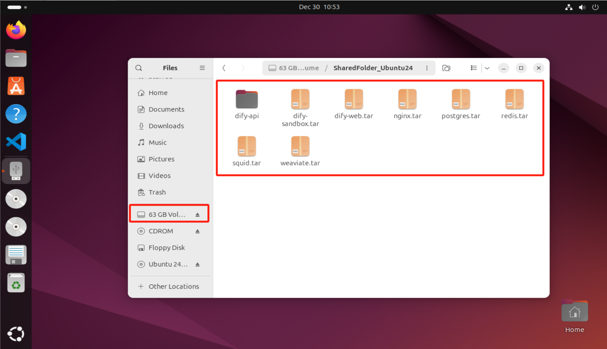


# 01 Ollama离线部署

## 一、Ollama离线安装

1、官网下载Ollama安装包：https://github.com/ollama/ollama/releases

2、解压：`tar -C /usr -xzf ollama-linux-arm64.tgz`

3、启动服务：`ollama serve`，启动后新起一个终端，即可体验Ollama


备注-官网下载install.sh，修改配置后安装，**无需理会，新版ollama已无需这样**：

1、本地创建install.sh文件：`touch install.sh`

2、复制官网的install.sh内容到本地：https://ollama.com/install.sh

3、修改install.sh两处内容：

- 修改Ollama下载地址：注释下载链接
  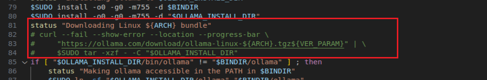
- 修改Ollama安装目录：修改为你Ollama压缩包解压后所在位置
  

4、安装Ollama：先给权限`chmod +x install.sh`，后安装`./install.sh`

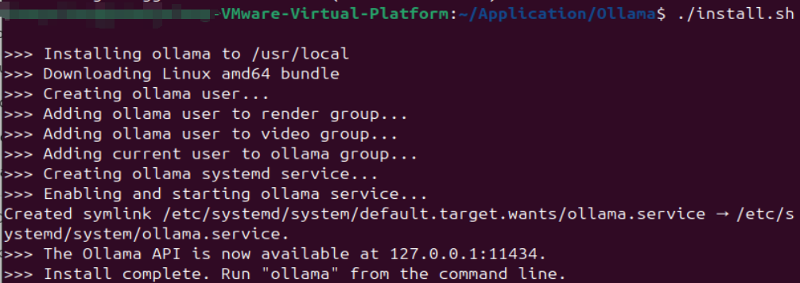


## 二、Ollama离线部署模型

去HuggingFace或者国内的ModelScope下载模型：

### 1、下载GGUF格式模型

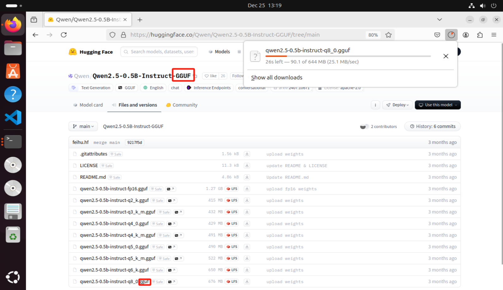

不同编号模型间的区别：https://blog.csdn.net/weixin_44455388/article/details/136500170?spm=1001.2014.3001.5501

我们这里随便下载一个q8体验一下。


### 2、创建Modefile

- 创建一个名为 Modelfile 的文件：使用 FROM 指令，填写你模型的本地文件路径。

  ```bash
  FROM ./模型名.gguf
  ```

- 在Ollama中创建模型

  ```bash
  ollama create 模型Name -f Modelfile
  ```

如下图所示：

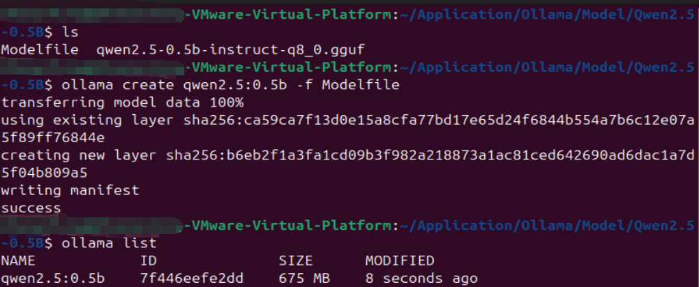

补充：

- Modelfile文件中还可以添加系统提示词以及各项参数：https://cn.bing.com/search?q=Modelfile%E6%96%87%E4%BB%B6

  ```bash
  FROM ./模型名.gguf
  
  # set the temperature to 1 [higher is more creative, lower is more coherent]
  PARAMETER temperature 1
  
  # set the system message
  SYSTEM """
  ************
  """
  ```

  

### 3、测试模型

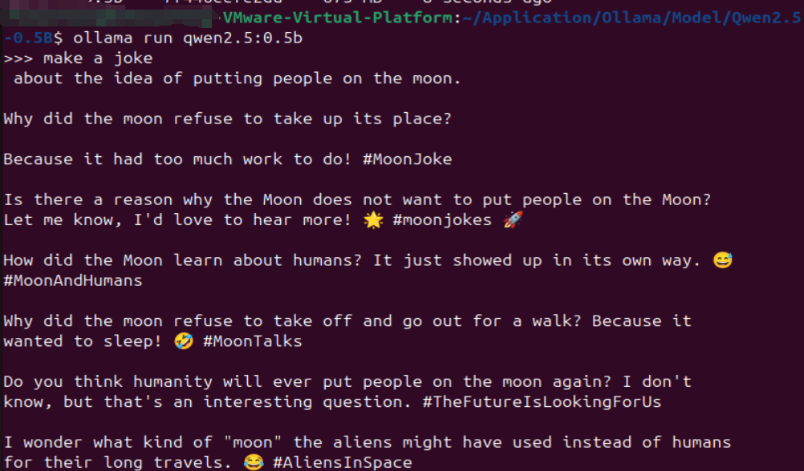


# 02 Dify离线部署

## 一、离线安装docker

这里以Ubuntu为例：先下载文件，后离线安装docker

### 1、官网下载docker离线安装包

具体步骤如下：

- 网址：https://download.docker.com/linux/ubuntu/dists/
- 不同的编号对应不同Ubuntu版本，我这里是Ubuntu24.04.1，选择noble，接下载选择focal/pool/stable，最后根据自己系统架构选择即可，如：https://download.docker.com/linux/ubuntu/dists/noble/pool/stable/amd64/
- 下载核心的三个deb文件：containerd.io、docker-ce-cli、docker-ce，我这里直接挑最新版本的下载了


### 2、安装docker

按顺序安装containerd.io、docker-ce-cli、docker-ce即可：

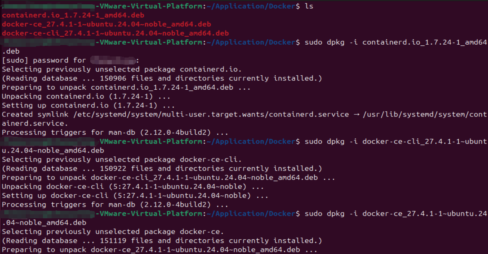

检查是否安装成功：

- 启动docker：`systemctl start docker`
- 查看状态：`systemctl status docker`
  - 如果显示状态为 `inactive` 或者 `failed`，尝试重新启动 Docker 服务：`sudo systemctl restart docker`，并再次检查状态`systemctl status docker`，


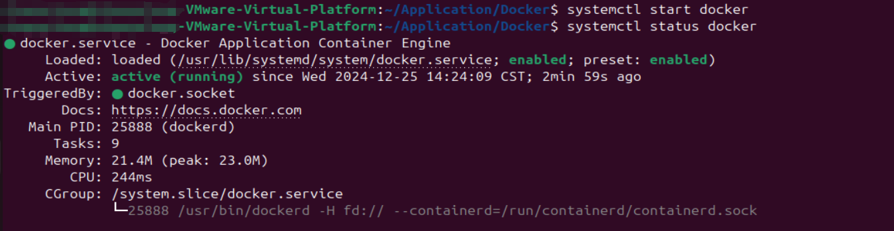

注意，active不一定代表可以使用，如果 Docker 服务是 **active** 的，但你使用docker时，如`docker ps`仍然遇到 `permission denied` 错误，可能是当前用户没有权限访问 Docker 守护进程：

- 将当前用户添加到 `docker` 用户组：`sudo usermod -aG docker $(whoami)`
- 用户组修改生效通常需要重新登录。你可以注销当前会话并重新登录，或者直接使用以下命令：`newgrp docker`
- 验证是否可以使用docker：`docker ps`

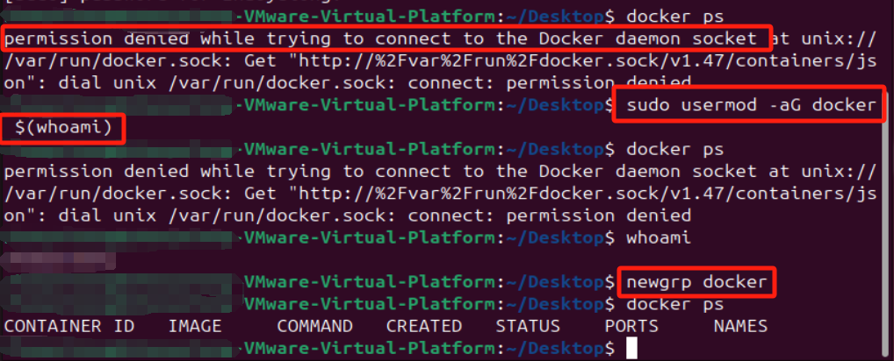

但之后你会发现，新启一个终端，又出现`permission denied` 错误了，因为尽管你已经通过 `usermod -aG docker $(whoami)` 将用户添加到 Docker 用户组，但该更改通常需要重新登录才能生效，此时可尝试：

- 重启系统
- 或者在新终端执行`newgrp docker`，可以临时解决问题


### 3、官网下载docker-compose

官网链接：https://github.com/docker/compose/releases

选择自己所需的docker-compose二进制文件

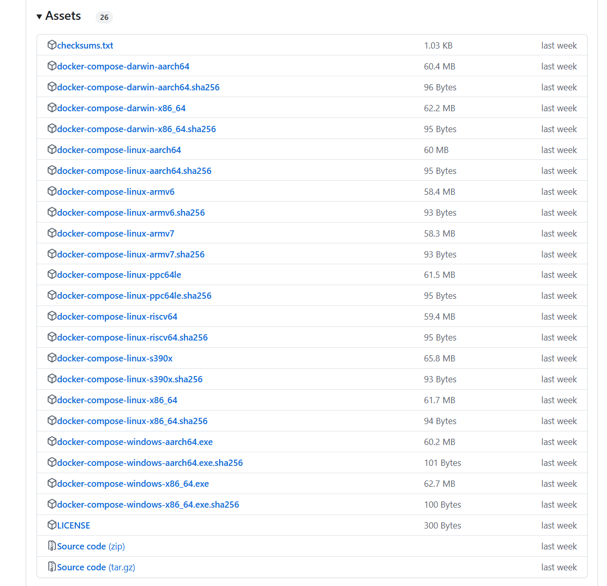

### 4、安装docker-compose

具体步骤如下：

- 将文件名称修改为：`docker-compose`
- 将文件移到 `/usr/local/bin`：`sudo mv docker-compose /usr/local/bin/docker-compose`
- 赋予权限：`sudo chmod +x /usr/local/bin/docker-compose`
- 验证安装：`docker-compose --version`

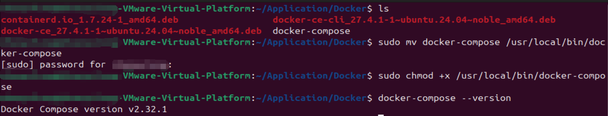


## 二、离线部署Dify

由于docker拉取镜像时需要联网，所以这里打包另一台主机现有的Dify环境并离线部署，具体步骤如下：

1、查看当前运行中的容器：`docker ps`

2、查看当前存储的镜像：`docker images`

3、如果部分容器没有封装成镜像，或着不是最新的镜像，需要将指定容器基于`docker commit`一个一个封装或者基于`Dockerfile`封装成镜像

4、镜像都准备完毕后，使用 `docker save` 命令将镜像导出为 tar 文件：

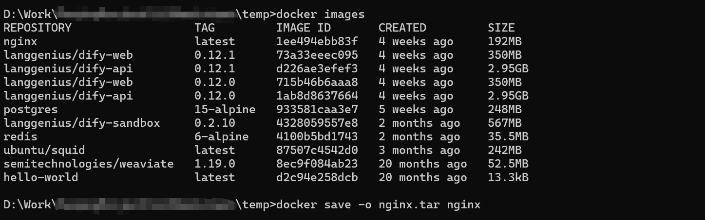

5、将文件传输至离线服务器并部署

使用 `docker load` 命令一个一个加载镜像：`docker load -i /path/to/destination/<image_name>.tar`

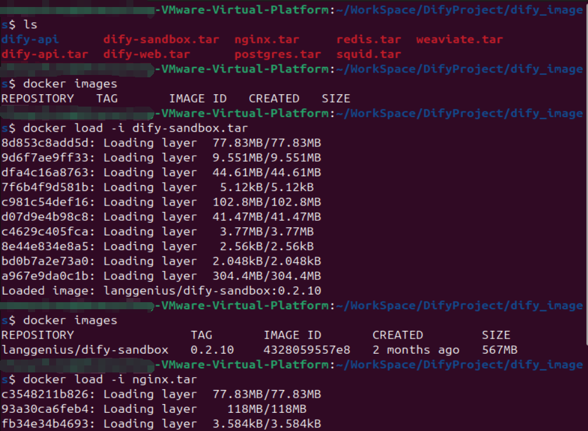

接下来，正确做法，基于我们windows拷贝过来的docker-compose.yaml，直接一步运行各个镜像：

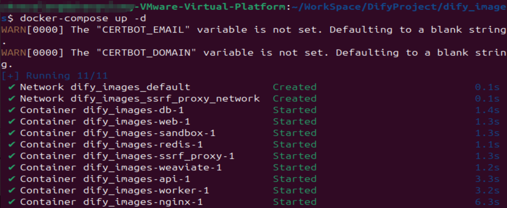

浏览器进入`http://localhost/install`等待一会后刷新一下网址即可

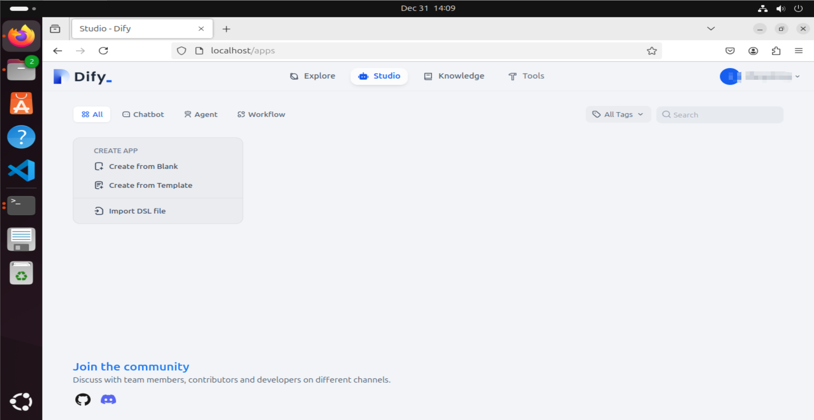

但是，接入ollama模型出现了问题。

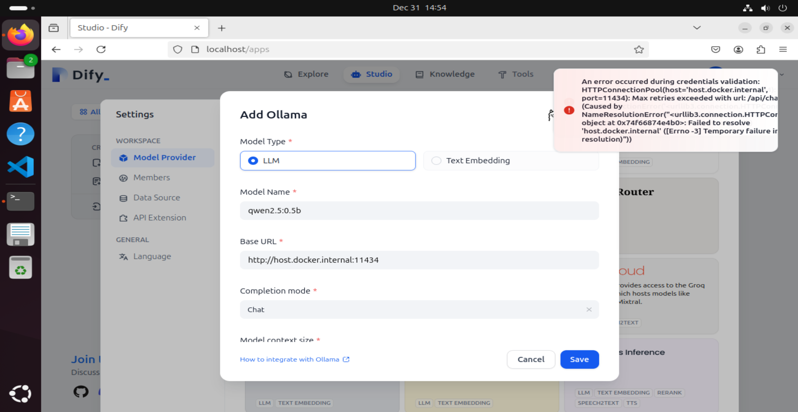

模型基础URL采用`http://host.docker.internal:11434`或者`http://localhost:11434`军不行，即便尝试如下方法也不行

- 排除模型问题：直接使用ollama在线下载模型，依旧连接不上dify
- 修改防火墙权限
- 采用局域网IP
- 设置Ollama参数：参考https://docs.dify.ai/zh-hans/development/models-integration/ollama，使用`OLLAMA_HOST="0.0.0.0" ollama serve`
  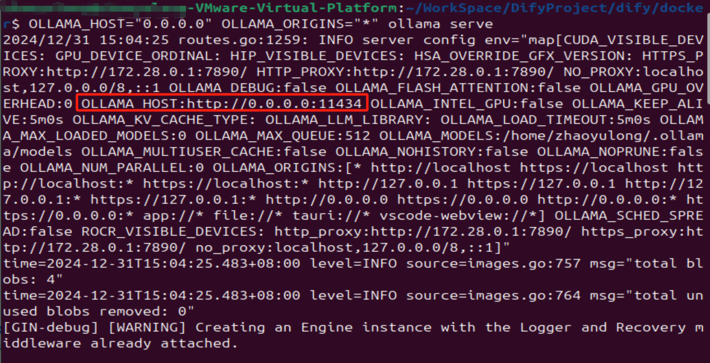

查询到原因为，`host.docker.internal`仅适合于win和mac，不适合linux，所以，docker容器没法通过http://host.docker.internal:11434访问不了主机的ip：

- 解决方案一：在docker-compose.yaml里指定映射（没成功）
- 解决方案二：直接指定本机IP
  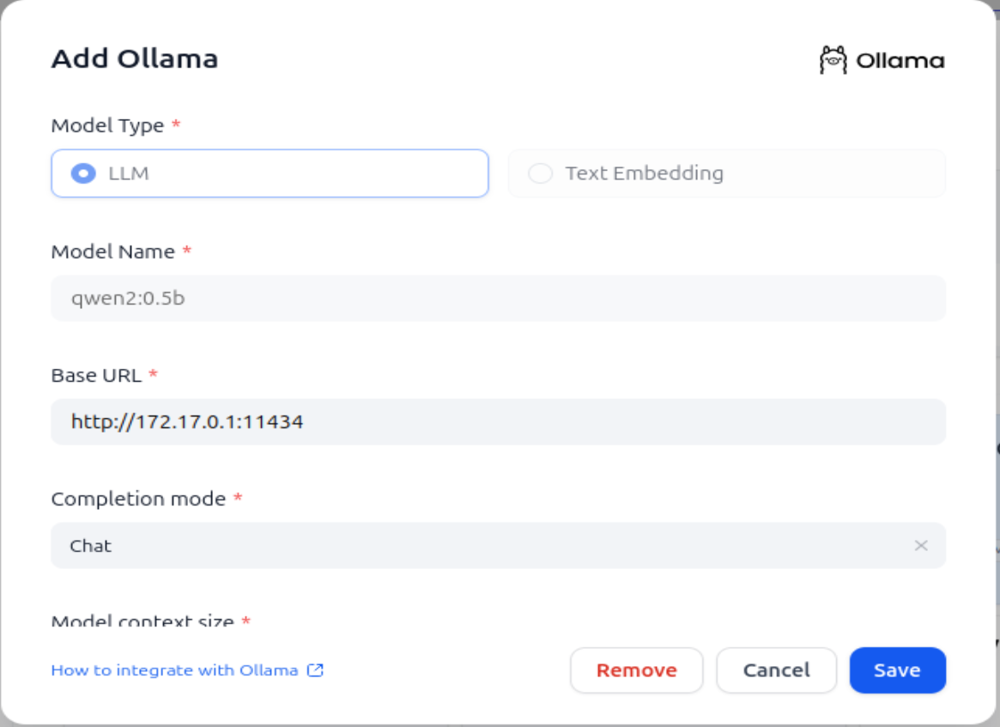
  - 但是由于当前在虚拟机环境，局域网IP有多个 
    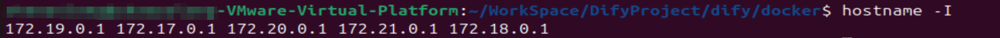
  - 而基于curl测试ollama模型时发现（如：`curl http://localhost:11434/api/generate -d "{\"model\": \"qwen2:latest\", \"prompt\": \"Why is the sky b
    lue?\"}"`），只有采用127.0.0.1或者localhost可以通过，直接采用上述任意局域网IP均不行，而127.0.0.1不能用于dify上ollama模型的配置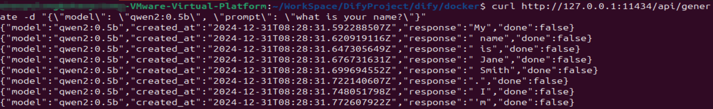
  - 那么就说明，ollama服务是部署在127.0.0.1上的，而非上述那五个172开头的ip，那么一种解决方案就是直接将ollama服务在某个局域网ip上启动即可
    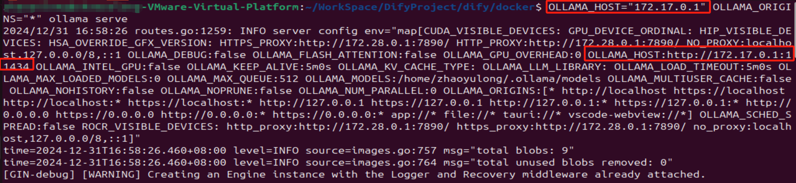
  - 之后再在dify中配置，就可以使用了
    

注意：Ollama模型URL配置不通，也可能是因为虚拟IP的缘故，比如特殊的梯子。


测试效果：

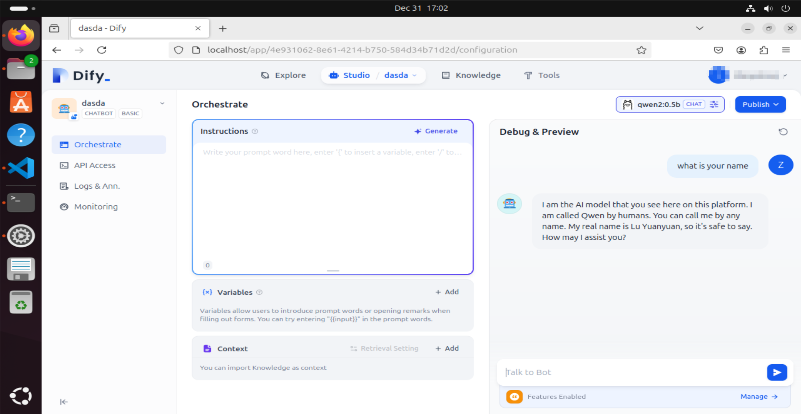


其他问题：

- 每次重启虚拟机，需要先关闭所有docker容器`docker stop $(docker ps -q)`，再重新`docker-compose up -d`才能使用dify，且访问dify时需等待几分钟项目完全启动


错误做法：一一使用加载的镜像在目标服务器上运行容器，这样会导致docker-compose.yaml中参数缺失，产生一些问题：

`docker run -d --name <container_name> <image_name>:<tag>`，也可以直接`docker run <container_name>:<tag>`，如果因为反斜杠导致失败，可以在容器名外加引号，注意TAB可以自动补全

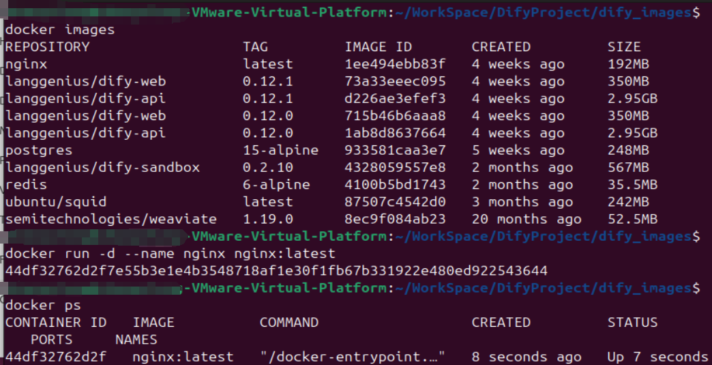

部分容器启动后，不需要ctrl + c终止终端，新启一个终端即可，部分容器加载失败：

- Postgres数据库
  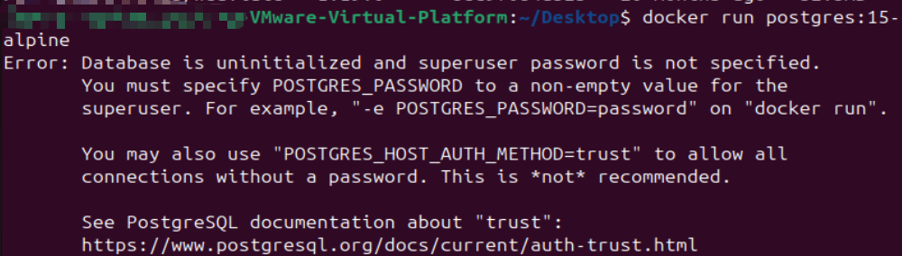

  - 这是因为Docker 中的 PostgreSQL 镜像需要一个 `POSTGRES_PASSWORD` 环境变量来设置该密码。如果没有设置这个变量，容器会抛出这个错误。

  - 我们这里直接在命令行指定密码即可，在dify源码包中的`docker-compose.yaml`可以看到密码为`difyai123456`，直接使用 Docker 的 `-e` 参数来设置环境变量即可，即`docker run --name postgres -e POSTGRES_PASSWORD=difyai123456 -d postgres:15-alpine`，不同dify版本的密码和postgres版本号可能有出入，按具体情况来即可，运行结果参考下图：

    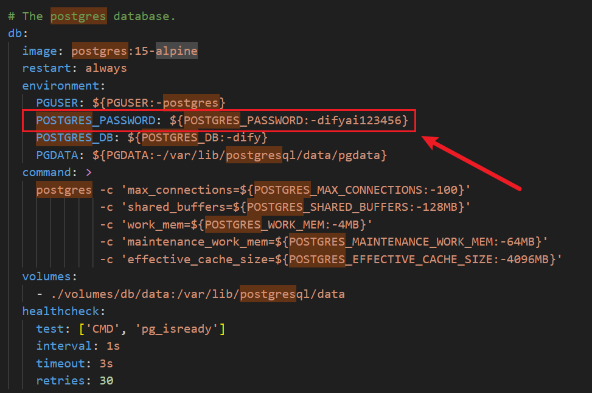

  - 运行指令即可：
    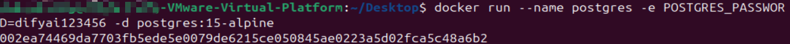

  - 如果出现报错，容器已存在，则直接删除：`docker rm postgres`，再重试上述指令
    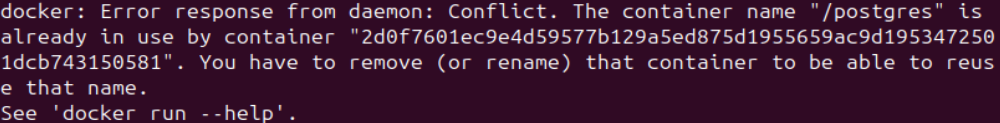

-  Weaviate 向量存储服务
  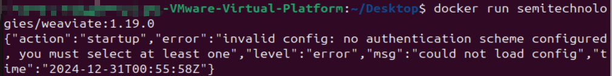

  - 这是因为Weaviate 容器需要配置身份验证方案才能正确启动。你需要选择至少一种身份验证方法，并在 Docker 环境变量中进行配置。
  - 老方法，我们可以在dify源码包中的`docker-compose.yaml`可以看到相关参数
    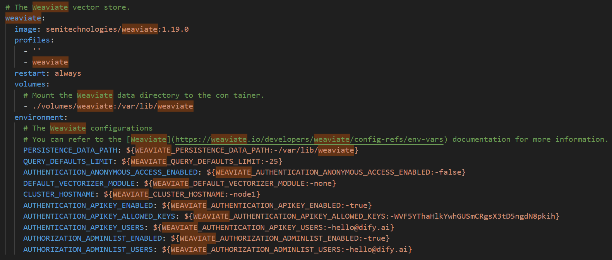
  - 在但是，运行指令后发现，终端没有报错，但docker ps中没有看到正在运行的Weaviate 容器
    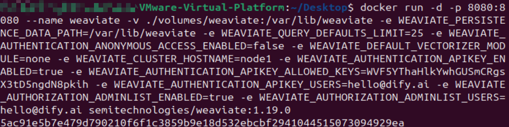
  - 尝试删除各个参数中的前缀`WEAVIATE_`重新运行，结果可以在docker ps中看到正在运行的Weaviate 容器了
    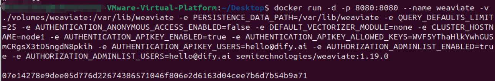


