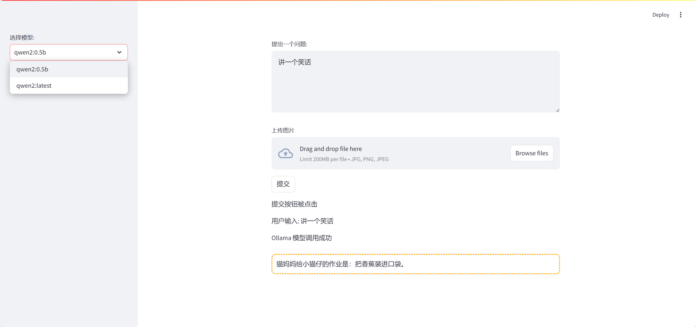
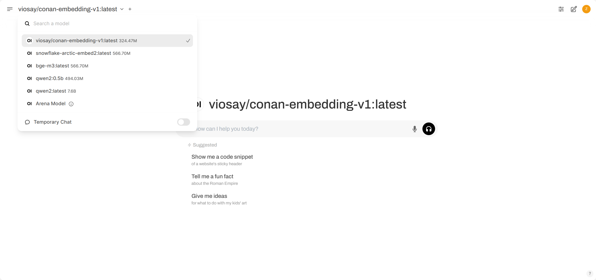
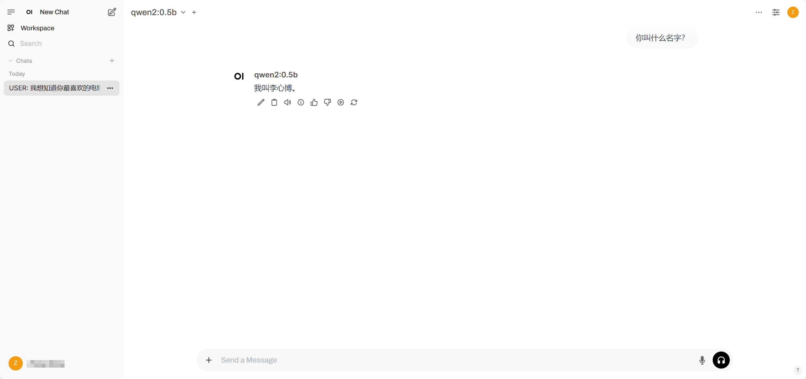

排除Dify、Coze等较大的项目，下面是一些用于开发简易的聊天窗口的工具


# 01 Streamlit

> 官网教程：https://docs.streamlit.io/
>
> 简介：
>
> - 简单来说, [Streamlit](https://streamlit.io/)是一个Python库，用于快速构建交互式Web应用程序。它提供了一个简单的API，允许开发者使用Python代码来创建Web应用程序，而无需学习复杂的Web开发技术
>
> 使用体验：
>
> - 简易轻量：一般LLMs聊天窗口应用的功能，Streamlit都能在Python脚本中是实现，代码量较少


调用API的方式，几行代码轻松是西安Web聊天：

- 参考：https://blog.csdn.net/weixin_42608414/article/details/128916767

直接调用本地模型：

- 参考：https://blog.csdn.net/qq_39813001/article/details/137320635

调用Ollama模型：

- 参考：https://blog.csdn.net/hzether/article/details/144151231，终端输入【`streamlit run py脚本名称`】启动项目




# 02 OpenWebUI

> 官网链接：https://github.com/open-webui/open-webui
>
> 简介：
>
> - **Open WebUI 是一个[可扩展](https://docs.openwebui.com/features/plugin/)、功能丰富且用户友好的自托管 AI 平台，旨在完全离线运行。**它支持各种 LLM 运行器，如 **Ollama** 和 **OpenAI 兼容的 API**，并**内置了 RAG 推理引擎**，使其成为**强大的 AI 部署解决方案**。
>
> 使用体验：
>
> - 部署过程简单
> - 界面酷似ChatGPT，省却了自己撰写前端的功夫
> - 大厂在用，Star当前57K，应该可靠，认可度高

## 1、部署OpenWebUI

Open WebUI 可以使用 Python 包安装程序 pip 进行安装。在继续之前，请确保您使用的是 **Python 3.11** 以避免兼容性问题。

1. **安装 Open WebUI：** 打开终端并运行以下命令以安装 Open WebUI：

   ```
   pip install open-webui
   ```

2. **运行 Open WebUI：** 安装后，您可以通过执行以下命令来启动 Open WebUI：

   ```
   open-webui serve
   ```

这将启动 Open WebUI 服务器，您可以在 [http://localhost:8080](http://localhost:8080/)


## 2、应用

参考官网链接，几种方法都直接给出了demo。

这边尝试了ollama对应的docker指令，运行 Open WebUI（`open-webui serve`）后，前端会自动显示本机的Ollama模型






# 03 Gradio

> 官网链接：[Gradio ](https://www.gradio.app/)
>
> 简介：
>
> - [Gradio ](https://www.gradio.app/)是一个开源的 Python 库，用于快速构建机器学习和数据科学演示应用。它使得开发者可以在几行代码中创建一个简单、可调整的用户界面，用于展示机器学习模型或数据科学工作流程。Gradio 支持多种输入输出组件，如文本、图片、视频、音频等，并且可以轻松地分享应用，包括在互联网上分享和在局域网内分享.
> - 简单来说,利用 Gradio 库,我们可以很容易实现一个具有对话功能的前端页面，实现最简单人机交互功能。
>
> 使用体验：
>
> - 没有实际部署，看起来Gradio是一个非常丰富的工具，不过这里相比Streamlit的轻量、相比面向LLM的框架Open WebUI，感觉优势不大

官网快速入门教程：

- https://www.gradio.app/docs/python-client/introduction

调用Ollama模型：

- https://53ai.com/news/zhinengyingjian/2024103038917.html


