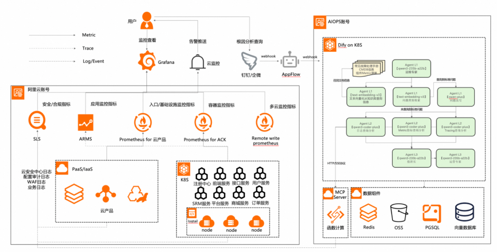

AIOps：Artificial Intelligence for IT Operations，智能运维。

- **由 Gartner 在 2016 年提出**，是指在 IT 运维过程中应用 **大数据、人工智能（AI/ML）技术**，实现 **自动化、智能化运维** 的理念与技术体系。
- 本质上：把 **运维的复杂问题** 交给 **数据驱动的智能算法** 去处理。

SRE：Site Reliability Engineering，站点可靠性工程

- Google 在 2003 年左右提出的一种运维工程理念和实践方法。
- 用软件工程方法来解决传统运维（Ops）中的问题。在 **系统可靠性、可扩展性和可维护性** 与 **快速迭代的开发效率** 之间找到平衡。

AI-SRE、SRE-Agent：略

> 参考：[2025.12.02 基于AI大模型的故障诊断与根因分析落地实现](https://mp.weixin.qq.com/s/AYenvVpB-oHWabJFbkUpmg)

一、项目背景与目标

- **背景**：企业数字化转型深化，业务系统复杂性指数级增长，导致故障排查困难。
- **目标**：构建一个**多智能体协作的AI系统**，模拟人类运维专家团队，实现故障的自动化、智能化根因分析，并通过企业微信/钉钉等平台推送给运维人员，最终大幅降低平均故障发现时间（MTTD）和平均故障修复时间（MTTR）。

二、系统核心原理

1. **数据接入**：集成多源运维数据，包括监控指标（Metrics）、日志（Logs）、调用链（Traces）等。
2. **多智能体协作**： **任务规划智能体**：生成排查计划，调度其他智能体。 **指标/拓扑/日志分析智能体**：各司其职，分析时序指标、系统拓扑、日志错误等。 **分析决策智能体（值班长）**：整合证据，判断根因。 **最终输出智能体**：生成结构化报告。
3. **交互反馈**：通过聊天机器人推送分析结果，支持自然语言交互。

三、解决的运维痛点

1. **告警风暴**：智能体对告警聚类、降噪，收敛为核心故障事件。一个底层组件如数据库、缓存的故障，会像多米诺骨牌一样触发上下游数百个服务的数千条关联告警。运维人员的微信在几分钟内被刷屏，陷入“告警海洋”，难以分辨孰先孰后，哪个是“因”，哪个是“果”。
2. **定位效率低**：7×24小时值守，压缩人工排查时间至分钟级。
3. **数据孤岛**：自动关联多源数据（如指标、日志、链路）。
4. **流程僵化**：直接推送结构化报告，减少沟通成本。
5. **知识沉淀难**：自动归档分析过程，形成可复用的故障案例库。

四、技术架构与设计原则

- **技术栈**：基于**Dify平台**构建分层工作流（任务规划层、感知层、分析决策层）。
- **设计原则**： **职责拆分**：多智能体各司其职，流程透明可追溯。 **动态查询**：通过MCP服务封装外部数据查询（如日志、监控接口），保证实时性。 **自我迭代**：采用ReAct模式，支持多轮工具调用与推理优化。

五、关键实现细节

- **ReAct模式优化**：解决长上下文、循环终止判断等问题，提升分析效率。
- **知识库构建**：涵盖系统静态知识、动态运行时数据、历史故障案例等，增强模型领域理解。
- **工具集成**：列出阿里云MCP服务接口（如SLS日志查询、ARMS调用链分析）。

六、效果与对比

- **当前成效**：根因定位成功率从20%优化至70%，仍在迭代中。

> 参考：[三重Reward驱动的运维智能体进化：多智能体、上下文工程与强化学习的融合实践](https://mp.weixin.qq.com/s/X17gt3KtxbjoNHRY-JMJBw)

首先我们认为，任何领域的智能体都是一个完整包含领域知识、技能、推理思考范式的多智能体系统，这个智能体系统主要会经历三个发展阶段。以我们技术风向领域的发展为例:

- 阶段一、基础智能: 结合LLM+技术风险，解决领域知识理解，数据、工具使用等痛点问题，具备基础的风险分析、洞察、处理能力。 
- 阶段二、中级智能: 通过RL与推荐系统等技术，不断提升系统智能的能力与场景匹配的精确度，技术上实现智能演进的闭环，业务上实现自主风险定位、分析与诊断。 
- 阶段三、高阶智能: 构建基于场景自适应学习的闭环，从被动响应到主动探测、学习、防御、总结、进化的高阶智能。 

在技术演进上，我们认为所有的AI原生的多智能体系统都是一个找最优策略的Reword(奖励)优化问题。\我们认为一个AI原生的智能系统，其技术核心的演进方向主要是找三类Reward：

- 多智能体协同Reward: 即不断优化寻找领域多个智能体之间，最佳的协同范式。
- 上下文工程的Reward: 即通过各种不同的策略，找到基础模型最偏好的上下文。
- 强化学习的Reward: 即通过构建基于场景的在线强化学习系统，找到领域模型最佳的权重。

多智能体协同：

- Agent概念：Profile（角色认定）+ Memory + Planning + Action
- 多智能体协作的两大范式：
  - 基于Group的群组协作模式：1.Manager Agent，2. Code Agent 3. Data Agent 4. Reporter Agent
  - 基于组织架构的团队管理模式：每个智能体只能看到当前本轮次的消息，每个智能体直接接收Manager的指令以及汇报自己的任务执行情况。

上下文工程：

- 核心：不断优化上下文组装的Reword，即通过各种不同的策略，找到基础模型最偏好的上下文，最大化模型输出的质量。

- 我们将其系统化演进划分为了三个阶段。

  - 阶段一、具备上下文处理的能力，提供一种统一的策略，实现初级上下文工程能力。

  - 阶段二、提供上下文优化策略引擎、提供各种可用的上下文优化策略，支持各种动态的优化配置。

  - 阶段三、基于模型架构与业务场景，系统自动智能调整上下文。

强化学习：

-  如果将多智能体架构与上下文工程分别看成是面向局部的协作优化与模型输入优化，那么强化学习就是围绕智能体与环境的系统性优化，也是任何智能体系统演进的终极目标。

开源案例：[DeRisk-AI原生的风险智能系统](https://github.com/derisk-ai/OpenDerisk)

- 略

Tips：

- 虽然Workflow可以满足短期业务落地的效果，但同时也锁死了智能演进的路线。 
- 告警分析场景：1. 监控指标分析 2. 日志报错分析 3. 业务链路分析 4. 变更信息分析 5. 代码分析 6. 分析报告生成。
- TeamMode
