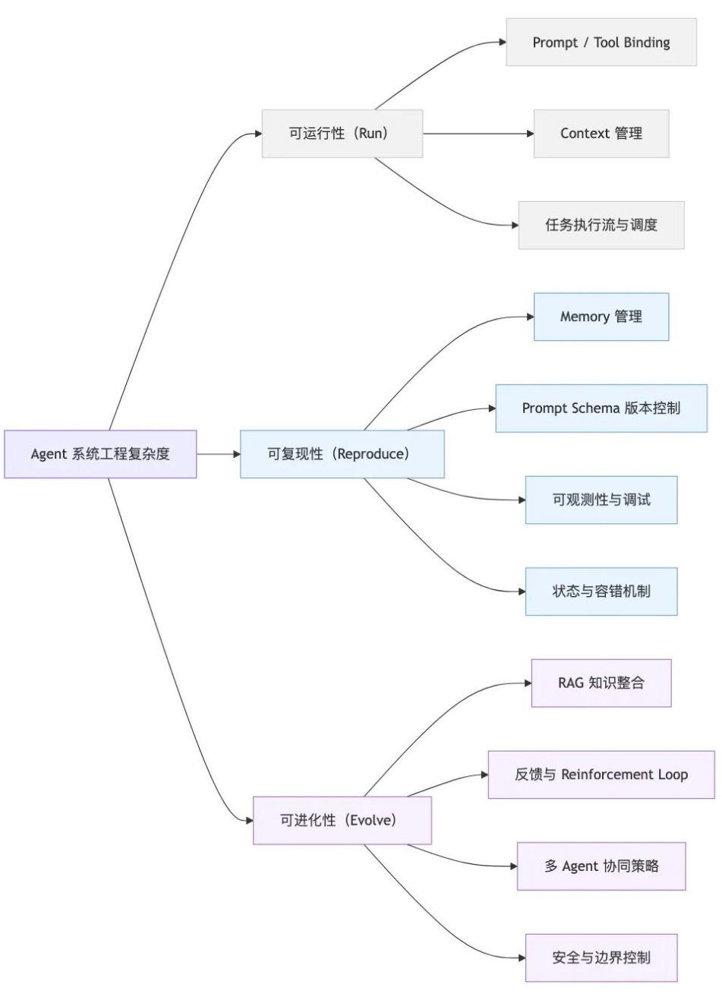

零散的经验：

- [AGI  掘金知识库 - 实践出真知：Agent领域经验分享](https://agijuejin.feishu.cn/wiki/VA8EwXqUFinkL1kmEPgcSIvGn4e)

幻觉问题：

- https://mp.weixin.qq.com/s/QKMqadee_oT1Jvza2lx7PQ：OpenAI新论文指出，语言模型出现幻觉的根本原因在于，当前标准的训练和评估程序更倾向于对猜测进行奖励，而缺乏对模型坦诚表达不确定性的奖励机制。

动态加载规则：

- 动态加载工具：略
- 动态加载规则：
  - 参考[parlant项目](https://github.com/emcie-co/parlant)，核心思想：[按需激活的规则系统](https://mp.weixin.qq.com/s/GZCReGhgjqde58T7Ntm0Xg)

项目实战：

- [C3仓库AI代码门禁通用实践：基于Qwen3-Coder+RAG的代码评审](https://mp.weixin.qq.com/s/jZPdxoeHFYg3PmUo33Dp8w)

> 参考：[阿里云 - 让Agent系统更聪明之前，先让它能被信任](https://mp.weixin.qq.com/s/vHVR1ldibtD1KSoKfra6vw)

作者以LangChain为例，提出了很多”利用框架一个Agent简单，但是设计出稳定的Agent难“的原因，或者说一些开发过程中经常忽略的模块，非常详细！

Agent 开发为何被误以为“简单”？例如：

- **被封装的复杂性：** LangChain只需几行代码就能创建一个Agent，但是几乎隐藏了所有复杂性：
  - prompt 拼装、调用链、上下文管理都在内部封装；
  - 但若任务出错（如 API 限流、工具失败），Agent 默认并不会重试或记录 trace。
- **被外包的复杂性：**在 LangChain 中，你可以快速添加“记忆”，但这只是短期记忆缓冲，它不会处理如下几点，当 Agent 规模扩大，memory的一致性与状态清理反而成了新的系统复杂度：
  - 旧信息冲突；
  - 多轮状态漂移；
  - 以及上下文过长导致的剪裁问题。

Agent 系统的三层复杂度：

