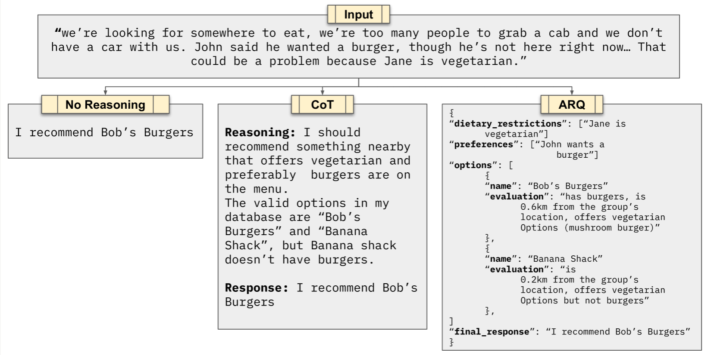

构建的智能体在对话中出现忽略提示词、幻觉反应等情况，这是Agent开发者的首要痛点。Parlant要解决的就是：停止与提示词做斗争、确保遵循原则。

常用于：*金融机构 • 医疗保健提供者 • 律师事务所 • 电子商务平台*


[博客：Parlant如何确保代理合规](https://www.parlant.io/blog/how-parlant-guarantees-compliance)

- 两个Agent的关键问题：
  - 失败频率、失败程度。
  - 你更愿意有一个99%准确的代理，但每100次对话中可能会有一次处理未经授权的1万美元退款，还是更愿意有一个85%准确的代理，但最糟糕的错误有时只是使用了稍微有些尴尬的表达方式？
- 五种AI偏差和非合规类型
  - 重点关注：跑题
  - 工作范围：误解上下文
  - 幻觉：错误或虚构的信息
  - 合规性：违反商业协议
  - 指示：忽略明确指示
- 新推出的模型固然会更稳定，但是不能从根本解决问题，我们需要一种架构，通过人类反馈有意识的驯服不确定性，这就是Parlant
- 两个概念：
  - 指南匹配方法
  - ARQs
- Parlant如何驯服不确定性
  1. Guidelines and Journeys: Comprehensive Behavior Control
     - Guidelines 通过条件-动作对为特定情况提供情境提示
     - Journeys 引导代理通过结构化对话流程，同时保持灵活性
     - 两者都由ARQs驱动
  2. Tool Calling Optimized for Conversational Apps
     - 工具调用的三点主要问题：上下文重叠、假阳性偏差、论证幻觉
     - Parlant通过上下文工具关联解决了前两个问题。工具与指南相链接，这意味着只有在关联的指南条件与对话上下文匹配时才会对其进行评估。
     - 多个附加创新：安全参数注释、工具参数缺失洞察
  3. Canned Responses and Strict Mode
     - 代理根据上下文起草流畅的回复（考虑指南、工具和对话历史）
     - 引擎检索并使用上下文字段替换渲染相关的预先批准的响应模板
     - 代理选择并发送最合适的标准回复
     - 如果不存在合适的匹配项，代理将发送可配置的无匹配回复


[专注推理查询（ARQ）本质上是内置于提示中的结构化推理蓝图](https://www.zdoc.app/zh/emcie-co/parlant/blob/develop/docs/advanced/explainability.md)，用于在 LLM 进行决策或解决问题时引导其遵循特定的思维模式。与期望 AI 智能体自然考虑所有重要因素不同，ARQ 为不同领域显式地规划推理步骤——就像配备了专业化的思维检查清单以供遵循。

ARQs 之所以能有效实施行为约束，关键在于它强制模型关注那些容易被忽略的关键考量因素。模型必须按照预设的推理阶段（如情境评估、解决方案探索、批判性分析和决策形成）逐步推进，确保在采取行动前始终评估重要约束条件。



如何将[ARQs](https://arxiv.org/abs/2503.03669)引入现有项目：

- 核心思想：在执行动作前，让模型先回答一系列小而明确的“检查问题”，再根据这些回答决定是否触发行为或调用工具。

- 示例代码（Python + OpenAI API）：

  ```
  import os
  from openai import OpenAI
  
  client = OpenAI(api_key=os.getenv("OPENAI_API_KEY"))
  
  def run_arq(user_message: str, arq_questions: list[str]) -> dict:
      """
      将用户输入和一组 ARQ 问题送入模型，输出结构化回答。
      """
      system_prompt = (
          "你是一个专注推理助手。"
          "请逐条回答以下问题，答案限定为“是”或“否”。"
      )
      questions_text = "\n".join([f"{i+1}. {q}" for i, q in enumerate(arq_questions)])
  
      response = client.chat.completions.create(
          model="gpt-4o-mini",
          messages=[
              {"role": "system", "content": system_prompt},
              {"role": "user", "content": f"用户输入: {user_message}\n问题:\n{questions_text}"}
          ],
          temperature=0
      )
  
      raw_answer = response.choices[0].message.content.strip()
      # 简单解析：假设模型按行输出“1. 是/否 …”
      answers = {}
      for i, q in enumerate(arq_questions):
          key = q
          if f"{i+1}" in raw_answer:
              answers[key] = "是" if "是" in raw_answer.splitlines()[i] else "否"
      return answers
  
  
  def refund_agent(user_message: str):
      # Step 1. 定义 ARQ 问题
      arq_questions = [
          "用户是否提到退款？",
          "用户是否提到物品未使用？",
          "用户是否提到物品已使用？"
      ]
  
      # Step 2. 执行 ARQ
      arq_result = run_arq(user_message, arq_questions)
      print("ARQ 判断结果:", arq_result)
  
      # Step 3. 决策逻辑
      if arq_result["用户是否提到退款？"] == "是":
          if arq_result["用户是否提到物品未使用？"] == "是":
              return "您可能有资格获得退款。"
          elif arq_result["用户是否提到物品已使用？"] == "是":
              return "很抱歉，已使用的物品通常不符合退款条件。"
          else:
              return "我需要更多信息，请问该物品是否已使用？"
      else:
          return "请问您需要什么帮助？"
  
  
  # 🔎 测试
  if __name__ == "__main__":
      user_inputs = [
          "我想要退掉这个还没拆封的耳机。",
          "我买的鞋子穿过了，可以退吗？",
          "你好，咨询一下售后。"
      ]
  
      for msg in user_inputs:
          print(f"\n用户: {msg}")
          reply = refund_agent(msg)
          print(f"Agent: {reply}")
  
  ```

  

单一代理还是多个代理？

- 这是一个常见的争议，Parlant的立场是两者的结合。
- 一般来说，当我们的解决方案类似现实世界时，管理复杂性更容易。
- 比如：
  - 如果我们正在与一个代理交谈，他们拥有我们对话的全部上下文。他们是连贯的。他们不会突然忘记或意外地改变对情况的解释。
  - 我们正在交谈的代理可能并不总是能帮助我们解决所有问题。我们可能需要转接到另一个擅长某些主题的代理。
  - 我们期待收到此类转移的通知。如果它们突然发生或我们没有意识到，我们认为这是粗心的客户体验。
- 您可以看到，从熟悉的、现实世界的使用模式中获得的见解如何帮助我们做出明智的设计决策。
- 这就是Parlant正式建议将AI代理建模为人类代理工作方式的原因。换句话说，如果在现实生活中的用例中看到它是一个单一的人格，那么在Parlant中它应该被表示为一个单一的AI代理。顺便提一下，Parlant对代理对话模型相关元素的过滤允许你在单个代理中管理相当多的复杂性，所以如果你担心这一点，就不需要采用多代理方法。
- [多智能体系统失败](https://arxiv.org/abs/2503.13657)：有一篇关于多智能体系统失败的有趣论文，尽管它们在模块化和专业化方面具有潜力。它强调了多智能体系统在协调、通信和一致性方面常常遇到的挑战，导致出现意外的行为和失败。这与Parlant使用单个智能体来维持对话中的连贯性和上下文的方法相一致。
