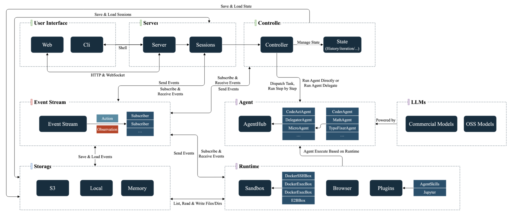
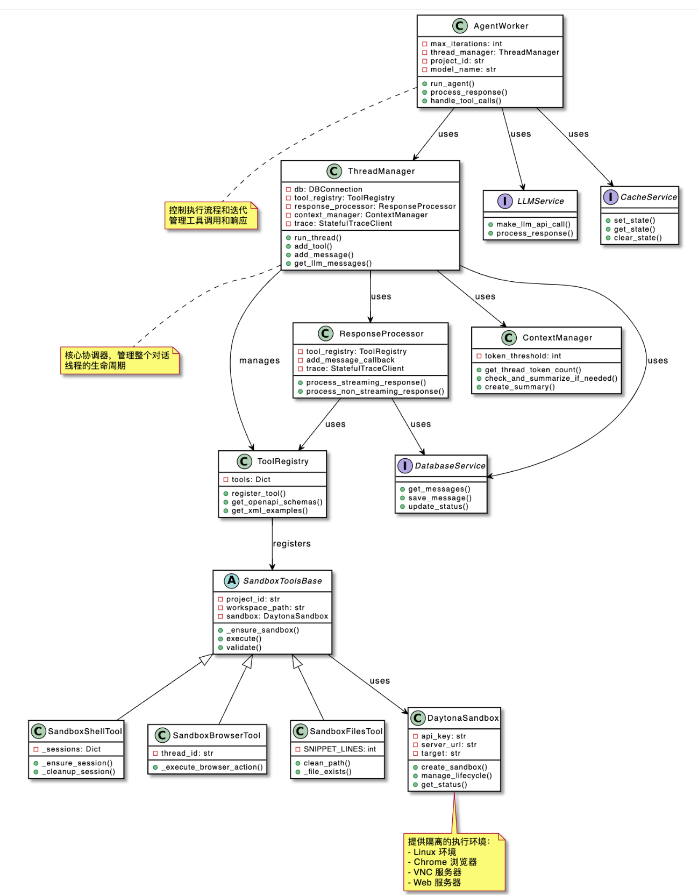
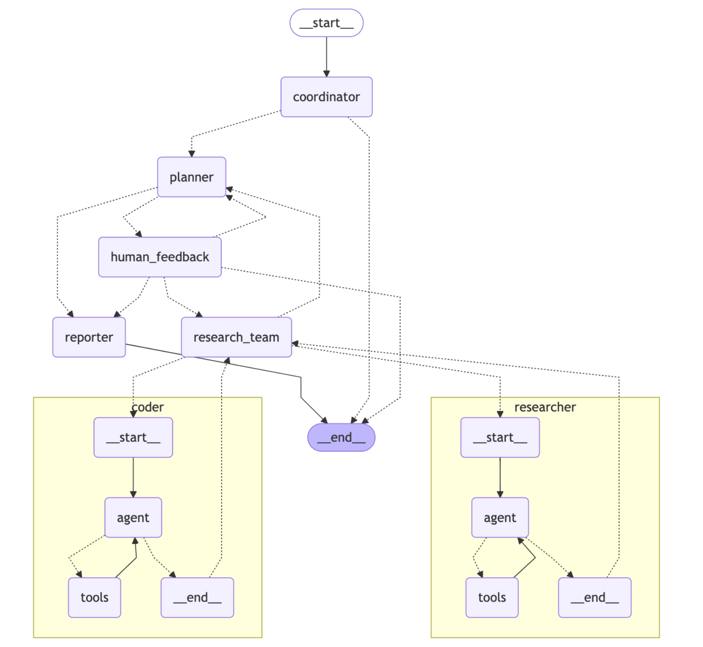
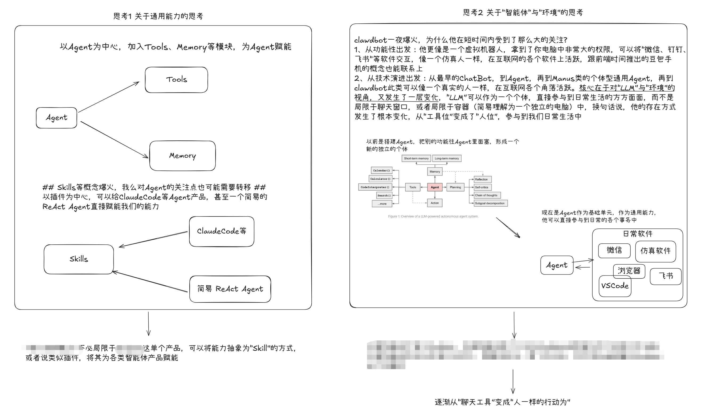

## 架构探究

### 核心内容

核心关注开源项目中的那些部分：

- 项目架构：架构图、技术栈
- Agent实现：OpenAI SDK？Langgraph？
- 多Agent实现
- Multi-Agent System中的上下文管理：结合常用框架、开源项目、业务场景，通常不该把所有上下文都共享，更稳妥/高效的做法是：**分层、按需、可控地共享**。
- 上下文工程
- 喜欢将哪些部分进行封装/抽象？

### 项目概述

OpenHands：原OpenDevin，对标软件助手Devin，Manus像是Devin的通用智能版

- 项目架构图：参考[架构图](https://github.com/All-Hands-AI/OpenHands/blob/main/docs/static/img/system_architecture_overview.png)
  
- Agent实现原理：
  - LLM抽象：底层为 `openhands/llm/llm.py` ，OpenHands使用litellm作为统一接口
  - 模型配置：通过`openhands/core/config/llm_config.py`定义了各类LLM的各类参数
  - 模型注册：在 `openhands/llm/llm_registry.py` 中，通过LLMRegistry管理不同的LLM实例
  - Agent实现：直接看`openhands/controller/agent.py`（Agent核心方法，如Prompt与Step）、`openhands/controller/agent_controller.py`（Agent控制组件）
- 是否涉及Multi-Agent：Delegation机制损坏，A2A没法确定上线时间
- 不同Agent之间的上下文关联：
  - 不同Agent之间并不是共享全部上下文，而是通过事件流实现有选择性的上下文共享 。
  - 委托Agent能够访问整个事件历史，但在实际处理中会根据需要（如通过Condenser）对历史进行筛选和浓缩。这种机制既保证了Agent协作时的上下文连续性，又避免了不必要的上下文过载。

- 上下文工程相关：暂未涉及上下文工程
- 特色：`vscode + runtime` 生态、成熟的前后端、丰富的源码设计

------

OpenManus：复现Manus的玩具

- 项目架构图：无，接近串行的执行各个模块
- Agent实现原理：基于OpenAI库，各个Agent本质均继承自`app/llm.py`中的`class LLM`
- 是否涉及Multi-Agent：项目存在多类Agent，但似乎不是自动调度，而是用户主动选择某一Agent模式
  - PlanningFlow：一个专门用于任务规划和执行的工作流管理器，它通过协调多个Agent来完成复杂任务。
    - 初始化 ( init )；
    - 执行器选择 ( get_executor )：默认使用Manus
    - 主执行流程 ( execute )：
      - 初始计划创建 ( _create_initial_plan )：了解项目中的各个Agent信息
      - 获取当前步骤信息 ( _get_current_step_info )
      - 执行步骤 ( _execute_step )：使用指定的执行器（代理）执行当前步骤
      - 其他：标记步骤完成 ( _mark_step_completed )、获取计划文本 ( _get_plan_text )、从存储生成计划文本 ( _generate_plan_text_from_storage )、完成计划 ( _finalize_plan )
  - Manus：一个多功能的通用Agent，具备使用本地和MCP（Model Coordination Protocol）工具的能力。PlanningFlow作为任务调度器，Manus作为主要执行者之一。
- 不同Agent之间的上下文关联：不同Agent之间 不共享全部上下文
  - 当执行特定步骤时，PlanningFlow通过 _execute_step 方法将当前计划状态作为上下文传递给执行该步骤的Agent `planning.py`
  - 具体实现方式是创建一个包含当前计划状态的提示文本，然后将其作为参数传递给Agent的 run 方法
  - 在执行每个步骤时，会将当前计划状态、进度和任务详情传递给负责执行的Agent，但Agent的内部状态（如完整的消息历史）不会自动共享给其他Agent

- 上下文工程相关：未涉及上下文工程
- 特色：项目架构和代码规范值得学习，agent等目录分类的非常清晰易懂

------

Suna：Manus名字倒过来

- 项目架构图：
  
- Agent实现原理：采用模块化架构
  - 参考`backend/services/llm.py`，由Litellm统一提供模型服务，`make_llm_api_call`函数提供了调用大模型的方法
  - 核心运行逻辑参考`backend/agent/run.py`中的`AgentRunner`
    - 由`ThreadManager`创建agent服务，在run函数中，有详细的agent初始化步骤，包含message的处理、基于`thread_manager.run_thread`与agent交互，具体参考`backend/agentpress/thread_manager.py`
  - 还有线程管理、工具系统等模块，略
- 是否涉及Multi-Agent：似乎没有，每个Agent都是单线程，且缺乏Agent之间的通信机制
- 不同Agent之间的上下文关联：无
- 上下文工程相关：参考context_manager.py 文件
- 特色：参考Manus

------

DeerFlow：跟Suna的DeepResearch似乎有关系

- 项目架构图：
  
- Agent实现原理：
  - 参考`src/llms/llm.py`知，大模型服务由langchian的各类库提供
  - 参考`src/agents/agents.py`知，agent由LangChain的create_react_agent创建
- 是否涉及Multi-Agent：采用流线型工作流（参考下方架构图），Readme中有详细描述
- 不同Agent之间的上下文关联：借助LangGraph的State机制，不同 Agent 之间 共享全部上下文
- 上下文工程相关：项目中实现了对文本内容进行压缩（缩短）和扩展（延长）的功能，这可以视为上下文工程的一部分：
  - src/prose/graph/prose_shorter_node.py ：实现了文本压缩功能，通过LLM将较长的文本内容缩短
  - src/prose/graph/prose_longer_node.py ：实现了文本扩展功能，通过LLM将较短的文本内容扩展
- 特色：DeepResearch参考架构、字节技术栈

## 待归纳

ClawdBot：为什么会一夜爆火

- 有人说这是玩具，我们给了他极大的权限和海量的Token，让他接入电脑的各个软件进行操作，但是并没有带来足够的生产力
- 有人说这是Manus换了个壳子，一个在虚拟机中，一个在真实电脑中，并无本质区别

