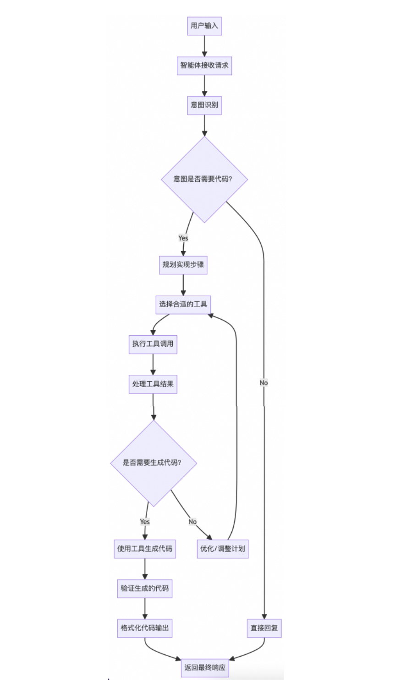

> 参考：[2025年12月29日 AI coding 智能体设计](https://mp.weixin.qq.com/s/8Dtj7ZSJAWSCoDnlCUKX3Q)

这篇文章系统地分析了AI coding智能体（特别是Gemini-CLI）的设计架构、工作原理和扩展能力，并探讨了规约驱动开发等最佳实践。

一、AI Coding智能体核心设计

1. 用户提示词预处理机制

- 命令识别：以`/`开头的提示词被视为命令，执行特定操作或替换为预置提示词
- 路径扩展：`@路径`语法自动读取文件内容作为上下文，减少会话轮次
- 多级命令系统：内置命令、MCP扩展命令、插件命令、本地自定义命令

2. 工具注册与调用架构

- 核心工具集：提供文件操作、代码编辑、Shell执行等基础能力
- MCP集成：通过Model Context Protocol集成外部工具和服务
- 子智能体封装：将复杂功能封装为工具，实现上下文隔离和高内聚设计

三、智能体工作流程

1. 意图识别与路由

- 基于提示词工程实现任务分类：简单任务直接处理，复杂任务路由到子智能体
- CodebaseInvestigatorAgent：专门处理复杂代码分析任务，使用只读工具

2. ReAct框架实现

- 主流程：Reasoning-Acting-Observing循环处理简单编码任务
- 子智能体流程：独立的ReAct循环，专注于深度代码分析

3. 记忆管理

- 压缩机制：当对话历史超过阈值时自动总结早期对话
- 长期记忆：通过`GEMINI.md`等文件保存项目上下文

四、提示词工程体系

文章详细解析了Gemini-CLI的提示词系统：

- 主系统提示词：定义智能体角色、工作流程、安全规范
- 记忆压缩提示词：指导模型高效总结对话历史
- 子智能体提示词：专门针对代码分析任务的指令集

五、扩展性设计对比

对比了Gemini-CLI和Claude Code的扩展能力：

| 扩展类型   | Gemini-CLI   | Claude Code        |
| ---------- | ------------ | ------------------ |
| 命令扩展   | TOML文件配置 | Markdown文件配置   |
| MCP集成    | 配置文件支持 | 专用命令管理       |
| 子智能体   | 实验性支持   | 完整支持           |
| Skills扩展 | 无           | 懒加载机制         |
| Hooks机制  | 无           | 完整的生命周期钩子 |

六、规约驱动开发模式

重点介绍了OpenSpec项目的spec-driven开发方法：

- **三阶段工作流**：提案创建→实施变更→归档处理
- **规范化流程**：通过严格的规范文件确保代码质量
- **AI助手集成**：为AI coding工具提供结构化指导

> 参考：[2025年12月24日 从CLI原理出发，如何做好AI Coding](https://mp.weixin.qq.com/s/QaE83XA6NQgyLXDP5n3n2w)

CLI的产品美学：为什么命令行工具重新流行？CLI遵循Unix哲学的“一切皆文件”和“实用主义”原则，通过终端统一访问系统资源，轻量、灵活且可组合。

CLI的技术原理：Single Agent架构与上下文工程

- 架构选择：以iFlow CLI为例，采用Single Agent而非Multi-Agent系统。 
  - 原因：Multi-Agent面临Agent间通信困难、流程僵化等问题，而Single Agent通过极致的上下文工程保持简单灵活。 
  - 核心组件：Control Loop + Chat Messages + Memory + Tools，通过SubAgent（作为特殊Tool）处理子任务。
- 上下文工程的5种方法： 持久化记忆（如用文件管理任务列表）； 隔离上下文（SubAgent独立处理子任务）； 召回上下文（结合向量检索、Agent搜索等技术）； 压缩上下文（对记忆进行有损或可回溯压缩）； 加强上下文（强调任务目标或环境变化）。

如何用好CLI工具进行AI Coding？

- 正确认知AI的定位
- 掌握Prompt/Context Engineering
- 合理划分任务边界
- 探索多智能体协作
- 建立团队协作机制
