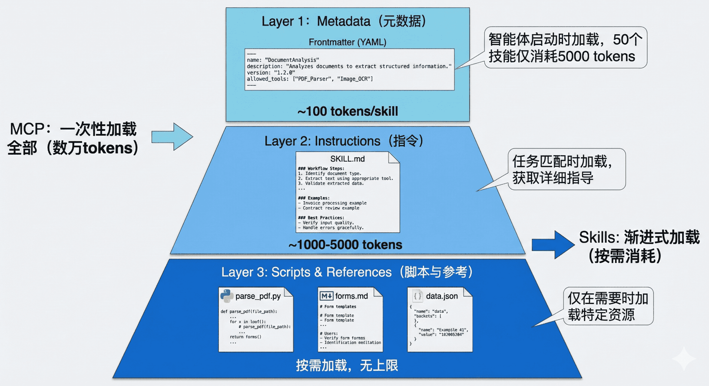

## 原理概念

> 参考：
>
> - [Claude Skills上线，却遭开发者集体吐槽](https://mp.weixin.qq.com/s/rdeBtXU5tvoZkz40rsUmAg)
> - [解析新 Claude Skills：模块化 AI 能力的技术架构设计与实践](https://mp.weixin.qq.com/s/h6d0PK7qwqDkbUiE2ASI_g)

Claude Skills 是一种“让 Claude 学会用工具”的新接口机制。Skills 本质上是一个包含指令、脚本和资源的结构化文件夹，Claude 能够根据任务需求动态加载这些资源。

从结构上看，一个Skill 就是一个文件夹（Folder），里面包含三样东西：

- 指令（Instructions） —— 告诉 Claude 该做什么、如何使用资源；
- 脚本（Scripts） —— 真正执行任务的逻辑，可以是可运行的代码；
- 资源（Resources） —— 模板、文件、品牌指南、数据模型等辅助内容。

Skills 如何工作？

- Anthropic 在工程博客中称这种机制为 Progressive Disclosure（渐进式披露）。
- 这意味着 Claude 不会一次性加载所有资源，而是按需调用，保证运行高效、安全。

> 参考：
>
> - [2025.12.15 Claude Skills｜将 Agent 变为领域专家](https://mp.weixin.qq.com/s/bwFGcomH6BfkBzhFMiiH1g)
> - [关于Agent Skills的详细总结来了](https://mp.weixin.qq.com/s/-wzXL3uzkhPCB0SF8Cq6eg)
>
> 一句话来讲，Claude Skills 是一种基于文件系统的、可复用的知识包，运行在 Claude 的沙盒虚拟机（VM）环境中，用于向 Agent 注入流程化、确定性的内部知识（SOP）的标准化方案**。**

MCP 的设计哲学是"上下文共享"。它不仅仅是一个远程过程调用协议，更重要的是它允许智能体和工具之间共享丰富的上下文信息。不过，你会遇到两个根本性的问题：

- 上下文爆炸：略
- 能力鸿沟：MCP 解决了"能够连接"的问题，但没有解决"知道如何使用"的问题。拥有数据库连接能力，不等于智能体知道如何编写高效且安全的 SQL

这正是 Agent Skills 要解决的核心问题。其概述：

1）核心设计理念

- 官方定义：智能体技能（Agent Skills）是一种模块化的能力，用于扩展 Claude 的功能。每个“技能”都封装了相应的指令、元数据和可选资源（例如脚本、模板）。当场景匹配时，Claude 会自动调用这些技能来完成任务。
- 一种标准化的程序性知识封装格式。
- 这种设计理念源于一个简单但深刻的洞察：连接性（Connectivity）与能力（Capability）应该分离。MCP 专注于前者，Skills 专注于后者。这种职责分离带来了清晰的架构优势：
  - MCP 的职责：提供标准化的访问接口，让智能体能够"够得着"外部世界的数据和工具
  - Skills 的职责：提供领域专业知识，告诉智能体在特定场景下"如何组合使用这些工具"

2）渐进式披露：破解上下文困境

- 这种机制将技能信息分为三个层次，智能体按需逐步加载，既确保必要时不遗漏细节，又避免一次性将过多内容塞入上下文窗口。
  
- 第一层 元数据（Metadata，即Skill 的名称、描述、标签等信息）：当智能体启动时，它会扫描所有已安装的技能文件夹，仅读取每个`SKILL.md` 的 Frontmatter 部分，将这些元数据加载到系统提示词中。根据实测数据，每个技能的元数据仅消耗约 100 个 token。这与 MCP 的工作方式形成了鲜明对比。
- 第二层 指令（Instructions，即Skill 具体的指令）：当智能体通过分析用户请求，判断某个技能与当前任务高度相关时，它会进入第二层加载，读取该技能的完整 `SKILL.md` 文件内容，此时，智能体获得了完成任务所需的全部上下文。
- 第三层 附加资源（Scripts & References，即Skill 附带的相关资源，比如文件、可执行代码等）：对于更复杂的技能，`SKILL.md` 可以引用同一文件夹下的其他文件：脚本、配置文件、参考文档等。智能体仅在需要时才加载这些资源。

3）渐进式披露的效果：从 16k 到 500 Token

- Skills 包装后：创建一个简单的 Skill 作为"网关"，仅在 Frontmatter 中描述功能，初始消耗仅 500 个 token
- 当智能体确定需要使用该技能时，才会加载详细指令并按需调用底层的 MCP 工具。

关于 Agent Skills 与 MCP 的区别与协作关系：

- 从工程视角理解差异：一个具体的例子，MCP 让智能体"能够"访问 GitHub，能够调用这些 API。但它不知道"应该"做什么。Skills 告诉智能体"应该"做什么。
- 上下文管理策略的本质差异
- 互补而非竞争：Skills + MCP 的混合架构

技术实现：

- SKILL.md 规范详解
- 编写高质量 Skills 的原则：精准的 Description、模块化与单一职责、确定性优先原则、渐进式披露策略

> 参考：
>
> - https://agents.md/
> - https://github.com/agentsmd/agents.md

简单来说，如果 `README.md` 是写给人类开发者看的，那么 `AGENTS.md` 就是写给 AI 编程助手（如 Cursor、Windsurf、GitHub Copilot、Claude Code 等）看的。

[AGENTS.md 详解：统一管理 AI Agent 的指令文件](https://www.youtube.com/watch?v=TC7dK0gwgg0) 这段视频深入浅出地解释了 AGENTS.md 的起源、它如何解决多 AI 工具配置混乱的问题，以及如何通过一个简单的 Markdown 文件让你的 AI 助手更聪明、更符合项目规范。

## 快速上手

参考：

- [极速开发出一个高质量 Claude Agent Skills 最佳实践](https://mp.weixin.qq.com/s/5hFHlItI3XQUWekejC_kiw)

TODO

## 应用技巧

> 参考：[Anthropic首次公开：Claude Skills的完整思考！](https://mp.weixin.qq.com/s/hhEfjRrJS5BZHlenRbL3uA)

**从专用智能体到通用智能体+技能**：

- 行业最初专注于开发针对特定领域（如编码、研究、金融）的专用智能体。
- 但随着模型智能提升，Anthropic发现更好的方式是让通用智能体（如Claude Code）通过代码作为通用接口处理各种数字工作，再通过Skills为其注入领域专业知识。

三大关键技术特点：

1. **渐进式披露**：通过YAML元数据（约50token）、SKILL.md核心文件（约500token）和references/详细文档（2000+token）三层结构，实现按需加载，避免上下文窗口过载。
2. **脚本作为工具**：用自文档化、可修改的代码替代传统工具，解决工具说明不清和上下文膨胀问题。
3. **技能生态系统**： **基础技能**：文档处理、电子表格等通用能力 **合作伙伴技能**：第三方服务集成（如Notion、Browserbase） **企业技能**：组织内部流程和专业知识封装
