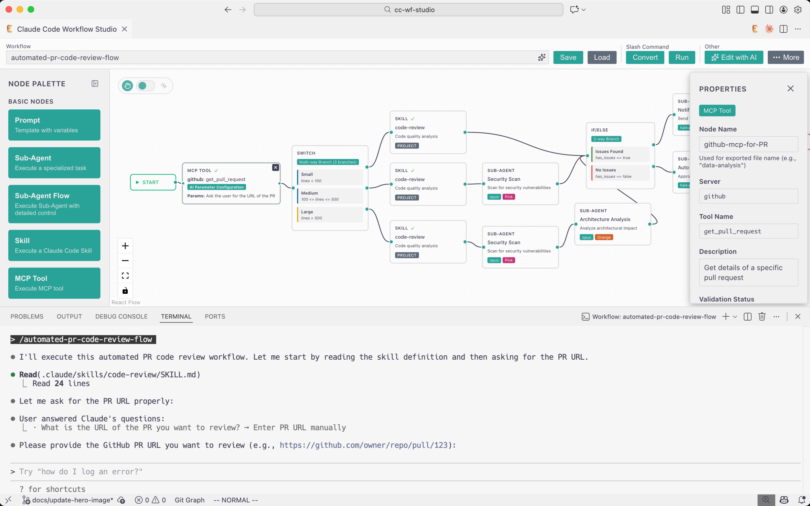
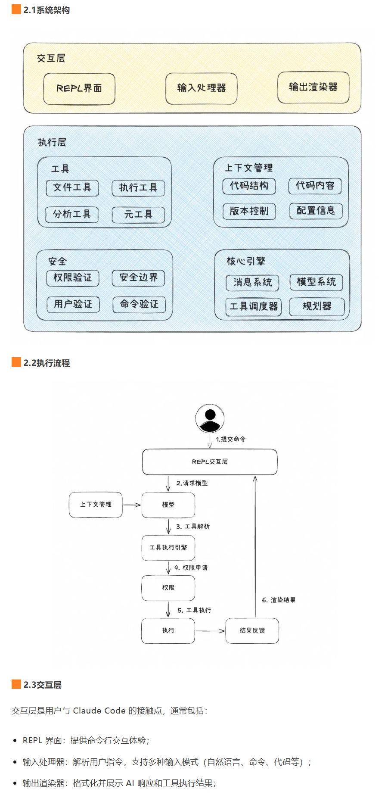
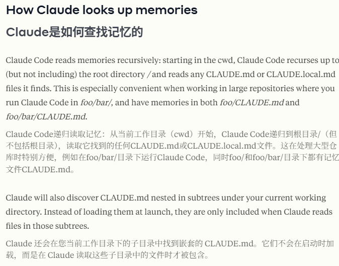
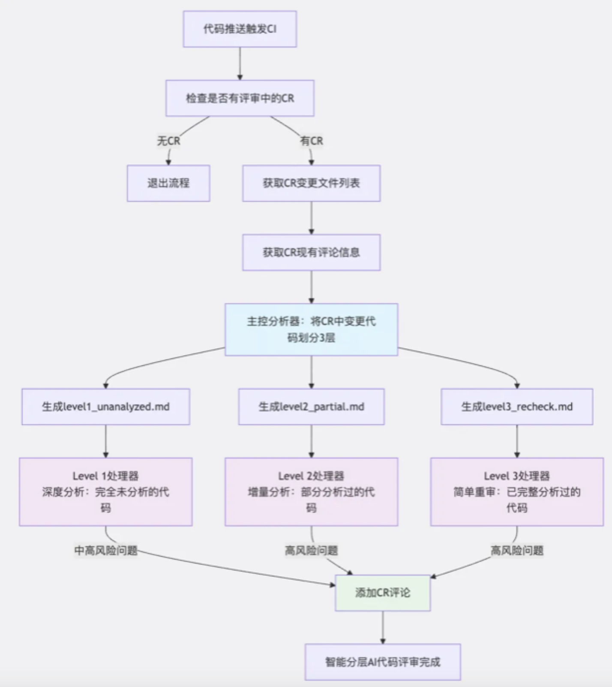

## 使用教程

### 部署

可以结合GLM使用，参考GLM官方教程以及一些大佬的博客：[claude code + GLM 4.6，保姆级配置教程](https://zhuanlan.zhihu.com/p/1957370685748938170)


## 架构概述

> 参考：2025.11开源 https://github.com/breaking-brake/cc-wf-studio




> 参考：[Claude Code 学习指南](https://zhuanlan.zhihu.com/p/1951644667348259262)

todo


> 参考链接：https://mp.weixin.qq.com/s/D1csjRwhljET95xmWaLq_A

该推文的核心观点：Claude Code 为什么如此好用？答案是，保持简单。

1）极简主义

- 一个主循环：
  - Claude Code 只采用单主线程、只保持一个主循环。
  - 对于层级任务，Claude Code 会生成自己的子智能体，但不允许子智能体继续生成更多子智能体。
  - LLM 本身已经很难调试和评估了，任何额外的复杂性（如多智能体、智能体切换或复杂的 RAG 搜索）只会让调试难度成倍增加。
- 用小模型处理所有事情
  - 超过 50% 的重要 LLM 调用都使用了 claude-3-5-haiku

2）完美Prompt

- 使用 claude.md 协作管理用户的上下文和偏好设置
- 特殊的 XML 标签、Markdown 和大量示例

3）工具

- 不使用RAG
  - Claude Code 检索代码库的方式与人类类似，采用真正复杂的 `ripgrep`、`jq` 和 `find` 命令。由于大语言模型对代码有深入理解，它能够通过复杂的正则表达式，精准定位几乎所有相关的代码块。有时，Claude Code 还会利用小模型读取整个文件。
  - RAG 在理论上听起来不错，但它带来了新的（更重要的是隐藏的）失败模式。比如，应该使用什么相似度函数？代码应该如何分块？
- 设计一个好的工具：
  - Claude Code 提供了低级（Bash、Read、Write）、中级（Edit、Grep、Glob）和高级工具（Task、WebFetch、exit_plan_mode）。
  - 这里的核心权衡在于：你期望智能体使用工具的频率，和它使用工具的准确性。Claude Code 经常使用 grep 和 glob，因此将它们作为独立工具是有意义的，但在特殊场景下，它也可以通过 bash 命令实现通用功能。同样，高级工具如 `WebFetch` 或 `mcp__ide__getDiagnostics`，能够非常明确地完成特定任务，这避免了 LLM 需要多次进行低级点击和输入操作。


> 参考链接：https://mp.weixin.qq.com/s/uq70MDj2BWJGtEGcrkuj-w

此推文主要从顶层的角度介绍了Claude Code，并没有详细讲述Agent工作的详细工作流等信息，不过针对上下文管理方面，值得学习。




## 系统Prompt

参考：

- https://github.com/x1xhlol/system-prompts-and-models-of-ai-tools/
- https://mp.weixin.qq.com/s/7yAgLn3FG9D9Co8CVhoH0A


## 上下文管理

### 概述

上下文管理是 Claude Code 的"记忆"，负责收集和组织代码相关信息：

- 项目结构：目录和文件结构
- 代码内容：关键文件的内容
- 版本控制：Git 历史和状态
- 配置信息：项目配置和依赖

上下文管理的挑战在于如何在有限的上下文窗口内提供最相关的信息：

- LRU缓存机制：对文件编码、行尾类型等信息实现缓存，减少重复操作。

文件缓存

```
const fileEncodingCache = new LRUCache<string, BufferEncoding>({
  fetchMethod: path => detectFileEncodingDirect(path),
  ttl: 5 * 60 * 1000,
  ttlAutopurge: false,
  max: 1000,
})

const lineEndingCache = new LRUCache<string, LineEndingType>({
  fetchMethod: path => detectLineEndingsDirect(path),
  ttl: 5 * 60 * 1000,
  ttlAutopurge: false,
  max: 1000,
})
```

- 按需加载策略：不会一次性加载整个代码库，而是根据查询需要智能加载相关文件 。

GlobTool.tsx

```
async *call({ pattern, path }, { abortController }){
    const start = Date.now()
    const { files, truncated } = await glob(
      pattern,
      path ?? getCwd(),
      { limit: 100, offset: 0 },
      abortController.signal,
    )
    const output: Output = {
      filenames: files,
      durationMs: Date.now() - start,
      numFiles: files.length,
      truncated,
    }
    yield {
      type: 'result',
      resultForAssistant: this.renderResultForAssistant(output),
      data: output,
    }
  },
```

- 结果截断处理：对大量搜索结果实现智能截断，避免上下文溢出，同时提供清晰的截断提示 。

lsTool.tsx

```
const MAX_LINES = 4
const MAX_FILES = 1000
const TRUNCATED_MESSAGE = `There are more than ${MAX_FILES} files in the repository. Use the LS tool (passing a specific path), Bash tool, and other tools to explore nested directories. The first ${MAX_FILES} files and directories are included below:\n\n`
```

- 拼装上下文

上下文拼装

```
async function getContext(): Context {
  return {
    directoryStructure: await getDirectoryStructure(),
    gitStatus: await getGitStatus(),
    codeStyle: await getCodeStyle(),
    // 其他上下文...
  };
}
```


### Subagents机制

> 参考：[阿里云 - Subagents：构建高可靠 AI Coding 专家顾问团](https://mp.weixin.qq.com/s/qd_3pdEzxMEqlgp_GiiaHg)
>
> Anthropic 原文：
>
> Subagents - Anthropic：https://docs.anthropic.com/en/docs/claude-code/sub-agents
>
> Slash commands - Anthropic：https://docs.anthropic.com/en/docs/claude-code/slash-commands

传统方案困境：

- 初始上下文过载与持续膨胀
- 主线污染与注意力分散
- 模型失焦与失忆效应


Subagents 是 Claude Code 引入的**一个改进 Context 管理功能**，用于特定任务的工作流程和改进的上下文管理。可以创建多个专精于特定领域问题的 Agent，组建一个 AI Coding “专家顾问天团”。当 Claude Code 遇到匹配的任务时，会自动或手动委托给相应 Agent 处理。


Subagents 有内置、用户、项目三个级别：

```
├── Built-in Agents
│   ├── agent-statusline-setup (configure the user's Claude Code status)
│   └── general-purpose (researching complex questions)
├── User Agents
│   └── ~/.claude/agents/*.md
└── Project Agents
    └── .claude/agents/*.md
```

官方规定的子代理（以Markdown存储）格式：

```
---
name: your-sub-agent-name
description: Description of when this subagent should be invoked
tools: tool1, tool2, tool3  # Optional - inherits all tools if omitted
model: sonnet  # Optional - specify model alias or 'inherit'
---

Your subagent's system prompt goes here. This can be multiple paragraphs
and should clearly define the subagent's role, capabilities, and approach
to solving problems.

Include specific instructions, best practices, and any constraints
the subagent should follow.
```


业务实践：[参考原文](https://mp.weixin.qq.com/s/qd_3pdEzxMEqlgp_GiiaHg)

-  原子化Subagents
- 串联多个Subagents形成Workflow
- 依赖管理Subagents
- 等等


一些思考：

- 为了干净的 Context 付出了**效率代价**：
  - 通过上下文隔离，Subagents 不会受到 Main Agent 已有对话或状态的影响；
  - 但代价是效率下降，Subagents 需要依赖前面步骤的结果，就必须再次获取这些信息；
  - 如果 Subagents 依赖前序链路的工作结果，最好通过文件保存在项目临时目录中，并在 Subagents 中做好显式的引用说明。
    - `需求分析 Agent` 把分析结果保存在`/tmp/implementation/`
    - `开发 Agent` 读取文件内容，进行开发。
    - 备注：如何理解“需求分析 Agent”和“开发 Agent”？（chatgpt的回答，待验证）他们都是Subagent，相互之间不共享对话上下文，保存在`/tmp/implementation/`的分析结果就是一个一个显式的“共享介质”——即把结果写到临时目录里，让后续 Subagent 显式引用。核心思想：1）上下文隔离 保证 Subagents 独立思考（避免“带偏”）。2）文件共享 保证 Subagents 能获取前序步骤的成果（避免“断链”）。
- Prompt、MCP、Subagents 怎么选：
  - 需要多阶段/需要角色隔离，用 Subagents


补充：




## 其他

### 代码索引

> 参考：[为什么Claude Code放弃代码索引，使用50年前的grep技术？](https://mp.weixin.qq.com/s/Fa15GoM3_2CUnjdHQ3I7Nw)

这种取舍并非一时兴起，而是一条**贯穿计算机科学 50 年的设计哲学，**从Unix管道到REST API，从MapReduce到Serverless， **无状态（Stateless）**设计在计算机历史上一次次证明了它的价值：通过放弃复杂的状态管理，系统获得了更好的可组合性、可靠性和可扩展性。

Claude Code 用 50 岁的 grep 放弃“智能索引”，本质是**用“无状态”换简单、确定、可组合、零维护**——在 AI 时代，反而成了更高级、更清醒的工程选择。下面，一步步解释这篇文章的含义。


一、首先解释两个关键词

代码索引（Code Index）

- **是什么**：把整份源码先“通读”一遍，抽出类名、函数名、变量名、调用关系等关键信息，做成一张**快速查找表**（倒排索引、向量数据库、语法树都行）。
- **目的**：让 IDE 或 AI 在毫秒级回答“这个函数在哪”“谁引用了它”“语义相近的代码有哪些”。
- **代价**：项目越大，建索引越慢（几分钟～几十分钟），占内存、占磁盘，还要持续增量更新；代码上传云端还可能带隐私风险。

grep

- **是什么**：1973 年随 Unix 诞生的**纯文本实时搜索**命令，毫无预处理，每次现场扫文件。

- **用法示例**：

  ```bash
  grep -R "processPayment" .
  ```

  意思：当场递归扫描当前目录下所有文本，把出现 `processPayment` 的行立刻打印出来。

- **特点**：零配置、零缓存、零持久化，**搜完就忘**，重启即归零。


二、文章为什么突然扯到“无状态”？

作者把“要不要预先建索引”拔高成了**“要不要在工具里保留历史信息”**——也就是计算机术语里的 **state（状态）** 问题。

- **有状态工具**（传统 IDE、Cursor、JetBrains）
  → 像“带记事本的管家”：先花时间去记代码长什么样，把笔记（索引）揣兜里，以后每次提问先翻笔记，答得快；但笔记会过期、占地方、要同步，管家换班还得交接。
- **无状态工具**（grep、Claude Code 的搜索）
  → 像“用完就扔的一次性打火机”：每次提问都重新现场翻文件，不记任何笔记；虽然每次都要重新找，但永远是最新、最确定、最轻巧，也永远不会因为“笔记错了”而翻车。

文章用大量篇幅回顾 Unix 管道、REST、Lambda Serverless 等例子，就为了说明：

> “放弃记忆”带来的简单、可组合、易并行、零维护，在历史上反复被证明是高阶智慧。


三、Claude Code 为什么甘愿“技术倒退”去用 grep？

1. **零等待**
   大项目首次打开不用“建索引等 5 分钟”，装完插件立刻能用。
2. **零运维**
   没有“索引损坏/过期/同步失败”这类后台故障；崩溃就重启，重启即满血。
3. **可预测 & 可调试**
   grep 行为纯线性，搜不到就是关键词不对，不会陷入“向量语义怎么又跑偏了”的黑箱 debug。
4. **隐私安全**
   代码不需要上传到云端做嵌入向量，从根本上杜绝“万一向量被反推”的泄露风险。
5. **Unix 哲学：工具要像乐高，而不是瑞士军刀**
   把“状态”交给数据库、Git、文件系统去管；搜索本身只做一件事——**现搜现给结果**，这样可以被用户随意拼接成更复杂的工作流，而不是捆绑成一个大而全的“智能黑盒”。


### 代码评审

> 参考：[适用所有团队研发提效｜带你1分钟上手基于Claude Code的AI代码评审实践](https://mp.weixin.qq.com/s/9seHYBOAfXCsD-WKiR9Bxg)

CR（Code Review，即代码审查），是一个系统性的过程，由一个或多个团队成员（通常是同事或高级开发人员）检查另一位开发人员新编写或修改的代码。

文章中以阿里CR面对的实际问题为引：

- 人工评审耗时较长，员工心力消耗大，可能会拖慢小组整体的研发节奏，同时也不一定保证能发现所有问题；
- 现有的代码分析、AI评审工具，也都存在一些经常发生的问题：误报多、分析不够深入、纠正意见不太实用等

进而分享一些解决方案：




### 基于LangGraph复现

参考：[阿里云 - CC&LG实践｜基于 LangGraph 一步步实现 Claude-Code 核心设计](https://mp.weixin.qq.com/s/cTi3Won0lsgAqY8gBG8ohw)

结合了CC的架构设计，基于LangGraph去复现，是一个很好的学习案例。


以下两个仓库对claude-code进行了全面的逆向分析，把相关逆向的提示词也开源了，我们完全可以通过这份repo来了解claude-code的核心实现。

1.https://github.com/shareAI-lab/analysis_claude_code

2.https://github.com/Yuyz0112/claude-code-reverse


### 基于Anthropic官方服务复现

参考：[Claude Code 没有秘密！价值 3000 万美金的 400 行代码](https://mp.weixin.qq.com/s/PTSSJAtuPt87OufGINYMgQ)

这篇文章提供的示例代码值得在本地进行调试和学习。
