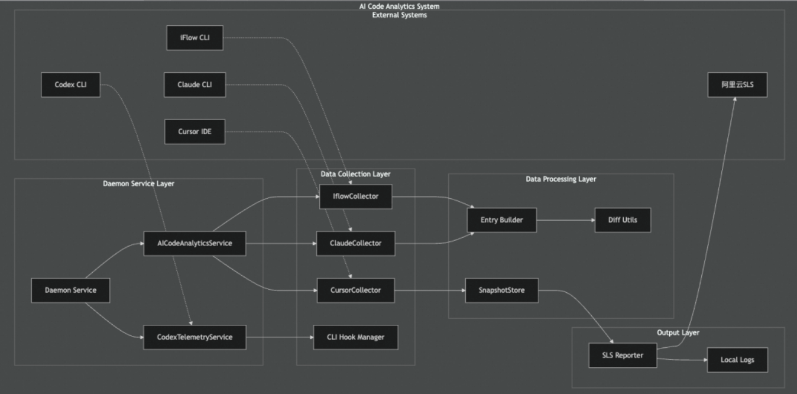

2025 年2月，前 OpenAI 研究总监 Andrej Karpathy 在社交平台上提出了“vibe coding”这个术语，形容自己“完全沉浸于氛围、拥抱指数级变化，几乎忘记代码本身存在”的开发状态。

“Vibe Coding”（“氛围编程”）是一种新兴的 **AI 辅助软件开发方式**，核心在于将传统的代码书写与语法剖析，转为用 **自然语言描述目标**，让 AI（通常是大型语言模型，LLM）生成、调整并迭代代码。这种开发流程强调对话、创造与快速反馈，适合快速原型、个人项目甚至非程序员使用。

概念介绍：[AI编程 Vibe Coding的原理是什么？](https://www.bilibili.com/video/BV15mMVzTEor)

- 修改文件：diff
- 获取IDE中相关信息：打开了什么文件等等信息
- 后台部署、数据库管理等上线问题难实现：MCP
- Prompt中写好一些模版

### AI Coding 参考文章

> 参考：[私域知识工程实战：如何让AI一次性写出高质量代码？](https://mp.weixin.qq.com/s/3gSg1CvX72Ib8tLpg-jSxg)

AI帮你完成了80%的基础工作，但剩下20%的精细调整反而比从零开始更耗时耗力。

AI助手类似于新员工，有技术基础和学习能力，但是对团队项目历史没有了解，那么如何写好代码呢？

三板斧：

- 用"代码解构与业务分析师Prompt"(后面有完整模板)，把你的工程代码、技术文档、业务文档都扔给AI
- 基于知识库的智能编程
- 私域知识的自动维护：再好的文档，如果不更新维护，也会很快过时，建立一个自动增量更新机制，让私域知识跟上代码和业务的变化。这里有两个关键动作（建立维护规范、自动增量更新）

拿走就能用的Prompt工具箱：

- 模板1：代码解构与业务分析师Prompt
- 模板2：开发专家Prompt
- 模板3：文档自动维护专家Prompt

### AI-native IDE

例如：

- [Trea](https://github.com/Trae-AI/Trae)：未开源，[已被逆向Prompt](https://github.com/x1xhlol/system-prompts-and-models-of-ai-tools/tree/main/Trae)，可参考<toolcall_guideline>、<tool_parameter_guideline>、
- [Trea-Agent](https://www.cnblogs.com/xiaoqi/p/18971235/Trae-Agent)：无有效信息
- [CodeGeeX4](https://github.com/zai-org/CodeGeeX4)：开源了提示词等内容，但是未涉及用户日志等内容
- [Cursor](https://github.com/cursor/cursor)：官方未开源架构。根据第三方的解析
  - [Cursor原理分析](https://uae6ktejd3.feishu.cn/docx/YD9vdMwydocIvvxJirWcJ3CSnif)：详细讲述了Agent架构
  - [深入解析｜Cursor编程实践经验分享](https://developer.aliyun.com/article/1668888?spm=a2c6h.24874632.expert-profile.46.30c17d13xL9Gwt)：
  - （存疑）cursor 的逻辑是，先将工程内的所有代码进行索引和向量化（Embedding），再之后你的所有提问都是基于整个工程给你答案，它会将你的提问结合整个工程的代码一起提交给 LLM
  - [复现项目](https://github.com/topics/cursor-ai)：
    - https://github.com/yeongpin/cursor-free-vip

总结：各个AI-native IDE均未开源架构，似乎只能通过Github上开源的复现项目来学习相关架构。

部分框架的原理解析单独写在当前README同级目录了，下面是部分暂未整理的内容。

#### Trea

> 参考 - 全球人工智能开发与应用大会 - 字节Trea编辑器：[2025陈仲寅-打造可扩展的生态体系：从+MCP+到+Agent+集成的实践与趋势.pdf](https://github.com/echonoshy/cgft-llm/blob/master/conferences/AICON-2025/%E9%99%88%E4%BB%B2%E5%AF%85-%E6%89%93%E9%80%A0%E5%8F%AF%E6%89%A9%E5%B1%95%E7%9A%84%E7%94%9F%E6%80%81%E4%BD%93%E7%B3%BB%EF%BC%9A%E4%BB%8E+MCP+%E5%88%B0+Agent+%E9%9B%86%E6%88%90%E7%9A%84%E5%AE%9E%E8%B7%B5%E4%B8%8E%E8%B6%8B%E5%8A%BF.pdf)

概要内容：

- 介绍了从基础Agent到IDE Agent架构的进化，以及IDE Agent工作时的工作流程。
- 工具集的搭建、复用及tokens线性增长问题。
- Multi-Agent Syetem、Workflow等多形态，共同协作来达到目标。

> 参考：[揭秘字节 TRAE：AI 原生 Coding Agent 的工程化架构与实战落地](https://mp.weixin.qq.com/s/SpWWVQlKbXvgxI90z67vaw)

似乎没有实质内容

### 数据采集

> 参考：[2026.1.9 告别碎片化日志：一套方案采集所有主流 AI 编程工具](https://mp.weixin.qq.com/s/91Dg5N35Lk1N_WTw78wGdg)

背景：随着AI编程助手（如Claude Code、Codex、Gemini等）的普及，开发团队面临数据分散、平台支持弱、度量缺失等问题，团队提出一套轻量化、无侵入、可扩展的采集方案，可以采集各大主流AI变成助手的日志（原文给出了对应的**数据采集架构图**）

技术架构：系统分为三层

1. **采集层**： **CLI工具**：通过Hook脚本（Bash/PowerShell）拦截工具执行事件，异步写入本地日志。 **IDE工具（如Qoder）**：解析其历史快照文件（SQLite数据库）重建代码变更。 **Telemetry工具**：配置遥测输出路径，过滤并解析日志。 **OTLP协议**：支持Codex等工具的OpenTelemetry数据接收。
2. **处理层**：将异构数据转换为标准事件格式（如统一diff结构、文件路径归一化）。
3. **上报层**：批量上报至阿里云SLS日志平台，支持错误重试。

核心指标

- 定义**AI生码率（AGCR）**：`AI有效提交行数 / 分支Diff总行数 × 100%`，用于量化AI代码采纳率。

### Others

> 参考：[蚂蚁集团-CodeFuse系统，旨在实现从产品需求文档（PRD）到代码的端到端自动生成](https://mp.weixin.qq.com/s/msk1rLwcVsISfNJiTbZZag)

核心挑战：归纳的非常真切

- **代码资产复杂**：现有代码库庞大（数十万行），结构混乱（废弃代码、兼容逻辑多），AI难以理解深层逻辑。
- **业务理解困难**：安全业务背景复杂，AI无法穿透代码表象理解业务语义，导致需求理解偏差。

解决方案：实现最终的AICoding能力

- ***\*构建AICoding标准workflow，实现端到端逐步生码：\****围绕完整的生命研发周期，从prd出发，经过标准化系分、上下文知识扩充、需求拆解等阶段，最终结合安全自定义规则，逐步生码。
- ***\*扩充模型上下文，增强对仓库历史知识的理解能力：\****将数据从业务、通用、规范等维度结构化，基于RAG和知识图谱的能力，逐步增强模型生码需要的背景知识内容。
- ***\*沉淀流程数据，评测能力效果，不断优化AI生码质量：\****为了优化生码质量，不仅需要对各阶段模型能力制定评测benchmark，优化agent能力；同时将生码过程数据逐步沉淀，扩充知识库和知识图谱内容，增强知识召回能力，保证召回数据质量。

详细方案：

1. **构建AICoding标准化流程**

- •**步骤**：PRD → 标准化系分 → 上下文知识扩充 → 需求拆解 → 分层生码。
- •**关键创新**：•**自动生成系分**：通过Agent生成标准化系分文档，补充业务流程、状态机、高可用要求。•**需求拆解**：将需求拆解为原子化子任务，平衡复杂度和数量。•**分层生码**：按MVC分层生成代码，避免Token超限和上下文遗忘。

2. **增强模型上下文理解能力**

- •**RAG检索**：从业务Wiki、代码Wiki等结构化知识源检索信息，优化准确率（如实体提取、分应用召回）。
- •**知识图谱**：简化图谱结构（节点从10亿+降至100万+），提升召回完整性。
- •**模型训练**：•**持续预训练**：基于Qwen模型学习业务知识。•**强化学习**：训练模型在拆解需求时自动考虑三板斧、鲁棒性等要求。

3. **规范化与评测体系**

- •**生码规范**：为不同仓库定制项目规范（如`.project_rule`），确保架构兼容。
- •**自动Review**：生成需求实现度报告，降低人工CR成本。
- •**动态更新知识库**：沉淀生码过程数据，持续优化知识库和图谱。
- •**多维度评测**：覆盖知识召回率、需求拆解准确性、端到端生码质量。

成果与案例：

- **数据指标**：•CodeFuse用户提交代码的AI占比达**43.25%**，全量提交AI占比**36.01%**。
- •**典型案例**：1.**审理平台**：AI生成近2万行代码，实现需求管理全流程。2.**智能UI助手**：生成3000+行代码，采纳率超70%。3.**一键接入二方包**：自动生成熔断、压测等场景代码。

> 参考：[从代码生成到自主决策：打造一个Coding驱动的“自我编程”Agent](https://mp.weixin.qq.com/s/-BvGnwEbgrFknZ6I-pYfjw)

**一、核心理念与目标**

文章提出并实践了一个核心思想：既然大语言模型（LLM）能生成高质量代码，那么可以更进一步，让它编写并运行代码来控制Agent自身的行为。这使得Agent不仅能进行简单的线性响应，还能通过代码实现分支、循环等复杂逻辑，进行自主决策。

**二、系统架构设计**

该系统在经典的ReAct Agent模式上进行了深度优化，其技术架构的核心特点包括：

1、代码驱动与泛化调用：摒弃传统的JSON组装调用方式，基于Py4j实现“代码+泛化调用”机制，显著提升了工具调用的灵活性和执行效率。

2、后端与技术栈：采用Spring Boot构建后端，整合Spring AI及Spring AI Alibaba生态进行模型接入。

3、多模型策略：根据场景选用最优模型，例如低延迟任务用Qwen3-Turbo，代码生成用Qwen3-Coder，通用场景调用多方模型。

4、协议与生态：底层工具采用Mcp协议补充业务能力，基于A2A协议实现多Agent（Multi-Agent）架构以高效协作。

5、工程支撑：通过内部评测和观测平台实现全链路的评估与监控。

**三、核心功能模块**

1、记忆系统

2、上下文与提示词工程

3、代码驱动与执行：这是系统的核心创新。

- Python执行引擎（Java侧）：在Java中通过管理Python进程来执行代码，具备异步执行、生命周期管理、超时控制和资源隔离能力。
- 工具包桥接（Python侧）：通过Py4j建立Python与Java的通信桥梁（Toolkit Bridge），使得Python代码能像调用本地函数一样异步调用Java实现的工具包。
- 运行参数捕捉：通过装饰器捕捉Python函数执行时的局部变量，序列化后存储，以便在后续对话轮次中恢复上下文，实现状态持久化。

4、功能区设计

5、工具包体系

