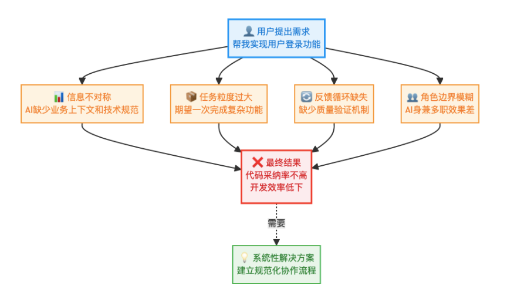
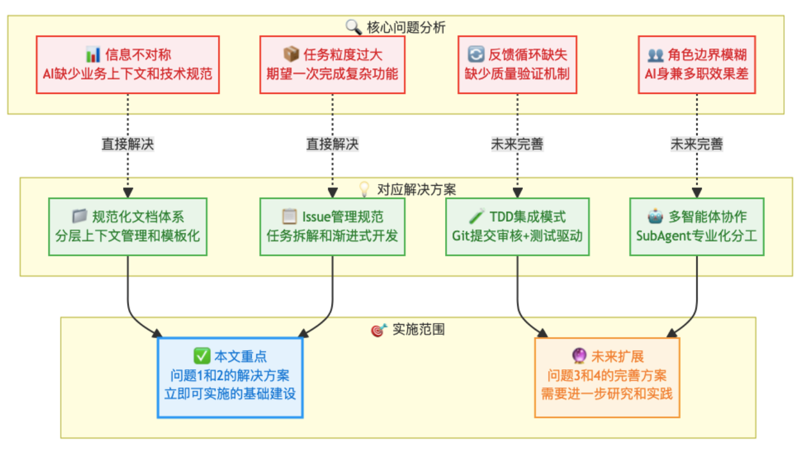

## 使用经验

> 参考：[20260123 - AI编码实践：从Vibe Coding到SDD](https://mp.weixin.qq.com/s/W6-e-uSPcGCqQAXxx_PDgA)
>
> 最近SSD这个词经常出现

团队经历了四个主要阶段：

1. **代码智能补全与单方法改写**：初期使用AI工具进行代码自动补全和简单重构，虽提升局部效率（减少70-80%键盘输入），但暴露出**缺乏整体业务理解**和**上下文感知**的局限。
2. **Agentic Coding探索**：通过详细提示词（Prompt）让AI实现完整功能，显著提升开发效率。但生成代码**风格不一致、延续性差**，且质量高度依赖开发者编写Prompt的能力。
3. **Rules约束引入**：通过建立规则文件（.aonerule）固化项目规范、架构模式和领域知识，有效解决了代码一致性问题，并大幅提升团队协作和Code Review效率。
4. **SDD（规格驱动开发）探索**：以自然语言规格（spec.md）为唯一真理源，驱动代码、测试和文档自动生成。虽在**一致性、可测试性和可维护性**上表现优异，但面临**规格编写门槛高、工具链不成熟、与历史代码集成困难**等挑战。

> 参考：[20260114 - 一文讲清Skill，子代理和MCP](https://mp.weixin.qq.com/s/eTucbJTv6jl9n4gogMOapA)

- **上下文窗口并不相同**。Claude Code提供稳定的200K token。Cursor因内部保护机制，实践中常截断至70-120K
- **Skills（技能）** 教会Claude你的特定工作流。通过在`~/.claude/skills/`下创建带有YAML frontmatter和Markdown指令的`SKILL.md`文件实现
- **Subagents（子代理）** 为复杂任务提供隔离的上下文（每个都有独立的200K窗口）。通过委托和摘要进行通信，而非共享上下文。
- **MCP连接器**消除上下文切换。连接GitHub、Slack、数据库等，将多标签页工作流整合为一个连续会话
- **这些功能会产生复合效应**。Skills编码模式，Subagents处理子任务，MCP连接服务。它们共同构建了一个随使用而不断改进的强大系统

> 参考：[202601 - 2百万人围观的Claude Code 实战使用指南](https://mp.weixin.qq.com/s/-PaH-JKbeVATVEbSoNIGEg)

- **先思考，后动手。** 规划比直接开聊能产生好得多的结果
- **CLAUDE.md 是你的杠杆点。** 保持简短、具体，解释原因，并持续更新。这个文件影响每一次交互
- **上下文在30%使用率时就开始退化，而不是100%。** 使用外部记忆，限定对话范围，并善用“复制-粘贴重置”技巧
- **架构比任何事都重要。** 你不能跳过规划。没有预先思考结构，输出就会很糟糕
- **输出源于输入。** 如果你用好模型得到坏结果，是你的 Prompt 需要改进。提升你的沟通能力
- **实验工具和配置。** MCP、钩子、斜杠命令。如果你是付费用户，把所有功能都试一遍
- **卡住时，改变方法。** 不要陷入循环。清空、简化、展示、重新构思
- **构建系统，而非一次性任务。** 利用无头模式、自动化，并随时间记录和改进。

> 参考：[AI结对编程核心思维模型](https://mp.weixin.qq.com/s/mSd5ZQAb010FToZmFS5Lxw)

主要描述了沟通表达代沟（表达的问题）和代码质量失控（测试与回滚）

> 参考：[与Cursor结对编程，掌握这个方法效率起飞！](https://mp.weixin.qq.com/s/88iwKK9sryCket4F2MjjcQ)

个人实践下来，发现 **PDCA** 是个挺有效的方法：

- 定义：**PDCA = Plan（计划）- Do（执行）- Check（检查）- Act（处理/标准化）**，循环往复实现持续改进。

- 目的：以数据驱动、低风险的小规模试验验证改进行动，沉淀为标准，再进入下一轮升级。

- 在需求交付中，**把目标拆到尽可能小的确定的独立任务**，明确达成路径，再基于每个小任务和 AI 结对编程，如此循环，将 AI 的黑魔法变成稳定可靠的生产力。

- **不同场景下的AI实践**：大致可以分成三大类，**生产交付**、**快速验证**、**实验探索**

- 一些别的实用技巧（挺不错的）

  

> 参考：[Claude Code、Cursor、Codex 的 11 条开发神技](https://mp.weixin.qq.com/s/3Kjsxr1BeSVRPVZXfqYb_g)

相比于宏观的讲述这些工具的使用思路，这篇文章提出了几个具体场景的解决思路，值得参考。

> 参考：[一万两千字，教你用ClaudeCode，解锁10倍生产力。](https://mp.weixin.qq.com/s/7Il5PRVMaiScL4gnAy62Vg)

todo

> 参考：[一套通用的、结构化的AI编程协作方法论](https://mp.weixin.qq.com/s/wxU8oBB60GaL0tZpeUeJxQ)

**1、四要素Prompt**

- **角色 (Role):** 你是谁？我告诉它：“你是一位精通Go和AI Agent的资深软件架构师。” 这为我们的对话设定了专业的基调和视角。
- **任务 (Task):** 你要做什么？我明确指出：“你的任务是分析ReAct Agent的核心实现逻辑，并生成一份技术梳理文档。” 这定义了成功的标准。
- **背景 (Context):** 你为什么要做这件事？我补充道：“这份文档将作为内部知识库的核心内容，帮助团队快速上手。” 这让AI理解了最终的价值。
- **约束 (Constraints):** 你要如何交付？我给出了具体的格式要求：“文档必须包含流程梳理、接口文档和Mermaid流程图三个部分。” 这确保了输出结果是我想要的，而不是一堆无用的闲聊。

**2、拥抱结构**

- 感觉式编程（Vibe Coding）。它的诱惑极大，你只需要向AI许愿，然后复制代码，粘贴，运行。如果出错了，就再许一个愿：修复这个bug。
- 但实际上很有可能 AI 给你写了一个不知道靠什么 Bug 运行成功的神奇系统。而在这个过程中，你只动了嘴，没动脑子，能力并无半分长进。
- 在阅读Claude Code最佳实践后系统化总结的方法，**勘探 → 规划 → 建造 → 验收**。
- **第一阶段：勘探 (Explore)**：在写任何代码之前，我和AI必须就问题和现有环境达成共识。提出要求，比如：“阅读这些文件，理解当前用户认证的逻辑，但先不要写任何代码。”
- **第二阶段：规划 (Plan)**：要求AI提出一个详细的实现计划，并鼓励它思考不同方案的优劣。有时，我甚至会把同一个问题抛给不同的AI模型，像是在听取多个技术顾问的建议。最终，我会选择并敲定一个最优方案。一个有效的技巧是，让这份计划以技术文档或GitHub Issue的格式输出。
- **第三阶段：建造 (Code)**：核心原则是：**小批量、可验证。**原则上，我进一步增加了"自动化"和"并行化"两个维度——拆分任务后，可以启动多个AI实例并发处理独立模块。我绝不会让AI一次性生成整个功能。我会按照规划好的任务列表，让它一个函数、一个模块地生成。这种小步快跑的反馈循环，极大地降低了出错的风险。
- **第四阶段：验收 (Commit)**：我会让AI辅助我完成收尾工作：生成规范的提交信息，更新相关的文档。更重要的是，我会让它扮演一位苛刻的“代码审查员”，对即将提交的修改进行一次预审，检查是否存在潜在的逻辑漏洞或风格问题。这相当于在正式交付前，进行了一次高质量的内部质检。

**3、重新思考“效率”**

- 来回地与AI讨论、确认，真的比我们自己撸起袖子直接写代码更快吗？
- “每分钟敲出的代码行数”这是一种虚荣且危险的指标。真正的效率，是**交付一个健壮、可维护的解决方案的总时长。**这个时长，不仅包括了写代码的时间，更包括了调试、返工、以及未来维护的隐性成本。
- **我们实际上是用高质量、高确定性的设计时间，替换掉了低质量、充满不确定性的纠错时间。**我们把原本会被浪费在修复bug上的精力，投入到了更有价值的活动上
- 这才是与AI协作的精髓。你不是在和它比谁打字快，而是在**利用它来外包你的认知负担，让自己能更专注、更深刻地思考。**

**4、一个决策框架**

- 到目前为止，我们已经建立了一套可靠的结构化协作流程。如何建立一个决策框架，来智能地选择与AI的协作模式。
- 基于经典的四象限思维模型，结合AI协作场景，我创新性地提出了以下决策框架。经过不断的实践，我发现，决定我们应该如何与AI协作的，是两个最古老的项目管理维度：**重要性**和**紧急性**。它们构成了一个简单的四象限模型，可以帮助我们在几分钟内，为任何任务选择最合适的协作模式。

> 参考：[如何将 AI 代码采纳率从30%提升到80%？](https://mp.weixin.qq.com/s/042Nwu3IfX9cm3XjhtRfiA?scene=1&click_id=6)

作者针对当前没法让AI写出可落地代码的情况，进行了分析：

- 首先，先对比一下传统软件开发流程与当前AI编程的现状，总结了Vibe Coding中的问题：
  
- 接着针对上述四个问题针对性的提出解决方案
  
- 最后结合Claude Code进行实践，并总结心得

## 拓展

> 参考：[2026.1.10 从 ReAct 到 Ralph Loop：AI Agent 的持续迭代范式](https://mp.weixin.qq.com/s/zMnIrokMvdNI6gW-33-6xQ)

核心问题与解决思路

- 痛点：传统 AI 编程工具存在 过早退出（AI 主观认为任务完成即停止）、单次提示脆弱（复杂任务需反复人工干预）、重新提示成本高 和 上下文断裂 等问题，本质是 LLM 的自我评估机制不可靠。
- 解决思路：通过 Ralph Loop 强制 AI 持续工作，直到任务达到客观可验证的完成标准，而非依赖模型的主观判断。

Ralph Loop 的核心机制

1. 循环结构： 通过极简的 Bash 循环（如 `while true; do cat PROMPT.md | claude-code; done`）反复输入同一提示，使 AI 能基于外部状态（如文件系统、Git 历史）持续迭代。
2. Stop Hook 拦截： 当 AI 尝试提前退出时，Stop Hook 会拦截退出信号，检查是否满足完成条件（如输出特定标记 `<promise>COMPLETE</promise>`），未满足则重新注入提示，形成自我参照的循环。
3. 三要素保障： 明确的任务与完成条件（如测试覆盖率 >80%） Stop Hook 防止提前退出 最大迭代次数（如 `--max-iterations 50`）作为安全阀。

工具生态支持

- Claude Code 通过官方插件集成 Ralph Loop 功能。
- LangChain/DeepAgents、Kimi-cli、AI SDK（JavaScript） 等主流框架均提供类似模式支持。

