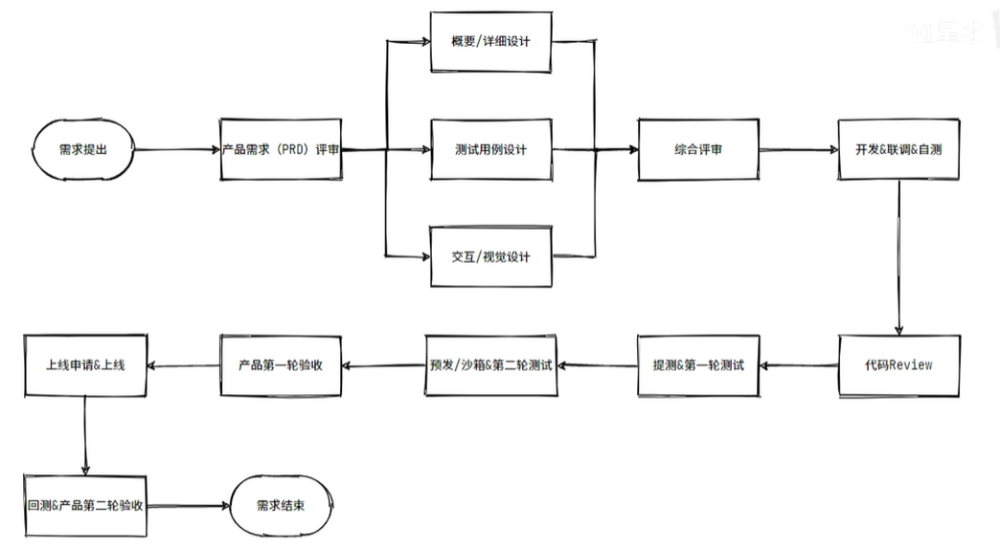
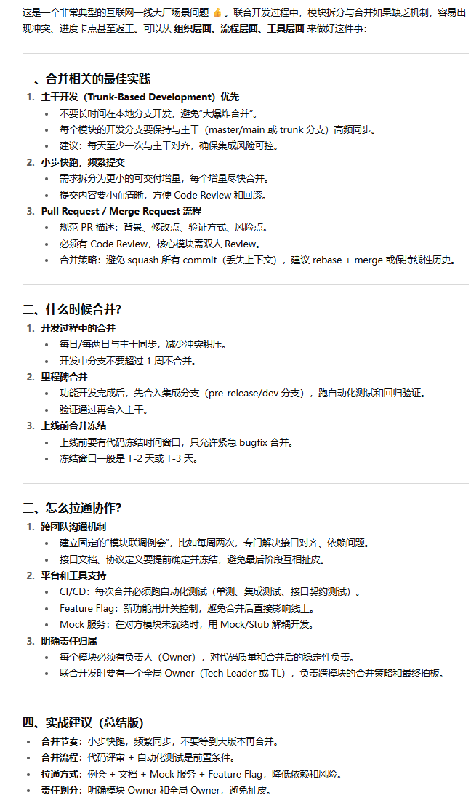

## 研发流程

参考：

- https://www.bilibili.com/video/BV1cf4y1x7HA
- https://www.bilibili.com/video/BV11q4y1T7kY

公司体量和需求不同，流程也不同，人员如下：

- PM：Product Manager 产品经理
- RD：Research & Developer 研发工程师
- QA/TE：Quality Assurance/TestEngineer 测试工程师
- OP：运维人员
- 等等

参考流程如下：

1. 需求分析：某人提出需求，全员讨论需求，增删改查后给出最终需求
2. 设计阶段：RD先设计代码（架构设计、概要设计、原型图设计等），之后所有RD讨论出最终实现方案
3. 研发阶段：研发准备阶段（确定技术栈、资源申请）、开始研发、编写单元测试用例、联合测试
4. 测试阶段：QA进行测试、PM验收是否符合产品预期
5. 提交上线：（CI/CD）提交Git分支、审查、合并分支、上线功能
6. 迭代优化：上线后根据需求改Bug

详细流程参考图：

其他参考：

## CI/CD

参考：

- [上线规范，发版上线流程｜分级发布、灰度发布｜CICD 流水线、CPU、内存、Panic、Fatal](https://www.bilibili.com/video/BV1FDjUzhEJQ)
- [1小时教你快速入门GitLab CI/CD，再也不怕被老板骂了](https://www.bilibili.com/video/BV11t4y147CJ)

