视频链接：

- https://www.bilibili.com/video/BV1dHWkewEWz

## Part1. LLM components

语言模型的三要素：Data数据、Compute算力、AIgorithm算法

### 1、Hardware

硬件方面未来发展/Hardware：

- 带宽：分布式、水冷、光纤等等
- 内存

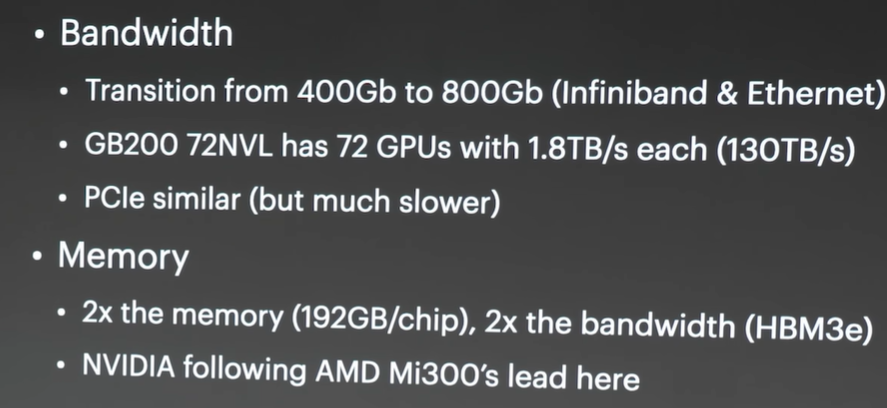

 算力：耗电、价格

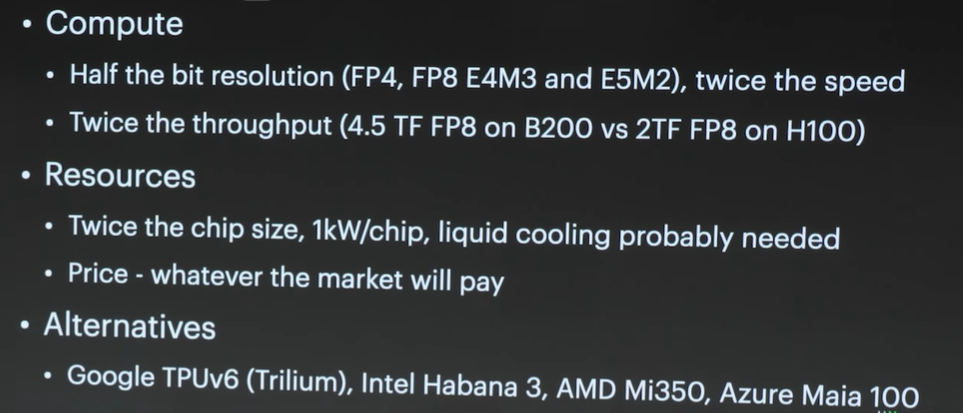

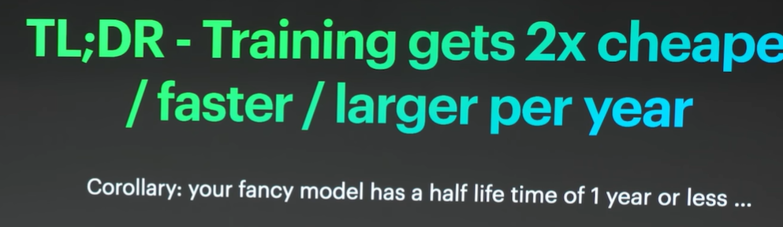

### 2、Models

在各个方面：

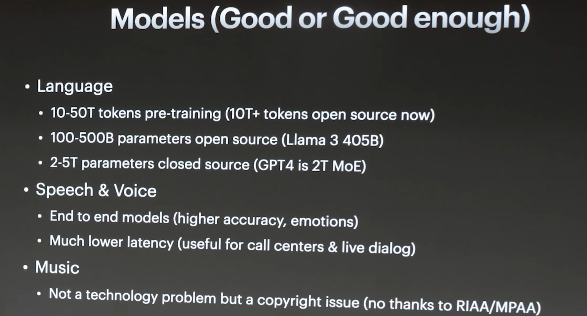

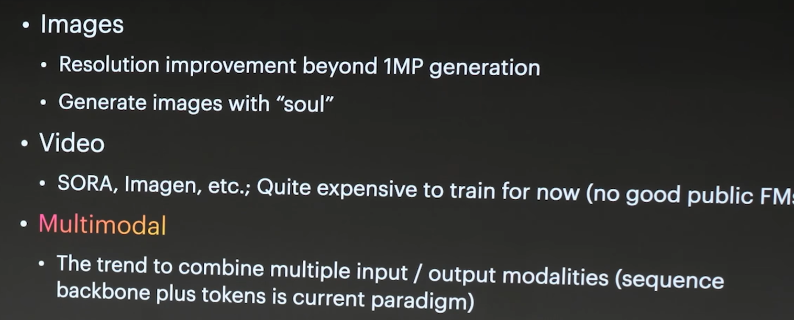

总结来看：各个方面有用？够用？能用？

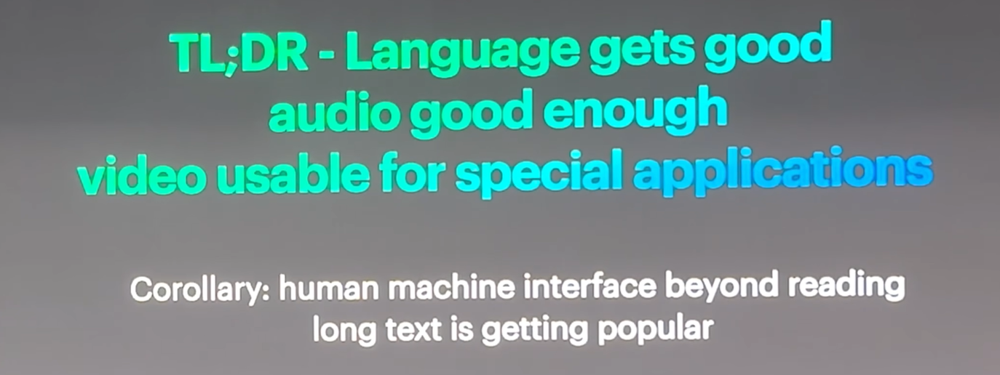

市场上还没涌现killer app（上一次是短视频，大家都没想到几秒钟的视频与生活的融合度）

### 3、Applications

应用方面：文科白领的工作已经被取代了一部分，工科白领还有一段距离

- 文科白领：
  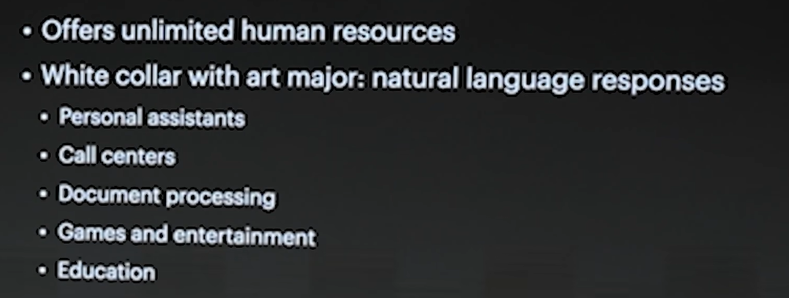
- 工科白领
- 蓝领：刷桌子、端盘子等等，与世界做很多交互，要很多很多的数据，模型 很难替代。蓝领是这个世界的主要成员，所以距离技术对整个世界的变革还有很多年，还有很多机会
  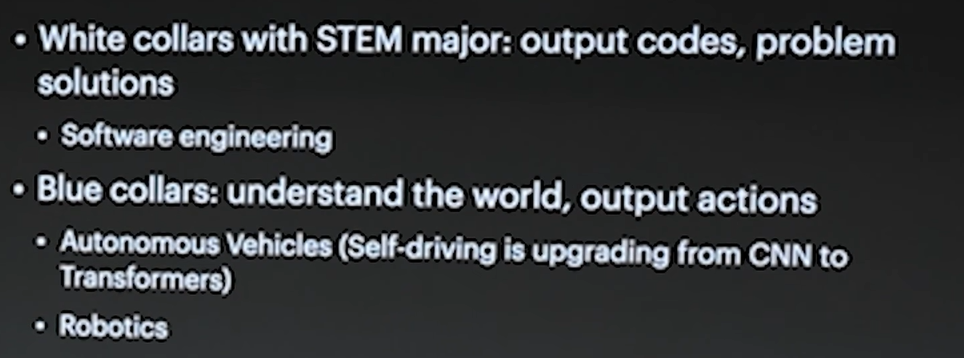

总结来看：

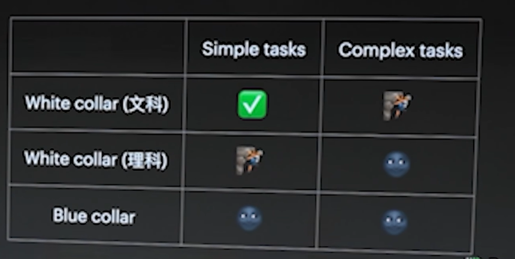

### 4、What we Learned

总结：足够的数据

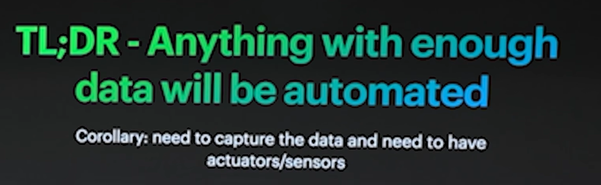

创业大概一年半，学到了什么：两年前预训练是个技术问题，现在更多的是一个工程问题，而后训练很难

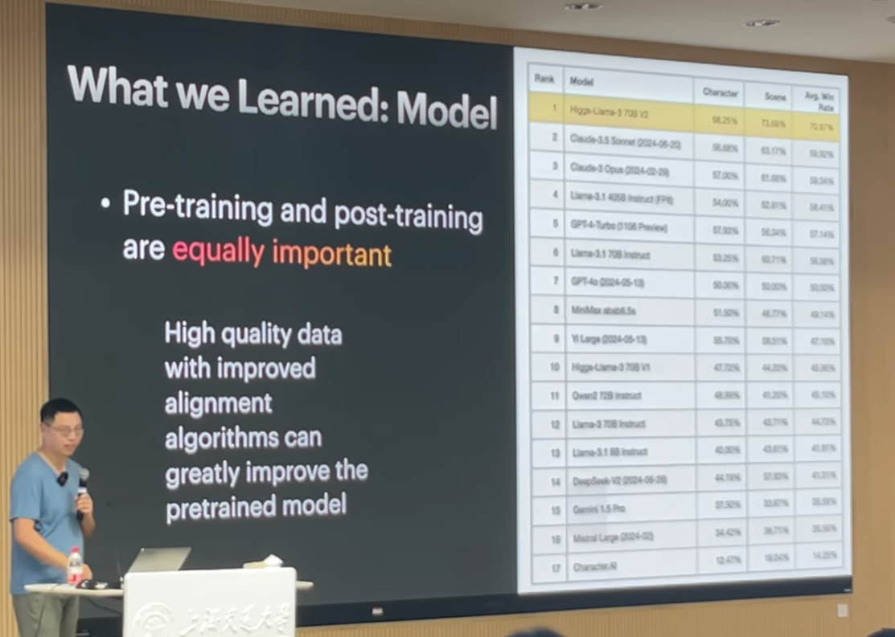

做垂直模型：

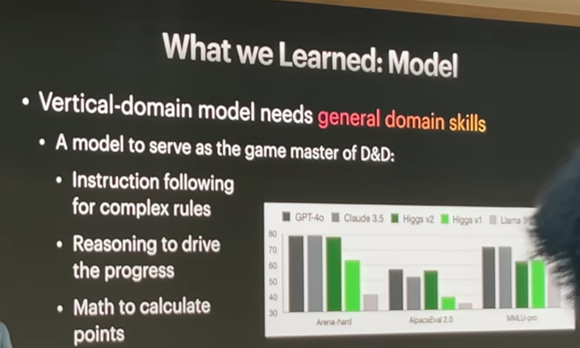

做评估很难：

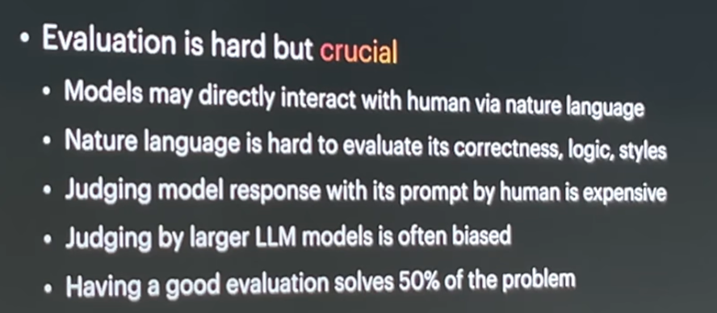

数据决定了模型的上限、算法决定了模型的下限：目前离自主学习AGI还有很远

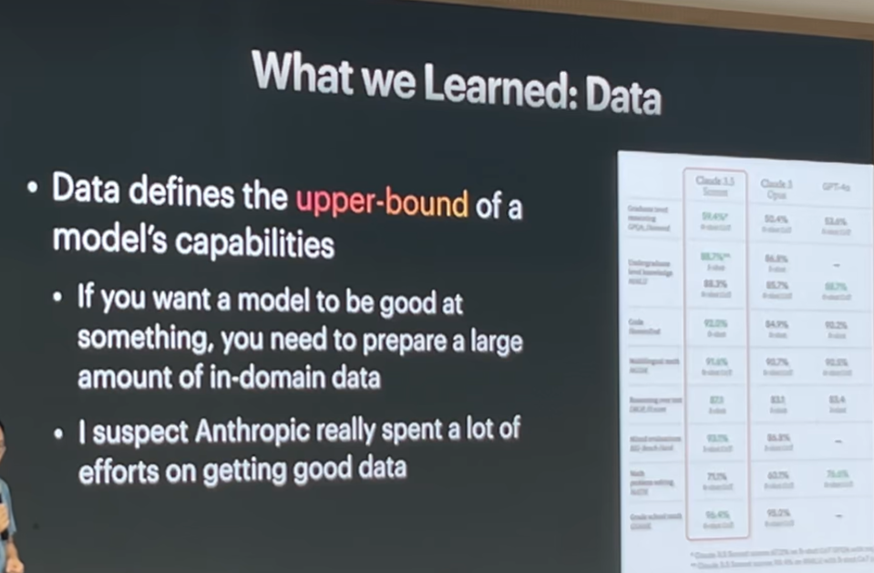

算力：买GPU与租GPU价格差不多，因为利润可能90%在NVIDIA手里

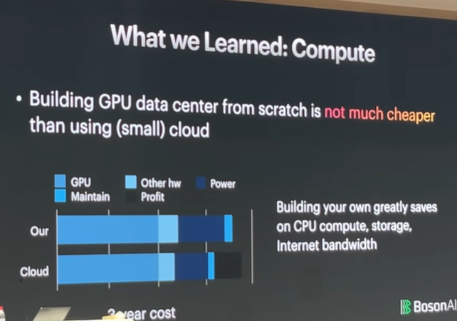

技术方面还是很多之前的技术，没必要去神话，但是模型确实大了很多，100倍

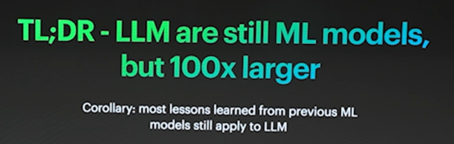

## Part2.PersonalCareer

过去从交大毕业后做了什么：

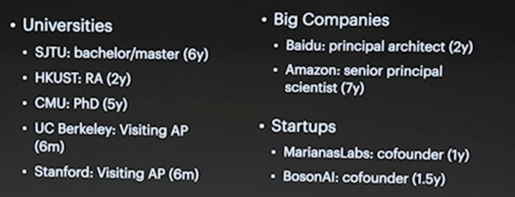

转来转去有什么体验：员工、Phd、创业者，每个身份有不同的体验

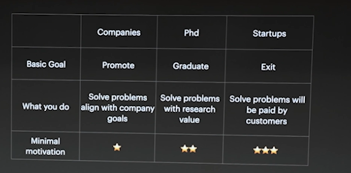

从打工人的角度：好处与坏处

- 工作五年的反思：https://zhuanlan.zhihu.com/p/374777591

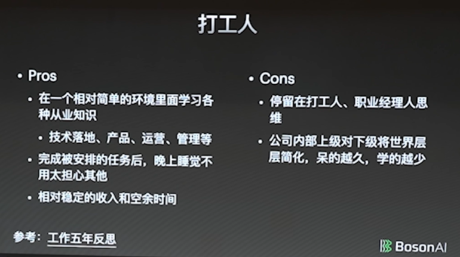

从PhD的角度：

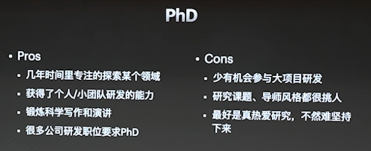

从创业者的角度：

- 创业一年，人间三年：https://zhuanlan.zhihu.com/p/714533901

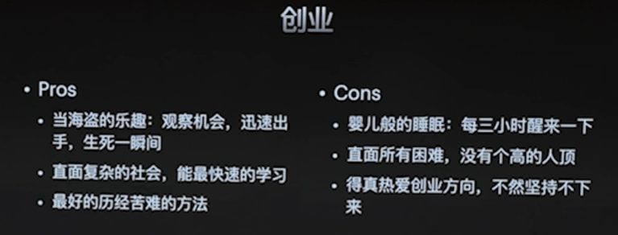

要有一个很强烈的动机：建议多看几遍

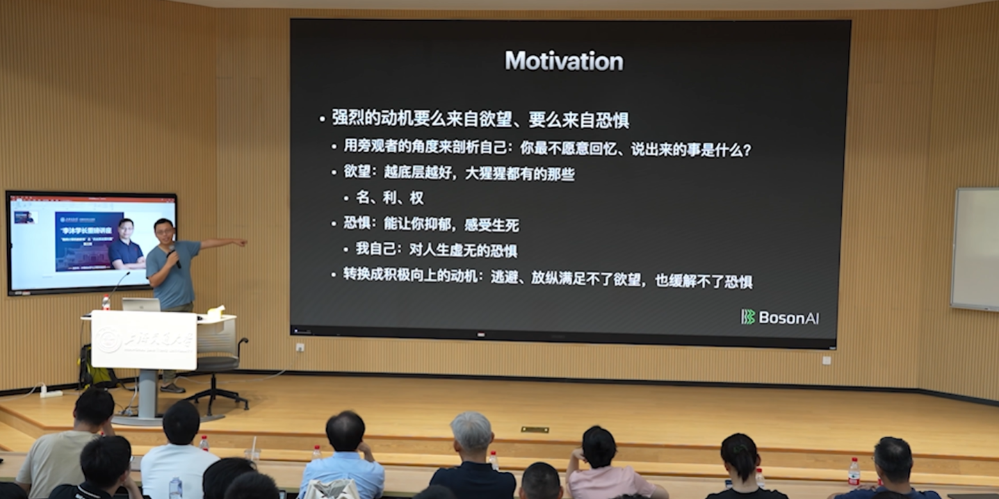

有了动机如何选择：

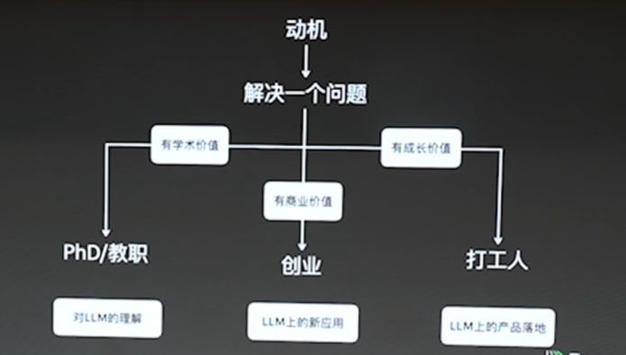

沐神的内功心法：

- （网友总结）省流：复盘
- （网友总结）不省流：可以理解为自己为自己的人生做抽象。最顶层最抽象的想想自己五年要做什么，然后拆解成年度的总结，再拆解成季度的，最后拆解成周的。人生就是自己创业，没人给你扛着，没人给你做抽象，没人把复杂的问题拆开来。所以按这一套方法拆解后，就可以源源不断的解决问题，去达成一些想做的事。

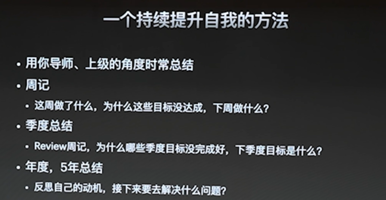

上一代很多人将成功归功于时代，现在越来越卷，好消息是很多新的机会，坏消息是这个电梯有越来越多的人，要拼命才能挤上去

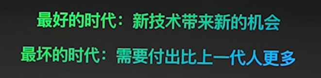

## Part3.交流环节

- 视频链接（最后30min）：https://www.bilibili.com/video/BV1vBWDepECq
- 内容：
  - 略
  - 招什么人
  - 大模型与新能源电力行业：时间序列的大模型、大模型安全性
    - 安全 --> 评估
    - 时序 --> 目前LLM用的没那么多，提炼信息
  - MoE
