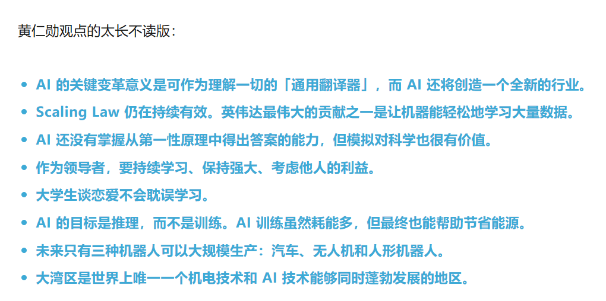
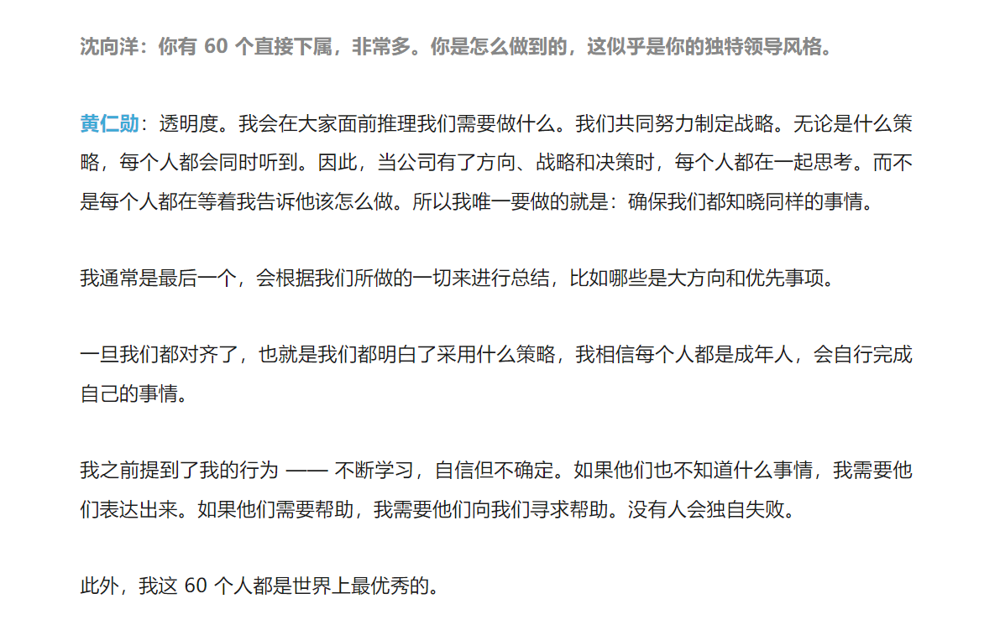

视频链接：[【科技人物】11月23日，英伟达（NVIDIA）CEO黄仁勋香港科技大学演讲，对话沈向洋](https://www.bilibili.com/video/BV1eTBsYfEFQ?spm_id_from=333.1245.0.0)

推文：https://mp.weixin.qq.com/s/pwjN5ZH2BT-r2DGuCNNJdg

如何理解AI？

- 理解信息的能力

是否能估计到下一个10年计算能力依旧翻涨那么多倍？

- 

香港将创建一家新医院，如何看待？

AI会被质疑，但是这里是从AI到医院，而不是医院到AI，这里接受技术，意义与潜力

关于领导力，如何领导那么大的团队？  

- 持续学习
  - 将你做的任何事看作是毕生的工作，而不只是工作，思维上差别很大
  - 领导不需要了解一切
  - 可以对某个追求充满信心，同时又允许不确定性。不确定性驱动学习
- 领导需要强大，才能支持众多人的需求。但是需要你强大和信心，但是仍然要脆弱和不确定性
  - “脆弱”不是“缺乏力量”，“不确定性”不是“缺乏信心”
  - 该怎么做决策？从对面团队的利益角度出发，做对面最大化利益的事

60个理事会，如何照顾得过来的？

- 透明

对创业的建议？

- 

是否担心因为AI的功耗，导致浪费更多的资源？

- AI未来会产生更多的功耗，但同时可以用AI的生产力，减少各个行业原本就冗余的功耗，更好的利用能源

物理与智能：物理系统越来越重视，机器人、自动驾驶等等，如何看待这些物理系统如何快速融入人们的生活？如何利用中国“湾区”的硬件生态加速发展？

- AI不够理解物理系统。不过感觉上很近了，生成式AI可以用文字生成视频、用图片生成视频，告诉他拿一杯咖啡，他会生成视频，为什么不能映射到机械臂拿咖啡呢
- 目前三类可以推广量产的机器：汽车、无人机、人形机器人
